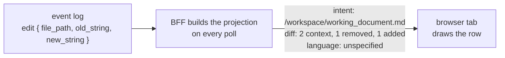

# Design: rendering agent output

**Related:** [`conversation-view.md`](conversation-view.md) (the stream these rows appear in, and the poll that builds
them); [`document-pane.md`](document-pane.md) (the pane the stream sits in); [`proto.md`](proto.md) (the wire format and
its compatibility gate).

## Overview

An agent run produces prose and tool calls, and a curator reads both in the conversation stream. This doc decides how
the stream draws them.

Everything the agent writes is untrusted, because it quotes pages the agent read. So agent text is never turned into
HTML, and nothing in it can make the curator's browser contact another host: links and images render as inert text.

A tool call arrives as a tool name and a dictionary of inputs, with no hint of how it should look. The display is read
from well-known input keys rather than from a list of tools, so a new tool that uses familiar keys displays properly
with no code change. That reading happens in the BFF (the web tier's backend-for-frontend server), which turns each call
into a one-line label, a body to show on expand, and the body's language. Browser tabs stay open across deploys, and
doing the work on the server means an old tab picks up a change on its next poll. The diff of a file edit is computed on
the server for a related reason: every open tab then draws the same edit the same way, whichever build it runs.

During a deploy a tab can also receive an enum value its build has never seen. It draws a neutral "unknown" instead of
failing, because a stream with one unlabelled element is more use to a curator than no stream.

## Background

A run's event log records what the agent did ([`conversation-view.md`](conversation-view.md) §Background). A tool call
appears in it as a name and an input, and later as a result:

```
tool call    name:   edit
             input:  { "file_path":  "/workspace/working_document.md",
                       "old_string": "### Sources\n\nThe finding draws on :paper[1111…].",
                       "new_string": "### Sources\n\nThe finding draws on :paper[1111…], specifically that
                                      :quote[1111…, The tab strip lists this paper]." }
result       output: "The file was edited."    is_error: false
```

The input is an untyped dictionary. Its keys belong to the toolset that defines the tool, and for the prebuilt tools
nothing on our side declares them. The custom `shell` tool has keys we chose (a `command`, and an `intent` naming what
the command is for). Nothing in the event says how the call should be displayed.

The browser does not read this log. Every few seconds it polls the BFF, which reads the log and returns the whole
conversation as a display model built fresh on each poll. That display model is called the **projection**
([`conversation-view.md`](conversation-view.md) §"The four methods"). Every decision in this doc is made while building
it, and the browser draws what it receives.



For each call, the projection sends a one-line label, a body (either as text or as a list of changed lines), and the
language the text is written in. The contract is `ToolCall` in
[`workbench.proto`](../../schema/proto/themis/workbench/models/workbench.proto).

## Design

### One tool call, end to end

Here is the `edit` call from the Background as the curator sees it. Collapsed, the row shows the tool's name and the
label. Expanded, it shows the body and the result:

```
 ▸ edit   /workspace/working_document.md
 ▸ shell  count the citation directives the draft carries
 ▾ edit   /workspace/working_document.md
     INPUT
       ### Sources

     - The finding draws on :paper[1111…].
     + The finding draws on :paper[1111…], specifically that :quote[1111…, The tab strip lists this paper].
     RESULT
       The file was edited.
```

The label is the file the edit targets, because an edit states no intent of its own. The body is a diff of the two
strings the agent passed, drawn with removed and added lines. The browser knew none of this about `edit`: it received a
label, a list of lines each marked context, removed or added, and a result. The sections below explain each of those
choices.

### Agent text never becomes markup or a request

Everything this doc draws was written by a model, and much of it quotes third-party text the model read. That text is
untrusted ([`../PRODUCT.md`](../PRODUCT.md) §9). A hostile page can contain instructions, markup, or links, and the
agent may copy any of them into its narration.

The obvious way to render markdown is to convert it to an HTML string and insert that into the page, with a sanitiser in
between. That gives full fidelity. But the sanitiser is then the only thing between a hostile page and the curator's
browser, and a sanitiser is a filter that has to anticipate every dangerous construct.

Instead, agent prose goes through one markdown renderer that produces React elements directly. There is no HTML string
anywhere on the path, so there is nothing to inject into. The renderer covers the full GitHub-flavoured grammar
(headings, tables, fenced code), and raw HTML in the source is shown as text. The same renderer draws the agent's
narration, the working document, a curator's own turns and a sub-agent's summary. A curator's turn also honours a single
newline as a line break, since Shift+Enter makes multi-line turns easy to type and standard markdown would fold them
back into one paragraph.

Even without HTML, an image loads the moment it renders, and a link loads when it is clicked. Either would let text
copied from a hostile page make the curator's browser contact a host of that page's choosing, carrying whatever the URL
encodes. So both render as inert text, with the destination dropped so it cannot be copied out either:

```
source                                       drawn as
[the paper](https://example.org/p)           the paper          (not clickable)
       [image: a figure]  (no request)
```

The cost falls on the curator: a source the agent links to cannot be opened from the stream, and its address is not
shown. The agent is expected to cite papers through the literature store instead, and those citations stay usable.

A citation is the one construct in agent text that does something when clicked. The agent writes `:paper[id]`, or
`:quote[id, text]` for a passage within a paper, and the renderer draws it as a button that opens that paper in a tab
([`document-pane.md`](document-pane.md) §Background). The id must have the shape of our own paper ids, and the paper is
fetched from our own server, so a citation cannot reach any other host. An id of the wrong shape renders as a visibly
broken citation.

A paper tab in the document pane is the one place where images load. A paper is third-party text too, but it needs its
own figures. There, an image whose source is a bare file name resolves to that paper's file in our own corpus, and
anything else, such as a URL or a path, stays inert:

```
            → the paper's figure1.png, loaded through our own files route
      → [image], no request
```

Links stay inert on every surface.

Tool bodies are code, and they are highlighted by the same principle. The highlighter lexes a body into a syntax tree
and turns the tree into React elements, so again no HTML string exists. Each token class maps to one of the app's own
colour tokens, and a class with no mapping takes the block's ordinary ink, so the palette never gains a colour it did
not define. Every language the wire can name must have a grammar registered, and the type checker and a test both fail
if one is missing.

Results and diffs are not highlighted. A result is whatever the tool printed, and lexing it as a program would invent
structure. A diff interleaves two versions of a text, so no block of it is one program, and syntax colours would compete
with the red and green that carry its meaning.

### The projection decides how a tool call looks

The obvious design switches on the tool name: an `edit` row shows its file and a diff, a `shell` row its command. That
is easy to read, and each tool can be displayed exactly as its author would like. But the toolset is defined upstream,
by the agent platform, and it changes on its own schedule. A switch would show every new tool as unrecognised until
someone added a case for it.

So the projection has no list of tools. It reads a small set of input keys that the prebuilt tools share, such as
`file_path`, `content` and `command`, and a new tool that uses them displays properly with no code change. A tool that
uses none of them still gets a readable row, as the fallbacks below show.

This reading happens on the server, in the BFF's projection
([`tool-projection.ts`](../../apps/web/src/server/tool-projection.ts)), and the browser holds no tool names or input
keys. The BFF and the browser code ship in the same release, so this does not save a deploy. It helps a tab that is
already open. Curators keep tabs open across deploys, and such a tab keeps running the build it loaded. When the
projection changes, the tab picks up the change on its next poll, without a reload. The fixture backend and the live
backend also call the same function, so the offline build and production draw calls the same way.

The label is the `intent` the agent stated, where the tool has one. Otherwise it is the value of a well-known target
key, such as a file path, a search pattern or a URL. Otherwise it is the tool's name. Each of these is a plain read of
one field, never a parse of a command:

```
call                                                           label
shell  { command: "python3 count.py doc.md",                   count the citations
         intent: "count the citations" }
read   { file_path: "/workspace/working_document.md",          /workspace/working_document.md
         view_range: [1, 120] }
mystery { some: "field" }                                      mystery
```

The body is the call's own text, untruncated: the shell command, the content a write wrote, or the two sides of an edit.
A write already names its file in the label, so its body is the content alone. A tool with none of these, such as a
read, shows its whole input as JSON, because that is the only place a read's line range appears:

```
{
  "file_path": "/workspace/working_document.md",
  "view_range": [1, 120]
}
```

Nothing is clipped. An expanded body and its result each scroll inside a fixed maximum height, and there is no "show
more" control. A truncated body would hide the one thing expanding a row is for, and a second expanded state would be
one more thing to get wrong.

The cost of reading keys is that nobody promises them. Only a delivered event confirms that a prebuilt tool still uses
`file_path` or `content`. When a key stops matching, the row degrades: the label falls back to the tool name, or the
body falls back to the JSON dump. The poll still succeeds, and the curator can still read the call.

### A body's language is read from its text

The projection also names the syntax of the body, so the browser knows how to highlight it. The obvious source is the
tool: a shell tool's body is shell. That breaks as soon as a command embeds a program. A shell command with a heredoc
passes everything after the `<<` to another interpreter, so the text is two languages at once. A write's content can be
any language at all.

So the language is read from the text, or from the name of the file the text was written to:

```
body                                              language
python3 count.py doc.md                            shell
python3 - <<'EOF' … EOF                            unspecified (drawn unlit)
write to /workspace/count_citations.py             python
write to /workspace/notes.xyz                      unspecified (an extension the map does not list)
the JSON dump of a read's input                    json
```

Detecting a heredoc is a pattern match on the opener, and it errs towards unlit: a command it mistakes for a heredoc
merely loses its colours. A real shell parser in the projection would be a large dependency for a cosmetic gain.

### The BFF diffs a replacement

An edit's body is two strings, the text it replaces and the text it puts in its place. The obvious design sends both
strings and lets the browser diff them. That keeps the wire format simple. But during a deploy, tabs on last week's
bundle and tabs on today's bundle would run different diff code, so the same edit could show a different alignment in
two tabs side by side. A screenshot of a row would not be reproducible from the row's data.

So the BFF diffs the two strings and sends a list of lines, each with a kind (context, removed or added) and its text,
without a `+` or `-` prefix, and the browser draws the sign. For the edit in the Background:

```
kind      text
context   ### Sources
context
removed   The finding draws on :paper[1111…].
added     The finding draws on :paper[1111…], specifically that :quote[1111…, The tab strip lists this paper].
```

The diff compares the two strings the agent stated, not the file on disk: the BFF never reads the file. Aligning two
texts costs time quadratic in their line counts, so past a line cap per side the BFF skips the alignment and sends every
old line as removed and every new line as added. That loses no content, only the pairing.

The cost is that the wire fixes the diff at whole lines. Marking the changed characters within a line would need a
schema change, not just a client change.

### A value the tab's build does not know draws as unknown

During a deploy, an open tab keeps running the build it loaded, and it keeps polling. The server may then send it an
enum value that did not exist when that build was made: a new status for a sub-agent thread, a new body language, or a
new kind of diff line.

The strict response would be to throw, which makes the mismatch visible at once. But the curator would lose the whole
stream over one pill, and the tab would recover only on a reload. So each enum has a neutral rendering for a value it
does not know:

```
enum                  unknown value drawn as
sub-agent status      a neutral "unknown" pill
body language         the text, unlit
diff line kind        the line with no sign and no colour
```

Each of these enums reserves 0 for "unspecified". The projection always sets the sub-agent status and the diff line
kind, so it never sends 0 for either. For the body language, 0 is an ordinary value: a body with no language, drawn
unlit.

A value the build does not know arrives as 0 as well. The client decodes the wire's JSON by enum name, and a name the
build has never seen decodes to 0. Suppose a deploy adds a sub-agent status "paused": a tab still on the old build finds
no member of that name, gets 0, and draws the neutral pill. So on the client, 0 is how an unknown value looks, and the
table above is the rendering for 0. A status of 0 on the client therefore does not mean the projection failed to set the
field.

## Alternatives considered

- **A oneof over the two body shapes.** Today the text body travels in `command`, the diff in a sibling field `diff`,
  and one function in the projection is the only thing that keeps both from being set. A oneof would make exactly one
  body a property of the message. It would also retire `command`, whose name now misleads: it carries every text body, a
  write's content included, and the compatibility gate stops it being renamed. Retiring a field already on the wire and
  reshaping the message is a large change for the sake of one tool, so it waits until some tool needs a body that is
  neither text nor a diff.

## Open questions

- **A result that is not text.** The projection keeps only the text blocks of a result, so a result made of an image or
  a structured block reaches the stream as empty output. The input side always shows something, because an input the
  projection does not recognise falls back to the JSON dump. The result side has no such fallback, and what it should
  show instead of an empty box is undecided.
