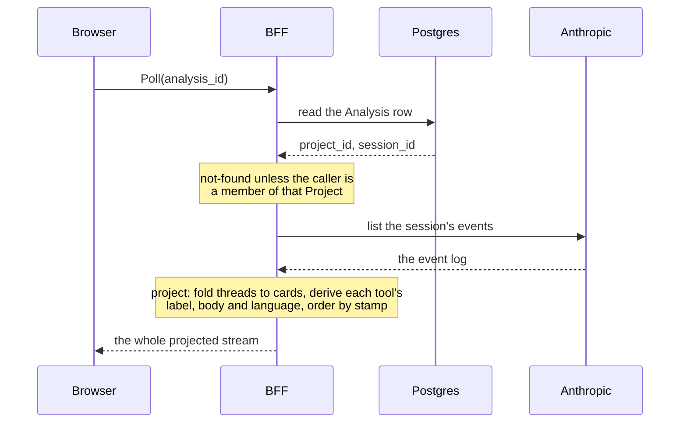
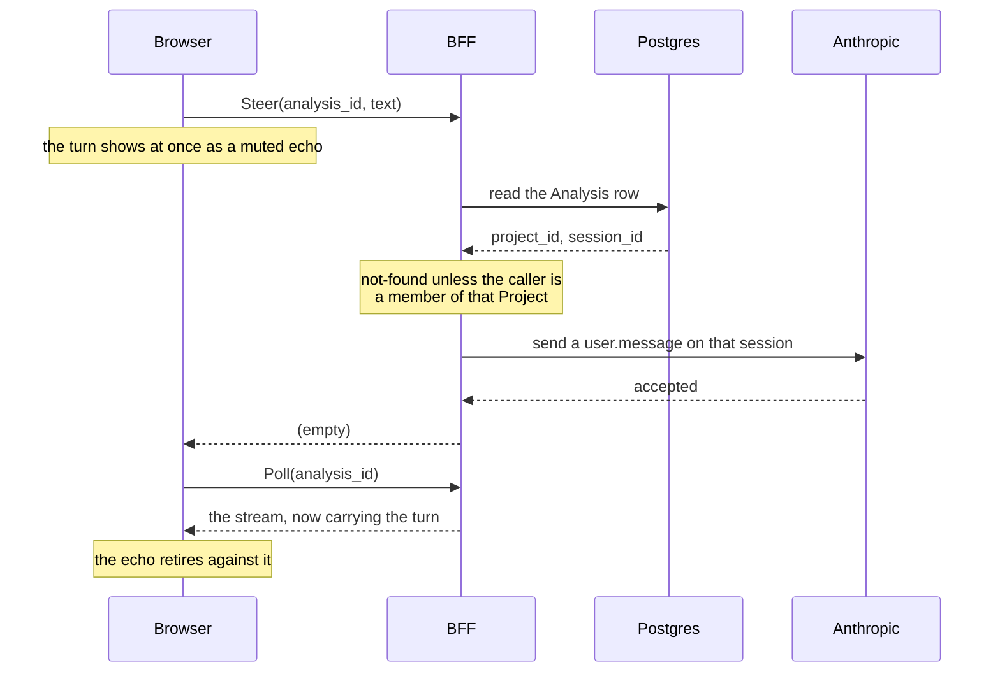

# Design: the conversation view

**Related:** [`document-pane.md`](document-pane.md) (the region this renders into, and its dock edges);
[`frontend-framework.md`](frontend-framework.md) (the poll that feeds it, the Connect seam, and the caching posture);
[`workbench-navigation.md`](workbench-navigation.md) (the Analysis page it lives on);
[`workspace-model.md`](workspace-model.md) (why a contribution is a turn, and the authorization chokepoint);
[`agent-runtime.md`](agent-runtime.md) (the coordinator/sub-agent topology this renders);
[`managed-agents.md`](managed-agents.md) (the hops one case makes, and which doc owns each);
[`analysis-scenarios.md`](analysis-scenarios.md) (what the kickoff turn is rendered from);
[`agent-output-rendering.md`](agent-output-rendering.md) (how what the agent produced is drawn: tool rows, diffs,
highlighting, forward compat); [`proto.md`](proto.md) (the wire and its compat gate).

## Overview

The Analysis page's conversation region is where a curator watches the agent work and answers it. This doc decides what
that region renders and how a curator acts on it.

- **The stream is a projection** the BFF computes from the agent's session log on every poll. No turn, tool call or
  result is stored our side, so the log is the record and the projection is the only thing between it and the screen.
- **A curator acts through two session mutations** — a steering turn (`Steer`) and a halt of the current step
  (`Interrupt`). Both reply empty: the poll stays the single authority on what the conversation contains.
- **A sub-agent thread folds to one card**, and that thread's own conversation is fetched (`GetThread`) only when a
  curator expands the card.
- **How anything the agent produced is drawn** — a tool row, a replacement, highlighted source, and what happens to a
  value the build predates — is [`agent-output-rendering.md`](agent-output-rendering.md)'s. This doc decides what the
  stream contains and how a curator adds to it.

## Background

**What Anthropic runs.** Anthropic runs the agent loop and owns its record ([`managed-agents.md`](managed-agents.md)).
One Analysis is one **session**. Inside it the **coordinator** works on its own thread and delegates to **sub-agent
threads**, each with its own history and tools ([`agent-runtime.md`](agent-runtime.md)). Every turn, narration, tool
call, tool result and thread status is appended to the session's **event log**, the only record that any of it happened.
Some of a sub-agent thread's events are **cross-posted** onto the coordinator's stream: a sub-agent's tool calls appear
there — its narration does not — each marked as coming from that thread, which is how a reader at coordinator scope
knows a delegation happened without reading the thread. Exactly which events cross-post, and what else the listing does,
is in the Appendix.

**Poll and project.** The web tier holds no connection for the run's duration
([`frontend-framework.md`](frontend-framework.md) §Session observation). The browser polls the **BFF** — the web tier's
backend-for-frontend, which holds the Anthropic credential and is the one place the browser's requests are authorized —
every few seconds; the BFF reads the log, projects it, and returns the whole stream. The client replaces its stream by
event id and never appends, so a projection change reaches the screen on the next tick with no client-side merge to get
wrong.

**Vocabulary.**

- **turn** — one contribution to the conversation, the curator's or the agent's
  ([`workspace-model.md`](workspace-model.md)).
- **tick** — one poll, and the whole projected stream it returns.
- **projection** — the display model the BFF computes from the event log. What a line of the stream *contains* is
  decided there; the client draws what it is given.
- **fold** — collapsing several events into one line of the stream.
- **card** — the line a folded sub-agent thread occupies.

## Non-goals

- **Editing.** A curator writes turns; the working document has one writer, the agent
  ([`workspace-model.md`](workspace-model.md)).
- **A client-side settled turn.** The client never treats a turn as part of the conversation until a tick carries it
  back.
- **Structured steering.** A turn carries prose, and nothing else (§`Steer`).
- **Steering or interrupting a sub-agent directly.** As in Claude Desktop, the curator's interlocutor is the
  coordinator; sub-agents are the coordinator's delegations and are not addressed by the curator. The coordinator can
  send a sub-agent thread a message, so a curator who wants one redirected asks the coordinator to relay.

## Design

### The surface

The conversation region is a stream with a composer under it, docked to one of the main window's four edges beside the
tab area ([`document-pane.md`](document-pane.md)). Every line of the stream is one of four kinds.

```
┌─ conversation region ───────────────────────────────────────────┐
│  I'll start from the ClinVar record, then the frequencies.      │ ← narration: agent prose, markdown
│                       ┌───────────────────────────────────────┐ │
│                       │ Ignore the two one-star submissions.  │ │ ← curator turn: right-aligned bubble
│                       └───────────────────────────────────────┘ │
│  ▸  read the ClinVar submissions for NM_001382309.1:c.332del    │ ← tool row, collapsed: the label only
│                                                                 │
│  ▾  classify the frameshift against SVCv4                       │ ← tool row, expanded
│     ┌──────────────────────────────────────────────────────┐    │
│     │ from themis import svcv4                             │    │ ← the body: the call's own text, highlighted
│     │ svcv4.evaluate(transcript, hgvs_c)                   │    │
│     └──────────────────────────────────────────────────────┘    │
│     ┌──────────────────────────────────────────────────────┐    │
│     │ PVS1 met (LOF, NMD-predicted)                        │    │ ← the result: never highlighted
│     └──────────────────────────────────────────────────────┘    │
│                                                                 │
│  ▾  revise the PVS1 paragraph of the working document           │ ← tool row whose body is a replacement
│     ┌──────────────────────────────────────────────────────┐    │
│     │   PVS1 applies at Very Strong.                       │    │ ← a diff, drawn from kinded lines:
│     │ - The transcript is MANE Select.                     │    │   no signs on the wire, never highlighted
│     │ + The transcript is MANE Select (NM_001382309.1).    │    │
│     └──────────────────────────────────────────────────────┘    │
│                                                                 │
│  ▸  SUB-AGENT  draft the frequency paragraph     (  idle   )    │ ← sub-agent card, collapsed: badge,
│                                                                 │   what it was asked, where it stands
│  ▾  SUB-AGENT  check gene–disease validity       (  done   )    │ ← sub-agent card, expanded
│     │  Read ClinGen's validity classification for this gene.    │ ← the thread's own stream, fetched
│     │  ▸  fetch the ClinGen gene–disease record                 │   on expand: its instruction, its
│     │  Definitive, last evaluated 2023-06.                      │   narration, its tool rows
│                                                                 │
│                       ┌───────────────────────────────────────┐ │
│                       ┊ Also check the splice predictions.    ┊ │ ← a sent turn, echoed until the
│                       └───────────────────────────────────────┘ │   poll carries it back
├─────────────────────────────────────────────────────────────────┤
│  [ Answer the agent…                            ]  [ ■ stop  ]  │ ← composer, inside the region
└─────────────────────────────────────────────────────────────────┘
```

Speaker is conveyed by alignment and styling — assistant turns bare and left-aligned, curator turns in a right-aligned
cream bubble. There are no avatars and no per-turn labels: with two speakers, position says which is which. The kickoff,
the instruction the run opened with ([`analysis-scenarios.md`](analysis-scenarios.md)), is a curator turn like any
other, so it renders as one.

What a tool row and a replacement look like inside the stream — the label, the body, the highlighting, the diff's signs
— is [`agent-output-rendering.md`](agent-output-rendering.md)'s; this doc takes them as given.

### What is stored where

| Store                         | What this surface keeps there                                                                                                                                                                                                                                                                                              |
| ----------------------------- | -------------------------------------------------------------------------------------------------------------------------------------------------------------------------------------------------------------------------------------------------------------------------------------------------------------------------- |
| Anthropic's session event log | The conversation itself: every curator turn, narration, tool call, result and sub-agent thread. That log *is* the transcript; the BFF relays it and keeps no copy.                                                                                                                                                         |
| Postgres, the Analysis row    | Which session the Analysis runs in, which Project gates access to it, and the scenario inputs. Written once at create. Every method here reads the row — for the access check and the session id — but none reads the inputs: those are read at create, to render the kickoff, and by the surfaces that name the Analysis. |
| GCS                           | Nothing for this surface. The working document lives in a bucket and a tick carries its version number, but the document itself is the document pane's.                                                                                                                                                                    |

Two things follow from the first row. A durable copy of a conversation would be the session-mirroring work rather than
anything this surface does ([`analysis-scenarios.md`](analysis-scenarios.md) §"The kickoff text is rendered, not
stored"). And with no copy of our own there is nothing to diverge: a change to how a conversation reads is a change to
the projection, and it applies to every Analysis ever run.

### The four methods

Four methods serve this surface, described alike so they can be compared: what triggers each, what happens in response,
how it is authorized, and what the client does with the reply. Two carry a request diagram; the other two make the same
hops. Every one of them is a `POST` carrying the request message as its body ([`proto.md`](proto.md), bucket 2).

#### `Poll`

**Trigger.** A tick of the region's polling loop, every few seconds while the Analysis page is open.

**In response.** The BFF reads the Analysis row, lists the session's events, and returns the whole projected stream plus
the working document's version number where one has been produced. Nothing is written.



*A tick reads two stores and writes neither; the projection is computed fresh each time, from the log alone.*

**Authorization.** A point access ([`workspace-model.md`](workspace-model.md) §Authorization): a single chokepoint,
which every data access goes through, resolves the Analysis row and checks the caller's Project membership, answering
not-found to a non-member. The session id comes off that row, so no request field names a session.

**The client.** Replaces its stream by event id. The reply is the whole stream every tick, the upstream log offering no
since-cursor, and a tool body is untruncated ([`agent-output-rendering.md`](agent-output-rendering.md) §"A tool call is
a label and a body"), so the reply grows with the run. The general fix is the incremental cursor open in
[`frontend-framework.md`](frontend-framework.md) §Open questions.

#### `GetThread`

**Trigger.** A curator expands a sub-agent card.

**In response.** The BFF lists that thread's own events and projects them with the fold the coordinator's stream uses,
so a tool row renders identically inside a body and the coordinator's instruction reads as the thread's own opening
turn. Nothing is written.

**Authorization.** The poll's point access, and the session the thread is looked up in comes off the resolved row rather
than a request field — so a guessed thread id is looked up inside the caller's own session, and answers not-found.

**The client.** Renders the body inside the expanded card and refetches on the poll's interval while the thread runs. A
body never carries a card — one level of delegation is a *runtime* limit ([`agent-runtime.md`](agent-runtime.md)), not a
type guarantee — so the client treats a nested card as an error rather than nesting a fetch inside a fetch.

#### `Steer`

**Trigger.** A curator writes a turn in the composer and sends it.

**In response.** The BFF sends the text to the Analysis's existing session as a `user.message` — the same event that
seeds a new session with its kickoff. Nothing is written our side, and the reply is empty.



*A curator turn writes nothing our side: it lands on the agent's session, and the next tick brings it back. The empty
reply is the point — a reply carrying the turn would let the client settle it without the poll.*

**A turn carries prose, and nothing else.** What it settles — a tier, a code, a constraint — is the agent's to extract
and record in the working document. A typed field on the request would be a second, divergent home for that value, and
the working document would stop being the one artifact.

**Authorization.** The same point access; a non-member is answered not-found, so the turn never reaches the run.

**The client.** Shows the turn as a pending echo and retires it when a tick carries it back (§"A sent turn is echoed
until the poll carries it").

#### `Interrupt`

**Trigger.** A curator presses stop, beside the composer.

**In response.** The BFF puts one `user.interrupt` event on the session; the API closes any in-flight tool call with an
error result and idles the session. Nothing is written our side, and the reply is empty. Against a session that is not
mid-step the halt is a no-op, so the control needs no run-state gating of its own and a curator may safely race a step
that is completing. Unlike the send, the halt has no typed refusal of its own: every failure propagates and is masked as
internal (§"What a failure means").

**Authorization.** The same point access on the resolved row.

**The client.** Asks for a tick at once on success rather than waiting out the interval, so the halted step appears
immediately. A failed stop and a failed send are reported apart, so a stop that failed is never shown as a failure of
the turn sent beside it.

### What a failure means

The four methods reach the session two ways. `Poll` and `GetThread` read it — the **read leg**; `Steer` and `Interrupt`
write to it — the **send leg**. A failure means something different on each.

**An upstream not-found means different things on the two legs.** On the read leg it becomes a typed not-found: a stale
client polling a session that no longer exists, or naming a thread its session does not hold, is a caller reference that
resolves to nothing. On the send leg it does not. The caller already resolved the Analysis and cleared membership, so a
session refusing the turn means our database and the session store disagree — an invariant break. It stays a plain
error, logged and masked as internal; the not-found branch logs nothing, so remapping would erase the only trace a
silently dropped curator turn leaves. The send takes the resolved row rather than an id, which makes that precondition
structural rather than a convention.

**A session mid-step refuses a turn, and the refusal points at the halt.** Mid-step a session accepts only
tool-result-shaped events. That refusal surfaces as a typed error rather than a masked internal one, and the composer
words it itself — naming the stop control beside it — because the upstream message names internal event ids a curator
has no use for. The alert clears when a later tick shows no call in flight, or when the curator presses stop: the
condition it asserts is a live one, and stopping is the act it asked for.

### The stream carries four kinds of line, ordered by their stamps

A conversation event is a oneof over four variants — assistant narration, a user turn, a tool call, a sub-agent card —
so kind-iff-payload is structural, and the client surfaces it as a tagged union rather than checking a tag against a
payload. All agent prose — narration and a card's summary, alongside the curator's own turns — renders through the one
markdown surface, and never as HTML ([`agent-output-rendering.md`](agent-output-rendering.md) §"The agent never authors
its own presentation markup"); how a tool row is drawn is that doc's too.

The server is what orders the stream: the projection emits events by their stamp. Leaving the sort to the client would
mean inventing an answer for an event the log left unstamped, then disagreeing with any other consumer of the same
reply. Only the user-role events the BFF itself sent may arrive unstamped; one of those takes the stamp of the event
before it, and an unstamped run at the head of the stream, having nothing before it, takes the first stamp that follows.
So no fabricated epoch instant reaches the wire, and because the inherited stamp goes onto the wire, re-sorting the
serialized stream by it reproduces the projection's order.

The promise is that and no more — sorted by stamp, with the listing's relative order preserved between equal stamps. It
is the strongest claim available, the tiebreak leaning on the listing arriving near-ascending (Appendix).

### A spawned thread folds to one card

A sub-agent thread is one line of the coordinator's stream: a collapsible card, badged as a delegation, stating what the
thread was asked, where it stands, and what it returned. The card is a **fold**, not an event — its status mutates and
its summary arrives after its prompt, so per-event attribution would have the client re-fold it on every tick.

The projection instead pre-scans the log for the spawned thread ids and, for each, its prompt, its summary and its
latest status. It places the card where that thread's *first* event landed — whichever event that turns out to be, since
the real stream can deliver a status before a creation event or without one at all. It stamps the card at that instant
and never again, so the card does not slide down the stream as the thread runs.

Four upstream statuses fold to three display states, which is what a curator reads on the card. **Running**: the thread
is working, and a thread that has reported no status yet reads this way too, as does one upstream has rescheduled, a
reschedule being a transient retry. **Idle**: the thread has returned to the coordinator and is waiting for its next
instruction. **Done**: the thread is finished. A status this build predates renders as a neutral unknown pill rather
than as an error ([`agent-output-rendering.md`](agent-output-rendering.md) §"An enum value a build predates renders as
unknown").

Both of the card's texts — what the thread was asked, what it returned — are *absent* until they land, rather than
empty, and the card distinguishes not-yet-asked from asked-with-no-text rather than showing a blank line.

Two consequences of the fold. There is no separate prompt bubble inside an expanded card: the body's first event *is*
the instruction. And the card keeps showing its summary while expanded, clamped to a preview while collapsed — the body
carries the thread's closing reply only when the thread narrated it, which is observed and not promised, so a summary
hidden on expand could end up shown nowhere; a double print when the closing narration repeats the reply is the cheaper
failure.

Cards spawned in one fan-out sit tighter together than unrelated neighbours do, so a delegation to several threads reads
as one act rather than as several unconnected ones.

### A sent turn is echoed until the poll carries it

A tick is up to one interval away, so a sent turn appears at once as a muted bubble and retires when the run carries it
back. It is marked in two independent ways, one visual and one for assistive technology, so neither a greyscale render
nor a screen reader loses it.

The server mints the event id, so a pending turn cannot be matched to its settled twin by id; it is matched by its text.
A curator can therefore send the same words twice, and the second echo waits for the second server event rather than
being retired by the first.

The composer stays live while a send is in flight — a second thought while the first turn is still going is exactly the
case the echo exists to handle. It *is* disabled until the first tick resolves, because a turn's place in the run is not
knowable against a stream that has not loaded. A failed send hands the prose back rather than dropping it, prepended if
the curator has typed something new meanwhile; and the draft lives with the poll rather than inside the composer, so a
layout change that remounts the composer does not discard a half-written turn.

The composer sits inside the conversation region, below the stream, so it travels with the region across all four dock
edges. Enter sends and Shift+Enter inserts a newline; ⌘↵ is accepted too, so the gesture that creates an Analysis stays
true here.

### Offline, the same projection drives the surface

The app runs offline against a fixture backend, and its scripted run feeds real tool inputs through the same derivation
and the same differ the live adapter uses, rather than a hand-written rendering of them. So the offline surface
exercises the code under review: a screenshot taken without cloud access shows what a curator would see, not a mock of
it.

A curator turn is spliced into the scripted run at the point the run had reached when the turn arrived, so steering can
be exercised offline too, and the agent's answer follows in the run's own voice.

## Alternatives considered

- **Per-event attribution plus client grouping** (instead of the card fold). It presumes the poll carries each thread's
  events, which it must not: a sub-agent's narration is not at session scope at all, so there would be nothing to
  attribute. It also moves the fold onto the client, which then redoes it every tick.
- **A narrower message type for a thread body.** The body needs a user case anyway (the coordinator's instruction is the
  thread's opening turn), and every field later added to the stream would have to be added twice. The one thing a narrow
  type would buy — no card inside a body — is a runtime limit, enforced by the client throwing.
- **A per-thread token figure on the card.** The number is cheaply available, but only where the thread's own listing
  has been read — that listing's aggregated usage is the only source, the usage span carrying no thread id at either
  scope — and the listing is read on expand. A figure that appears on the cards a curator happened to open and nowhere
  else is worse than none: the cards they did not open would read as costing nothing.
- **Returning the minted event id from `Steer`, and matching the echo on it.** The send response does carry event ids,
  but the field is optional in the SDK's type, and the correct handling of a response without one cannot be "fail the
  RPC": the turn already landed, and reporting failure invites a duplicate. The id path would need the text path as a
  fallback anyway, leaving two mechanisms of which one is exercised approximately never.
- **No echo at all** (the poll alone). A curator sees nothing for up to an interval after pressing Enter, and a failed
  send loses their prose silently.
- **Disabling the composer while a send is in flight.** It would make the shared mutation state safe to read, at the
  cost of forbidding the very interaction the echo exists for.
- **Writing the turn into the query cache as settled.** The next tick would overwrite it anyway, and until then the
  client would be asserting something about the conversation that the log had not confirmed.
- **A typed steer** (a tier, a code beside the prose). Beyond the divergent-home problem above, a tag vocabulary is its
  own drift surface, and a parser's failure mode is a silent misparse rather than a refusal.

## Open questions

- **Where a long thread body should open.** A sub-agent thread can run long, and an expanded card puts its whole
  conversation inline in the coordinator's stream. Inline expand is the decision for now: it needs no surface of its
  own, and it keeps the thread beside the delegation that produced it. Opening it instead as a pane beside the stream
  ([`document-pane.md`](document-pane.md)) stays reachable later without a contract change, rendering the same
  `GetThread` reply.
- **How a curator learns that a run cannot take a turn.** Nothing on the tick carries the run's status, so the composer
  cannot tell a live session from a terminated one. A send refused for any reason other than the agent being mid-step
  therefore surfaces as a masked internal error with the prose handed back (§"What a failure means"), rather than as a
  composer that says the run is over. A run-status signal on the tick is what such a state would need.
- **Whether a curator should see the agent's thinking.** The stream carries no thinking variant, so the reasoning behind
  a step is not readable here, only the narration and the calls. Adding the variant is additive to the event oneof, so
  the wire does not settle the question either way.

## Appendix: what the event stream actually delivers

The cross-posting rule is the SDK's documented contract: a thread id on a tool use marks it "cross-posted from a
subagent's thread … empty on the thread's own events", and the thread-status events are "emitted on the thread's own
stream and cross-posted to the primary stream". Everything below was established empirically, against production
sessions, and the projection is built on all of it. Each observation is followed by what it decided.

- **The session-scope event listing is the coordinator's own thread listing** — identical event-id sets, not a superset
  of the sub-agents' histories. A sub-agent's narration and thinking never appear at session scope, so coordinator
  narration needs no filtering and a tick stays a single session-scope read.
- **A sub-agent's tool *uses* are cross-posted onto the coordinator's stream**, under the same event id and carrying the
  documented thread-id marker. The projection excludes them from the coordinator's tool rows: rendered there they would
  read as the coordinator's own work.
- **A sub-agent's tool *results* cross-post as separate records**, with their own event ids and no cross-post marker.
  Pairing a result to its call therefore stays within one listing; nothing has to merge two.
- **The agent name is the coordinator's own on every thread** — every entry in the coordinator's roster of sub-agents
  reports as self — so the name distinguishes nothing, and it is neither on the wire nor rendered.
- **The root thread** carries thread-status events but is never created and never addressed. Spawned means created or
  addressed, so the root never becomes a card.
- **The thread-scope listing takes no order parameter**, where the session scope does. It returns ascending by stamp in
  practice, but nothing promises it, so the projection sorts rather than relying on it. This is also why the ordering
  promise above is only as strong as it is: a listing delivered wholesale-descending, which nothing has produced, would
  invert its equal-stamp blocks.
- **A listing can deliver an event twice.** User-role events come back a second time carrying no stamp, in a block
  detached from the stamped stream, and which of them do differs between listings of the same session. The projection
  folds a listing to one record per event id — an id already seen is that same event, never a second turn — and keeps
  the stamped delivery, for its instant and its place.
