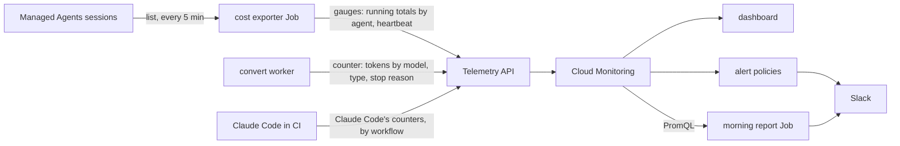

# Design: Cost monitoring

**Related:** [`../runbooks/claude-api-wif.md`](../runbooks/claude-api-wif.md) (the Anthropic-side identities each
workload federates into, and their scopes), [`deployment.md`](deployment.md) (the GitHub-to-GCP federation pool CI runs
authenticate through, and where a secret lives), [`spike-infrastructure.md`](spike-infrastructure.md) (§5 — GCP infra
budgets, which this doc does not replace), [`agent-runtime.md`](agent-runtime.md) (the trace's per-turn token telemetry,
and why a session's cost is not summed from it), [`managed-agents.md`](managed-agents.md) (how sessions come to exist),
[`evidence-fulltext.md`](evidence-fulltext.md) (the conversion lane whose direct model calls this monitor counts).

## Overview

Themis spends on Anthropic in three places, and only the invoice sees all three together. This doc designs the monitor
that shows that spend as it happens — a dashboard, alerts, and a morning Slack report — without holding a credential
that could read the invoice.

- **Spend is observed client-side, by the code that incurs it.** The provider's own spend reports need an
  organization-admin credential — no read-only or workspace-scoped form of them exists — and nothing in Themis holds
  one. So each place our code or our tooling makes a billable call reports what it used: the **cost exporter** polls the
  workspace's Managed Agents sessions, whose listing carries every session's cumulative usage and list cost; the
  **convert worker** counts the tokens of each direct Messages API call at the call site; and the Claude Code runs in CI
  export Claude Code's own usage metrics. Nothing else in the codebase bills.
- **Tokens are the unit; dollars are derived at query time.** Tokens are the raw fact every source exposes. A list-price
  table in the Pulumi program, rendered into every query it emits as literal multipliers, prices them for the dashboard,
  the alerts and the report alike. Where the provider computes a dollar figure — a session's list cost, Claude Code's
  own cost metric — that figure is kept, because it accounts for charges tokens cannot. A model the price table lacks
  raises an alert rather than pricing at zero.
- **One write path.** Every producer writes through OpenTelemetry over OTLP to Google's Telemetry API, and everything
  downstream reads Cloud Monitoring with PromQL. Dashboard, alert policies, notification channel and the report Job are
  Pulumi resources.
- **Two series kinds, two query shapes.** A polled running total is a gauge whose window figure is a delta and whose
  silence means the poller is dead; a counted event is a counter whose window figure is an increase and whose silence
  means an idle lane. The freshness alert therefore watches the exporter alone.
- **No store of record, no admin-capable identity.** Anthropic retains sessions until we delete them, so the API is the
  raw store and drill-down is a live query; each producer's identity can write metrics and nothing more.

## Background

**Where the dollars are.** A direct Messages API response carries a `usage` block — token counts by component — and no
price. A Managed Agents session carries cumulative `usage` too, and in addition a `list_cost`: model tokens at published
list rates, plus web search and session running time
([pricing](https://platform.claude.com/docs/en/about-claude/pricing)), rounded to the cent and growing as the session
works. That is the only dollar figure readable with a workspace credential. The organization-wide usage and cost reports
of the Admin API are readable with an Admin API key, an organization-admin token, or a key not scoped to a workspace
acting with its owner's permissions; no read-only or workspace-scoped scope exists for them
([authentication](https://platform.claude.com/docs/en/manage-claude/authentication)). Claude Code, when told to, exports
its own metrics over OpenTelemetry: tokens by type and model, and a cost figure in dollars it computes per request.

**What bills, in this codebase.** Every use of the Anthropic SDK in Themis is one of three things. Managed Agents
plumbing — the web tier creating sessions and sending and reading events, the dispatcher draining the work queue, the
sandbox worker serving a session's tool calls — whose model calls all bill through the session. Read-only calls — the
exporter listing sessions. And one direct model call: the convert worker transcribing a PDF
([`evidence-fulltext.md`](evidence-fulltext.md)), the only Messages API caller
([`themis/litcache/anthropic_ocr.py`](../../themis/litcache/anthropic_ocr.py)). Outside the codebase, the review bot,
the doc garden and the merge follow-ups run Claude Code in GitHub Actions under the workspace's CI identity. That is the
whole list, and it is what the monitor covers.

**What a sessions listing returns.** The listing carries each session's full usage, so one paginated listing is a
complete snapshot of cumulative cost for every session ever created. Three properties of the API shape the design:

- **There is no change feed.** Sessions filter by creation time, status and agent, never by "updated since", and nothing
  pushes usage changes. Any monitor is a poller re-summing full listings.
- **Cost can grow at any age.** A session that finishes its work goes idle, not terminated, and accepts new events
  indefinitely, so last month's session can resume tomorrow and spend more. Anthropic retains sessions until explicitly
  deleted ([retention](https://platform.claude.com/docs/en/manage-claude/api-and-data-retention)); nothing ages out.
- **Archived sessions are excluded by default.** A naive listing under-counts; the monitor asks for them.

**How a session's list cost is made up.** For a Themis session it has three components: model tokens at list price,
session runtime at a flat rate per hour the session had a thread running (the session reports those seconds), and
server-side web searches at a flat rate per request (the session reports the count; web fetch is free). Tool execution
runs in our own sandbox, so no server-side execution charge applies. A session reports no model; which model an agent
runs is its configuration.

**What Cloud Monitoring accepts.** Points are immutable once written — no upsert, no backfill beyond a day, 24 months of
retention — so the monitor must feed it only values that never need rewriting. Google's ingestion path for application
metrics is OpenTelemetry: OTLP to the Telemetry API, which files each metric as a Prometheus-style series readable by
its OTLP name in PromQL. The API places a point by two labels it derives from the OpenTelemetry resource, a location and
an instance, and drops a point lacking either. Its metrics ingestion is in Preview.

**Who else looks at cost.** The trace records each turn's token usage for engineering analytics on analysis runs
([`agent-runtime.md`](agent-runtime.md)), but only for sessions that produce a trace, and the trace's spans cannot be
summed to a session's cost. Workspace spend accrues from every session — analysis runs, eval loops, ad-hoc experiments —
and from calls that are not sessions at all. That is this monitor's gap.

## Non-goals

- **Billed-dollar accuracy.** List price is the tracked figure; reconciling against the invoice (discounts, credits) is
  a finance activity, not a monitoring one.
- **Per-session runaway alerting.** The platform-enforced session budget set at creation guards against a single looping
  session, and the morning report is the human backstop. Per-session series would be unbounded label cardinality, and
  the monitor does not carry them.
- **A store of record.** Anthropic retains every session's usage until we delete it, and the metric store keeps 24
  months; a copy of our own buys nothing yet asked for (Alternatives considered).
- **Cross-workspace aggregation.** Workspaces are per environment
  ([`../runbooks/claude-api-wif.md`](../runbooks/claude-api-wif.md)), and so is the Pulumi program; each environment's
  stack monitors its own workspace.
- **Spend made outside the workspace's identities.** A person's own key spends as that person; the monitor covers what
  the deployed workloads and the repository's CI incur.
- **GCP infrastructure cost.** CPG's per-project budgets govern it ([`spike-infrastructure.md`](spike-infrastructure.md)
  §5) and a native billing dashboard charts it; what scales with usage — sandbox runtime, Cloud SQL storage, GCS growth
  — belongs on that dashboard, not this one.
- **A curator-facing surface.** This is a dev/ops dashboard; cost never appears in the curator UI.

## Design

### Three producers, one workspace figure

A **producer** is one place spend is incurred and reported. The monitor has three, and the dashboard's headline is their
sum in dollars.

**Sessions — polled by the cost exporter.** A Cloud Run Job on a five-minute schedule lists every session in the
workspace, archived included, and sums each session's cumulative usage by **agent name**: list cost in cents, tokens by
type, active seconds, and web-search requests. It writes each sum as a gauge and exits; the entry point is
[`themis/services/cost_exporter`](../../themis/services/cost_exporter/__main__.py). The four figures are enough to
decompose a session's list cost without a model label: runtime is active seconds at the flat hourly rate, search is
requests at the flat per-request rate, and token cost is what remains of list cost once both are subtracted. The
decomposition is exact up to the cent rounding of each session's list cost, and it is a query, not something the
exporter computes.

Attribution is the agent's name because it is what a session records. The session object names no creator, so "who spent
this" has no server-side answer; each workload runs its own agent, so agent and workload coincide. If two workloads ever
share an agent their spend merges until sessions are stamped with a creator (Alternatives considered).

**The convert worker — counted at the call site.** The one direct model call in the codebase adds its response's token
counts to a counter, labelled by the **model** the response reports, the **token type**, and the **stop reason**
([`themis/telemetry/request_tokens.py`](../../themis/telemetry/request_tokens.py)). The stop reason is a label because a
truncated or refused transcription is billed like a complete one, and a lane paying for output it then discards is what
an operator reading this dashboard wants to see. The counter is recorded before the outcome is judged, for the same
reason. The conversion library itself depends on no telemetry: it takes a counter interface, and the worker hands it the
telemetry one, so the library stays importable and testable without a meter.

**Claude Code in CI — Claude Code's own metrics.** The three workflows that run Claude Code enable its native
OpenTelemetry export through the action's settings, pointed at the same Telemetry API. Claude Code reports tokens by
type and model, and a cost figure in dollars by model. The **workflow** rides as the OpenTelemetry service namespace, so
the three are told apart by the resource their series belong to rather than by a label on the points, which carry none
of the resource's attributes. Nothing is parsed from the run's output.



### The series

Everything downstream reads these series and nothing else. The Themis names live in one module
([`themis/telemetry/names.py`](../../themis/telemetry/names.py)) — underscores rather than OpenTelemetry's dotted
convention, since a dotted name has to be quoted in every PromQL expression that touches it; the Pulumi program cannot
import the module and keeps a copy that a test holds to it constant by constant. Claude Code's two are its own
instruments, dotted, and quoted where read.

| Metric                                                     | Kind                 | Unit                    | Labels                                                       | Written by                        | Counts                                                  |
| ---------------------------------------------------------- | -------------------- | ----------------------- | ------------------------------------------------------------ | --------------------------------- | ------------------------------------------------------- |
| `themis_anthropic_session_list_cost_cents`                 | gauge, running total | cents                   | `agent`                                                      | exporter, every run               | the agent's sessions' cumulative list cost              |
| `themis_anthropic_session_tokens`                          | gauge, running total | tokens                  | `agent`, `type`                                              | exporter, every run               | cumulative tokens by component                          |
| `themis_anthropic_session_active_seconds`                  | gauge, running total | seconds                 | `agent`                                                      | exporter, every run               | cumulative running time the runtime charge is priced on |
| `themis_anthropic_session_web_search_requests`             | gauge, running total | requests                | `agent`                                                      | exporter, every run               | cumulative web-search calls                             |
| `themis_anthropic_exporter_last_success_timestamp_seconds` | gauge                | seconds since the epoch | none                                                         | exporter, every run               | when the last run succeeded                             |
| `themis_anthropic_request_tokens`                          | counter              | tokens                  | `model`, `type`, `stop_reason`                               | convert worker, per Messages call | each direct call's tokens by component                  |
| `claude_code.token.usage`                                  | counter              | tokens                  | `type`, `model`, `query_source`, and Claude Code's `user.id` | Claude Code in CI                 | each run's tokens by component                          |
| `claude_code.cost.usage`                                   | counter              | USD                     | `model`, `query_source`                                      | Claude Code in CI                 | Claude Code's own list-price cost                       |

`type` takes `input`, `output`, `cacheRead` and `cacheCreation` everywhere.

Every series is a `prometheus_target` in Cloud Monitoring, so it also carries the labels the Telemetry API derives from
the producer's resource: `location` (the region), `job`, `instance` and `namespace`. The exporter writes as
`job=themis-cost-exporter` with one fixed `instance` per environment — the Anthropic workspace id — so every execution
extends one series and a delta over it means something. The worker writes as `job=themis-convert-worker` with one
`instance` per Cloud Run instance: separate counter series, summed at query time. CI writes as `namespace=<workflow>`,
`job=<workflow>/claude-code`, one `instance` per run. The series Themis writes also carry `scope_name=themis`.

### Tokens are the unit; dollars are a query

Every source exposes tokens; only some expose dollars. Making tokens the unit keeps the three producers on one
vocabulary — one metric family, one `type` label, one price table — and keeps pricing out of the producers, which would
otherwise each carry a copy of a table that changes when the provider's prices do.

**The price table is static, in the program.** List prices per model and token type live in one module of the Pulumi
program ([`infra/themis_infra/cost_prices.py`](../../infra/themis_infra/cost_prices.py)), and the program renders them
into every query it emits — dashboard, alerts, report — as literal multipliers on the token series. One source prices
everything, with no runtime series carrying a constant and no join in the query, and the convert lane's dollars depend
on nothing but its own counter. A query can also ask which usage the table does not price — tokens whose model is not
among the ones the table names — and the **unpriced-usage alert** fires when the convert worker reports such a model,
rather than the multiplier silently pricing it at nothing. The table names the models Themis calls or is likely to, and
grows when a caller reaches for another; that alert is what makes a model outside it page rather than price at zero. A
price edit is a code change, deployed, and reprices history (Consequences accepted).

**Provider dollars are kept where they exist.** A session's list cost includes runtime and web search, which are not
tokens, so pricing a session's tokens alone would under-count it; the list cost is the session figure, and the token
price is used only to read the split. Claude Code's cost figure accounts for per-request context tiers a longer
conversation crosses — a request over the standard context window is priced higher — which an aggregate token count
cannot recover; so its figure is the CI figure. Only the convert worker's spend is derived from tokens: one model, one
tier, one request shape, so nothing but the token counts varies between its calls.

**The label vocabulary is Claude Code's.** The `type` label takes Claude Code's four values — input, output, cache read,
cache creation — so a session's tokens, the worker's and Claude Code's break down on one axis and one price table covers
them all. The convert worker's cache-creation count covers both cache lifetimes together and is priced at the
five-minute write rate; a one-hour write costs twice that and is under-priced by the difference until a caller uses
one-hour caches, at which point the split is a new label value, not a new metric. Labels for service tier, inference
geography, speed and context tier are likewise deferred until a caller sets any of them: the worker runs one model at
the standard tier, and an unset label is a series dimension with one value.

### Running totals and event counters

The two ways spend reaches the monitor differ in kind, and the difference decides how each is queried and alerted.

**A polled total is a gauge of a running total.** The exporter writes each agent's cumulative figures unconditionally on
every run, whether or not anything changed; deltas, rates and windows are computed at query time. The window figure over
such a series is its **delta**. This carries most of the exporter's design:

- **Nothing ever needs rewriting.** A cumulative total observed at time T is a fact about T; a resumed session makes
  later points larger, never past points wrong, so Monitoring's immutability stops being a constraint.
- **The exporter is stateless.** A delta needs the previous value; a total needs nothing — no state store, no
  read-modify-write, no recovery logic.
- **Missed runs need no repair.** A skipped tick leaves a sparser series; the next point carries the full total and any
  window delta over it stays correct. Duplicate or racing runs write near-identical points harmlessly — the failures a
  delta scheme double-counts or drops.
- **Session deletion shows honestly.** Deleting a session steps its agent's total down, which a window delta shows as
  negative spend — odd-looking but truthful. This is why the series is a gauge and not a counter, whose reset semantics
  would read the dip as a restart and fabricate a spend spike.
- **Silence means the poller is dead.** Because the gauge is written every run, a silent exporter — crash, timeout,
  revoked credential — is indistinguishable from and detected as missing data. The **freshness alert** is the absence of
  the exporter's heartbeat — the time of its last successful run, written whether or not the workspace has sessions, so
  an empty workspace does not read as a dead exporter — and it is the one alert that covers every way the exporter can
  die, since a dead exporter cannot report on itself.

**A counted event is a counter.** The worker's token counter and Claude Code's counters count events as they happen; the
window figure is the **increase**, which sums across the counter resets a restarted process produces. Silence here means
the lane was idle — no conversion ran, no CI job ran — and is not a fault, so no freshness alert watches a counter. Each
Cloud Run instance of the worker counts from zero in its own series; the query sums them. Each CI run is its own series
set: the run is the instance, and Claude Code stamps a per-runner user id on every point besides, so one run could not
extend another's series even if that were wanted; the query sums those too.

What a polled total costs is freshness: it is exactly as current as the last poll, so session spend appears with up to
one tick of latency, and per-cent rounding hides sub-cent growth until it accumulates.

### One write path: OpenTelemetry to the Telemetry API

Three producers in two languages and two runtimes write through one mechanism: an OpenTelemetry meter whose exporter
speaks OTLP to Google's Telemetry API, authenticated by the workload's own Google identity. The shared pipeline for the
Python producers is [`themis/telemetry`](../../themis/telemetry/__init__.py); Claude Code brings its own. OpenTelemetry
is the standard for this, Google states it as the direction and has deprecated its Monitoring-API exporters, and a
metric lands in Cloud Monitoring under one uniform prefix whatever produced it. The API's Preview status is accepted:
what it costs is the possibility of a breaking change to the ingestion path, which would break the write, visibly, and
not the data already written.

**What the endpoint requires shapes each producer's resource.** A point is placed by a location and an instance, so the
pipeline refuses to build a resource that yields neither rather than let every point be dropped. Beyond that the
instance is chosen per producer for the query shape above: fixed for the exporter Job, whose every execution is a new
process, detected from the environment for the worker, and the run itself in CI (§The series).

**The worker exports off the request path.** Its meter exports periodically, so a conversion never waits on a metric
write and a failed export is logged, not raised: the export can fail without a paper failing, and a paper can fail
without its tokens going unrecorded. Shutdown flushes the last points inside Cloud Run's termination grace. The exporter
Job, by contrast, exports once at the end — the totals and the heartbeat together — and exits non-zero if the API
refuses, so a run that failed leaves no heartbeat behind.

**Claude Code's export runs on an interval, and its flush at exit is what carries the last response.** Cloud Monitoring
refuses a second point on a series within five seconds of the last, so a frequent cadence would land that exit flush
inside the window behind a periodic export and lose it; at Claude Code's default cadence the odds are small, and since
the counters are exported as cumulative totals the intermediate exports add nothing to a run's total that the final one
does not carry. The accepted consequence is a small chance per run of losing the last response's tokens; the alternative
kept in reserve is in Alternatives considered.

### What reads the metrics

Everything downstream reads Cloud Monitoring, with PromQL, so everything downstream is a Pulumi resource in the same
program that deploys the producers.

**The dashboard** has a section per producer under a workspace headline: the workspace dollar total stacked by producer;
sessions — list cost by agent, and its runtime, token and search split; the convert lane — tokens by type and model,
with the derived dollars beside them; CI — tokens by workflow and model, and Claude Code's own cost.

**Three alert policies over the metrics, and a fourth over the report Job's executions**, all notifying Slack through
Monitoring's incident lifecycle:

- **A spend spike** on the one workspace dollar total — sessions' list-cost delta, plus the worker's token increase at
  list price, plus Claude Code's cost increase — over a rolling window against a threshold in stack configuration. One
  total rather than one alert per producer, because the question a spike answers is "is the workspace spending faster
  than we expect", and which producer is the dashboard's to show.
- **Freshness**, the absence of the exporter's heartbeat (§Running totals and event counters), written as a PromQL
  condition rather than Monitoring's own absence condition because only a PromQL condition can be declared before its
  metric exists — a fresh environment deploys before the first point is written.
- **Unpriced usage**, when the worker reports tokens under a model the price table lacks — a static matcher over the
  models the table names (§Tokens are the unit).
- **A failed morning report**, on the report Job's executions. The report posts only when a figure moved, so without
  this a failed morning would be indistinguishable from a quiet one.

**A morning report**, distinct from alerting. A second Cloud Run Job, on a daily schedule in Sydney time, evaluates a
fixed set of PromQL queries against Monitoring's Prometheus HTTP API — the Pulumi program renders them into the Job's
environment, so it stays the one source of PromQL over the spend metrics, and the report parses what it is given
strictly — and posts to the spend channel: the total first, then dollars per producer with the sessions split, and a
chart of hourly dollars stacked by producer, one upload carrying the message as its comment. A producer no series
answered for reads as no data, not as nothing spent; a negative figure is shown as it is. It posts only when a figure
moved, so the channel carries information on the normal days and the alert path stays reserved for the abnormal ones.
Tokens stay on the dashboard; the report is the dollar view. The window is the 24 hours to the run, so on a
daylight-saving changeover it covers one hour twice or not at all; the heading names the window's end, so the figure
stays true to what it says.

**Drill-down is a live query, not a stored view.** "Which session is that spike?" is answered against the API, which
holds every session's cumulative usage indefinitely; the appendix carries a worked example. "Which conversion?" is
answered from the worker's log, which records each transcription's model and token counts.

### Identity

No identity in the monitor can read the provider's spend reports, because none is admin-capable, and no identity holds
more than its producer needs.

**The exporter** runs as its own GCP service account and exchanges that identity for a short-lived Anthropic token under
a dedicated Anthropic service account and federation rule — the established path and naming in
[`../runbooks/claude-api-wif.md`](../runbooks/claude-api-wif.md), whose Anthropic side is an organization-admin
registration that follows the first deploy minting the GCP identity the rule pins. It shares the web app's identity on
neither side, so disabling it touches nothing else and Anthropic-side attribution stays legible per workload. The
exchange grants the workspace-developer scope because nothing narrower reaches sessions — the only other workspace scope
excludes Managed Agents, and read-versus-write scopes do not exist — and that is enough to list the workspace's
sessions, usage included. On the Google side the exporter holds one capability, writing metrics
([`grants.TelemetryWriter`](../../infra/themis_infra/grants.py)): it writes points to any metric in the project — a
point under a name the project has not seen creates the metric — and, through Google's predefined Service Usage Consumer
role, uses the project's service quota and may also list the project's time series. A custom role holding only the
quota-use permission was considered and rejected on lifecycle, for the reasons [`pr-screenshots.md`](pr-screenshots.md)
records for its area: the deploy identity cannot create roles, and a deleted custom role blocks its id for weeks.

**The convert worker** already federates into Anthropic as itself for the transcription; it gains the same
metrics-writer capability and nothing else.

**The CI runs** authenticate to Google through the repository's GitHub federation pool
([`deployment.md`](deployment.md)) as a service account that holds the metrics-writer capability and nothing else, so a
run that takes it can write metric points and do nothing more; any run of the repository may take it, whatever its ref
or event. The account is program-managed
([`infra/themis_infra/ci_telemetry.py`](../../infra/themis_infra/ci_telemetry.py)) since, unlike the deploy identities,
nothing needs it before Pulumi can run. What a run gains is a bearer token for the export, not a credentials file on
disk. The step that obtains it never blocks the job it precedes: a failed exchange lets the review, the garden or the
follow-ups run without telemetry, which shows as a producer with no data on the report and an empty CI section on the
dashboard, not as a failed review. Telemetry is never allowed to break the work it observes.

**The report Job** reads Monitoring under a viewer-only identity and posts with a Slack bot token — the one secret the
monitor holds, kept on the deployment's secret path ([`deployment.md`](deployment.md)). A bot token rather than an
incoming webhook because the chart is a file upload, which only the Web API can do.

### What is stored where

Anthropic holds the raw data: every session, its cumulative usage, its transcript, until we delete it. Cloud Monitoring
holds the derived signal — the gauges and the counters — for 24 months. Nothing else is stored: the price table is code,
the exporter keeps no state, the report reads and posts, and the bot token is a secret like any other.

### Failure posture

Correctness is never traded for liveness. The exporter's run has a hard deadline well under its schedule interval, and
any error — a page that fails, a session missing a field the totals need, an export the API refuses — aborts the run
with nothing written, because a partial total written as the gauge would read as spend shrinking, a silent wrong answer,
where a missing point is a visible gap the freshness alert catches. The full scan is deliberate: at current volume it is
a handful of pages against a documented per-minute request ceiling, and the deadline is the tripwire that says when to
revisit (the incremental option is in Alternatives considered). The worker's counter can neither fail a conversion nor
be failed by one. In CI a telemetry failure costs the run its metrics, never its result, and a healthy export can lose
at most the last response.

### Consequences accepted

- **The exporter's credential can write.** The workspace-developer scope is the scope the data plane creates sessions
  with — read-only is the exporter's behaviour, not its token's ceiling — so a compromised exporter could spend in the
  workspace. The bounds: the workspace's own spend and rate limits cap the damage, the short-lived token is mintable
  only by the pinned GCP identity, disabling that identity revokes everything, and the spend such a compromise would
  create lands on exactly the dashboard and alerts this design builds.
- **The figure is list price**; a contracted discount makes the real bill lower, never higher.
- **The price table is hand-maintained, and an edit reprices history**, since the multipliers apply to whatever range a
  query reads. Accepted: Anthropic ships a new model id at a new price rather than changing an existing id's, and a
  corrected row should apply retroactively anyway. The table itself has no staleness guard: the unpriced-usage alert
  catches a model outside it, but a list price Anthropic changed for an existing model id would go unnoticed until
  someone edits the row — accepted for the same reason, and because list price is already an approximation of the bill.
- **A CI run may lose its last response's tokens**, with small odds per run, and each run is its own series set:
  cardinality grows with runs, within what a repository's workflow volume produces.
- **History beyond 24 months is gone from the metric**, re-derivable from the API for sessions while they exist and not
  at all for the counters.
- **A new breakdown dimension starts from its introduction**; Monitoring cannot backfill the past.

## Alternatives considered

- **The Admin API's usage and cost reports.** Billed dollars, org-wide, and tokens by workspace and service account —
  but only under a credential that can also manage the organization (§Background), and the dollar report offers daily
  buckets and no per-workload split. A monitor should not hold such a credential to read its own workspace's spend;
  ruled out, to be revisited only if a scoped read-only credential ships.
- **Priced tokens only, no provider dollars.** One rule for every producer — but it under-counts sessions, whose runtime
  and search charges are not tokens, and misprices Claude Code, whose per-request context tiers an aggregate cannot see.
  Provider dollars where they exist, tokens elsewhere.
- **The price table as a runtime series**, written by the exporter every run and joined to the token series in the
  query. It would record the rate in force at each point in time, so a window spanning a price change would price each
  side at its own rate — but that is a runtime write for a constant, and it couples every producer's dollar figure to
  the exporter being alive. Literal multipliers rendered into the queries read the same table with neither.
- **Log-based metrics** for the worker's usage: one structured line per conversion, turned into a series by Monitoring.
  No metric client in the worker, and the line doubles as an audit trail — but the metric is bespoke to Monitoring, is
  its delta kind rather than a counter, lands about ten minutes behind the log, and turns a log line's format into a
  contract. OpenTelemetry writes the same fact as a counter, on time, in the shared vocabulary.
- **The Monitoring API's write call**, directly. Google's guidance for application metrics is OpenTelemetry rather than
  that call, and it offers no counter semantics for a per-call event: a caller would aggregate and keep start times
  itself, re-implementing the SDK.
- **A table of cost surfaces** — a declared list of producers driving the dashboard, alerts and report from one
  structure. A generalisation built from one row; with three producers whose queries differ in shape, each surface is
  written where it is read.
- **A post-step parsing Claude Code's execution file** instead of its native export. The file carries the run's exact
  usage and cost after the fact, so it loses no tail; it is also a second mechanism, bespoke to CI, parsing a file whose
  format is the action's. Kept as the fallback if the exit flush proves to lose the last response often enough to
  matter.
- **A store of record** (append-only per-session snapshots in BigQuery), Monitoring derived from it. Indefinite
  retention, deletion-proof history, re-derivable breakdowns — and the natural extension if any of those become needs.
  Rejected for now: Anthropic already retains the raw data, so the store duplicates it to serve queries nobody is
  asking, and drags in a dataset and a dashboard surface that cannot be charted from Monitoring.
- **Exporter-computed deltas, or Monitoring's cumulative kind.** Deltas make the exporter stateful and turn missed runs
  into gaps needing repair; the cumulative kind's reset semantics turn a deletion's step-down into a fabricated spike. A
  gauge of a running total gets immutability for free and is honest under deletion.
- **Incremental scans.** Bounding the frequent scan by creation date needs a second unbounded pass for resumed old
  sessions, and filtering by status risks silently dropping sessions when the status vocabulary grows. Complexity
  against a problem the full scan will not have for years; the run deadline says if that changes.
- **Creator stamped in session metadata.** The clean who-launched-it dimension, and the upgrade path if agent-name
  attribution blurs — but it needs a change in every session-creating path and cannot cover sessions that already exist.
- **A federation rule on the web service account** for the exporter. Registering a rule is gated by the same
  organization-admin permission as creating a service account, so it saves no request, and it would merge the exporter's
  attribution into the web identity for nothing in return.
- **Push instead of poll.** No usage-change events exist.

## Open questions

- Alert thresholds and windows are operational tuning, set from the first weeks of data rather than designed here.
- How often Claude Code's exit flush loses a run's last response is measured against runs' execution files; if the loss
  proves material, the post-step fallback replaces the export.

## Appendix — drill-down worked example

The dashboard's sessions section says *which agent* and *when*; the session behind a spike is one query away, no admin
credential involved:

```sh
ant beta:sessions list \
  --created-at-gte 2026-08-01T00:00:00Z --created-at-lt 2026-09-01T00:00:00Z \
  --include-archived --max-items -1 --format jsonl \
  --transform '{id,created_at,status,agent:agent.name,cost:usage.list_cost.amount}'
```

Sorting the output by cost names the culprit; `ant beta:sessions retrieve` on its id gives the full picture, and the
session's transcript — retained until deleted — holds what it was doing.
