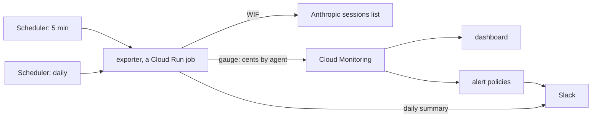

# Design: Cost monitoring

**Status:** current **Related:** [`../runbooks/claude-api-wif.md`](../runbooks/claude-api-wif.md) (WIF paths,
service-account naming, per-env workspaces), [`spike-infrastructure.md`](spike-infrastructure.md) (§5 — GCP infra
budgets, and the trace-based token rollup this doc is not), [`frontend-framework.md`](frontend-framework.md) (the
durable trace and its cross-session analytics), [`managed-agents.md`](managed-agents.md) (how sessions come to exist),
[`evidence-fulltext.md`](evidence-fulltext.md) (the conversion lane whose direct-API spend this monitor cannot see).

## Overview

The bulk of what Themis spends on Anthropic flows through Managed Agents **sessions**, and the session object is the
only place a dollar figure is readable without an organization-admin credential. This doc designs the monitor for that
spend. The decisions:

- **A stateless exporter writes one metric.** Every run lists every session in the workspace, sums each agent's
  cumulative list cost, and writes it as a Cloud Monitoring gauge; deltas are a query, not a stored value.
- **No store of record.** Anthropic retains sessions until we delete them, so the API is the raw store and our metric a
  derived signal; per-session drill-down is an on-demand query against the live API, not a copy we keep.
- **Everything downstream derives from the metric.** The dashboard, the spend-threshold alert, the freshness alert
  (metric absence), and a daily Slack summary all read the same series inside Cloud Monitoring.
- **All of it is Pulumi.** Exporter, schedules, metric, dashboard, alert policies, notification channel — declarative
  resources end to end.
- **A dedicated identity over WIF.** The exporter authenticates by Workload Identity Federation with its own service
  account, holding no stored key.
- **Two adjacent cost surfaces are mapped, not built.** The paper-conversion lane's direct Messages-API spend,
  observable only at the caller (a self-reported usage metric is the seam), and GCP infrastructure cost, which existing
  budgets govern and a native billing dashboard charts.

## Background

**Where the dollars are.** A session accumulates a `usage.list_cost` figure — model tokens at published list rates, plus
web search and session running time ([pricing](https://platform.claude.com/docs/en/about-claude/pricing)) — rounded to
the cent, growing as the session works. This is *list* price, not the billed price where a contract discounts it, and it
exists only on sessions: the Admin API's organization-wide cost and usage reports require an `org:admin` credential, no
read-only or workspace-scoped usage scope exists, and a direct Messages API call carries no dollar figure at all. So a
workspace-scoped monitor watches sessions or watches nothing.

**What a listing returns.** The sessions list carries each session's full `usage`, so one paginated listing is a
complete snapshot of cumulative cost for every session ever created — no per-session fetches. Three properties of the
API shape the design:

- **There is no change feed.** Sessions can be filtered by creation time, status, and agent, but not by "updated since";
  nothing pushes usage changes. Any monitor is a poller diffing or re-summing full listings.
- **Cost can grow at any age.** A session that finishes its work goes `idle`, not `terminated`, and accepts new events
  indefinitely — so last month's session can resume tomorrow and spend more. Anthropic retains sessions until explicitly
  deleted ([retention](https://platform.claude.com/docs/en/manage-claude/api-and-data-retention)); nothing ages out.
- **Archived sessions are excluded by default.** A naive listing silently under-counts; the monitor must ask for them.

**Retrospective growth versus monitoring stores.** Because old sessions can grow, any per-day attribution keyed to a
session's creation date rewrites history — and Cloud Monitoring points are immutable once written (no upsert, no
backfill beyond a day, 24-month retention). The design has to feed Monitoring only values that never need rewriting.

**Who else looks at cost.** The per-report token rollup from the durable trace
([`frontend-framework.md`](frontend-framework.md)) serves engineering analytics on analysis runs — but only sessions
that produce a trace. Workspace spend accrues from *every* session — analysis runs, eval loops, CI, ad-hoc experiments —
and in dollars, which the trace never carried. That gap is this monitor's; the two cost surfaces beyond sessions
entirely are mapped in §Adjacent cost surfaces.

## Non-goals

- **Instrumenting the adjacent cost surfaces.** Direct-API usage export belongs to the conversion worker, and the GCP
  billing dashboard is native GCP configuration; §Adjacent cost surfaces names both seams — this design builds neither.
- **Billed-dollar accuracy.** List cost is the tracked figure; reconciling against the invoice (discounts, credits) is a
  finance activity, not a monitoring one.
- **Per-session runaway alerting.** The platform-enforced session budget set at creation is the guard against a single
  looping session; the daily report is the human backstop. The monitor's aggregate metric cannot carry per-session
  series without unbounded label cardinality, and doesn't try.
- **A store of record.** Anthropic retains every session's full usage until we delete it, so keeping our own copy buys
  nothing v1 needs; the trade-offs of adding one later are in Alternatives considered.
- **Cross-workspace aggregation.** Workspaces are per-env
  ([`../runbooks/claude-api-wif.md`](../runbooks/claude-api-wif.md)), and so is everything in this repo's Pulumi
  program; each env's stack runs its own exporter against its own workspace.
- **A curator-facing surface.** This is a dev/ops dashboard, consistent with cost never appearing in the curator UI.

## Design

**The signal is a cumulative total, not a delta.** Every run, the exporter lists all sessions (archived included, full
pagination), sums cumulative list cost in cents grouped by **agent name**, and writes one gauge point per agent —
unconditionally, whether or not anything changed. Deltas, rates, and windows are computed at query time (PromQL) by the
dashboard and the alert policies. This one choice carries most of the design's weight:

- **Nothing ever needs rewriting.** A cumulative total observed at time T is a fact about T; a resumed session makes
  later points larger, never past points wrong. Monitoring's immutability stops being a constraint.
- **The exporter is stateless.** A delta needs the previous value; a cumulative total needs nothing. No state store, no
  read-modify-write, no recovery logic.
- **Missed runs need no repair.** A skipped tick leaves a sparser series; the next point still carries the full total,
  and any window delta over it remains correct. Duplicate or racing runs write near-identical points harmlessly —
  exactly the failures a delta scheme double-counts or drops.
- **Session deletion shows honestly.** Deleting a session steps its agent's total down, which appears as a negative
  window delta — odd-looking but truthful. This is why the metric is a `GAUGE` and not Monitoring's `CUMULATIVE` kind,
  whose counter-reset semantics would misread the dip as a restart and fabricate a spend spike.

**Attribution is the agent's name.** The session object records no creator, so "who spent this" has no server-side
answer; what it does record is which agent ran. Today each workload uses its own agent, so agent name and workload
coincide. The consequence to accept: if two workloads ever share an agent, their spend merges until sessions are stamped
with a creator in `metadata` (Alternatives considered).

**Everything downstream lives in Cloud Monitoring, so everything downstream is Pulumi.** Charting BigQuery or any
external store would have forced a click-ops dashboard; a Monitoring-resident metric makes the dashboard, alert
policies, and Slack notification channel declarative resources:

- **Dashboard** — spend rate over time by agent (window deltas), cumulative total, one year of history in view
  (Monitoring retains 24 months).
- **Spend alert** — trailing-window delta above a configured threshold, notifying Slack through Monitoring's incident
  lifecycle (deduplication, auto-close).
- **Freshness alert** — metric *absence*. Because the gauge is written every run unconditionally, a silent exporter —
  crash, timeout, revoked credential, expired token — is indistinguishable from and detected as missing data. No
  self-reporting is trusted: a dead exporter cannot alert about itself, so absence is the one signal that covers every
  death mode.

**A daily Slack report, distinct from alerting.** A second, daily trigger of the same exporter queries the metric for
each agent's total now versus a day ago and posts the day's spend to Slack, only when it is non-zero — information on
the normal days, so the alert channel stays reserved for the abnormal ones.

**Drill-down is a live query, not a stored view.** "Which session is that spike?" is answered against the API, which
holds every session's cumulative usage indefinitely — typically driven through Claude with the operator in the loop. The
appendix carries a worked example.

**Failure posture.** The run has a hard deadline well under the schedule interval, and any error — a page that fails, a
session missing an expected field, an auth failure — aborts the run loudly rather than writing a partial total: a
partial sum written as the gauge would read as spend *shrinking*, a silent wrong answer. A failed run is caught by the
freshness alert; correctness is never traded for liveness. The full scan is deliberate — no incremental cleverness. At
current volume it is a handful of pages against a documented 600-requests-per-minute ceiling, and its cost grows only
with total session count; the run deadline is the tripwire that says when to revisit (the bounded-scan escape hatch is
in Alternatives considered).

**Identity.** The exporter runs as its own GCP service account and exchanges its identity for a short-lived Anthropic
token under a dedicated Anthropic service account and federation rule, following the established Path B pattern and
naming in [`../runbooks/claude-api-wif.md`](../runbooks/claude-api-wif.md). Registering either resource on the Anthropic
side — the service account or the rule — is an organization-admin action held outside the project, so the identity
arrives as one request to that admin, carrying the runbook's exact registration; the request can only follow the first
deploy, which mints the GCP identity the rule pins. The monitor does not share the web app's identity on either side:
disabling the exporter's GCP identity revokes it immediately without touching the web app's, and Anthropic-side usage
attribution stays legible per workload. `workspace:developer` is the scope the exchange grants, and nothing narrower
reaches sessions: the only other workspace scope, `workspace:inference`, excludes Managed Agents entirely, and
per-resource or read-versus-write scopes do not exist
([WIF reference](https://platform.claude.com/docs/en/manage-claude/wif-reference#oauth-scopes)). It suffices: a
federated token under it lists the workspace's sessions, usage included.



**What is stored where.** Anthropic holds the raw data: every session, its cumulative usage, its transcript — until we
delete it. Cloud Monitoring holds the derived signal: cumulative list-cost gauge points by agent, 24 months. Nothing
else is stored; the exporter keeps no state, and the Slack webhook lives in Secret Manager like any other secret
([`spike-infrastructure.md`](spike-infrastructure.md) §4).

**Consequences accepted.**

- The credential can write. `workspace:developer` is the same scope the data plane creates sessions with — read-only is
  the exporter's behavior, not its token's ceiling — so a compromised exporter could spend in the workspace. The bounds:
  the workspace's own spend and rate limits cap the damage, the short-lived token is mintable only by the pinned GCP
  identity, disabling that identity revokes everything — and the spend such a compromise would create lands on exactly
  the dashboard and alerts this design builds.
- History beyond 24 months is gone from the metric (re-derivable from the API while sessions exist).
- The figure is list price; a contracted discount makes the real bill lower, never higher.
- Per-cent rounding hides sub-cent growth until it accumulates; spend appears with up to one tick (5 min) of latency.
- A new breakdown dimension starts from its introduction; Monitoring cannot backfill the past.

## Adjacent cost surfaces

**Direct Messages-API spend — the conversion lane.** Not all Anthropic spend runs through a session. The full-text
conversion lane LLM-OCRs PDFs into litcache through direct Messages API calls
([`evidence-fulltext.md`](evidence-fulltext.md)) — no session, so no `list_cost`, and no dollar figure reachable without
`org:admin`: this spend appears on the invoice and nowhere else. Its governors today are structural, not observational —
the conversion queue caps concurrent dispatches and bounds retries precisely because each dispatch bears model cost. The
observation seam, when it is wanted, is the caller: every Messages response carries a `usage` block, and the cheap,
staleness-proof export is one structured log line per conversion carrying its token counts, turned into a dashboard
series by a log-based metric — no new credential, no metric-client code in the worker, and the line doubles as the
per-document audit trail. Dollars are deliberately not derived there: the response carries no price, so pricing tokens
client-side means maintaining a model-price table that silently goes stale — direct-API spend stays token-denominated on
the dashboard and dollar-denominated only on the invoice. That instrumentation belongs to the conversion worker.

**GCP infrastructure.** Governed by CPG's existing per-project budgets
([`spike-infrastructure.md`](spike-infrastructure.md) §5), and near the serverless floor at idle. What scales with
usage, and so is worth a chart: sandbox runtime (a session's sandbox job runs as long as the session works), Cloud SQL
storage, and GCS growth (litcache and corpora). A native billing dashboard beside the spend dashboard is the surface for
those curves; the budgets already alert on totals, and nothing needs building in this design.

## Alternatives considered

- **A store of record (BigQuery snapshots), with Monitoring derived from it.** Append-only per-session snapshot rows
  would give indefinite retention, deletion-proof history, and re-derivable breakdowns — and is the natural extension if
  any of those become needs. Rejected for v1: Anthropic already retains the raw data, so the store duplicates it to
  serve queries nobody is asking yet, and it drags in a dataset, views, and a dashboard surface that cannot be charted
  from Monitoring (the click-ops question this design dissolves).
- **Exporter-computed deltas.** Writing per-interval spend increments keeps Monitoring append-only too, but makes the
  exporter stateful (a delta needs the previous cumulative), turns missed runs into gaps needing repair, and makes
  racing runs double-count. The cumulative gauge gets the same immutability for free.
- **Monitoring's `CUMULATIVE` metric kind.** Purpose-built for counters, but its reset semantics turn a session
  deletion's step-down into a fabricated spend spike, and it adds start-time bookkeeping. A gauge of a running total
  with query-time deltas is simpler and honest under deletion.
- **The Admin API's cost/usage reports.** Billed dollars, org-wide — but `org:admin` only, with no scoped or read-only
  credential, and daily buckets. A monitor should not hold an org-admin key to read its own workspace's spend; revisit
  if a scoped credential ships.
- **Incremental scans.** Bounding the frequent scan by creation date requires a second unbounded pass for resumed old
  sessions, and filtering by status risks silently dropping sessions when the (demonstrably incomplete) status
  vocabulary grows. Both are complexity purchased against a problem the full scan will not have for years; the run
  deadline tells us if that changes.
- **Creator stamped in session `metadata`.** The clean who-launched-it dimension, and the upgrade path if agent-name
  attribution blurs — but it needs a change in every session-creating path and can never cover the sessions that already
  exist. Agent name costs nothing and is exact while workloads and agents stay one-to-one.
- **A federation rule on the existing web service account.** Halving the Anthropic-side ask looked attractive, but rule
  registration is gated by the same organization-admin permission as service-account creation, so it saves no request —
  and it would merge the exporter's Anthropic-side attribution into the web identity and couple the monitor to the data
  plane's credential chain for nothing in return.
- **Postgres as the sink.** The product database's lifecycle (migrations, backups, access) has no business coupled to
  ops telemetry, and it would still leave alerting and dashboards unsolved.
- **Push instead of poll.** No usage-change events exist; polling is the only mechanism on offer.

## Open questions

- Initial alert thresholds (trailing-window dollars, freshness window) are operational tuning, set with the first weeks
  of data rather than designed here.

## Appendix — drill-down worked example

The spike on the dashboard says *which agent* and *when*; the session behind it is one query away, no admin credential
involved:

```sh
ant beta:sessions list \
  --created-at-gte 2026-08-01T00:00:00Z --created-at-lt 2026-09-01T00:00:00Z \
  --include-archived --max-items -1 --format jsonl \
  --transform '{id,created_at,status,agent:agent.name,cost:usage.list_cost.amount}'
```

Sorting the output by cost names the culprit; `ant beta:sessions retrieve` on its id gives the full picture, and the
session's transcript — retained until deleted — holds what it was doing.
