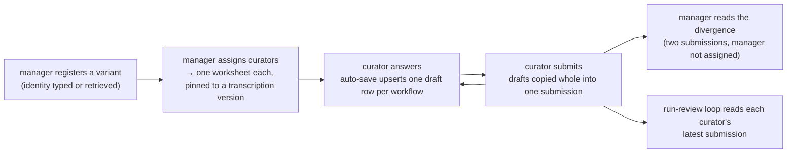

# Design: the curation surface

**Related:** [`evidence-interfaces.md`](evidence-interfaces.md) (the evidence rpcs and `themis.svcv4`, the library whose
vocabulary this surface shares and whose arithmetic it refuses to duplicate);
[`svcv4-worksheet-transcription.md`](svcv4-worksheet-transcription.md) (what the worksheet's workflows are, where the
calculator and the supplements part, and how the transcription is held to the framework);
[`svcv4-interpretations.md`](svcv4-interpretations.md) (the readings applied where the standard is silent or contradicts
itself — the worksheet mirrors two of them); [`workspace-model.md`](workspace-model.md) (Project, Analysis and working
document, and the membership chokepoint this surface stands beside rather than inside);
[`frontend-framework.md`](frontend-framework.md) (the web tier it runs in, and the IAP gate in front of it);
[`proto.md`](proto.md) (a proto at rest in a Cloud SQL column, and the compat gate that governs its evolution);
[`migrations.md`](migrations.md) (how the tables land, and the condition a destructive migration is taken under);
[`../runbooks/curation-vocabulary-deploy.md`](../runbooks/curation-vocabulary-deploy.md) (the closed-window procedure
the vocabulary migration is applied with); [`../PRODUCT.md`](../PRODUCT.md) (§6 adversarial review and calibrated
uncertainty, §7 the curation seat the workbench grows into); terms in [`../../GLOSSARY.md`](../../GLOSSARY.md).

## Overview

The curation surface is where a curator records an SVCv4 classification of one variant and the reasoning behind it,
working alone. It exists so the run-review loop — the evaluation that reads an agent's classification run against a
human's — has a reference authored by a human, in a shape a reader can compare a run to line by line.

- **The worksheet mirrors the ClinGen Pilot Calculator's workflows, with the arithmetic removed.** Every workflow's
  wording is transcribed verbatim; the points column, the running totals and the class band are dropped. What is stored
  is the curator's *selection* — the framework's own decision-tree cell — and their reasoning. Points stay derivable
  from the cell; nothing here computes them.
- **It is unassisted by design.** No agent, no prefill, no retrieval of evidence (§Assistance anchors). Variant
  *identity* is the one exception, retrieved by the manager who registers the variant.
- **Two curators answer each variant blind to one another, and both answers are kept.** Analyst-to-analyst spread is the
  measurement that says how much of a run's divergence is normal, and a split between the two is a finding the manager
  reads in a compare view, never a conflict to reconcile.
- **One vocabulary per concept.** Molecular consequence, mode of inheritance and class are the enums the evidence
  interfaces and `themis.svcv4` already speak, so a curator's answer and a run's are the same members.
- **Storage is a scratch tier and a record tier.** Auto-save upserts drafts; submitting copies them, whole and in one
  transaction, into insert-only assessments under a submission that owns the set. Lifecycle and status are read from
  those two facts, never stored.
- **It is its own module on the repository's ordinary machinery**, coupled to the workbench through infrastructure
  alone, so it can grow into the product's assisted curation seat, be absorbed by it, or be retired, each as a local
  change.

## Background

### Three layers, and the one that needs a human

An SVCv4 classification has three layers. **Fact recovery** finds what is known about the variant — its frequency, its
predicted effect, what has been observed in patients. **Assessment** turns each fact into a framework code at a
strength: the decision-tree cell the fact lands in, chosen by reading a supplement's clause against the case. **Tally**
sums the codes to a class.

The first and third are mechanical. Retrieval is what the evidence interfaces do, and the tally is what `themis.svcv4`
does, deterministically and audited against the calculator ([`evidence-interfaces.md`](evidence-interfaces.md)). The
middle layer is the seat SVCv4 assigns to "an experienced analyst": adjacent cells differ by a clause in a supplement,
and choosing between them is judgement. It is the only layer that needs a human, and the one that benefits from language
— a curator's reason for choosing a cell is worth more than the choice. Every decision in this doc follows from treating
that layer differently from the other two.

### What the run-review loop reads

The loop's reference is a curator's code set with its recorded reasoning, and the worksheet holds exactly that, in the
database: each curator's latest submission per variant, as one row per workflow carrying the status, the evidence, the
rationale, the nearest alternative and how open the call is; plus the routing the curator stated and the class they
reached. The loop reads it in the shape it is stored — no projection into a second contract, no file passed between the
two. How a run is read against that reference is the subject of `run-review-loop.md`; what this doc decides is what the
reference has to contain for that reading to be possible.

A divergence is only useful if it is *adjudicable*. A run that reaches the curator's cell by a route the curator would
reject has not matched them; a run that differs by a step while reasoning better has found something. Neither judgement
can be made from a chosen option and a sentence, which is why the capture below is more than a selection.

### Assistance anchors, and the reference is what anchoring corrupts

A recommendation is an anchor. Agreement with an anchored recommendation measures assent rather than judgement, biased
in the direction the loop exists to detect, and the reference is where that bias cannot be recovered from — every later
round is scored against it. The same argument bars the model from authoring the reference at all: the run under review
and any model-authored reference share a model family, so a shared misreading reads as a pass.

An instruction not to recommend does not close this. A model that merely notes one option is more common has anchored
without disobeying, and detecting that in prose is unreliable. The property a prompt cannot guarantee is the one the
worksheet buys structurally: nothing on the screen the curator did not put there. What anchors a curator is a
recommendation or a fact about the variant they are to assess — a frequency, a predicted effect, somebody else's
classification; the variant's identity is the *question*, not an answer to it, which is why §Identity may be retrieved
admits it.

### Two curators, blind

The pilot's own concordance among its analysts — reported in the SVCv4 working group's ACMG 2025 annual-meeting session,
on the slide "Results of SVC v4.0 Pilot", ten variants across eight to ten analysts — was 84% at seven class levels, 86%
at five and 91% at three. A divergence inside that envelope is data about the framework, not a defect in the run — and a
local measurement of the envelope is only obtainable if two curators answer the same variant without seeing each other's
answers.

### The framework's vocabulary, as used here

- **SVCv4** is the ClinGen 2026 pilot of ACMG V4, the points-based ACMG/AMP classification framework, released as a
  draft standard; the banner on [`evidence-interfaces.md`](evidence-interfaces.md) states what that means for anything
  built on it. **SM*n*** is its numbered Supplementary Material *n*, where the framework's rules are specified.
- A **workflow** is one of the calculator's question blocks: a title, an applicability line, a table of rows, and notes.
  Most score one **evidence code** (`POP_FRQ`, `CLN_AFF`, `MIS_PRD`…); some share a code across the inheritance modes
  they split on.
- A **cell** is one row of a workflow's decision tree — the thing a curator selects — named by a stable id built from
  the code and the row (`CLN_AFF.ad.specific_full`). The id names the cell for a human reader and for the compare view;
  the loop's reader matches a run's stated codes and derivations to the worksheet's cells by reading, not by a join.
- **Routing** is the pair of statements that decide which workflows apply at all: the mode of inheritance selects
  between the autosomal-dominant and recessive/X-linked variants of the observation workflows, and the consequence class
  selects the predicted-effect workflow.
- The **rarity gate** is the calculator's rule that a variant common enough against its disease threshold bars four
  clinical and locus codes outright ([`svcv4-worksheet-transcription.md`](svcv4-worksheet-transcription.md)).
- A **variant** on this surface is one variant being classified against one **mono-disease entity** (gene × disease ×
  inheritance × mechanism), the framework's unit of classification.
- **IAP** is the Identity-Aware Proxy in front of the web app, which authenticates every request before it reaches the
  app ([`frontend-framework.md`](frontend-framework.md) §Auth).

## Non-goals

- **No points, no totals, no bands, no classification arithmetic** — not shown, not stored, not computed. `themis.svcv4`
  owns the tally and is tested against the calculator; a second implementation behind a form is a second thing to audit.
  The one threshold comparison the worksheet does make, the frequency bin, reads the library's own numbers and is joined
  to them by a test.
- **Retrieves no evidence.** No frequency, no gene-disease lookup, no ClinVar, nothing about the variant's effect or
  existing classification. What a curator assesses, they look up themselves. Variant identity is the exception, and is
  not evidence.
- **Not an authority on the framework.** Where the calculator and the supplements disagree, the worksheet mirrors the
  calculator and records the disagreement on the workflow it affects; it adjudicates nothing.
- **Not a Themis Analysis.** A curation is not a session, has no working document, spawns no agent and appears in no
  Project. It shares the deployment and the IAP boundary and nothing else.
- **Not a general form builder.** The workflows are SVCv4's, transcribed rather than authored, and rendered as
  components rather than driven by a schema.
- **Does not reconcile two curators' answers**, and does not author the reference from the model's judgement.

## Design

### Where it lives, and what it is coupled to

Whether the worksheet stays what it is, grows into the assisted curation seat of [`../PRODUCT.md`](../PRODUCT.md) §7, is
absorbed by it, or is retired once a reference exists is not knowable now. The design commits to none of those and to
clean seams instead: a module whose boundaries are explicit can be evolved, absorbed or dropped as a local change, while
one whose boundaries are implicit can only be negotiated with.

It uses the repository's ordinary machinery and lives in directories of its own inside each: the pages and route
handlers under [`apps/web/src/app/curation/`](../../apps/web/src/app/curation) and
[`apps/web/src/app/api/curation/`](../../apps/web/src/app/api/curation), the module under
[`apps/web/src/curation/`](../../apps/web/src/curation), the contract in
[`curation.proto`](../../schema/proto/themis/curation/models/curation.proto), the schema in
[`0011_curation.sql`](../../themis/migrate/migrations/0011_curation.sql). A pipeline of its own would buy separation the
seams already give, and forfeit the repository's checks to get it.

The rule for what the module may depend on: infrastructure, yes — the IAP verifier, say; the workbench's domain, no —
never its `AuthorizedBackend`. Infrastructure is shared by everything and outlives any one caller; a domain coupling has
to be renegotiated whenever either side moves. Nothing outside the module imports it, apart from the landing page, which
composes the module's own panel without knowing what a curation role is. The one piece of infrastructure the module made
shareable is the Cloud SQL pool: a second pool in one Cloud Run instance would be doubled connections against one
database for nothing.

The browser reaches the module through plain route handlers rather than a second Connect mount: a form's write path is a
handful of endpoints, and generating a client for them would cost a service definition and a mount to save nothing. A
fixture store and a fixture allele resolver sit on the same switch as the Cloud SQL store and the live resolver, so the
whole surface runs offline for tests and for the screenshots a rendered-surface change ships with; the fixture resolver
answers a fixed handful of allele ids with the registry's own answers and refuses every other, since a fixture that
synthesised an identity for any id would let the surface look as though it had resolved a variant nobody registered.

### The surface

Four pages, keyed on a role a manager grants: a curator's list, the worksheet, the manager's view, and the compare view.
A curator's own list:

```
Curation                                                    [Manage variants]
SVCv4 worksheets assigned to you.

[Pending 1] [In progress 1] [Submitted 0]                sort: Newest assigned

┌────────────────────────────────────────────────────────────────────────┐
│ NM_000257.4:c.1988G>A                       3 workflows · In progress  │
│ MYH7 · hypertrophic cardiomyopathy                                     │
└────────────────────────────────────────────────────────────────────────┘
```

Opening a worksheet:

```
 Recorded    │ ← All worksheets                                        Saved
 ● POP_FRQ   │ NM_000257.4:c.1988G>A
 ● POP_HMZ   │ MYH7 · hypertrophic cardiomyopathy · MONDO:0005045
 ○ CLN_UAF   │
 ○ CLN_AFF   │ ┌ Routing ────────────────────────────────────────────────────┐
 ○ CLN_DNV   │ │ Mode of inheritance [Autosomal dominant ▾]                   │
 ○ CLN_ALT   │ │ Consequence class   [Missense ▾]                             │
 ○ CLN_CCS   │ └─────────────────────────────────────────────────────────────┘
 ○ LOC_PHE   │ ┌ The case ────────────────────────────── none recorded · show ┐
 ○ LOC_SEG   │
 ○ MIS_PRD   │ POPULATION OBSERVATIONS (POP)
 ○ MIS_INF   │ ┌ POP_FRQ  Population Frequency ──────────────────────────────┐
 ○ MIS_FXN   │ │ (scored) (not applicable) (no data)                          │
   …         │ │ Disease Allele Frequency Threshold  [1.18e-05]               │
             │ │           [Use Calculator Approach] [Use Binning Approach]   │
             │ │ Variant GrpMax Filtering Allele Frequency  [2.8e-07]         │
             │ │ 2.800e-7 / 1.18e-05 = 0.0237× DAFT                           │
             │ │ ▸ Frequency of VBC <(1.5x of DAFT)              ← derived    │
             │ │   Frequency of VBC >=( 1.5x of DAFT ) - <(5x of DAFT )       │
             │ │   …                                                          │
             │ │ Evidence ………   Rationale ………                                 │
             │ │ Nearest cell not chosen [▾]   and what ruled it out ………      │
             │ │ How open is this call? (settled) (leaning) (open)   note ……… │
             │ └─────────────────────────────────────────────────────────────┘
             │ …one card per routed workflow, in the calculator's order…
             │ ┌ Verdict ────────────────────────────────────────────────────┐
             │ │ (Pathogenic) (Likely pathogenic) (Uncertain significance) …  │
             │ │ Reasoning ………   Class-determinative: [POP_FRQ] [CLN_AFF] …  │
             │ └─────────────────────────────────────────────────────────────┘
             │ [Submit]  Submitting records everything you have answered as one set.
```

The ledger on the left is a ledger and not a progress bar: a workflow answered *no data* is an answer, and a bar would
read it as a gap and press the curator to fill it. The framework's words and the curator's are set in different faces,
so a curator can tell at a glance which text is theirs, and the framework's half reads as inert reference rather than a
prompt.

The manager's view lists the registered variants with who is on each and how far they have got — counts and dates only,
never an answer — with a form to register a variant and assign curators, and, once two curators have submitted, a link
to the compare view:

```
Variants under curation                                      [My worksheets]
[Add a variant]
[Unassigned 0] [Pending 1] [In progress 0] [Part submitted 1] [Complete 1]

┌ NM_000138.5:c.7003C>T  FBN1 · Marfan syndrome   Complete · 2 assigned · Read the divergence ┐
│ a.curator@…          submitted 2026-08-20                                                   │
│ b.curator@…          submitted 2026-08-22                                                   │
└────────────────────────────────────────────────────────────────────────────────────────────┘
```

The compare view lays the two submissions side by side, one section per workflow:

```
Where the curators diverge                    NM_000138.5:c.7003C>T · FBN1 · Marfan syndrome
┌ CLN_AFF  cln_aff_ad ──────────────────────────────────────────────── different cells ┐
│ a.curator@… · scored                       │ b.curator@… · scored                    │
│ Highly specific phenotype — Heterozygous 3 │ Specific phenotype — Heterozygous 3     │
│ ┃ The referral names the ectopia lentis …  │ ┃ Without a documented eye exam the …   │
└────────────────────────────────────────────┴─────────────────────────────────────────┘
```

The lifecycle those pages drive:



### What is captured, and why

Per workflow the curator records a status — scored, not applicable, or no data, three different findings — the cell they
selected, and four text fields; per worksheet, the routing, the verdict and the case. The contract states what each
field implies for a writer ([`curation.proto`](../../schema/proto/themis/curation/models/curation.proto)). Three
decisions about the capture are the doc's:

**Evidence is kept apart from rationale.** What the call rests on — PMIDs, the database and its version, the values read
— is the fact-recovery half; why this cell, given that evidence, is the assessment half. Recording them in one field
would leave a reader unable to tell a divergence over the facts from a divergence over the reasoning, and the two fail
independently and are fixed in different places. The same separation puts the facts bearing on several workflows at once
— the case the curator worked from — in named slots of their own, so a reader can tell a different conclusion from
different information.

**The nearest cell not chosen, and what ruled it out, is a field.** Adjacent SVCv4 cells differ by a clause in a
supplement, which is where a run goes wrong; a curator who names the clause turns "the model picked the neighbouring
option" from an unattributable disagreement into a checkable one. Optional, because a call sometimes has no near miss.

**Confidence is recorded on the curator's side too.** The product demands an explicit uncertainty of the agent
([`../PRODUCT.md`](../PRODUCT.md) §6); an envelope stated on one side only cannot be compared, so the curator states how
open they consider each call, and a divergence inside that envelope is not a defect.

Two worksheet-level records serve the same end. The **routing** the curator states is recorded in its own right, because
a run that routes differently is not disagreeing about codes. The **verdict** carries the class the curator reaches —
stated, never derived — and which calls they consider class-determinative, which is what says whether a divergence could
have moved the answer at all.

**Submission refuses a scored workflow whose rationale is empty.** That row is the reference's entire value — a
selection with no reasoning is a number, and a number is what the reference exists not to be. The other fields are
prompted, not required. The refusal sits in the access layer rather than the screen, because the store copies drafts
inside the database without decoding them and would commit whatever is there.

### The mode of inheritance is the curator's answer, not the registration's

The mode of inheritance is half of a mono-disease entity, so on the face of it the manager should register it beside the
disease term. It is not registered, and it is not seeded into the worksheet: the curator states it on the routing card,
which opens unset, and each worksheet's routing is the whole record of the mode.

The registration precedes every curator, and a mode filled in for them is a judgement they cannot be told to have made —
a curator who left a seeded picker alone would record the manager's answer as their own, and no reader could tell that
from a judgement, which is the one thing the routing section exists to capture. The cost is that a piece of the entity
moves from the question into the answer: two curators may route differently, and have then classified two entities
rather than disagreed about one. The disease term still fixes the question, and a disagreement about the mode is the
divergence a blind pair exists to surface.

### The workflows are the calculator's

The workflows a curator answers are the ClinGen Pilot Calculator's, transcribed verbatim with the arithmetic removed —
no points, no totals, no band — so a worksheet is answerable without a second manual and an answer is comparable to one
given in the calculator itself. The rarity gate the calculator prints under `POP_FRQ` is enforced, at the cost of the
status signal on the nine workflows it bars. Where the calculator and the supplements part, what the worksheet derives
rather than asks, how the transcription is versioned and how it is held to the framework are the subject of
[`svcv4-worksheet-transcription.md`](svcv4-worksheet-transcription.md).

### One vocabulary per concept

A worksheet's routing states a molecular consequence and a mode of inheritance, and its verdict states a class; a run
states all three too, and the loop's first question is whether the two agree. Two enums with identical member names and
different numbers would answer that question by accident of which side decoded, which is not a comparison at all.

So each concept has one vocabulary, owned by the contract every side already reads. Consequence and inheritance are what
an evidence interface answers about a variant and a curated entity, so they live with the shared value types in
[`evidence.proto`](../../schema/proto/themis/evidence/models/evidence.proto); the class ladder is what `themis.svcv4`
computes, so it lives beside the library in [`svcv4.proto`](../../schema/proto/themis/svcv4/models/svcv4.proto),
together with the two outcomes SM18's gate substitutes for a class when gene-disease validity falls below Limited and
the curator's own "no class established". The curation contract declares only the vocabularies nobody else has an
opinion on — whether a workflow was scored, and how open the curator considers the call — and names the shared ones for
the rest. The library returns a class as a string, so a test holds the proto ladder and the loaded reference to naming
each other, and a framework revision that adds a class cannot leave the wire behind.

Sharing costs something in the other direction, and the worksheet pays it. The shared inheritance vocabulary is the one
the curated sources harmonise onto, so it carries modes — Y-linked, mitochondrial, undetermined — that the calculator's
autosomal-dominant versus recessive/X-linked split has no branch for; the consequence vocabulary likewise carries
non-coding, for which no predicted-effect workflow exists. Both routing pickers offer every member the contract names,
and a worksheet routed to one the workflows do not branch on shows none of the routed workflows, with the page saying
so: what the workflows branch on decides what renders, never what a curator may state. Every workflow's applicability
predicate names the modes it covers positively — a predicate written as "not dominant, therefore recessive" would route
a mitochondrial worksheet into the recessive branch — and a test holds the unrouted set to exactly the members the
framework has no branch for.

### Blind pairs: roles, assignment, and what the manager may see

A roles table maps an IAP-verified email to *manager* or *curator*. Managers are seeded out of band, exactly as Project
memberships are; managers add curators through the surface, because assignment is the workflow and an out-of-band step
in the middle of it would not be used. IAP still decides who reaches the app at all, so the table is an authorization
layer over an already-authenticated caller, never the authentication. A verified caller with no row is refused as
forbidden rather than as a masked not-found: the surface's existence is not a secret, and telling someone they need
access is more useful than a lie.

A manager registers a variant (its identity and disease entity) and assigns curators to it, which is what mints a
worksheet. A submitted worksheet cannot be withdrawn — a reference the loop may already have read cannot be deleted out
from under it.

Every read goes through one access object that resolves the caller's verified email to what they may see, and no route
holds an unscoped store — the same default-deny shape the workbench's `AuthorizedBackend` gives Analyses
([`workspace-model.md`](workspace-model.md) §Authorization), built separately because the module does not import it. Two
rules carry the blindness the concordance measurement depends on:

- a curator sees their own worksheets and no one else's answers, in progress or submitted;
- **a manager who is also assigned to a variant does not see that variant's other answers.** Without this the blindness
  is defeated by role, which is the likeliest way to lose it in a small team where the manager curates too.

An unknown worksheet and one belonging to someone else both answer not-found, never a distinguishable forbidden. The
manager's view is safe for a manager who curates because it fetches no answer at all: counts, dates and a state, with
the submission note dropped before it reaches the page.

**The compare view is where a split becomes a finding.** It reads the latest submission of every curator on a variant
and lays them side by side, per workflow rather than per total: two people reaching the same code by different rows have
not agreed, and only the cell shows it; two reaching different rows with the same reasoning is a framework finding
rather than a mistake, and only the rationale shows that. It marks each workflow as same cells or different cells and
prints each curator's rows and rationale beneath. It is refused to a manager assigned to the variant, whatever their
role, and refused until two curators have submitted — one submitted answer is not a comparison, and serving it would let
a manager read a colleague's reasoning under the name of one. Everything it renders comes from the stored assessment,
never from today's transcription: a worksheet pins the version it was answered against, and labelling an old answer with
current wording would report a question the curator was never asked.

### How far something has got, derived rather than stored

Both lists carry a status, read from the two facts already stored — whether a draft exists, whether a submission does —
so there is no state column to fall out of step with them. A worksheet is *pending*, *in progress* or *submitted*, and
stays submitted while its drafts are edited again: reopening is the curator editing, and the submission is what the loop
reads. A variant is read over its worksheets and carries one state more than the obvious three: *unassigned*, which is
work for a manager where *pending* is work for a curator; *part submitted*, shown with its fraction, because one answer
out of two is the state where somebody is being waited on; and *complete*, which means *every* assigned curator has
submitted — a variant reading complete while a second curator has not started is the one state the concordance
measurement cannot use, so it is the reading the tag must not permit.

### Identity may be retrieved; evidence may not

A manager registering a variant may enter a ClinGen allele id and retrieve the gene, the MANE Select transcript and the
HGVS c. from the ClinGen Allele Registry, with the protein and genomic forms shown beside them to confirm against. The
allele id stays optional; without one, every field is typed. An HGVS projection is the question the curator is asked,
not an answer to it, and it is entered by a manager before any curator sees the variant; nothing retrieved reaches a
worksheet beyond the identity in its header. The registry's dbSNP and ClinVar crosswalks are not requested, stored or
shown — a route to ClinVar's existing classification, one click from a worksheet header, is what §Assistance anchors
rules out.

Retrieval is a step the manager completes and confirms, not something folded into the submit: both curators of a variant
answer whichever identity was registered, so a mistyped id that silently registered a different variant is the most
expensive error this screen can make. An edit to any retrieved field drops the registry's panel, because a panel still
asserting the registry's values beside fields that now say something else is the opposite of a confirmation.

The resolver is the module's own port with a live and a fixture adapter, not the evidence plane's `Variant.Normalize`,
though that rpc returns the same ids. That rpc canonicalises the other way — transcript HGVS in, allele id out — and
every evidence interface gates on a session token minted for an Analysis's sandbox session, which a curation, having no
session, would have to counterfeit. The duplication that buys is four fields of one public payload, parsed against a
vendored registry response so a schema change there fails a test rather than mis-registering a variant.

### Storage: a scratch tier, and submissions that own what they committed

Everything is in Postgres, in a `curation` schema of its own — so grants, ownership and the blast radius of a change are
statable about the schema as a whole rather than reconstructed from a name prefix — applied by
[`0011_curation.sql`](../../themis/migrate/migrations/0011_curation.sql) under the ordinary migration discipline
([`migrations.md`](migrations.md)). Nothing is in GCS and nothing reaches the model provider. Six tables:

- **roles** — who may reach the surface, and as what.
- **variants** — one variant against one disease entity, the identity typed or retrieved by the manager, and no mode of
  inheritance (§The mode of inheritance is the curator's answer). The entity sits on the variant rather than on the
  worksheet: two curators of one variant must be answering the same question.
- **worksheets** — one curator on one variant, pinned to a transcription version; unique per pair.
- **drafts** — auto-save scratch, one row per workflow, upserted.
- **submissions** — one act of submitting, with its time and note.
- **assessments** — what a submission committed: the complete set of rows as of that moment, never touched again.

**Drafts are scratch; assessments are the record.** The two tiers exist because auto-save and history answer different
questions: a curator wants nothing lost between keystrokes, while the reference wants what they stood behind, and one
mechanism serving both records a few hundred snapshots of a sentence being typed and calls it provenance. The loop reads
assessments through a worksheet's latest submission and never drafts — a half-typed rationale is not a weaker version of
a committed one but a different kind of thing, and the draft tier is what makes that distinction available to state.

**A submission owns a complete set**, rather than assessments carrying a revision number of their own. Under
per-workflow revisions, a curator who changes their mind about three of twenty workflows writes three rows, and nothing
afterwards distinguishes that from a full re-affirmation of all twenty. A reference is a claim about what one curator
stood behind at one moment, so the snapshot is the unit; rewriting twenty rows to record a change to three is a few
kilobytes on a rare event. Keeping the parent also puts the time and the note where they belong — properties of the act,
stated once — and makes "which worksheets are submitted" an index scan rather than an aggregate over every assessment
ever written. The lifecycle needs no state column as a result.

**Drafts is the one table with an `UPDATE` grant, a deliberate exception** to this database's posture. It holds no
record of anything: a draft is superseded by its own next keystroke, no round may read it, and losing the whole table
would cost unsubmitted typing and nothing any reference rests on. Every table that *is* evidence stays insert-only; the
one delete is a manager withdrawing a role or an unsubmitted assignment.

**Variant identity is columns; an assessment is a serialized proto.** The two churn differently — identity is a handful
of framework-fixed fields used as join keys, while the capture follows a pilot under revision — and proto is what makes
the churning half safe to evolve: the compat gate lets a field go only with its name and number reserved, so an old row
stays readable ([`proto.md`](proto.md) §Protos in Cloud SQL columns). A row holds one message, a required oneof over the
four kinds of row a worksheet has — a workflow, or one of the three worksheet-level sections — addressed by the row's
workflow id.

**Adopting the shared vocabularies is the one non-additive change the contract has taken.** Two of the three enums
number their members differently from the curation-local ones they replace, so a row written under the old numbering
decodes, with no error, to a member the curator never chose — the failure the schema-evolution rules exist to rule out.
It is accepted because the alternative is a second vocabulary for the lifetime of the surface, and it is taken with the
dev deployment's data retained:
[`0012_curation_vocabulary.sql`](../../themis/migrate/migrations/0012_curation_vocabulary.sql) snapshots both assessment
tiers and the variant registry before the rows are rewritten by a one-shot operator tool and verified against the
snapshots. A closed window is needed because the deploy rolls Cloud Run before it applies migrations
([`migrations.md`](migrations.md) §How it runs), so a row saved in that gap would be renumbered twice with nothing able
to tell; the procedure is [`../runbooks/curation-vocabulary-deploy.md`](../runbooks/curation-vocabulary-deploy.md).

### Auto-save, and the one write that is transactional

One workflow is one draft row, so its status, selection and prose move together and can never be read half-written. A
failed save must never look like a successful one — a curator who closes the tab on unsaved work has lost it — so the
indicator reports failure loudly, keeps the value on screen and retries.

Submitting is transactional across the whole worksheet: the submission row and every assessment land together or not at
all, and the copy from drafts to assessments happens inside the database, so no encode/decode step sits between what the
curator saw and what the submission commits. A partially committed submission would be a reference nobody could tell was
partial.

## Alternatives considered

- **An agent-assisted worksheet.** Rejected for the reference-building stage: a recommendation anchors (§Assistance
  anchors). Assistance is the product's direction and is designed with the working document, not here.
- **A CSV worksheet of open calls.** One row per call on an already-curated case cannot express a curation of a variant
  no reference has seen.
- **A separate app and Cloud Run service.** Separation at the deployment layer duplicates the IAP backend, the deploy
  and the identity verification for a seam the dependency shape already draws.
- **Reuse Project membership for curator identity.** Ties who may curate to the workbench's Project model, in the one
  place the two surfaces have no reason to agree.
- **Assessments carrying their own revision number, with no submission parent.** Makes a partial resubmission
  indistinguishable from a full re-affirmation (§Storage).
- **One append-only tier, with every auto-save a revision.** Conflates durability with provenance: a round reading the
  latest row per workflow reads mid-keystroke state as an answer.
- **Free-form prose per code, with no options at all.** Two curators' answers stop being comparable, which is the
  concordance measurement's whole basis.
- **Register the mode of inheritance and seed the routing from it.** A seeded picker left alone records the manager's
  answer as the curator's (§The mode of inheritance is the curator's answer).
- **Retrieve the whole registry record, crosswalks included.** Puts somebody else's classification one click from a
  worksheet header.
- **Restrict the routing pickers to the members the workflows branch on.** Makes the stored vocabulary a subset per
  consumer, which one vocabulary per concept exists to stop.

## Open questions

- **Whether a round may use a resubmission.** The schema permits one — a second submission — and keeps both sets, so
  this is a question about what counts as an independent answer, not about what can be stored. A revision made after the
  curator has seen the compare view is not blind, and nothing in the data says whether they had. The run-review loop is
  the consumer that has to decide it.
