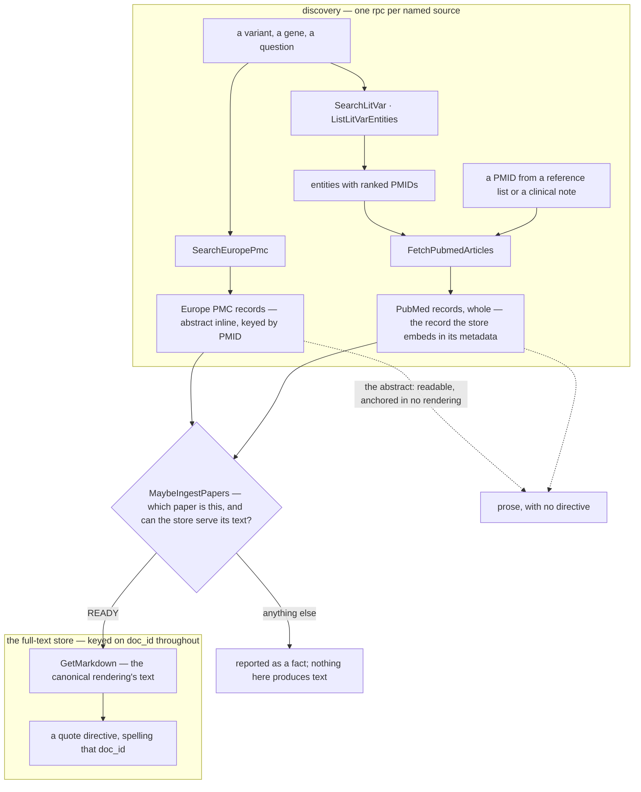

# Design: the literature evidence layer

**Related:** [`evidence-fulltext.md`](evidence-fulltext.md) (how a paper's text is produced, and how readiness is
derived from the store), [`litcache-manifest.md`](litcache-manifest.md) (the per-paper record: source lineages,
content-addressed renderings, recorded licence), [`document-pane.md`](document-pane.md) (the workbench surface that
reveals a paper and highlights a quote), [`evidence-interfaces.md`](evidence-interfaces.md) (the sibling fact interfaces
in the same deployment, and the error taxonomy they share), [`sandbox-rpc-exposure.md`](sandbox-rpc-exposure.md) (how an
rpc becomes agent-callable), [`services.md`](services.md) (the service pattern this follows). Terms in
[`../../GLOSSARY.md`](../../GLOSSARY.md).

## Overview

An analysis run has to answer two questions about the published literature, and they are not the same question: *what
has been published about this?* and *can I read it, and quote it?* The first is answered by public indexes that list far
more than we hold; the second only by what Themis has ingested. This doc decides how one gRPC interface —
[`literature.proto`](../../schema/proto/themis/rpc/literature.proto), served by the `evidence` deployment — answers both
without letting either answer be mistaken for the other.

- **Discovery asks named sources, one rpc each, and returns what each one states.** Each answer keeps its source's own
  shape — PubMed's own record behind a PMID, Europe PMC's hit for a search — and is never mapped into a schema its
  source did not publish, so a further index arrives as its own rpc returning its own record shape, never as a change to
  what an existing rpc means. A hit from any of them claims a paper *exists*; it never claims its text is readable.
- **`MaybeIngestPapers` is the one door into the full-text store.** It takes an external identifier, scheme-qualified,
  and answers with the internally minted `doc_id` that names the paper plus whether the store can serve its text,
  starting a conversion where that text is still pending. Everything past the door — reads and citations — keys on
  `doc_id` alone, and the citation grammar spells nothing else, so the door is enforced rather than taught.
- **An abstract is readable and deliberately not quotable.** It rides on what a discovery rpc returns, so a run can
  judge whether a paper matters without holding the paper — and it is then stated in prose, never quoted, because only
  the text `GetMarkdown` serves has an anchor a quote can resolve against.
- **Absence is modelled wherever it could be read as a fault**, and a fault is never reported as absence. "The index has
  no abstract for this record" and "the store has no text for this paper" are answers a run can act on; a crosswalk
  outage or a malformed identifier is not.
- **Serving a paper never produces its text.** A paper the store cannot serve is a fact the run reports, and the
  ingestion loop closes it out of band — because producing text on a request path turns a settled answer into a timeout
  ([`evidence-fulltext.md`](evidence-fulltext.md)).
- **A variant search returns candidates, not a verdict.** The variant literature index splits one variant across several
  entities that share no records; the interface surfaces all of them, labelled with where they agree and where they
  disagree, and leaves the choice to the caller.
- **Reading is the foundation for a layer above it.** What a run reads here is distilled into shareable facts that each
  cite the exact rendering text they came from. That is why a rendering is identified by its own bytes: a citation made
  years ago has to resolve against the same text, or against nothing.

## Background

**Why literature is a service and not a fetch.** Themis shares *facts* extracted from papers across Projects, each fact
carrying a citation — a pointer to its source, not a copy of it — while the source documents themselves stay behind the
institutional licensing of whoever obtained them ([`../PRODUCT.md`](../PRODUCT.md) §7). Sources are also untrusted
content reached through a curated tool surface (§9). Both push the same way: reading literature is a typed call into a
service we control, not something a run does for itself.

**Two consumers.** The sandboxed analysis agent finds papers, reads them, and cites them into a working document; it has
no network and no cloud credentials, so every outbound call is the service's own. The workbench BFF (the web tier's
backend-for-frontend) resolves a paper for the document pane and serves its bytes to the browser
([`document-pane.md`](document-pane.md#backend-seam-structured-over-connect-bytes-over-presigned-redirects)).

**The three live indexes.** Keyword search asks Europe PMC, and for a reason PubMed cannot match: Europe PMC matches
query terms against open-access full text, where a variant notation or an assay name routinely appears only in the body
or a table, and its index carries preprints and PMC-only deposits no PubMed id names. The record behind a PMID, by
contrast, is PubMed's own: efetch already serves a whole batch in one call, and its record is the one the full-text
store embeds in a paper's canonical metadata — so a triage read and the store speak one bibliographic language, and the
service carries no second account of the same paper. NCBI's LitVar2 is a variant-literature index built by running an
entity recogniser over publication text. One property of LitVar2 shapes a large part of this contract: it keys an entity
on *whichever identifier the recogniser found in the text* — an rsID, a ClinGen allele id, or a bare change string under
a gene — never on a variant. One variant is therefore split across several entities that may share no record at all, and
some entities are indexed under a numbering no currently valid identifier constructs.

**The full-text store.** One bucket holds everything Themis has of a paper: the captured sources — publisher XML, PDFs —
and the text converted from them. It is the **full-text store**, and it is what a public index's hits get checked
against: an index says a paper exists, the store says whether we can serve its text. Nothing in this design has a second
store. Its concrete name belongs to the infrastructure that creates it
([`storage.py`](../../infra/themis_infra/storage.py), `fulltext_bucket`), and the interface takes it from its
environment ([`config.py`](../../themis/services/evidence/literature/config.py)). The per-paper layout inside it — one
directory per paper, holding the captured sources, the converted renderings, the figures and supplementary files, and a
manifest that records what each lineage is and under what terms it was obtained — is **litcache**'s, and is
[`litcache-manifest.md`](litcache-manifest.md)'s subject. Sources and renderings are written additively, each
content-addressed by its own bytes: a re-fetch adds a revision, a re-conversion adds a rendering. So a citation against
a rendering resolves to the exact bytes it was made against for as long as the paper exists.

## Non-goals

- **No production on the serving path.** Nothing that serves a paper fetches or converts its text. The reason is
  [`evidence-fulltext.md`](evidence-fulltext.md)'s: the cheap production route takes seconds and the expensive one takes
  minutes, so a request that waited for either would be a timeout dressed as an answer.
- **No entitlement, for now.** The store is shared and its reads are session-free: they carry no session binding and
  nothing is gated per reader — only the enqueue behind `MaybeIngestPapers` resolves a session, because a conversion
  spends model budget ([`evidence-fulltext.md`](evidence-fulltext.md)). Gating a read by the reader's institutional
  access is a requirement this interface will have to grow, and it will need both a session binding on these requests
  and a decision about what a reader who may not open a paper sees instead. Deferring it is what lets the Spike run
  against public sources with no session plumbing at all.
- **No external identifiers on the rpcs that serve a paper.** Resolution is its own step, so a request either names a
  paper we hold or does not.
- **No search over the papers the store holds.** The discovery group reaches live indexes only. A search scoped to the
  store, keyword or semantic, is a different question — *what do we hold about X* rather than *what has been published
  about X* — and would arrive as its own rpc behind the same interface, not as a mode of these.

## Design

### A discovery rpc is a query against one named source

Each rpc in the discovery group asks one named external index, and answers with what that index states.
`SearchEuropePmc` returns Europe PMC's records, abstract inline; `SearchLitVar` returns LitVar2's entities, each with
its ranked PMIDs; `FetchPubmedArticles` returns PubMed's own record whole — `PubmedArticle` for a journal record,
`PubmedBookArticle` for a book record — from the source's own published schema rather than a re-modelling of it, so
nothing is lost in a mapping and nothing invented in one.

What the rule guards against is a *mapping*: a record re-modelled into a schema its source did not publish. The target
can be a type invented to be common, or an existing source's schema borrowed for another source's hits; either way it
carries only what the target has a field for, so each source either loses the fields that made it worth querying or
bends the target's fields to mean something their owner never stated, and it invites code that handles "records" without
knowing which index answered — the point at which the differences between indexes stop being visible and start being
bugs. The store applies the same rule at rest: a paper's `metadata.pb` holds each index's record in that index's own
schema — PubMed's generated from NLM's DTD, Crossref's and OpenAlex's as strict mirrors of the JSON each publishes —
never one mapped into another's ([`litcache-manifest.md`](litcache-manifest.md#the-bibliographic-record-metadatapb)).
Sharing is the opposite move, and it is why `FetchPubmedArticles` and the store carry PubMed's record the same way:
whole, through the schema's own converter, with every field the source states and nothing invented.

The same test is why `SearchEuropePmc` does not answer in `PubmedArticle`, although both rpcs carry a bibliography and
an abstract. A hit is Europe PMC's JSON, not NLM's XML, so the answer would be a mapping — and the hits Europe PMC holds
its seat for are the ones the message cannot hold. A preprint would arrive as a `MedlineCitation` with no PMID and a
publisher standing in for a journal; a year-only date would gain a month and a day the index never stated; and the facts
only this index states — that a hit is a preprint, that its text is open access — would have nowhere to land, where a
record of Europe PMC's own can take them as fields. A source that answers in its own shape arrives as its own rpc with
its own record message, and nothing already written against an existing rpc has to be re-read when it does.

Names carry the same concreteness. Every rpc names the source or payload it deals in — `SearchEuropePmc`,
`FetchPubmedArticles`, `SearchLitVar`, `ListLitVarEntities`, `GetMarkdown` — rather than a generic verb, and so does
every record message that comes back. A generic `Search` returning a generic `Record` is a promise the interface cannot
keep: the next source would either break it or be folded quietly into it, changing what an existing rpc means for
callers already written against it.

### The door into the store: `MaybeIngestPapers`, over a minted `doc_id`

Nothing a source hands back is a key the store can take. Not every paper has a PMID or a DOI, and the ones that do often
have several identifiers that arrive at different times, so the store's key is neither: it is an internally minted UUID,
the `doc_id`, which names the paper's directory and is what every rpc that reads the store, and every citation, takes.
`MaybeIngestPapers` is the one rpc that turns an external identifier into one — the single door from a discovery result
into everything the store can do. A **crosswalk** table maps scheme-qualified external ids (`pmid:`, `doi:`, `pmcid:`,
…) onto `doc_id`s.

Qualifying an id by its scheme is what keeps the door indifferent to which source produced it. A PMID goes through as
`pmid:12345678`; a source that answers in DOIs instead needs nothing new on this side of the interface. The scheme also
removes the guessing: a bare number could be a PMID and a bare `10.1/x` a DOI, but a wrong guess resolves to another
paper.

Ingestion *mints* against that table, claiming all of a paper's identifiers in one transaction and adopting an incumbent
where one exists, so concurrent ingestion workers converge on one `doc_id` per paper. Identifiers that turn out to
bridge two separately-ingested works form an equivalence class: the linked `doc_id`s resolve to one deterministically
chosen canonical member, recorded as an edge in the manifests. The table is the mint lock, not the system of record: it
is rebuildable from the manifests, and a row claimed by an ingestion that never committed its manifest is harmless — it
reads back as a paper the store does not hold.

The evidence service holds the **read half only**. `MaybeIngestPapers` looks an identifier up and claims nothing, and
the service's database role is granted `SELECT` and no more. The distinction is not fussiness: minting *claims*, so
minting to answer a read would hand back a fresh `doc_id` naming no manifest — permanently unresolvable — and would
leave a crosswalk claim on someone else's DOI. The same read-only posture holds for the store itself: nothing in this
interface writes it, and ingestion and production write under their own identities. Confining the lookup to one rpc also
confines the interface's only relational dependency to one method; every other rpc reads the store's objects alone.

The lookup answers only for identifiers captured at ingest, so a caller holding a PMCID for a paper stored under its DOI
and PMID misses even though the store has it. Closing that gap means resolving identifiers against one another in front
of the lookup, which puts a network round trip on a request path; it is deferred because ingestion captures a DOI and a
PMID for most papers.

That gap is the shape the rpc's *name* reserves. A renamed rpc is a broken one for every deployed caller, so the name is
chosen for where the call is going rather than for what it does today, and `Maybe` is load-bearing either way — such a
call may resolve nothing and produce nothing.

Production is not reserved in the same way: a paper that comes back unsettled has its conversion enqueued by the same
call. Resolution only ever *starts* production and never waits for it — the queue and the producer behind that enqueue
are [`evidence-fulltext.md`](evidence-fulltext.md)'s. The *no production on the serving path* rule above is untouched by
that, because what it bars is a request that serves a paper waiting on its text, and nothing here waits.

**One spelling per identifier, folded at the boundary that owns it.** The crosswalk folds the case of the schemes whose
identifiers are case-insensitive and no more, so two spellings that genuinely denote different identifiers stay
different keys. The discovery rpcs never touch the crosswalk and fold a PMID's several spellings — bare digits, a
`PMID:` prefix, zero padding — onto one. A malformed identifier is refused outright rather than looked up: a malformed
key reaches nothing, and an answer of "no such paper" to a request that was never well-formed reads as a settled fact
about what the store holds.

### What the store says about a paper

A paper can accumulate several renderings of its text — one converted from publisher XML, one transcribed from a PDF, an
older one from a superseded converter. The read surface serves exactly one of them, the **canonical rendering**, picked
by converter fidelity first (a rendering derived from source XML beats a transcription of a PDF) and recency on a tie.
One choice, made in one place, is what lets the agent's read, the quote matcher and the document pane agree on which
text a paper *is*; without it a quote validated against one rendering could fail to locate in another.

Two further per-paper facts cross the wire, and neither is stored anywhere:

- **Readiness** — whether full text is servable at all: `READY`, `PENDING`, or one of the two terminal outcomes
  `NO_FULL_TEXT` and `FAILED`, plus `UNKNOWN_PAPER` for a `doc_id` the store holds no paper under. It is derived from
  the store's layout on each read, and [`evidence-fulltext.md`](evidence-fulltext.md) owns both the derivation and the
  reason there is no status store behind it.
- **Text provenance** — how the canonical rendering's text got into the store. A lineage the manifest records as
  institutionally captured, or an uploaded revision, is `SUPPLIED`; a lineage recorded as free to read is `OPEN_ACCESS`;
  a licensed, unknown or unplaceable lineage says neither. Open access is a claim about how text was obtained, so
  nothing defaults to it. `SUPPLIED` text reached the store only through a human's institutional access, which is a
  thing a run should be able to state about what it relied on — but it is no less citable for that.

Text provenance is named for the *text*, not for the fact: the `Provenance` message every other evidence rpc returns
records where a *fact* came from, which is a different thing that happens to want the same English word.

### The store's read surface

| rpc                 | what it does in the system                                                                                                                                                                                   |
| ------------------- | ------------------------------------------------------------------------------------------------------------------------------------------------------------------------------------------------------------ |
| `MaybeIngestPapers` | The door: a batch of scheme-qualified external ids in, the paper each names and that paper's readiness out, and a conversion where pending. The mandatory first step for a caller holding a PMID or a DOI.   |
| `GetMarkdown`       | The agent's read path: the canonical rendering's text and its provenance — or a modelled statement that the paper has no servable text.                                                                      |
| `DescribePaper`     | What a paper offers, so the document pane can choose a default representation and list its figures and supplementary files.                                                                                  |
| `ResolveContent`    | Names the storage object behind a chosen representation or file — a location, never bytes. Serving bytes to a browser is the BFF's job, and the BFF holds the authorisation boundary.                        |
| `Locate`            | Where a quote sits inside a chosen representation, for the pane to highlight. A quote that is not there is a modelled outcome, not an error.                                                                 |
| `Validate`          | Whether a quote locates in any representation at all — the agent's authoring-time check, and deliberately forgiving: an unknown paper and an absent quote both come back as a negative answer with a reason. |
| `PollFullTexts`     | Readiness for a batch of `doc_id`s, producing nothing and enqueuing nothing.                                                                                                                                 |

Four mechanisms the table rests on:

- **Readiness and content are separate rpcs.** A batch that answered with each paper's text would blow past the message
  budget, and a caller asking which of fifty papers is worth opening does not want fifty papers back. So readiness is a
  cheap batch and content is a single-paper read.
- **A read is budgeted, and says so.** `GetMarkdown` cuts a long rendering at a line boundary behind an inline marker
  and reports the rendering's full character count beside the text, so a whole paper and a clipped one are told apart by
  comparing that count against the text's own length, and a reader handed a clipped one learns how much lies past the
  cut. `Validate` and `Locate` still run over the whole rendering, which means quoting only within what was actually
  read is the reader's discipline, not something the server can enforce for it. The budget is there to protect the
  reading run's context, and the cut is where that protection is spent. Which is why the budget is the caller's to
  suggest and the server's to bound, on the same census idiom the searches use: `max_chars` asks, the service ceiling
  caps what it grants, and the full character count beside the text's own length says whether anything was cut. A run
  that hits a cut and needs what lay past it asks again for more, up to that ceiling — the way to more is a larger
  budget, never a cursor, and past the ceiling the remainder stays unreachable.
- **A batch has a ceiling, and it is the server's.** A readiness or resolution batch is refused past a fixed size,
  because each entry costs the service reads it did not ask for. Nothing blocks server-side to make a batch wait: a
  caller with somewhere to sleep waits there and asks again.
- **One quote matcher, over markdown.** `Validate` and `Locate` share a single matcher run server-side over the
  rendering's bytes, so what the agent validated while authoring is what the pane later resolves
  ([`document-pane.md`](document-pane.md#highlight-resolution-server-side-one-matcher)). No producer resolves a quote
  against a PDF yet, so against the live store `Locate` answers a PDF request `UNIMPLEMENTED` and `Validate` reports a
  PDF-only paper as unchecked — the alternative, a "not located" for a quote that is plainly on the page, states the
  opposite of the truth. The fixture's seeded locations are the offline surface, which is what the pane's highlight path
  is built against before a producer exists.

### Searching the live indexes

| rpc                   | what it does in the system                                                                                                                                                                                                                                             |
| --------------------- | ---------------------------------------------------------------------------------------------------------------------------------------------------------------------------------------------------------------------------------------------------------------------- |
| `SearchEuropePmc`     | A keyword query against the live index, answered with ranked Europe PMC records and the index's own count of what matched.                                                                                                                                             |
| `FetchPubmedArticles` | PubMed's own record, whole, for a batch of PMIDs — `PubmedArticle` for a journal record, `PubmedBookArticle` for a book record — ones reached from outside this service (a reference list, a submission's citation list, a clinical note) or selected from the census. |
| `SearchLitVar`        | A variant's identifiers in, every LitVar2 entity they reached out — unmerged, each with the index's own labels, a per-identifier agreement verdict, its record count, and its top-ranked PMIDs.                                                                        |
| `ListLitVarEntities`  | A gene's whole entity inventory, most-published first — the route to an entity indexed under a spelling no current identifier constructs.                                                                                                                              |

**A hit is existence, not readability.** Nothing in this group says the store can serve a paper's text;
`MaybeIngestPapers` is what says that. The same gap is why the abstract riding on a record is readable but not quotable:
a discovery result carries no `doc_id`, so there is no citation directive that could resolve against it.

**The variant census belongs to literature, not to a variant interface.** What `SearchLitVar` and `ListLitVarEntities`
produce is literature — entities carrying ranked PMIDs, each one `FetchPubmedArticles` read away from its bibliography.
Variant identifiers are one way of searching for papers, beside keywords; they are not a different kind of answer.

### A search states its census instead of paging

None of the three searches offers a page cursor. Instead each reports, alongside its results, a count of everything that
matched before the budget — the index's own count where the index states one, the service's own census where the cut is
the service's (the entity fan-out, a `contains` narrowing). Comparing that count against what came back tells a complete
answer from a top-ranked prefix, and the way to more is a narrower query, a larger budget, or — for a candidate the
fan-out ceiling dropped — the entity's own id. Nothing else is echoed: the budget a caller asked for it already knows,
and the one the service applied is visible in what a cut answer carries.

Paging is what we would owe callers if the goal were exhaustive retrieval. It is not: a run reads the most relevant
handful and then narrows. A cursor would add per-call state, a stale-cursor failure mode, and an invitation to walk a
thousand hits, in exchange for a completeness the reading loop does not use. The census gives the caller the one thing a
cursor would have told it — *there is more, and how much* — for the price of a couple of integers.

### A variant search answers with candidates

Because LitVar2 keys entities on whatever its recogniser found rather than on a variant, there is no reliable way for
the service to decide which of the entities a request reached is the caller's variant. It could withhold the ambiguous
ones; it does not. It returns every entity it reached, unmerged, and states the disagreement instead: for each kind of
identifier the request supplied, a verdict on whether the entity's own labels agree, differ, say nothing comparable, or
were never asked about.

That shape follows from what the service can and cannot know. A gene symbol that differs is weak evidence, because an
alias or a superseded symbol produces one on an entity that *is* the caller's variant. Two differing ClinGen allele ids
are strong evidence, because two such ids are two alleles by construction. The service cannot tell a label the request
got wrong from one the index got wrong — so reporting the verdict and letting the caller weigh it beats silently
dropping an entity that may be the only one carrying the relevant paper. For the same reason a disagreement is never
raised as an error: it is a fact about how the index labelled something.

Three consequences the contract makes explicit rather than leaving to be discovered:

- The entity sets are not a partition. An allele-scoped entity's records are usually a subset of an rsID-scoped one's,
  so one PMID arrives under several entities and neither the PMID lists nor the counts sum. Deduplicating before
  counting anything is the caller's.
- The census answers in PMIDs, not bibliographies: each entity carries its top-ranked PMIDs up to the request's budget,
  beside the index's own total. Which of them deserve a bibliographic read is the caller's call, spent through
  `FetchPubmedArticles`; an entity the fan-out ceiling dropped is re-asked by its id.
- An empty answer is a fact about the index, not an error. A paper that names a variant in prose alone is indexed under
  no entity at all, and is still reachable by keyword.

Unioning those entities into one answer per variant, and merging what several sources say about one paper, both belong
to a layer above this contract. The store's own metadata normalisation is where cross-source merging has the knowledge
to happen: it sees every source's record for a paper against one `doc_id`, which is precisely what a discovery rpc,
holding one index's answer, does not.

### Absence is a statement; a fault is a status

The failure vocabulary follows one rule: never let a transient failure look like a settled fact, and never let a settled
fact look like a failure. Concretely:

- An unknown `doc_id` on the rpcs that serve a paper is `NOT_FOUND` — a broken reference, not a fact about the store.
- In the two per-id batches it is a per-entry `UNKNOWN_PAPER` instead, because aborting the batch would lose the answers
  for every other entry.
- A known paper with no servable text is a modelled *unavailable* result carrying its state, not an error.
- A rendering the manifest lists but the store cannot produce is `INTERNAL`: the store has broken its own invariant, and
  `NOT_FOUND` — a status the shared taxonomy never retries — would file that fault as a settled answer about the paper.
  An object the paper simply lacks, or lists without having fetched it yet, stays `NOT_FOUND`.
- A batch that is malformed or oversized is `INVALID_ARGUMENT` — answered whole or refused, never trimmed to fit, since
  a silently dropped entry comes back looking exactly like an identifier nothing is indexed under.
- A crosswalk that cannot be reached fails the whole call `UNAVAILABLE`; a deployment that wires none fails
  `FAILED_PRECONDITION`. The distinction matters because gRPC's default policy retries `UNAVAILABLE`, and no number of
  retries configures a database.
- A bibliographic lookup's outcomes are statements about the record, never faults: a PMID nothing is indexed under is
  named in the response rather than left to be noticed as an omission, one indexed as a Bookshelf citation — a
  GeneReviews chapter — arrives as PubMed's own book record, `PubmedBookArticle`, beside the journal records, and a
  record the index carries no abstract under still arrives whole. None is retryable within a run, and none is answered
  by ingesting the paper: all are things the index says.

The discovery adapters make no attempt to retry an upstream themselves; they place an upstream failure on the error
taxonomy the evidence interfaces share ([`evidence-interfaces.md`](evidence-interfaces.md)), and the caller's retry
helper owns backoff.

### The agent's reach: typed calls through the hatch

Exposure to the sandboxed agent is decided per proto file, and this file is not marked: its rpcs do not yet meet the
condition [`sandbox-rpc-exposure.md`](sandbox-rpc-exposure.md) sets for one — most of them resolve no session at all,
and `MaybeIngestPapers`, which resolves one, does so at its enqueue rather than at the door.

The read surface is shaped for that agent regardless: the guest (the sandboxed process these calls would serve) has no
network and no storage credentials, so once the file meets the condition, typed calls are its entire reach into the
literature. That is also why the agent's read path is `GetMarkdown` rather than the store directly, even though
`ResolveContent` already names the object:

- the service owns canonical-rendering selection, the read budget, and readiness and provenance derivation; a raw object
  read would re-derive all three inside the guest, where they could drift;
- a read crosses the hatch (the sandbox's one channel out, a fixed allowlist of typed rpcs) and lands in the session's
  event log, which is what makes it possible to see afterwards which papers a run relied on;
- the location `ResolveContent` returns is useless in the guest by construction — nothing in the sandbox can follow it.

The BFF path is the complement: it takes a location and serves the bytes to the browser itself. `ResolveContent` and
`Locate` are useful only there, and file-level exposure would carry both into the guest's catalog anyway — catalogued
noise, and the Open question at the end.

Several channels in that reach do carry free text the agent composes: the keyword query, and the variant identifiers a
search carries — a gene symbol, a coding or protein change, an entity id passed back from a listing. They are an
accepted residual rather than a hole, because of the shape they are bounded to. Each crosses only as an encoded value on
a fixed endpoint — a parameter's value or a single path segment — so what it can influence is which records or entities
come back and nothing about where the request goes; there is no destination for it to name ([`security.md`](security.md)
§What counts as an exfiltration channel). And the same typed, logged crossing that records which papers a run read
records what it asked, so a string the agent composed is legible afterwards rather than an unobserved reach outward.

The agent's working loop, in outline: discover or arrive with a PMID → through the door to a `doc_id` → read the
markdown → save the served text verbatim in the workspace and quote only from that saved copy → validate every quote
while authoring. A truncated read cannot anchor text past its cut even where the server-side check would pass it, which
is exactly why the saved copy, and not the server, is the thing quotes are taken from. A paper the store cannot serve is
reported, not worked around.

### Citing a paper

A working document's literature claims are anchored by two markdown directives the workbench renders:
`:quote[doc_id, verbatim quote]` for a passage the run read, and `:paper[doc_id]` for reliance on a paper without
resting the claim on any single passage. Clicking either reveals the paper in the document pane; a quote resolves live
through `Locate` into a highlight, and one that does not locate renders as a warning rather than an error — a citation
that has drifted is worth showing as drifted.

The grammar is `doc_id`-keyed end to end, and that is what makes the door mandatory rather than a convenience: there is
no directive spelling that names a PMID. Abstracts, database facts and specification text are stated in prose with no
directive at all, because none of them has an anchor in the store a directive could resolve against.

### Knowledge units: the layer above reading

A run that reads a paper and cites it has answered one question, once. Above this interface sits the layer that makes
such an answer reusable: a paper's full text is distilled into **knowledge units** — atomic assertions, each stripped of
the source's phrasing, each citing the exact text in a rendering it was drawn from. One paper yields many. A unit is a
claim together with the evidence for it, not a summary of a paper.

What that buys is a question answered without opening anything. Asked whether there is functional evidence that a
variant impairs a channel's function, the layer pulls the units bearing on that claim, judges each as supporting or
refuting it, and returns a cited tally — four supporting reports and one conflicting, say — from facts already
distilled. The reading surface comes back in for the next step: whoever wants to check the load-bearing report follows
its citation into the source text, which resolves to a passage in a rendering through `Locate`, exactly as a working
document's `:quote` directive does. So the layer above answers from facts, and this interface is what makes an answer
verifiable against the paper.

That is also why the two are separate layers rather than one interface. A knowledge unit is a fact, and facts cross
Project and institutional lines, each keeping a citation that points at its source rather than copying it
([`../PRODUCT.md`](../PRODUCT.md) §7); reaching the text a citation names is a separate step, taken against the store,
under whatever access the reader has. Nothing above has to hold a paper to use what was read from it.

Content-addressed renderings are what make a unit's citation permanent, which is why that property is load-bearing here
rather than merely tidy. A unit outlives the run that extracted it, so its citation has to still mean something after a
better converter has produced a new rendering of the same paper and a re-fetch has added a source revision. Because a
rendering is identified by its own bytes, the one a unit cites cannot change under it: the citation resolves against
exactly the text it was made against, or against nothing. For an anchor to record which rendering that was
([`litcache-manifest.md`](litcache-manifest.md) §Quote-reference model), the read has to hand back its hash, and
`PaperMarkdown` does not carry one yet; the field lands with the knowledge-unit layer that reads it.

### Supplied papers are ordinary papers

A paper the open-access route cannot serve enters the store through a human. Such papers accumulate in a **mirror**: a
durable, maintained collection of PDFs obtained under institutional access, kept outside the store and outside anything
this interface reaches. The route the design admits off that mirror is a **deposit**: per PDF, resolve its identifiers,
mint or adopt its `doc_id`, write the PDF as an institutionally-captured source, and produce the same markdown rendering
by the same converter every non-open-access paper gets. Nothing downstream then treats the result as a special case —
the one thing that distinguishes it is the recorded access disposition, which surfaces as `SUPPLIED` text provenance.

A deposit is idempotent by construction, so the whole mirror can be re-run safely: the mint adopts incumbents, every
write is content-addressed, and an existing rendering short-circuits the conversion. It runs under the ingestion
identity, not the service's, which is what keeps the evidence service read-only. So the mirror, not the bucket, is the
authoritative copy: everything the store holds for such a paper derives from it, and recovery is re-running the deposit
rather than restoring the bucket. No tooling in the tree drives a deposit yet.

### Offline or real, never half of each

Behind the servicer sits one port, however many places its answers come from: the live backend reads two sources, the
full-text store and the live indexes. A **single** switch chooses live or fixture ([`services.md`](services.md); the
interface is [`literature/`](../../themis/services/evidence/literature/)). A run is therefore entirely offline or
entirely real. A switch per source would buy a mode nobody wants — real papers with invented search results, or the
reverse — and would make a fixture run's results impossible to interpret.

The live store adapter proves the bucket readable at startup by listing it, and exits if it cannot. A bucket the service
cannot read would otherwise answer every request "no such paper", which is indistinguishable from a store that genuinely
holds nothing — the one failure mode that would let a run conclude, quietly and wrongly, that the literature says
nothing.

## Alternatives considered

- **One bibliographic record across the discovery rpcs**, whether a type invented to be common or `PubmedArticle`
  borrowed for `SearchEuropePmc`'s hits. Rejected: both are mappings of a source's answer into a schema it did not
  publish — see *A discovery rpc is a query against one named source*.
- **Serving the PMID-keyed lookups from Europe PMC**, so the one index that answers search also answers the bibliography
  behind the census and the batch fetch. Rejected: a PMID is PubMed's own key, efetch already serves a whole batch in
  one call, and its record is the one the store embeds in a paper's canonical metadata — Europe PMC in that seat means a
  second account of every paper across the service's own rpcs, and a batch lookup emulated through a search endpoint's
  term disjunction. Europe PMC keeps the seat it earns: keyword search over open-access full text and preprints.
- **Inline bibliographies on the variant census.** Rejected: filling records into `SearchLitVar`'s answer forces a
  record budget shared across entities, and its truncation accounting — which entity's list was cut by budget rather
  than by the index — is exactly the delicate part. The census in PMIDs keeps the budget per entity, and the caller —
  who chooses which entities matter — spends the bibliographic read through `FetchPubmedArticles` on the PMIDs it
  actually wants, at the price of one more call.
- **Accepting external identifiers directly on the rpcs that serve a paper**, as an either-or in each request, instead
  of a separate resolution step. Rejected: every one of those rpcs would then have to police an ambiguous request;
  resolution has to happen explicitly anyway, since directives and saved copies are `doc_id`-keyed; and a dedicated rpc
  is what confines the relational dependency to one method.
- **Serving bytes rather than a location** from a single content rpc. Rejected: the guest consumes only text, publisher
  PDFs routinely exceed the message budget, and the markdown rendering is the citable representation in any case. A
  file-serving rpc can be added later if a need appears; declaring selectors that the rpc would refuse trades fail-loud
  honesty for a symmetry nobody reads.
- **A separate home for the variant-literature pair** — its own interface under `evidence-interfaces.md`'s
  one-interface-per-source rule, or folded into the variant interface. Rejected: what it produces is literature, and a
  two-rpc interface would buy a separation no consumer wants.
- **Merging LitVar2's entities into one answer per variant.** Rejected: the merge would have to guess which entity is
  the caller's, using exactly the labels the caller can see, and a wrong guess silently drops the papers under the
  dropped entity. Reporting the disagreement costs the caller a decision and costs nobody a paper.
- **A page cursor on the searches** — see *A search states its census instead of paging*.
- **A status store for readiness, or producing text on a read** — rejected in
  [`evidence-fulltext.md`](evidence-fulltext.md), and not restated here.

## Open questions

- **Exposure granularity to the guest.** Exposure is decided per proto file, so the guest's catalog would carry
  `ResolveContent` and `Locate` — a storage location it cannot follow, and a UI reveal seam. Harmless noise; per-rpc
  granularity would remove it, at the cost of a second place where exposure is decided.
- **Surfacing retraction.** The manifest records a paper's retraction — flagged, never purged
  ([`litcache-manifest.md`](litcache-manifest.md)) — but nothing on this read surface reports it, so a retracted paper
  reads like any other and a run can cite it as live evidence. How the read surface and the citation directives carry
  the flag needs a contract decision.
- **A Bookshelf accession at the door.** `MaybeIngestPapers` takes a scheme-qualified DOI, PMID or PMCID. A GeneReviews
  chapter's URL carries its Bookshelf accession (`NBK…`) where a citation carries its PMID, and the store mints the
  accession as an external id like the others
  ([`litcache-manifest.md`](litcache-manifest.md#the-bibliographic-record-metadatapb)); whether the door accepts
  `bookid:` as a fourth scheme is undecided.
