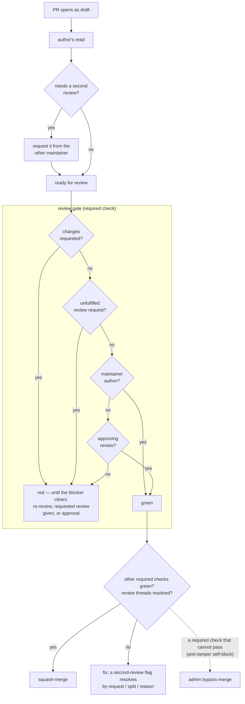

# Design: review and merge policy

**Status:** current **Related:** [`../plans/screen-and-mirror-workflow.md`](../plans/screen-and-mirror-workflow.md) (the
PR-time screen and public mirror this policy gates), [`../plans/doc-garden.md`](../plans/doc-garden.md) (a bot
contributor under this policy)

## Overview

Who must review what before a PR lands on `main`, and how GitHub encodes it: maintainers (the direct admin
collaborators) review each other on request; every other contributor needs a maintainer's approving review.

## Background

With a small maintainer group, a required human approval on every PR makes the review queue the bottleneck and spends
review time where it earns least: implementation PRs are already adversarially self-reviewed before opening
([`../../CLAUDE.md`](../../CLAUDE.md) § CI and review) and screened by the PR-time LLM review, while the reviews that
matter — design docs, interface contracts, and database schema changes — compete with them for attention. The threat
model is honest oversight ([`../plans/screen-and-mirror-workflow.md`](../plans/screen-and-mirror-workflow.md)):
contributors and org admins are trusted; the machinery reminds a careful person, it does not need to defend against a
malicious one.

## Design

Two tiers, keyed on direct admin collaboratorship:

- **Maintainers (direct admin collaborators).** No review from another maintainer required. Whether a PR gets one is a
  per-PR judgement call, not machine-enforced: design docs, interface changes (proto contracts, data-contract docs), and
  database schema changes (migrations) ship as their own PR and get a review requested explicitly from another
  maintainer after the author's own read, while the PR is still a draft — the reviewer is asked for a diff the author
  has vetted and stopped churning, and a request survives the draft phase (only CODEOWNERS auto-requests waited for
  ready), so it is on record before checks and the reviewbot first fire. Implementation PRs are normally merged by their
  author, though requesting a review for any PR is fine (e.g. limited subject-matter expertise in the area touched).
  Author-merged does not mean unreviewed: code is largely agent-written, and the author's own read of the diff is the
  human review of an implementation PR — a PR opens as a draft and goes ready only after that read. A requested review
  is waited for — machine-enforced: the `review gate` check fails while a request is unfulfilled.
- **Everyone else** (org members with write access, bots such as doc-garden). One approving review required — in
  practice a maintainer's. Maintainers learn of these PRs by watching the repo; nothing auto-requests a review.

The judgement call has a machine reminder: the PR-time review carries a second-review concern
(`.github/review/second-review.md`) that flags second-review content with no reviewer engaged, and implementation mixed
beyond the bounds below. A flag is a T2 review thread, so required thread resolution holds the merge until the author
requests the review, splits the PR, or resolves the thread with a reason. The polarity is deliberate: a machine verdict
that grants permission must be tamper-proofed, one that raises a requirement needs only a legible override — resolving
one thread, recorded on the PR.

What the interface PR can hold is bounded, and each bound is enforced by a check — a split that ignores one lands red:

- **A retirement splits in two.** The interface PR is additive: the replacement, with the retiring field still in place.
  The implementation PR stops setting it; the deletion — number and name reserved — rides along only where
  [`proto.md`](proto.md) §Schema evolution allows the skew (a browser-sent field is deleted only after the stop-setting
  change has deployed), else it follows as its own change. An rpc declared ahead of its handler additionally needs the
  service impl widened to `Partial<ServiceImpl<T>>`, narrowed back in the implementation PR; that narrowing is what
  catches a handler nobody wrote.
- **An addition need not be separable either.** A new `AnalysisInputs` member fails the tests holding every scenario
  named, labelled and rendered, so it ships with the surfaces that render it.
- **A migration carries its `deploy.yml` substitution** — a `${VAR}` in its SQL is rendered from the
  `THEMIS_MIGRATE_SUBSTITUTIONS` map the deploy passes to the migrate step, so the entry ships with the migration — and
  generated stubs their lint exclusions. A test pairs the first, ruff the second.

Encoding — a `main` branch ruleset plus the `review gate` workflow. The path from draft to merge:

- PR required; no ruleset-level approval count — a flat count cannot express the two tiers, so the review requirement
  lives in the `review gate` required check; review-thread resolution; squash the only merge method.
- `review gate` (`.github/workflows/review-gate.yml`): a commit status posted to the PR head; the chart above is its
  verdict chain. An unfulfilled request outranks an existing approval — re-requesting means "look again". It runs on
  `pull_request_target` + `pull_request_review`, so the default branch's workflow judges every PR — a PR cannot edit its
  own gate — and it checks out nothing. The required context is the posted status, not the job's own check run: the job
  succeeds even when the verdict it posts is a failure, so the two must not share a name. Its required-check entry
  carries no `integration_id`, so a hand-posted status satisfies it too.
- Required status checks, non-strict: `review gate`, `regex screen`, `review + LLM screen`, `pre-commit`, `pytest`,
  `web`, `backward-compatible`, `regen-is-fresh`. Non-strict: an up-to-date-branch requirement would have every merge to
  `main` invalidate every other open PR — a rebase plus a full check re-run (LLM review included) per landing — while
  binding only contributors without the bypass. A cross-PR semantic conflict instead surfaces minutes after landing, via
  the same checks running on the push to `main`.
- Linear history; no force-pushes; no deletion.
- Bypass: the *Repository admin* role, mode **pull requests only**.

Consequences:

- PR-only bypass means admins cannot push directly to `main` either: every commit passes through a PR where the leak
  screen ran before it mirrors to public. A bypass merge is an explicit checkbox at merge time and is recorded.
- Admins can merge over a failing required check when needed. This covers the anti-tamper self-block: a PR editing
  `internal-review.yml` fails its own `review + LLM screen` (claude-code-action refuses a workflow file that differs
  from the default branch); the admin bypass-merges instead of temporarily un-requiring the check. With the review
  requirement in the gate rather than an approval count, this is the bypass's only remaining use — a routine maintainer
  merge never ticks it, so a bypass in the log marks an exceptional merge, not noise.
- The gate reads the maintainer set live: direct admin collaborators. Org owners inherit the admin role — and with it
  the ruleset bypass — but are not direct, so they do not self-merge through the gate; adding a direct admin
  collaborator grants self-merge. A role change fires no PR event, so an open PR's verdict reflects it only from its
  next push or review event.
- The gate's status appears on a head SHA only when one of its events fires, so a PR open before the check became
  required shows "waiting for status" until its next push or review event; a maintainer can post the status by hand
  (`gh api repos/…/statuses/<head-sha>`) for a PR that will see neither.
- There is no CODEOWNERS file. GitHub auto-requests a review from every listed owner when a PR goes ready-for-review,
  with no off switch, so any entry would notify every maintainer on every PR. That would defeat the point of the
  request-only flow: a review request only signals "this PR actually needs your review" when it is never sent by
  default.
- Stale approvals survive new pushes: dismissal would re-notify the reviewer on every fixup or restack of an
  already-judged diff. Symmetrically, a stale changes-requested keeps the gate red until its reviewer re-reviews or
  dismisses it.
- Required checks skip a draft, so a chain of them is unverified until each goes ready. The author's read is a draft's
  only gate; a long-lived draft stack is not green, it is untested. The `review gate` is the exception — it posts
  `pending` on a draft and evaluates at ready.

## Alternatives considered

- **CODEOWNERS + required code-owner review** (the original encoding). Encodes "a maintainer must approve" precisely,
  but the auto-request is inseparable from the file — a team owner merely reroutes it, still landing in members'
  review-requested queues. Rejected for the notification noise on every maintainer PR.
- **CODEOWNERS narrowed to design/interface/migration paths** (machine-enforcing the two-PR split). Rejected: which
  changes need another maintainer's review is a judgement call the maintainers trust each other on, and the interface
  surface doesn't glob — a port `abc.ABC` or a data-contract doc lives among implementation files.
- **Classic branch protection with `enforce_admins` off.** A smaller settings change with the same merge-button
  experience, but it also unlocks direct pushes to `main` for admins — an accidental `git push origin main` would skip
  the screen and mirror publicly within minutes. The ruleset's PR-only bypass keeps that path closed.
- **Restricting approval to maintainers.** Without CODEOWNERS, any write-access org member's approval satisfies the
  review requirement, so two non-maintainers could in principle approve each other's PRs. Accepted: they are inside the
  trusted circle (org admins can change any setting anyway), and a failing check still blocks them — the bypass is
  admin-only.
- **Ruleset-level approval count (1) with routine admin bypass** (the prior encoding). The flat count cannot express the
  two tiers, so every maintainer merge ticked the bypass checkbox — and a bypass used on every merge stops marking the
  exceptional one. The gate encodes the tiers directly and returns the bypass to its exception.
- **A bot-applied `self-mergeable` label feeding the gate** (the reviewbot labels a maintainer PR whose scope needs no
  second review; the gate passes on the label). Rejected on polarity: a label anyone with write can apply would grant
  permission, so trusting it means verifying the labelling actor — machinery against insiders the threat model trusts —
  and a bot false negative resurrects the routine bypass tick it was meant to remove. Ruleset conditions cannot express
  it natively either (ref-name only). The second-review concern keeps the bot's judgement but flips the polarity: it can
  only raise a requirement, and its override is resolving one thread with a reason.

## Implementation state

Applied: ruleset `main` on `themis-internal` — `review gate` among the required checks, no ruleset-level approval count;
classic branch protection and `.github/CODEOWNERS` removed.
