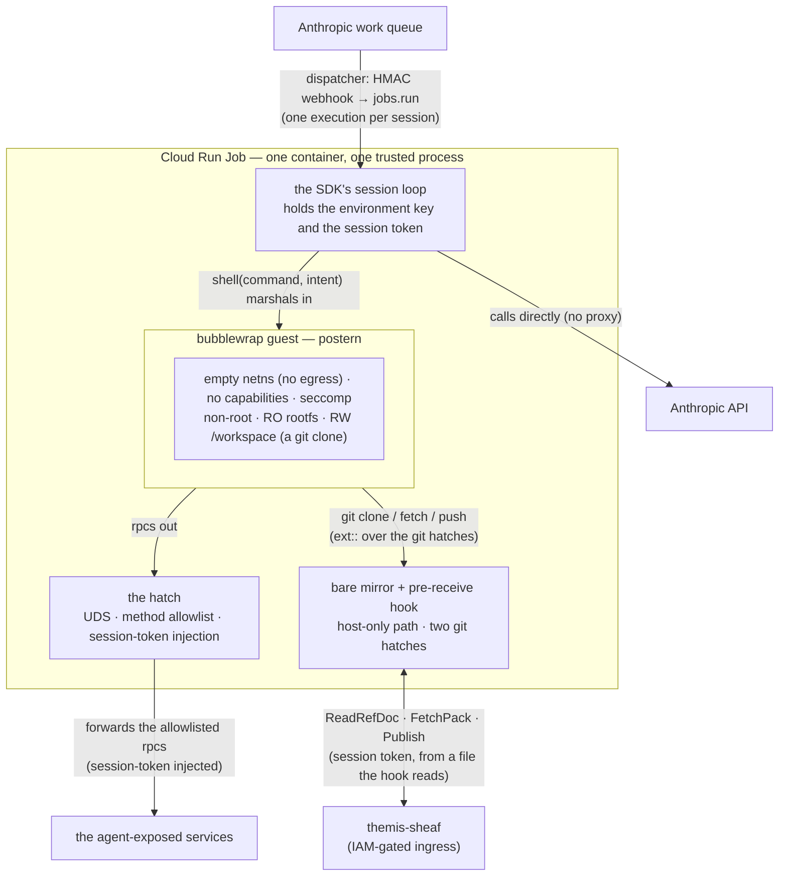

# Design: the sandbox worker

**Status:** current **Related:** [`sandbox-rpc-exposure.md`](sandbox-rpc-exposure.md) (which rpcs the guest may call
through the hatch, and how that set is declared), [`../plans/self-hosted-sandbox.md`](../plans/self-hosted-sandbox.md)
(the dispatcher, the credential model and the session lifecycle this execution model sits inside),
[`sheaf.md`](sheaf.md) and [`sheaf-service.md`](sheaf-service.md) (the repository the workspace is, and the service the
worker reaches it through), [`../runbooks/self-hosted-sandbox.md`](../runbooks/self-hosted-sandbox.md) (operating it),
[`services.md`](services.md) (the data-plane services it reaches)

## Overview

Themis runs the agent's tool execution inside CPG's network rather than Anthropic's, because that execution reads
genomic data and calls internal services ([`../PRODUCT.md`](../PRODUCT.md) §9). This doc decides what runs where inside
that boundary: how a session's code is isolated, what it can reach, and how its work survives the process ending.

- **One trusted process, not two containers.** The worker holds the credentials and runs the SDK's session loop.
  Untrusted model code never shares it: every shell command is marshalled into a
  [bubblewrap](https://github.com/containers/bubblewrap) guest whose exits are a method-allowlisted gRPC hatch and two
  git hatches onto the worker's mirror of its repository.
- **Egress is contained at the namespace, and fails closed.** The guest runs with an empty network namespace, so there
  is no egress firewall, no DNS sinkhole, no internal load balancer and no proxy in front of Anthropic — a whole network
  subsystem the container-isolation shape needs and this one does not.
- **The guest holds no credential and names no upstream.** It dials the hatch; the trusted worker injects the session
  token and forwards.
- **The workspace is a git repository the agent commits to and pushes.** `/workspace` is a clone of the Analysis's sheaf
  repository, served to the guest's own `git` from a bare mirror the worker keeps at a host-only path. The worker holds
  no bucket credential: its mirror reads and publishes through the `Sheaf` service, and the session token — the one
  credential it has for the repository — is what scopes every call. What the agent has not committed when the session
  ends is gone, and it is told so. The working document is a file in that repository like any other, and the worker
  keeps no copy of it.

## Background

**Where the worker sits.** Anthropic runs the model and owns the conversation; the tools run here. A webhook tells our
dispatcher that a session wants work, and the dispatcher starts one Cloud Run Job execution for it, injecting the
session's identifiers and its minted session token. Everything upstream of that — the dispatcher, the credential seam,
the work-queue lease — is the plan's ([`../plans/self-hosted-sandbox.md`](../plans/self-hosted-sandbox.md)) and
unchanged by this design; what follows begins at the moment that execution starts.

**Vocabulary.** A **session** is one agent conversation; a **work item** is the claim on it that the SDK's worker loop
leases. The **guest** is the sandboxed process model-written code runs in; the **hatch** is the Unix-socket gRPC server
through which it calls internal services, and the **git hatches** are the two Unix sockets its `git` reaches the
worker's **mirror** — a bare copy of the Analysis repository — through; together they are the guest's only exits.
**`/workspace`** is the directory the session's files live in — a clone of that repository — and the only writable one
the guest sees. In **code mode** the model reaches internal services by writing Python against their generated stubs
rather than through chains of discrete tool calls.

**What the SDK's loop does, and does not, hand us.** Four of its behaviours shape decisions below:

- It consumes the session's event stream itself and yields the caller *tool calls*, not events. The turn boundary is
  visible to it and not to us.
- It releases the work item when the session terminates, or after an idle period elapses following the end-of-turn
  event.
- It runs each tool call under a per-tool deadline and abandons a call that overruns, so nothing a slow call was still
  doing completes.
- It downloads the session agent's skills into the working directory each spawn, which fixes that directory as
  `/workspace` so the guest finds them where the platform's convention says they are.

**What postern gives us.** [postern](https://github.com/populationgenomics/postern) is the sandbox library: a bubblewrap
guest with an empty network namespace, no capabilities, a non-root uid, its own user namespace and a seccomp filter that
fails closed on an unrecognised architecture; a read-only root filesystem the image assembles ahead of time; a
reference-closed workspace accessor that resolves one path component at a time, so a symlink or special file the guest
planted is never followed out of the tree by the trusted process; and the hatch, which refuses any method outside an
allowlist. It also offers a self-test that launches a real guest, which is proof of all of it because every one of those
controls aborts the launch rather than degrading quietly — and the host matters, because unprivileged user namespaces
are what bubblewrap needs and not every runtime provides them.

The design was pressure-tested in two adversarial security reviews against postern, both concluding that it can run
without an egress firewall or a load balancer.

## Non-goals

- **No general-purpose method on the hatch.** Nothing shaped like `fetch(url)` or `query(sql)`. An exposed rpc whose
  answer depends on the session — a Project's scope, a data cutoff — derives that server-side from the token the worker
  injected, never from an argument the guest chose; a general method would move that decision inside the sandbox.
- **The `Sheaf` service is not agent-reachable.** The agent reaches its repository through stock `git` against the
  worker's mirror, over two stream hatches that splice to one fixed git service each. The service behind the mirror is
  worker-only, and no hatch method reaches it. A guest-facing storage API, were one ever wanted, would have to be scoped
  and size-capped by design rather than being the raw rpcs put on the allowlist.
- **The guest's egress is not filtered, because it has none.** This design expresses no allowlist of hosts or CIDRs and
  has nowhere to put one. Containment is the absence of a network, not a policy over one.
- **File I/O is not sandboxed** — only arbitrary execution is (§"Only arbitrary execution is sandboxed").

## Design

The worker is one Python package, [`themis/services/sandbox_worker/`](../../themis/services/sandbox_worker), running as
one Cloud Run Job execution per session:

```mermaid
flowchart TB
    wq["Anthropic work queue"]
    wq -->|"dispatcher: HMAC webhook → jobs.run<br/>(one execution per session)"| worker

    subgraph job["Cloud Run Job — one container, one trusted process"]
        worker["the SDK's session loop<br/>holds the environment key and the session token"]
        hatch["the hatch<br/>UDS · method allowlist · session-token injection"]
        mirror["bare mirror + pre-receive hook<br/>host-only path · two git hatches"]
        subgraph guest["bubblewrap guest — postern"]
            iso["empty netns (no egress) · no capabilities · seccomp<br/>non-root · RO rootfs · RW /workspace (a git clone)"]
        end
        worker -->|"shell(command, intent) marshals in"| guest
        guest -->|"rpcs out"| hatch
        guest -->|"git clone / fetch / push<br/>(ext:: over the git hatches)"| mirror
    end

    worker -->|"calls directly (no proxy)"| anthropic["Anthropic API"]
    mirror <-->|"ReadRefDoc · FetchPack · Publish<br/>(session token, from a file the hook reads)"| sheaf["themis-sheaf<br/>(IAM-gated ingress)"]
    hatch -->|"forwards the allowlisted rpcs<br/>(session-token injected)"| upstreams["the agent-exposed services"]
```

### One trusted process, not two containers

The obvious shape is two containers: an **untrusted** one running the SDK's worker with bash and the file tools
executing inside it, beside a **trusted** sidecar holding the credentials and injecting them. That shape puts model code
in a container that must then be contained *from the outside*, and containing a container's egress takes a whole network
subsystem — a dedicated VPC, a deny-all egress firewall with an allowance for Anthropic, a NAT, a DNS sinkhole, an
internal load balancer for the services the sandbox may still reach.

Pushing untrusted execution into an empty network namespace instead needs none of it. The worker is one trusted process;
it holds the environment key and the session token, calls Anthropic itself, and marshals each command into a guest that
has no network to contain. Egress containment becomes fail-*closed* — a namespace with no interface — rather than
fail-*open*, which is what a firewall is when a rule is wrong.

The table below is the consequence, kept because each absence is a decision a reader will otherwise propose filling:

| Not built                                                                                         | Why it is unneeded                                                                                                                                                                                        |
| ------------------------------------------------------------------------------------------------- | --------------------------------------------------------------------------------------------------------------------------------------------------------------------------------------------------------- |
| An internal load balancer                                                                         | Its only job is a host-filterable private address for internal services, which only a host-filtering firewall needs. No firewall, no filtering requirement: the worker dials each service at its own URL. |
| A dedicated VPC, a deny-all egress firewall with an Anthropic allowance, a NAT and a DNS sinkhole | The guest's empty namespace contains egress at the namespace, fail-closed.                                                                                                                                |
| A reverse proxy in front of Anthropic, with a path allowlist                                      | Only a sandbox that reaches Anthropic through an injector needs one. The trusted worker calls Anthropic directly, and the guest reaches nothing.                                                          |
| A gRPC forwarding sidecar                                                                         | The forwarders run in the trusted process, on a socket the guest cannot leave.                                                                                                                            |
| A separate container running the SDK's worker                                                     | The session loop runs in the trusted process, with `shell` as the sandboxed replacement for `bash`.                                                                                                       |
| Custom ID-token audiences on the internal services                                                | With no load-balancer hostname in front of them, each service's audience is its own URL.                                                                                                                  |

The worker has ordinary egress: a NAT route to Anthropic, and a private path onto the services network for the
internal-ingress services. Only the *guest* has no network at all.

### The guest's world is assembled at build time

The guest's root filesystem is built into the image as a separate tree and bound read-only at launch, so the guest sees
none of the worker's userland, none of its dependencies and none of its credentials. What it can see is that read-only
root, a writable `/workspace`, a private `/tmp`, the system gitconfig its `git` needs, and the hatch sockets. Nothing
else is bound in.

Before serving anything the worker runs postern's self-test and refuses to start if isolation is not enforced on this
host. Off-platform — a developer's machine with no bubblewrap — that means the worker exits rather than running model
code unsandboxed, which is the behaviour we want from a boot gate: it fails to the safe side of a mistake in how it was
deployed.

One first-party library ships into that root beyond the interpreter and the gRPC runtime: the **guest SDK**, a small
module under a stable import name, handing out a stub accessor per exposed service over one shared channel to the hatch.
That accessor set is generated from the same proto option the hatch reads its allowlist from
([`sandbox-rpc-exposure.md`](sandbox-rpc-exposure.md)), so the calls the SDK offers and the calls the hatch admits
cannot drift apart. Three decisions in it are why the model reaches services through it rather than through gRPC
directly, and each answers the same failure — a snippet losing work it had already done.

The first belongs to the channel: it fills in a deadline for any call whose caller named none, set below what the
enclosing tool call gets. gRPC's own default is infinite, so a service that never answers would otherwise be an
unkillable wait, ended only by the worker abandoning the tool call — and with it the unprinted results of every call
before it in the same script. Leaving that to each snippet is no protection, because the snippet that forgets is the one
that hangs; putting it on the channel means an unbounded call is not reachable through the SDK at all.

The second is a renderer for whole responses, so no field goes unread for not having been named — the field a snippet
did not think to print is the one saying why a lookup came back empty. Printing whole needs a length bound of its own,
or one oversized field buries every other; past that bound the head is what survives, and a marker says how much was
cut. A submessage that would take a large share of the bound renders as a marker instead, naming its type and the fields
it sets, so a record returned whole does not push the fields after it past the cut. The third is a retry that reissues a
failure meaning the call never reached an answer, and returns a settled one — no record, a request refused — as it
stands, since retrying that only spends the upstream's rate limit. It sets one budget covering every attempt and the
waits between them, in place of the channel's per-call default. An opt-in response cache under `/workspace/scratch`, the
ignored directory, spares a repeat.

The working-document linter ships beside it, so the agent can check its own output without leaving the sandbox.

### The hatch is the capability boundary

The guest's exit to the internal services is a gRPC server on a Unix socket inside the sandbox. It admits exactly the
methods on a generated allowlist and answers everything else `PERMISSION_DENIED`; which methods those are is decided by
an option on each rpc's declaration in the `.proto` and generated from it, so the allowlist is never authored
([`sandbox-rpc-exposure.md`](sandbox-rpc-exposure.md)).

The worker registers one forwarding servicer per exposed service. Each injects the per-session token as request metadata
and forwards over a channel carrying the worker's own service identity. So the guest holds no credential it could
exfiltrate and knows no upstream address it could try to reach directly: it names a method, and the trusted side decides
what that means. One channel is held per upstream *deployment* rather than per service, since a deployment may serve
several interfaces ([`services.md`](services.md)). What the trusted side then does on the guest's behalf can itself
reach a third party, which is why an rpc qualifies for exposure only if its own outbound calls are destination-fixed and
query-only ([`sandbox-rpc-exposure.md`](sandbox-rpc-exposure.md) §Security).

A failed call crosses the hatch under its own status code, so the guest can tell a settled answer from a fault, but its
text crosses only where the servicer marked it as its own, with a trailer `themis.common.authored_status` writes.
Without the mark the guest gets the code's bare name. The rule exists because grpc writes its own text for a failed
channel or a cut deadline under the same codes a servicer uses, and Cloud Run and the ID-token plugin set the
authentication codes; that text names the upstream's address or audience, which the guest is not meant to learn.

The mark is therefore a promise about the text, which the hatch trusts without reading it, and marked text is read by
the agent and by a browser. It names the rpc, the upstream by its label or public host, the status the upstream returned
and its stated reason, and what the caller sent. It never carries an internal address (a service URL, a database
instance, a queue path), a URL with its query, a credential or anything a header carried, a driver's or database's own
error text, or our egress address, which some upstreams echo back. Text that might hold any of these goes to the log,
and the status goes unmarked.

### The workspace is a repository, and the agent's git is the only git in it

`/workspace` is a clone of the Analysis's sheaf repository ([`sheaf.md`](sheaf.md)), and every `git` that touches it
runs inside the guest — the clone at session start, the agent's own commits and pushes, and one push of every branch at
teardown so a commit the agent made and forgot to push survives. The guest owns the working tree, `.git` included, so a
`git` the trusted worker ran there would execute whatever `core.hooksPath` or a clean filter pointed at, in the process
holding the credentials. Two layers enforce that, and only one of them is live: a test over this package asserts that
its every `git` is the guest's or the mirror's, which holds in any deploy; the structural layer — the guest owning
`/workspace` under a mapped uid, so a host-side `git` there meets git's ownership check — is built and proven under test
but off until the SDK's file tools hand each written file down to that uid (§"The ownership guard is built and switched
off"). The worker makes no commits on the agent's behalf — its one commit seeds an empty repository with the ignore file
— so what the agent has not committed when the session ends is gone; a commit it made and did not push is carried by the
teardown push, and one the repository refuses then is preserved under a stranded ref for a later session to merge.

The one host-side git is the mirror's: a bare repository at a path the guest is never bound to, which the guest's `git`
reaches over two stream hatches — one splicing to `upload-pack`, one to `receive-pack`, so the socket is the capability
and a guest holding the fetch socket cannot push. Before either hands a connection to git the mirror is brought up to
the repository's current state, so git's own fast-forward check does the rejecting in the common case; a push then runs
the mirror's pre-receive hook, which refuses anything that rewrites history, writes a protected path, carries a commit
in anyone's name but the agent's, or adds a path the workbench's git library cannot read, and publishes the rest. The
agent's name is the one the guest's system git configuration gives it, and the worker hands the hook the same one
([`sheaf.md`](sheaf.md) §"Protecting what the agent must not write").

The mirror reads and publishes through the `Sheaf` service ([`sheaf-service.md`](sheaf-service.md)), never the bucket.
The worker holds no bucket credential and makes no auth call, and its only credential for the repository is the session
token, which the service resolves to the Analysis whose repository every call then acts on. The checks a repository's
document can decide — that a publish is against the current generation, that no ref is deleted, that the reflog moved —
run in the service; the checks that need the objects — that every move is a fast-forward, that no protected path is
written, that every new commit is the agent's — run in the worker's hook, which is the only place that has them. The
hook is a subprocess `git receive-pack` spawns with a scrubbed environment, and it parses bytes the guest composed, so
the token reaches it by a file path rather than through its environment: the worker writes the token, readable by its
owner alone, under the mirror's host-only root at session start and removes it with the mirror at teardown; the hook is
handed the path, not the token, and the sync state it reads names the path too. Nothing the guest can see, and no
subprocess's environment or argument list, ever holds it. The client that implements this is
[`themis.clients.sheaf.store`](../../themis/clients/sheaf/store.py); the mirror and the hook are
[`themis.sheaf.wire`](../../themis/sheaf/wire).

The working document is a file in the repository like any other, committed and pushed by the agent, and the worker keeps
no copy of it. So an edit to the document is durable exactly when any other edit is: once the agent has committed it and
a push has landed. The teardown push runs on the way out of a failed session loop and on the task's SIGTERM, so a commit
the agent made and did not push survives both. An exit that gives the worker no chance to run it, such as an
out-of-memory kill, loses what the agent changed after its last commit. The accepted cost, and why no second copy of the
document is kept, is argued in [`workbench-workspace.md`](workbench-workspace.md) §"Where things are stored".

Two failure policies fall out of what the repository is worth:

- **Restore is fail-closed.** The repository is the deliverable, so a clone that fails fails the spawn; an Analysis with
  no repository yet clones an empty one and seeds it with the ignore file. A repository with no working document starts
  without one, and the agent writes it.
- **A refused push is the agent's to resolve, in git's own wording.** History is append-only, so a force-push or a
  deletion is refused; a push behind the tip is told to pull and push again. The service's size ceilings bound what one
  push may publish ([`sheaf-service.md`](sheaf-service.md), Deployment), since the bytes are whatever the guest pushed
  and nothing in a sheaf store is reclaimed.

The skills the SDK re-downloads each spawn sit in writable `/workspace`, reachable by guest code. That is harmless,
since the guest already runs arbitrary code and they refresh every spawn, and they are ignored by the repository and
protected by the hook, so no stale copy is ever pushed or restored; a genuinely read-only mount would need postern to
overlay a read-only bind *inside* the workspace.

### The ownership guard is built and switched off

The structural layer works through ownership. postern can map the guest to a dedicated host uid, so every file the guest
creates is owned by a uid that owns nothing else on the host. Git refuses to operate on a repository owned by another
user, and root is not exempt (`fatal: detected dubious ownership`). So a host-side `git` in `/workspace` fails, and the
only override is a `safe.directory` entry that a reviewer would see.

Everything the guard needs exists: the uid and gid on the sandbox profile, a socket directory the mapped uid can
traverse, and tests that clone, commit and push from the dropped guest and then watch a host-side `git status` refuse
the result. The deploy sets neither uid, so the guard is off in production, and the test over the worker package is the
layer that holds.

The obstacle is the same mechanism pointed the other way. Ownership makes a host-side `git` refuse the guest's
repository, and it equally makes a file the worker wrote refuse the guest. The SDK's `write` and `edit` tools run in the
trusted worker, so under the mapping they create files the worker owns, with mode 0644, in a `/workspace` that carries
the sticky bit. The guest can neither rewrite such a file in place nor unlink and recreate it, so a `git checkout` or a
`git pull --rebase` that has to update one fails. The mode and the sticky bit each block it on their own, so relaxing
either one alone changes nothing.

There are three ways out:

- **Chown each written path down to the guest.** The file tools stay in the worker. After a successful `write` or
  `edit`, the worker hands the file's ownership to the guest's uid. The change is contained to the worker, and the test
  that records the cost as an expected failure then pins the fix. Everything else the SDK writes, such as the skills
  download, stays read-only to the guest, which is what it should be.
- **Run the file tools in the guest.** Ownership then holds by construction. But it reverses the premise that only
  arbitrary execution is sandboxed (§"Only arbitrary execution is sandboxed"), and it needs guest-side implementations
  of read, write, edit, glob and grep.
- **Change what postern does with a mapped workspace**: no sticky bit, and group-writable under a shared gid. It touches
  the dependency, and it weakens the protection the sticky bit gives where no uid is mapped.

The first is the choice. Until it is built, the deploy stays unmapped.

### The session's release lands about a minute after its last turn

The SDK's loop returns when the session terminates, or when its idle interval, a minute by default, passes with no new
event following an end-of-turn idle. The teardown push of what the agent left unpushed is therefore made roughly a
minute after the turn it belongs to. In one measured session, the harness recorded the session as settled at 07:58:20,
and the worker's teardown ran at 07:59:20.

A reader of the repository has to expect that lag for commits the agent made and did not push. What the agent pushed
itself is in the repository as soon as its push lands.

### Only arbitrary execution is sandboxed

The session's toolset is the SDK's standard file tools — read, write, edit, glob, grep — with `bash` dropped and a
`shell` tool in its place. The file tools resolve every path against the working directory and reject escapes, so they
run in the trusted worker; `shell` marshals its command into the guest. The agent's web search runs on Anthropic's side
and touches neither the worker nor the sandbox. The agent has no web fetch: it would fetch any URL a tool printed, which
makes it an exfiltration channel ([`security.md`](security.md#what-counts-as-an-exfiltration-channel)).

`shell` marshals **every** command, with no fast path for anything. The command runs through postern's hatch-bound
Python entry point, which is what exports the hatch's socket address into the environment, so a `python3` the command
spawns inherits it and can reach the services in code mode. The tool also takes an `intent` — a short model-stated label
for the action — which the workbench renders and the worker logs beside the exit code, giving a worker-side audit of
what ran. No tool runs a model-supplied command on the host: one that did would bypass the sandbox entirely.

The trade-off is deliberate and worth stating plainly: the credential-holding process runs the file tools directly. It
is accepted because the toolset's own trust model holds the file tools safe unsandboxed and only `bash` unsafe, and
because the tools' path confinement is what that safety rests on.

### The work item is acked once restore proves

The dispatcher polls for work without acking, so an item stays reclaimable until someone takes responsibility for it.
The worker acks after `/workspace` restore succeeds and before serving. That ordering does two things at once: a spawn
that dies before restore stays unacked and correctly re-surfaces on a later drain, and a session that outlives the
reclaim window is not reclaimed and re-dispatched underneath itself.

The repository's verdict at restore is terminal: the `Sheaf` service refusing the session token, or a ref document that
is corrupt or names a pack that is gone. A respawn would meet the same failure, so that item is acked to stop reclaim
and stopped to end it. It is the only item the worker stops itself. A failure that is not a verdict, such as a guest
command failing, a node-local fault or the service out of reach, leaves the item unacked to reclaim onto a fresh spawn,
which may outlive the outage. Once the session loop is entered the SDK force-stops the item on every exit from it,
shielded against cancellation, so a stop from the worker would only race that one and take a conflict response the SDK
tolerates and we do not.

The accepted limitation is on the other side of the ack: a worker death *after* the ack wedges the session. The item is
out of the reclaimable set, and the dispatcher drains only on a run-started webhook, which an idle waiting for action
never re-fires — so nothing re-drains it (§Open questions).

### The design is verifiable offline

The whole test suite runs without bubblewrap, against a fake at the narrowest seam, the SDK's event stream. The
repository path is not faked at all: the tests run the real `Sheaf` servicer in-process over a local backend, the mirror
over the real client, and a real `git` against the hatches' host-side sockets, so everything but the isolation is the
production path. The properties only a real launch can prove — the boot gate passing, the guest having no network, the
hatch socket being the one channel bound in, the host uid mapping — are gated on the host having bubblewrap, so they run
in CI and skip on a developer's laptop rather than silently passing there.

## Alternatives considered

- **An untrusted agent container beside a trusted credential-proxy sidecar.** Weighed in §"One trusted process, not two
  containers": its cost is the network subsystem, and its benefit — running the SDK's worker exactly as shipped — is not
  worth a VPC.
- **An egress firewall around the sandbox instead of an empty namespace.** A firewall is fail-open: a wrong or missing
  rule permits. A namespace with no interface has no rule to get wrong. The firewall's one advantage, letting sandboxed
  code reach a curated set of external hosts, is not something this design wants — the agent reaches external data
  through services on the allowlist, which is where the curation belongs.
- **A shell-less, trimmed guest root filesystem.** Rejected as security theatre here: isolation rests on the empty
  namespace, the dropped capabilities and the non-root uid, all of which hold whatever binaries are present. Trimming
  would only cost the model the tools it is meant to use.

## Open questions

- **A wedged session has no automatic recovery.** A worker death after the ack leaves nothing to re-drain the item
  (§"The work item is acked once restore proves"). Recovering it would need a reclaim tick independent of the webhook.
- **Memory is bounded from outside, not by a cgroup.** The container's own memory limit is the only bound, giving a
  one-session blast radius; postern's per-process address-space cap is left unset, and a delegated child cgroup would be
  the better answer if the platform allows one. The per-run process-count cap postern applies by default is untested.
- **Where the worker's code belongs.** It sits under `themis/services/`, while
  [`../repo-structure.md`](../repo-structure.md) reserves an `apps/` path for the eventual deployable and defines
  `themis/services/` as gRPC servicers — and the worker is not a servicer. To reconcile.
