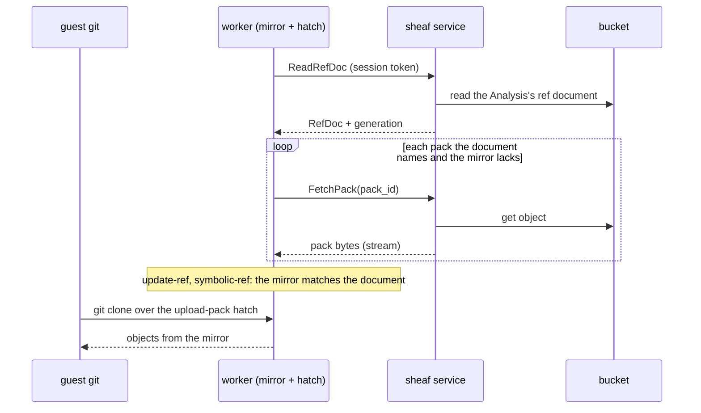
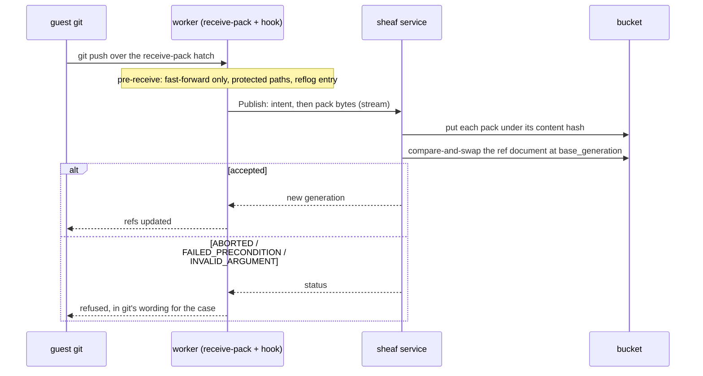

# The sheaf service

**Related:** [`sheaf.md`](sheaf.md) (the storage model: packs, the ref document, append-only history, the reflog);
[`sandbox-worker.md`](sandbox-worker.md) (the worker whose mirror and hook call this service);
[`services.md`](services.md) (how a data-plane service is built and called).

The `Sheaf` gRPC service is how a sheaf repository is read and written. It holds the only credential on the workspace
bucket; a caller holds the objects — a bare git mirror — and drives the protocol through three rpcs. That caller is the
sandbox worker: its mirror hydrates through `ReadRefDoc` and `FetchPack`, and its pre-receive hook publishes through
`Publish`. The guest's `git` sees none of this: it speaks git's own protocol to the worker's mirror over the stream
hatch, and the mirror is where git's world ends and sheaf's begins. The BFF is the deployment's second consumer, through
a workspace-level interface of its own ([below](#the-second-consumer)); it holds no objects and no session token, so it
does not call these three rpcs. The protocol lives in the service rather than in each caller so that the checks a
repository's document can decide are made once, for every writer, and so that no caller needs a bucket credential of its
own. Which deployment hosts the service is not part of the contract; every rpc is scoped by the session it carries, not
by where it runs.

Contract: [`sheaf.proto`](../../schema/proto/themis/rpc/sheaf.proto). Stubs: `themis.rpc.sheaf_pb2`,
`themis.rpc.sheaf_pb2_grpc`.

## Scope of a call

Every rpc carries a session token as `x-themis-session-token` metadata. The service resolves it through the auth service
to an Analysis, and the repository every rpc acts on is that Analysis's — its ref document and packs under the
Analysis's prefix in the workspace bucket. No request names a repository, so a caller cannot reach another Analysis's,
and a call with no token is `UNAUTHENTICATED`, one whose token does not resolve `PERMISSION_DENIED`, before anything is
read — the mapping every data-plane service shares through `themis.clients.auth`.

## The rpcs

### `ReadRefDoc`

`google.protobuf.Empty` → `RefDocSnapshot`

Returns the repository's ref document and the generation that wrote it.

- `document` is the `RefDoc` message as stored — refs, the pack manifest, HEAD — carried as a message so a field this
  build does not model survives the round trip. Unset when the repository does not exist yet.
- `generation` is the bucket's version token for the document: the value the object had when read, and the value a
  conditional write is made against. It is opaque — a GCS generation is a microsecond timestamp, neither dense nor
  ordered in any way a caller may rely on — and is compared for equality only ([`sheaf.md`](sheaf.md), Consequences).
  Zero exactly when `document` is unset.

A repository that does not exist is not an error. A publish against `generation = 0` asserts that it still does not.

Errors: `DATA_LOSS` if the stored document does not parse as one this code wrote — a truncated or foreign encoding. That
is damage, and a caller treats it as terminal, not as a fault to retry.

### `FetchPack`

`FetchPackRequest{pack_id}` → `stream PackChunk`

Streams the bytes of one pack the document names, in order. `pack_id` is the lowercase hex SHA-256 of the pack's bytes,
as the document's `packs` lists it, so a caller can verify what it receives.

Errors: `INVALID_ARGUMENT` if `pack_id` is not sixty-four hex digits, before the store is consulted — the id becomes
part of an object key, so its form is the contract's to fix. `NOT_FOUND` if no such pack. Nothing in a sheaf store is
ever deleted, so a pack the current document names is always present; `NOT_FOUND` means the id did not come from a
document this service returned.

### `Publish`

`stream PublishRequest` → `PublishResponse`

Uploads a publish's packs and replaces the ref document in one compare-and-swap.

The stream is one `PublishIntent` first, then the bytes of each pack the intent declared, in order — a stream of the
intent alone is a complete publish when it declares no packs:

- `PublishIntent.base_generation` — the generation of the `RefDocSnapshot` the caller built against. Zero asserts the
  repository does not exist yet.
- `PublishIntent.ref_updates` — ref name → `RefUpdate{old, new}`. `old` absent requires the ref not to exist; `new`
  absent is a deletion, which is refused by name, as is git's zero object id. Names are fully qualified under `refs/`. A
  publish that moves any ref outside `refs/sheaf/` must also move `refs/sheaf/reflog`, the ref sheaf keeps as its own
  record of which commit was each ref's tip and when — one commit per publish, parented on the previous entry and every
  tip the publish set, so every commit ever a tip stays reachable ([`sheaf.md`](sheaf.md), "The reflog ref says what was
  current"). The service can check that an entry is present; what it points at is the caller's contract. A publish that
  moves no ref outside `refs/sheaf/` is refused: nothing legitimate publishes only sheaf's own bookkeeping, and the
  classification below is over exactly those refs, so the refusal is what keeps its receipt arm from being vacuous.
- `PublishIntent.head` — optional `RefTarget`. Unset carries the document's HEAD over, except an unborn one — a symbolic
  HEAD naming a branch that does not exist — once the publish leaves a branch, so a clone lands on a branch rather than
  on nothing. Re-derivation, on a first publish and in that case, is one rule: `refs/heads/main` if it exists after the
  publish, else the first branch in name order, else an unborn `refs/heads/main`.
- `PublishIntent.packs` — one `PackDescriptor{size, pack_id}` per pack the publish carries, in the order their chunks
  follow: the pack's byte length, and the SHA-256 of those bytes that becomes its id — sixty-four hex digits, refused
  before any byte is read if anything else, since it becomes part of an object key. Declared up front so a stream that
  delivers the wrong number of bytes for a pack — a client that half-closed after a short read of the quarantine — is
  refused rather than stored. A truncated pack the manifest names would be the one damage this store cannot undo, since
  nothing is ever deleted and `Publish` only extends the manifest.
- `PublishChunk.pack` — which declared pack the bytes belong to. Chunks of one pack arrive in order and packs are
  contiguous — all of pack *n* before any of pack *n+1* — so the service hashes, checks and stores one pack at a time.
  Every pack is self-contained (not `--thin`).

The service validates the intent — including that the declared packs fit the deployment's per-publish byte ceiling,
refused with `RESOURCE_EXHAUSTED` before any byte is stored — then checks and uploads each pack under its declared hash,
and compare-and-swaps the document at `base_generation`. Packs land before the document names them, so a refusal at any
point leaves at most an unreferenced pack and never a ref that points at an object nothing can fetch.

Response: `generation`, the value at which the document holds this publish's outcome — the one the publish wrote, or the
current one when the call succeeded because the publish had already landed — which the caller's next `ReadRefDoc`
returns. Nothing else: the packs stored are exactly the declared descriptors, so the caller already knows their ids.

Errors, and what each means to the caller:

| Code                  | Cause                                                                                                                                                                                                                                                                                                                                                                                                                                                                                                                                                                | The caller's move                                         |
| --------------------- | -------------------------------------------------------------------------------------------------------------------------------------------------------------------------------------------------------------------------------------------------------------------------------------------------------------------------------------------------------------------------------------------------------------------------------------------------------------------------------------------------------------------------------------------------------------------- | --------------------------------------------------------- |
| `ABORTED`             | The document is no longer at `base_generation`, and every ref the intent moves outside `refs/sheaf/` still holds its `old` in the current document: an unrelated publish landed first.                                                                                                                                                                                                                                                                                                                                                                               | Read again, rebuild the intent against it, publish again. |
| `FAILED_PRECONDITION` | The document is no longer at `base_generation`, and a ref the intent moves outside `refs/sheaf/` has moved: the caller's view of that ref is behind.                                                                                                                                                                                                                                                                                                                                                                                                                 | A non-fast-forward: merge or rebase, then push again.     |
| `INVALID_ARGUMENT`    | A ref name or object id git cannot hold; two names that collide as a directory and a file; an update with no `new` or with the zero id (a deletion); an intent moving no ref outside `refs/sheaf/`; a declared pack id that is not sixty-four hex digits; a pack whose bytes do not match its declared size or hash; a HEAD naming neither an object nor a ref; a publish that moves a ref outside `refs/sheaf/` without moving `refs/sheaf/reflog`; a malformed stream — no intent, an intent after a chunk, a pack index out of order or beyond the declared list. | Fix the intent; retrying the same one never lands.        |
| `UNAUTHENTICATED`     | No session token on the call.                                                                                                                                                                                                                                                                                                                                                                                                                                                                                                                                        | —                                                         |
| `PERMISSION_DENIED`   | The session token does not resolve to an Analysis.                                                                                                                                                                                                                                                                                                                                                                                                                                                                                                                   | —                                                         |

`RESOURCE_EXHAUSTED` is the size refusal: the declared packs exceed the deployment's per-publish byte ceiling, or the
ref set the publish would leave exceeds its ref-count or document-size ceiling — both decided from the intent and the
current document before any pack is stored, and the second for the same reason as the first: nothing is deleted, so the
ref set only grows. Faults are gRPC's ordinary codes and are not refusals: `UNAVAILABLE` or `INTERNAL` for a storage
fault, which a caller retries under gRPC's usual semantics and the worker's hook reports as a deployment fault rather
than the pusher's.

A moved document is classified in a fixed order, from one read of the current document, over the refs the intent moves
outside `refs/sheaf/` — the reflog ref advances on every publish, so it can never still hold its `old` after a race and
is bookkeeping the service checks for presence, not an input to the split. First the receipt: if every such ref already
holds its `new`, this publish landed and only its response was lost, so the call succeeds with the current generation
and a retry completes. Then the split: every such ref still at its `old` is `ABORTED`; one that moved is
`FAILED_PRECONDITION`. Those are the two rejections [`sheaf.md`](sheaf.md) keeps distinct: the first is replayable and
the second is semantic. The classification is the service's to do. Sheaf's in-process store — `Store.publish` in
[`themis/sheaf/store.py`](../../themis/sheaf/store.py), which this rpc and the BFF's path both call — compares `old`
against the caller's own base snapshot, which a caller deriving its intent from that snapshot can never fail, so without
the re-read every moved generation would be `ABORTED` and the split would exist in the table alone. The worker's hook
turns the first into git's "the remote moved, pull first" and the second into git's own non-fast-forward message.

## What the service checks, and what the caller does

The service holds the document and no objects, so it decides what the document alone decides:

- every ref name is fully qualified and one git can hold;
- every object id is a SHA-1, and not the zero id;
- every declared pack arrives with exactly its declared size and hashes to its declared id;
- no two names in the resulting ref set collide as a directory and a file;
- no update deletes a ref;
- a publish moving any ref outside `refs/sheaf/` also moves `refs/sheaf/reflog`;
- `base_generation` is the document's current generation — and when it is not, whether every ref the intent moves
  outside `refs/sheaf/` already holds its `new` (the publish landed: success), still holds its `old` (`ABORTED`), or has
  moved (`FAILED_PRECONDITION`);
- the ref set the publish would leave is within the deployment's ref-count and document-size ceilings.

The caller, which holds the objects, is responsible for:

- every move being a fast-forward (the worker's hook checks with `git merge-base --is-ancestor`; a writer that builds
  its commit on the tip it read satisfies it by construction);
- the reflog entry's parents being the previous entry and every tip the publish sets;
- the packs making every new tip reachable.

## Flows

Hydration, at session start. The worker syncs its mirror from the service; the guest then clones the mirror over the
hatch, and never reaches the service or the bucket.

A push, from the guest's `git push` to the accepted publish. Before `receive-pack` spawns, the connection's handler runs
the same sync as hydration — `ReadRefDoc`, then `FetchPack` for anything new — which is what lets git's own fast-forward
check reject in the common case; the hook then reads the document once more, to compare generations and to find the
reflog tip, so a push is two reads unless the sync state carries the tip. The hook is a subprocess `receive-pack` spawns
with a scrubbed environment; it finds the service's address and the session token the way it finds the sync state — by a
file path — rather than in its environment, since it parses guest bytes and `/proc/<pid>/environ` is readable by
anything sharing its user.

The hook does not update the mirror's refs on success; the next request's sync reads them from the document. Its exit
status is what tells git to keep or discard the push's quarantine.

## The second consumer

The BFF edits the workspace on a curator's behalf inside an HTTP request — a widget's state file changed, a comment span
added to the document — and has to write each as a commit. It holds no objects, runs no `git` and carries no session
token, so none of the three rpcs above fit it. It reaches the same deployment through a workspace-level interface of its
own, whose unit is a file at a commit rather than a pack and a ref: read a file at a commit, or the working document
together with every file it references so one call renders it, both immutable by commit and cached as such; commit a set
of changes on a branch against a base commit, refused with the current tip when the branch has moved; and the branch's
history, read from the ref document and the reflog ref. Those rpcs name the Analysis and are authorized by the BFF's
service identity — the BFF having already checked that the curator belongs to the Analysis's Project, the authorization
chokepoint [`workspace-model.md`](workspace-model.md) gives it — a different scope model from the session token, which
is one reason they are a separate interface. Ingress becomes IAM-gated public when they land. Their contract is not this
document's; it follows with the BFF-side design.

Behind that interface the service is itself a sheaf writer, and it shares everything with the worker's path except the
hook: it hydrates a bare mirror per Analysis through the same code the worker runs, builds blob, tree and commit with
git plumbing against that mirror, writes the reflog entry, packs, and publishes through the same in-process
`Store.publish` the `Publish` rpc calls. So the document-level checks are made once for both consumers, and the writer's
contract the hook enforces for a push is met by construction here: the commit's parent is the tip the intent was built
against, and the reflog entry's parents are that tip and the previous entry. The storage protocol's own lost race is
replayed inside the service and never crosses that interface; only a moved tip does, and the reapply belongs to the
caller that holds the intent. Serving a file at a commit needs the Analysis's mirror hydrated in the service, so
[`sheaf.md`](sheaf.md)'s pre-hydration ceiling and its warm-versus-per-request mirror question sit on that read path,
and the image needs `git`.

## Deployment

`Sheaf` is a logical service; which Cloud Run service hosts it, and beside which other interfaces, is the deploy's
arrangement and is recorded there ([`deployment.md`](deployment.md)), not here, so that arrangement can change without
this doc being wrong. What the service needs of its deployment, wherever it lands:

- **Credential:** the identity it runs as holds `roles/storage.objectUser` on the workspace bucket, and is the only
  identity that does. Replacing the ref document under `ifGenerationMatch` is an overwrite, and GCS requires
  `storage.objects.delete` for an overwrite, so a create-and-read role cannot implement the protocol; "nothing deletes"
  is a property of the protocol, and if it is to be a property of the bucket too that is object versioning or a
  retention policy on the pack prefix, not the role. The worker's identity holds `run.invoker` on that service and
  nothing on the bucket.
- **Ingress:** internal, reached by the worker over the services VPC. The BFF has no VPC egress; when its rpcs are
  added, ingress becomes IAM-gated public.
- **Size:** chunks are sized under gRPC's default 4 MiB message limit. A publish's declared total, and the ref count and
  document size it would leave, are bounded by per-deployment ceilings and refused with `RESOURCE_EXHAUSTED` beyond
  them; the value is deployment configuration, and the ceiling exists because the bytes are whatever the guest pushed
  and nothing is ever reclaimed.
