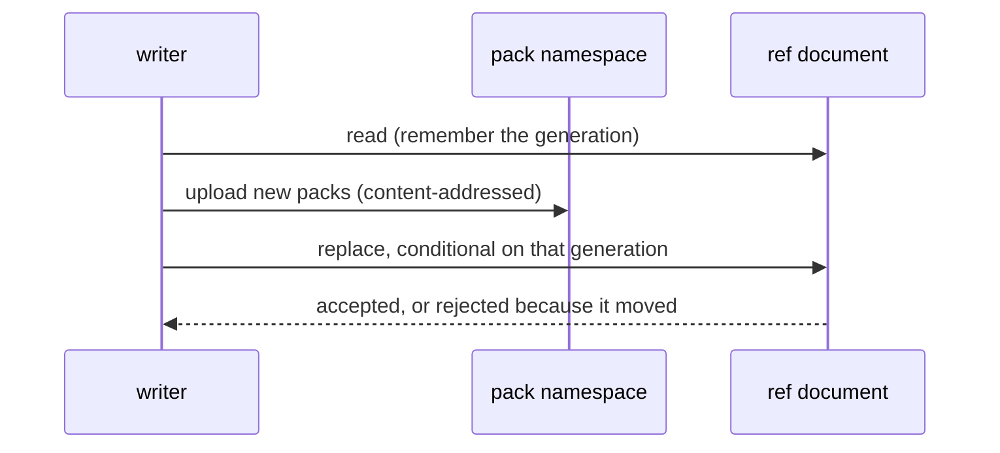

# Design: sheaf — git over object storage

**Status:** draft

**Related:** [`workspace-model.md`](workspace-model.md) (the collaboration model whose workspace this would carry, and
the branch-and-append semantics an Analysis has); [`services.md`](services.md) (the store service, which holds the
workspace archive today, and how the sandbox reaches a service at all); [`agent-runtime.md`](agent-runtime.md) (the
session the sandbox runs inside).

## Overview

A Themis workspace has two writers. The agent writes into a sandbox that lives and dies with one session; the BFF — the
web tier's backend-for-frontend — writes in response to a curator's click, inside a request, with no sandbox and no
checkout. The workspace is an opaque tar archive, replaced whole by whoever writes it, and nothing records what a write
changed. Only the sandbox writes it today; adding the second writer to that model means each one silently overwrites the
other's work.

Git already solves this, and its object model happens to fit an object store almost exactly: an **append-only,
content-addressed object store** plus a **small mutable pointer set**. GCS gives both — immutable keys, and
compare-and-swap on a single object through `ifGenerationMatch`. So the decision is:

- **One document per repository holds all the mutable state** — every ref, plus the manifest of packfiles that make up
  the object database — and it is only ever replaced by compare-and-swap. That single conditional write is all the
  concurrency control the data needs: no lease object, no advisory lock in Postgres, no `--max-instances=1` on a git
  server.
- **Two failure modes are kept distinct**, because they need different responses: a writer whose document moved but
  whose refs are untouched can safely replay, while a writer whose ref no longer holds the value it expected has a
  non-fast-forward on its hands and needs a merge.
- **A shared, accumulating record is modelled as an append-only log**, not as a mutable field. Appends commute, so a
  writer that loses the race re-appends to whatever the winner left and no user is ever shown a conflict.
- **Stock git owns the wire protocol.** The agent clones and pushes with a real `git` binary against a real
  `git http-backend`. Sheaf's own code in that path is a CGI bridge, a sync of the bare mirror before each request, and
  a pre-receive hook that turns the push into one compare-and-swap and refuses one touching a protected path.
- **The resident set is bounded by a ceiling checked before hydration.** Serving a request means a local object
  database, and on Cloud Run that is memory. Exhausting it is the one failure this layer cannot replay away, so a
  repository too large to serve is refused by the request that asked for it rather than taken out on the instance.

The mechanism lives in [`themis/sheaf/`](../../themis/sheaf), with no Themis domain type in it, so it stays extractable
into a package of its own if a second consumer ever appears.

## Background

**What the two writers are.** The agent runs untrusted model code inside a sandbox whose filesystem is discarded when
the session ends, so its work has to be checkpointed somewhere durable. The BFF handles a curator's click — "mark this
criterion as reviewed" — inside an HTTP request. It has no sandbox to run git in and no working tree to commit from, and
standing one up per click is not affordable.

**What object storage gives.** GCS has no locks, no atomic rename, and no multi-object transaction. It has exactly one
concurrency primitive: a write to a single object can be made conditional on that object's current generation, and the
service rejects it if the generation has moved. Writing an object under a key derived from its own content is
unconditionally safe, because a racing writer of the same key is writing the same bytes.

**What git's object model is.** A git repository is a content-addressed store of blobs, trees and commits, none of which
is ever mutated, plus a set of refs — short mutable pointers from a name to a commit id. Everything git needs a
filesystem for concerns the refs: lock files, atomic renames, directory semantics. The object half wants nothing that an
object store does not already provide.

**What a bare `git init` does not give you.** Git's own ref update is a lock file plus a rename, both of which an object
store lacks. Two writers advancing the same ref through separate GCS writes would lose one update with no error.

## Non-goals

- **Not a general-purpose git host.** One repository per workspace, served on loopback to a known client, with no
  authentication of its own. Anything reaching it goes through something in front that authenticates. Which repositories
  a server will serve is an explicit input to it, never inferred from the request path — with no authentication, that
  set is the only boundary between a client that can reach the server and every workspace in the store.
- **Not an authorization control.** Compare-and-swap prevents *accidental* loss; it does nothing about deliberate
  overwriting. A force-push is honoured, because git told the server to accept a non-fast-forward and the precondition
  still holds. Protected paths stop a specific forgery, not a determined holder of the credential.
- **SHA-1 repositories only.** The bare mirror takes git's default object format, which is what bounds the hash a client
  can push. Git's own default has not moved, and adopting SHA-256 is a migration in its own right.
- **Not a replacement for the versioned working document.** The working document has a linear version history and a
  promote-to-report step of its own ([`workspace-model.md`](workspace-model.md)); a git branch is the wrong shape for
  that, and nothing here proposes to change it.
- **No implementation of git's object format.** Sheaf stores packfiles whole and never looks inside one; every pack it
  holds came out of `git pack-objects`. Reimplementing the format is how a store ends up subtly incompatible with the
  client it exists to serve.
- **No cross-repository operation.** No shared object store between workspaces, no alternates, no dedup across
  repositories. Each repository is self-contained under its own key prefix, so one workspace's storage is reachable
  without any authority over another's.

## Design

### The two namespaces

A repository occupies one key prefix, holding:

- **Packfiles**, under content-addressed keys. Write-once, never mutated, never renamed. A pack's key is a digest of its
  bytes, so a replayed attempt that produces identical objects re-uploads to the same key instead of littering the
  namespace.
- **One ref document**, at a fixed key. It carries every ref of the repository and the list of packfiles that make up
  its object database, and it is only ever replaced by compare-and-swap against the generation the writer last read.

The refs and the manifest live in the *same* object because compare-and-swap is available per object. Splitting refs
across keys would make a multi-ref update a multi-key update with no atomicity — the problem this design exists to
avoid. The manifest has to be in there too: a listing of the pack prefix cannot tell a live pack from one orphaned by a
lost race, so a reader needs the manifest to know what to download, and garbage collection needs it to know what is safe
to delete.

The storage seam is deliberately narrow — read and conditionally write one mutable key, and put, get, list and delete
content-addressed objects. That is small enough to implement over a local directory, which is how the concurrency
protocol is tested with no network and no credentials, and it means a bug in the protocol shows up as a protocol bug
rather than as a cloud-client bug.

### Publishing

Every write, from either writer, has the same shape.

A rejection is replayed rather than reported, which the next section takes up. The conditional replace is the only point
where writers are ordered against each other, and it is one object-store call. Anything else that serialises — a server
holding a lock while it refreshes its own cache — is protecting a cache, not the data.

Objects go up before the ref document names them, always. A ref pointing at an object nobody can fetch is corruption; a
pack nobody names is litter. That asymmetry is why the ordering is not negotiable — and why litter is a design
consequence rather than a bug, since unlike git's push quarantine an upload to object storage cannot be cheaply rolled
back.

### A lost race is not a conflict

Two rejections are possible, and conflating them is how a system either loses data or asks a user to resolve something
it could have handled:

- **The ref document moved, but the refs this writer is touching still hold what it expected.** Somebody else committed
  something unrelated. Re-read, rebuild the intent against the new state, publish again. Nobody is told anything.
- **A ref no longer holds the value the writer expected.** This is git's non-fast-forward. It cannot be retried away —
  retrying would clobber whatever landed — so it surfaces to whoever is pushing, who merges or rebases.

The distinction is what makes the coarse, one-document compare-and-swap acceptable. Two writers touching disjoint refs
contend on the document, but the loser's replay always succeeds, so contention costs a round trip rather than a failure.
The retry budget bounds the replay; exhausting it means the writer was starved by sustained contention, which is a real
condition to report rather than one to hide.

A writer that derives its whole intent from the snapshot it was handed can, by construction, never see the second case.
That is why publishing takes a builder — re-invoked on every attempt against whichever state won — rather than an
expected old value.

### Appends commute; that is the load-bearing choice

The BFF edits the workspace on a human's behalf, and some of what it would write is a record that accumulates — an
assertion that a criterion has been assessed, a comment asking for rework. Modelled as a mutable field in a document,
two writers racing means one write is lost, or a user is shown a merge. Modelled as a line appended to a log, the loser
re-reads the winner's log and appends again — the same set of lines either way, no conflict, and no dependence on an
agent being alive for the write to land. Whether review state in particular becomes such a file is an open question
below; what this section fixes is the shape any shared, accumulating file has to take.

Commuting has to hold for the *agent's* merges as well, not only for the store's compare-and-swap. Where the agent's
clone and the BFF have both appended to one log, git's default textual merge is a conflict in the middle of the agent's
turn. Git's built-in `union` merge driver keeps both sides instead, and it is built in, so marking the log files for it
in the repository's own attributes configures both ends at once.

Each write is authored as the acting user and committed as the service, so history distinguishes who decided something
from what wrote it down.

### The wire: stock git, sheaf's precondition

Getting `git-upload-pack` and `git-receive-pack` subtly wrong is the kind of mistake that surfaces as an obscure failure
in somebody's git version months later. So the agent's side of this is a real `git` binary talking to `git http-backend`
over loopback, and the code in that path does two things:

1. **Sync a bare mirror from the store before handing the request to git.** Once local refs match the store, a client
   pushing from an out-of-date clone fails git's own fast-forward check and gets git's own message — which is exactly
   what a model has been trained to respond to. The fetch path syncs too: a rejected pusher's next move is a pull, and a
   mirror refreshed only on push would hand back the pusher's own stale state, so the retry loop would never converge.
   The mirror is a cache in the strict sense — never the source of truth — so syncing force-updates local refs and
   deletes refs the store no longer has.
1. **Turn the push into one compare-and-swap, in a pre-receive hook.** By the time a pre-receive hook runs, git has
   validated the incoming objects and checked fast-forwardness, and no ref has moved. So the hook builds a pack of the
   new objects, uploads it, and conditionally replaces the ref document against the generation the *client's view* was
   built from. Exiting non-zero makes git discard the quarantine and leave every ref untouched, so a refusal cannot
   leave the mirror disagreeing with the store. `pre-receive` and not `update`, because it sees the whole push at once —
   so a multi-ref push maps onto a single compare-and-swap and is atomic in the same way the store is.

Git's own fast-forward check does the rejecting in the common case; the hook only ever meets the narrow race where
something landed between the sync and the swap.

Incoming objects are validated by git rather than by the hook: that validation is off by default in receive-pack, and
the default is wrong here, because the hook is host-side code holding the store credential and it walks a pack the
sandbox composed. With validation on, receive-pack refuses a malformed object before the hook is invoked at all.

### The mirror knows what it holds without being told

The mirror is refreshed before every request, so it has to answer one question cheaply: which of the packs the store
names does it already have? Re-downloading the repository each time is out, and the packs' local filenames are no help —
git indexes a pack under a name derived from its own checksum, not under the store's.

The obvious answer is to write down what was fetched. That answer is wrong, and its failure is instructive: it creates a
second account of what the object database contains, and the two can disagree without anything noticing. Compaction is
what makes them disagree. It consolidates the mirror's packs into one and, in doing so, discards every object no ref
reaches — so a note reading "I have that pack" outlives the contents it describes. The next refresh skips a download it
needed, and because nothing ever rechecks a note, the mirror is wrong from then on. Nothing exotic is needed to get
there: a branch deleted, a compaction that loses its race, and the branch restored is the whole of it.

So the record is not a note about the pack. It *is* the pack: a second hard link to the file git indexed, under the
store's name for it. Git copies a pack in byte for byte and only renames it, so one set of bytes carries both names, and
the link count becomes the answer — two names means git still has its own copy, one means a repack dropped it. The
question is answered by looking at the object database rather than at a record of it, so there is nothing to keep in
step and nothing that can drift. The general shape is worth stating, because the tempting simplification is to go back
to a note: **where a fact about local state can be derived, deriving it beats remembering it** — a cache that can lie is
a defect surface, and this one sits on the path that serves every request.

Holding the pack open has a second consequence, which is what makes a lost race cheap. The bytes a repack discarded are
still on disk under their link, so the mirror re-indexes them instead of fetching them back: the repair costs no network
and works with the store unreachable. Those links are also why a compaction frees nothing until it succeeds — and that
is the right moment, because winning the compare-and-swap is precisely what makes the superseded packs unreferenced. A
compaction that loses keeps them, since the manifest still names them and the links are then the only copy left.
Mechanism: [`themis/sheaf/wire/bare.py`](../../themis/sheaf/wire/bare.py).

### Protecting what the agent must not write

Some of the workspace is not the agent's to write: a context document the user supplied for the agent to consult, or a
record of human judgement, should review state ever land in the workspace as a file. Everything inside the sandbox
belongs to the agent — the working tree, the commit message, and the author and committer lines — so a commit claiming a
human wrote it costs nothing to forge, and an identity check made in there is theatre. The pre-receive hook is the only
place the distinction between writers can be drawn: it runs outside the sandbox, sees the whole push, and runs before
any ref moves.

Two checks, neither useful alone:

- **What each commit introduces at a protected path**, compared against *all* parents rather than the first. A merge
  that takes the other writer's edit verbatim introduces nothing and must pass, or the agent can never merge; an "evil
  merge" that alters the file while resolving introduces it and must not.
- **Fast-forward only on a protected ref.** Without it the protected file never has to be written at all: rebase the
  commit that wrote it away and force-push, and the precondition is satisfied because the mirror synced a moment
  earlier.

The threat being defended against is fabrication — the agent authoring or altering content it has no standing over — not
loss. It defends nothing against anyone holding the BFF's own credentials: protected content is trustworthy exactly as
far as the service that writes it is.

The patterns come from the process environment, never from a file in the repository — a tracked config file would be
editable in the same push it is meant to constrain. Protection is opt-in and lives in the wire layer; the storage layer
has no opinion about paths.

### Living with append-only

Two housekeeping operations follow from a store that only ever grows.

**Compaction** rolls many small packs into one. The cost of not doing it lands in three places: one request per pack on
a cold hydrate, one index build per pack after that, and — the one that is easy to miss — the manifest, which lives in
the ref document and is therefore rewritten on *every* write, so beyond a certain point most of what a curator's click
uploads is bookkeeping rather than payload. The trigger is the ratio of loose packs to the largest one rather than a
plain count: compaction costs O(repository), so a fixed count that is generous on a small workspace is ruinous on a
large one, while a ratio bounds write amplification however long the history gets. A count cap exists only so a long run
of tiny appends cannot inflate the manifest while staying under the ratio.

Compaction deletes nothing. Superseded packs stay where they are, still named by retained generations of the ref
document, so a reader mid-hydrate against the old manifest carries on working and a compaction that loses its race costs
nothing but a little storage.

**Garbage collection** reclaims packs nothing references, and it is the only operation in the system that can destroy
data. Two rules keep it safe. A pack is a candidate only once it is older than the longest plausible gap between its
upload and the swap that would name it, so a sweep cannot delete a pack an in-flight publish is about to reference. And
every *retained* generation of the ref document counts as live, not just the current one — because compaction replaces
the manifest rather than extending it, so the current pack set is not a superset of what history needs.

That second rule has a precondition the code cannot assume: it needs the backend to be retaining prior generations. A
bucket without object versioning returns only the live generation, which is indistinguishable from a brand-new
repository. Treating "not retained" as "not reachable" is how a sweep silently makes history unhydratable, so collection
refuses to run when the history looks unavailable rather than proceeding on the optimistic reading. An operator who
understands the trade-off can override it.

### Hydration has no ceiling, and Cloud Run is where that bites

Everything above is about the store. What decides whether the design is deployable is the other end: how much of a
repository has to be resident to serve one request, and who pays when it does not fit.

Both writers land on Cloud Run. The agent's mirror lives in the sandbox and dies with it; the BFF's writer runs inside a
request, and both of the ways it could build objects — git plumbing against a bare repository, or a git library — need a
local object database hydrated from the store first. Cloud Run's filesystem is in-memory unless a volume says otherwise,
so a mirror is resident bytes, and packs are fetched whole before they are indexed. Instances serve many requests at
once: our store service takes the platform default rather than pinning a concurrency, and runs on one vCPU and 2 GiB.

The store service already reasons this way about the archive it holds today, and caps it — a runaway workspace fails its
own request instead of exhausting the instance. Hydration has no analogous cap. Resident bytes are the repository's
whole history, and [compaction](#living-with-append-only) bounds how many packs that history is spread across, not how
large it is. So the blast radius of the largest workspace is the instance, and the instance is everyone else's requests
too.

**A ceiling checked before hydration is what converts that into an ordinary failure.** The manifest names every pack and
the backend can size them, so a repository too large to serve can be refused whole, by the one request that asked for
it, before a byte is fetched. That is worth doing whichever deployment knob is also chosen — a mounted volume with a
size limit (the store stays the source of truth, so this is not the persistent-disk git server
[rejected below](#alternatives-considered)), a pinned request concurrency, or simply a stated and monitored ceiling.
Which of those to reach for is [open](#open-questions); leaving the resident set unbounded is not.

The failure it prevents is one this layer otherwise cannot make invisible. [A lost race](#a-lost-race-is-not-a-conflict)
is retryable because replaying it against the winning state succeeds; an instance killed for exhausting memory is not,
because replaying the same hydration fails the same way. So a client's part here is a bounded retry that eventually
reports, not the unconditional replay the store's contract otherwise promises — and a caller that cannot tell the two
apart will spend its whole budget on the one that cannot succeed.

### Consequences

- **The durable reflog comes free.** With object versioning on the bucket, every accepted ref transition is a retained
  noncurrent generation of the ref document — an ordered, server-side audit log at no cost in code. Git's own reflog
  lives in the per-session mirror and dies with it, so this is the only copy that survives a session.
- **A malformed ref name is unrecoverable through the normal path**, so names and object ids are validated at publish
  rather than on read. Refs are fed to git as whitespace-delimited, newline-terminated input, so a name containing a
  space makes every later sync of that repository fail, and the only way out is to compare-and-swap the bad entry back
  out of the document.
- **Generations are opaque.** A GCS generation is a microsecond timestamp, neither dense nor ordered in any way a caller
  may rely on. The ref document carries its own dense counter for anything that needs to reason about sequence.
- **Hydration is the per-session cost.** The mirror dies with the session, so every session reads the ref document and
  fetches the packs it names. That is latency-bound rather than bandwidth-bound, so it is done concurrently, one task
  per pack.

## Alternatives considered

**Keep the tar archive, add last-write-wins.** The status quo, made explicit. Rejected because the loss is silent:
nothing raises, nothing logs, and a curator's mark simply is not there. It also gives no history, so there is no way to
answer what changed or who changed it.

**A conventional git server behind a lease.** Run `git http-backend` over HTTPS against a persistent disk, and serialise
writers with an advisory lock in Cloud SQL or a lease object, or by pinning the service to a single instance. Rejected
on operational cost for no gain: it adds a stateful component, a lock whose expiry is a new failure mode, and a scaling
ceiling — all to reconstruct a guarantee that one conditional object write already provides. The lease is also strictly
weaker: a lease can be lost while its holder still believes it holds it, whereas a generation precondition is checked at
the moment of the write.

**One object per ref.** Superficially the natural mapping, and it makes a single-ref update atomic. Rejected because a
push that moves two refs is then two independent writes with no atomicity between them, and there is no way to recover a
consistent view if the second fails. It also leaves the pack manifest homeless.

**A typed RPC for each workspace operation, instead of git.** Themis already has a service pattern, so a
`CommitFile`-shaped API is the obvious thing to reach for. Rejected because the agent is a model that knows git
extremely well: it clones, commits, pushes, reads git's rejection message, and pulls and retries without being taught
any of it. A bespoke API means teaching every one of those behaviours, and owning the merge semantics. Git also gives
history, blame, diffs and merges that nobody has to implement.

**Reach into git's push quarantine for the objects to upload.** Cheaper than re-deriving the pack. Rejected because the
quarantine's contents depend on git's own configuration for when to explode a small push into loose objects — in which
case there is no pack to upload at all. Asking git to build a self-contained pack from the pushed tips, excluding what
the mirror already had, is independent of that.

## Open questions

- **Whether review state lives in the workspace at all.** Nothing here fixes review marks as files in the workspace.
  What the layer supplies is the two properties such a file would need — commuting appends for a log both writers touch,
  and a path the agent cannot write — and each stands on its own: a context document the user supplies for the agent to
  consult needs only the second. Whether review state becomes such a file, or lives outside the workspace entirely, is a
  collaboration-model decision ([`workspace-model.md`](workspace-model.md)), not a storage one.
- **What bounds the resident set, and where the mirror lives.** A ceiling checked before hydration is settled
  [above](#hydration-has-no-ceiling-and-cloud-run-is-where-that-bites); its value is not, and neither is what else
  carries the bound — a size-limited volume, a pinned request concurrency, or the platform defaults with the ceiling
  alone. The same choice decides whether the mirror can be warm across requests rather than rebuilt per session, which
  trades coherence for latency. All of it wants a measured workspace-size distribution rather than a guess, and the
  archive's own cap is the closest thing to prior art.
- **Who runs compaction and collection, and when.** Both are library functions with no scheduler behind them. Compaction
  on the publish path, a periodic job, or a maintenance rpc are all plausible, and the choice depends on what the write
  volume turns out to be.
- **How the agent's `git` reaches the store.** It runs inside a sandbox with no network, so the route is postern's
  stream hatch: a socket bound into the guest, spliced host-side to `git upload-pack` or `git receive-pack` against the
  mirror after a sync — git's native protocol over an `ext::` remote, no HTTP in the path. The socket is the capability:
  the guest's connector sends no repository and no service name, so nothing host-side parses one, and read-only access
  is a socket pair with the receive half unbound rather than a check. The hook and the compare-and-swap are unchanged —
  receive-pack runs the hook whatever the transport; `git http-backend` stays for a writer that is not sandboxed.
  postern 0.4.0 supplies the hatch; the wiring is the deferred sandbox work.
- **Whether an Analysis's branch tree maps onto git refs.** [`workspace-model.md`](workspace-model.md) gives an Analysis
  a tree of immutable turns with branching. Git refs could carry that, but nothing here has been designed against those
  semantics, and the working document's linear versioning deliberately stays where it is.

## Implementation state

The storage protocol, the wire layer, compaction and collection live under [`themis/sheaf/`](../../themis/sheaf) with
their own tests, and **nothing in Themis imports it**. That is deliberate, and it is staged rather than done in one step
because the pieces carry unrelated risk: the storage protocol is subtle and worth landing under test on its own, while
switching the workspace store over touches the sandbox, the store service and the deploy.

The BFF's side of the write path is deferred with it. What that writer needs from the store is present and under test —
a builder-shaped publish that replays a lost race — but the half that turns a curator's click into a commit is not
built, and nothing calls it. Two ways to supply it stay open: drive git's plumbing against a bare repository with no
working tree, or hand the object-building to a git library. That is a choice worth making against a real caller rather
than ahead of one.

The objects the tests assert on are built by a git binary, never by sheaf. Sheaf exists to interoperate with git, so its
fixtures have to be an independent oracle: a suite whose data came from sheaf's own writer would show only that sheaf
round-trips its own output, and a defect shared between the writing and reading halves would be invisible to it. So
`git` is a hard requirement of the suite — absent, it fails rather than skipping, because a compare-and-swap proof that
silently did not run reports as a pass.

Until the route named in the open question above exists, the workspace remains the tar archive the store service holds,
and [`workspace-model.md`](workspace-model.md) describes the live system.
