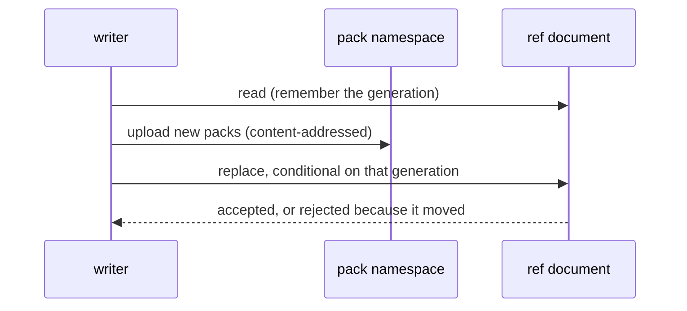

# Design: sheaf — git over object storage

**Status:** draft

**Related:** [`workspace-model.md`](workspace-model.md) (the collaboration model whose workspace this would carry, and
the branch-and-append semantics an Analysis has); [`services.md`](services.md) (the store service, which holds the
workspace archive today, and how the sandbox reaches a service at all); [`agent-runtime.md`](agent-runtime.md) (the
session the sandbox runs inside).

## Overview

A Themis workspace has two writers. The agent writes into a sandbox that lives and dies with one session. The BFF — the
web tier's backend-for-frontend — writes in response to a curator's click, inside a request, with no sandbox and no
checkout. Today the workspace is an opaque tar archive, replaced whole by whoever writes it, and nothing records what a
write changed. Only the sandbox writes it. Adding the second writer to that model means each one silently overwrites the
other's work.

Git already solves this problem, and its object model fits an object store well. Git is an append-only,
content-addressed object store plus a small set of mutable pointers. GCS provides both halves: immutable keys, and
compare-and-swap on a single object via `ifGenerationMatch`. The design follows from that:

- **One document per repository holds all the mutable state** — every ref, plus the manifest of packfiles that make up
  the object database. It is only ever replaced by compare-and-swap. That one conditional write is all the concurrency
  control the data needs; there is no lease object, no advisory lock in Postgres, and no `--max-instances=1` on a git
  server.
- **Two kinds of rejection are kept distinct**, because they need different responses. A writer whose document moved but
  whose refs are untouched can replay. A writer whose ref no longer holds the value it expected has a non-fast-forward
  and needs a merge.
- **A shared, accumulating record is an append-only log**, not a mutable field. Appends commute, so a writer that loses
  the race re-appends to whatever the winner left, and no user sees a conflict.
- **History is append-only, and nothing is ever deleted.** A ref may be created or fast-forwarded, never rewritten or
  removed, and a pack once uploaded stays. Every commit ever pushed is therefore reachable from a ref for good, and a
  reflog ref, written by the same compare-and-swap as each push, records which commit was each ref's tip and when. The
  price is storage that grows with publishes; the payoff is that the one operation able to destroy data does not exist.
- **Stock git owns the wire protocol.** The agent clones and pushes with a real `git` binary against a real
  `git http-backend`. Sheaf's code in that path is a CGI bridge, a sync of the bare mirror before each request, and a
  pre-receive hook that refuses anything rewriting history or touching a protected path, writes the reflog entry, and
  turns the push into one compare-and-swap.
- **The resident set needs a ceiling checked before hydration** — decided, not yet built. Serving a request means
  building a local object database, and on Cloud Run that is memory. Running out of it is the one failure this layer
  cannot replay away, so a repository too large to serve has to be refused by the request that asked for it, before it
  can take out the instance.

The mechanism lives in [`themis/sheaf/`](../../themis/sheaf). It has no Themis domain type in it, so it can be extracted
into a package of its own if a second consumer appears.

## Background

**The two writers.** The agent runs untrusted model code inside a sandbox whose filesystem is discarded when the session
ends, so its work has to be checkpointed somewhere durable. The BFF handles a curator's click — "mark this criterion as
reviewed" — inside an HTTP request. It has no sandbox to run git in and no working tree to commit from, and standing one
up per click would be too expensive. It is also TypeScript, and sheaf is Python: the BFF never touches the store itself.
Its write has to be an rpc to a Python service holding a bare mirror and a `git` binary, in the way it already calls the
evidence service. Today sheaf runs only host-side in the sandbox worker, reached from the guest's `git` over the stream
hatch, and the store service — which holds the tar archive — is internal-ingress and unreachable from the BFF. The
natural home for the rpc is that store service with its ingress opened to IAM-gated public, as
[`services.md`](services.md) anticipates for this caller; that is a decision for the migration, not the current state.
"The BFF's write" below means that rpc, wherever it lands.

**What object storage gives.** GCS has no locks, no atomic rename, and no multi-object transaction. It has one
concurrency primitive: a write to a single object can be made conditional on that object's current generation, and the
service rejects the write if the generation has moved. Separately, writing an object under a key derived from its own
content is always safe, because a racing writer of the same key is writing the same bytes.

**What git's object model is.** A git repository is a content-addressed store of blobs, trees and commits, none of which
is ever mutated, plus a set of refs — short mutable pointers from a name to a commit id. Everything git needs a
filesystem for concerns the refs: lock files, atomic renames, directory semantics. The object half wants nothing an
object store does not already provide.

**Why a bare `git init` on a bucket is not enough.** Git's own ref update is a lock file plus a rename, and an object
store has neither. Two writers advancing the same ref through separate GCS writes would lose one update with no error.

## Non-goals

- **Not a general-purpose git host.** One repository per workspace, served on loopback to a known client, with no
  authentication of its own. Anything reaching it goes through something in front that authenticates. The set of
  repositories a server will serve is an explicit input, never inferred from the request path: with no authentication,
  that set is the only boundary between a client that can reach the server and every workspace in the store.
- **Not an authorization control.** The store authenticates nobody, and protected paths stop a specific forgery, not a
  determined holder of the credential. What it does refuse, for everyone, is rewriting or deleting history: a force-push
  is rejected by the hook with git's own wording, so the client's ordinary recovery — pull, then push — applies.
- **SHA-1 repositories only.** The bare mirror uses git's default object format, which bounds the hash a client can
  push. Git's own default has not moved, and adopting SHA-256 would be a migration in its own right.
- **Not a replacement for the versioned working document.** The working document has a linear version history and a
  promote-to-report step of its own ([`workspace-model.md`](workspace-model.md)). A git branch is the wrong shape for
  that, and nothing here changes it.
- **No implementation of git's object format.** Sheaf stores packfiles whole and never looks inside one; every pack it
  holds came out of `git pack-objects`. Reimplementing the format is how a store ends up subtly incompatible with the
  client it exists to serve.
- **No cross-repository operation.** No shared object store between workspaces, no alternates, no dedup across
  repositories. Each repository is self-contained under its own key prefix, so one workspace's storage is reachable
  without any authority over another's.

## Design

### The two namespaces

A repository occupies one key prefix, holding two kinds of object:

- **Packfiles**, under content-addressed keys. Written once, never mutated, never renamed. A pack's key is a digest of
  its bytes, so a replayed attempt that produces identical objects re-uploads to the same key instead of littering the
  namespace.
- **One ref document**, at a fixed key. It holds every ref of the repository, the list of packfiles that make up its
  object database, and which ref or object a clone should check out. It is only ever replaced by compare-and-swap
  against the generation the writer last read.

Reconstructing a repository needs this document and the packs it names, and nothing else. The intent is that these three
things are all the document ever holds: anything a later need turns up goes in a separate object that no build is
required to read, so the document stays small and its meaning stays fixed. The encoding machinery described next exists
so that a departure from that intent is safe rather than silent.

The refs and the manifest share one object because compare-and-swap is per object. Splitting refs across keys would turn
a multi-ref update into a multi-key update with no atomicity, which is the problem this design exists to avoid. The
manifest has to be in the same object for a different reason: a listing of the pack prefix cannot distinguish a live
pack from one orphaned by a lost race, so a reader needs the manifest to know what to download.

The manifest is a **set**. Packs are named by the hash of their bytes and are self-contained — no `--thin`, so no pack's
objects are deltas against a base in another pack. Together those properties make each pack a partial map from object id
to content, and any collection of packs composes into a larger one: there is no shadowing and no dependency between
packs, so order carries no information and duplicates are harmless. The one thing the manifest must do is *cover* — name
every pack needed to reach the refs and HEAD. Since packs cannot conflict with each other, coverage is the only property
that can be violated, and a manifest that fails to cover is a destroyed repository.

The ref document is a binary protobuf, chosen for one property ([`proto.md`](proto.md)): a build reading a document a
later build wrote gets the fields it does not model back out untouched. Every publish rewrites the whole document, so a
publish is a read-modify-write, and it goes through the parsed message and not a projection of it. A projection drops
what it cannot name, and an older writer would then silently delete a newer one's state. This is also why the document
has no schema-version field: a newer document is readable by construction, and an older one never stops being readable,
so there is nothing a version would let a reader refuse. Hand-rolled JSON could carry an unknown key too; what proto
buys is that one schema generates every reader, and `buf breaking` fails the build instead of trusting a hand-written
check.

Every stored document names a HEAD. That is what distinguishes a document this code wrote from an empty or truncated
encoding, both of which are otherwise valid documents naming no packs — the shape of a repository with nothing in it,
which a reader would serve as such. HEAD has the highest field number for this reason: proto emits fields in number
order, so a truncation loses HEAD before it loses the manifest, and a message field carries presence, so its absence is
detected and not inferred. The proto reserves every number above HEAD's, so the document cannot gain a field and the
argument cannot quietly stop holding.

The storage seam is narrow on purpose: read and conditionally write one mutable key, and put, get and list
content-addressed objects — there is no delete, because nothing deletes. That is small enough to implement over a local
directory, which is how the concurrency protocol is tested with no network and no credentials. A bug in the protocol
then shows up as a protocol bug, not as a cloud-client bug.

### HEAD is in the document, not in the refs

A ref maps a name to an object id. HEAD maps a name to a *ref name* (a symbolic ref) or, when detached, to an object id.
It is a different type in a different namespace, and it is advertised differently on the wire. Storing it in the refs
map would also fail quietly: git's ordinary ref update dereferences a symref, so writing HEAD that way overwrites
whichever branch HEAD points at.

A symbolic HEAD names a valid ref name, which need not currently resolve. HEAD on a branch with no commits is git's own
state after `init`; `switch --orphan` re-enters it; and protocol v2 carries it explicitly so that a clone of an *empty*
repository still checks out the intended branch name. Requiring HEAD to resolve would forbid the state every repository
starts in, and that is exactly the case where there is no branch for a mirror to infer a default from.

Recording HEAD removes a guess that would otherwise be re-made on every hydrate. `git init --bare` takes HEAD from the
host's `init.defaultBranch`, so a mirror built on a machine defaulting to `master` advertises a HEAD pointing at
nothing, and a client clones the refs, checks out an empty tree, and reports no error. What the document cannot remove
is the *first* choice: nothing on a push says which ref the client considers primary, so a repository's first publish
picks from the refs it creates. The pick is made once and recorded, instead of being re-derived by whatever build
happens to be running, with two builds free to disagree about one repository.

### Publishing

Every write, from either writer, has the same shape.

A rejection of the replace is replayed by a writer that derives its intent from the snapshot, and reported to one that
cannot — the next two sections cover which is which. The conditional replace is the only point where writers are ordered
against each other, and it is one object-store call. Anything else that serialises — a server holding a lock while it
refreshes its own cache — is protecting a cache, not the data.

Objects always go up before the ref document names them. A ref pointing at an object nobody can fetch is corruption; a
pack nobody names is litter, and litter is inert. That asymmetry is why the ordering is fixed, and why litter is a
design consequence and not a bug: unlike git's push quarantine, an upload to object storage cannot be cheaply rolled
back, so nothing tries.

### A lost race is not a conflict

Two rejections are possible. Conflating them is how a system either loses data or asks a user to resolve something it
could have handled itself:

- **The ref document moved, but the refs this writer is touching still hold what it expected.** Somebody else committed
  something unrelated. Re-read, rebuild the intent against the new state, publish again. Nobody is told anything.
- **A ref no longer holds the value the writer expected.** This is git's non-fast-forward. Retrying would clobber
  whatever landed, so it surfaces to whoever is pushing, who merges or rebases.

The distinction is what makes the coarse, one-document compare-and-swap acceptable. Two writers touching disjoint refs
contend on the document, but the loser's replay always succeeds, so contention costs a round trip and not a failure. The
retry budget bounds the replay. Exhausting it means the writer was starved by sustained contention, which is a real
condition and is reported as one.

A writer that derives its whole intent from the snapshot it was handed can never see the second case. That is why
publishing takes a builder — re-invoked on every attempt against whichever state won — and not an expected old value.

### Appends commute

The BFF edits the workspace on a human's behalf, and some of what it writes is a record that accumulates: an assertion
that a criterion has been assessed, a comment asking for rework. Modelled as a mutable field in a document, two writers
racing means one write is lost or a user is shown a merge. Modelled as a line appended to a log, the loser re-reads the
winner's log and appends again. The result is the same set of lines either way, with no conflict and no dependence on an
agent being alive for the write to land. Whether review state in particular becomes such a file is an open question
below; what this section fixes is the shape any shared, accumulating file has to take.

Commuting has to hold for the *agent's* merges as well, not only for the store's compare-and-swap. Where the agent's
clone and the BFF have both appended to one log, git's default textual merge produces a conflict in the middle of the
agent's turn. Git's built-in `union` merge driver keeps both sides instead. Because it is built in, marking the log
files for it in the repository's own attributes configures both ends at once.

A write the BFF makes on a human's behalf should be authored as that human and committed as the service, so history
distinguishes who decided something from what wrote it down. That writer is not built yet; this is the contract it
inherits.

### The wire: stock git, sheaf's precondition

Getting `git-upload-pack` and `git-receive-pack` subtly wrong is the kind of mistake that surfaces as an obscure failure
in somebody's git version months later. So the agent's side is a real `git` binary talking to `git http-backend` over
loopback, and sheaf's code in that path does two things:

1. **Sync a bare mirror from the store before handing the request to git.** Once local refs match the store, a client
   pushing from an out-of-date clone fails git's own fast-forward check and gets git's own message, which is what a
   model has been trained to respond to. The fetch path syncs too. A rejected pusher's next move is a pull, and a mirror
   refreshed only on push would hand back the pusher's own stale state, so the retry loop would never converge. The
   mirror is a cache in the strict sense and never the source of truth, so syncing force-updates local refs and deletes
   refs the store no longer has.
1. **Turn the push into one compare-and-swap, in a pre-receive hook.** By the time a pre-receive hook runs, git has
   validated the incoming objects and no ref has moved. The hook refuses any update that is not a create or a
   fast-forward, writes the reflog entry for the rest, builds a pack of the new objects rooted at that entry, uploads
   it, and conditionally replaces the ref document against the generation the *client's view* was built from. Exiting
   non-zero makes git discard the quarantine and leave every ref untouched, so a refusal cannot leave the mirror
   disagreeing with the store. It is `pre-receive` and not `update` because `pre-receive` sees the whole push at once,
   so a multi-ref push maps onto a single compare-and-swap and is atomic in the same way the store is.

The client's fast-forward check does the rejecting in the common case, and `--force` is the instruction to skip it. The
hook's own check is what holds then, and it has to be the hook's: receive-pack's `denyNonFastForwards` and `denyDeletes`
run *after* the pre-receive hook and cover branches only, so a server relying on them would publish the rewrite before
git refused it, and would let a tag be moved or deleted. The hook also meets the narrow race where something landed
between the sync and the swap.

Incoming objects are validated by git, not by the hook. That validation is off by default in receive-pack, and the
default is wrong here: the hook is host-side code holding the store credential, and it walks a pack the sandbox
composed. With validation on, receive-pack refuses a malformed object before the hook is invoked at all.

### The reflog ref says what was current

Fast-forward-only history keeps every commit reachable, but it does not say which commits were ever a ref's tip: a push
of three commits moves the tip once, and afterwards the three look alike. The reflog ref records that. Each publish that
moves a ref writes one commit under `refs/sheaf/reflog`, parented on the previous reflog commit and on every tip the
publish set, with the transitions in its message. It rides in the same compare-and-swap as the refs it describes, so the
two cannot disagree, and it is an ordinary ref over ordinary commits, so `repack -a -d` keeps everything it reaches and
a clone can fetch it by name. A default clone does not: git's clone refspec covers `refs/heads/*`, so the agent sees the
reflog only if it asks for `refs/sheaf/*`, and its ordinary `push` never touches it. A `push --mirror` would try to
delete it and is refused whole.

Two things follow. Any question of the form "what did this ref point at when" is answered from the repository itself,
with no dependence on what the bucket retains. And because nothing is deleted, the answer is always hydratable: the
commit the reflog names is in a pack the store still holds.

The chain is sheaf's own from tip to root, and that is enforced at both ends. On a repository's first publish the writer
lays down a parentless root entry and parents the first real entry on it, so a reader walking first parents ends on a
commit sheaf wrote and never runs on into the pushed history — which the pushing side controls, and could shape to look
like an entry. A push may not write under the namespace, since a fast-forward of the reflog ref would be a forgery. And
the store refuses any publish that moves a ref without advancing the reflog ref alongside it: presence is checkable
without objects, and it is the mistake a second writer would otherwise make silently. What the store cannot check — that
the entry's parents are the new tips — stays the writer's contract, like fast-forwardness.

### The mirror knows what it holds without being told

The mirror is refreshed before every request, so it has to answer one question cheaply: which of the packs the store
names does it already have? Re-downloading the repository each time is out, and the packs' local filenames are no help,
because git indexes a pack under a name derived from its own checksum and not under the store's.

The obvious answer is to write down what was fetched. That creates a second account of what the object database
contains, and the two can disagree without anything noticing: a repack consolidates the mirror's packs into one and
deletes the files it consolidated, so a note reading "I have that pack" outlives the file it describes, and nothing
rechecks a note.

So the record is not a note about the pack; it *is* the pack. Each marker is a second hard link to the file git indexed,
under the store's name for it. Git copies a pack in byte for byte and only renames it, so one set of bytes carries both
names, and the link count answers the question: two names means git still has its own copy, one means a repack dropped
it. The mirror answers by looking at the object database, not at a record of it, so there is nothing to keep in step and
nothing that can drift. The general principle: where a fact about local state can be derived, derive it.

Holding the pack open is also what makes a lost compaction race cheap. The manifest still names the packs the repack
consolidated, and their bytes are still on disk under the marker links, so the next sync re-indexes them from disk
instead of fetching them again. The markers are dropped only once the compaction has won. Mechanism:
[`themis/sheaf/wire/bare.py`](../../themis/sheaf/wire/bare.py).

### Protecting what the agent must not write

Some of the workspace is not the agent's to write: a context document the user supplied for the agent to consult, or a
record of human judgement, should review state ever land in the workspace as a file. Everything inside the sandbox
belongs to the agent — the working tree, the commit message, the author and committer lines — so a commit claiming a
human wrote it costs nothing to forge, and an identity check made inside the sandbox proves nothing. The pre-receive
hook is the only place the distinction between writers can be drawn: it runs outside the sandbox, sees the whole push,
and runs before any ref moves.

The check is what each commit introduces at a protected path, compared against *all* parents and not only the first. A
merge that takes the other writer's edit verbatim introduces nothing and must pass, or the agent can never merge; an
"evil merge" that alters the file while resolving introduces it and must not pass. On its own this would not be enough —
the protected file need never be written at all if the commit that wrote it can be rebased away and force-pushed — but
that route is closed for every ref by the append-only rule above, not opened per protected path.

The threat being defended against is fabrication — the agent authoring or altering content it has no standing over — not
loss. It defends nothing against anyone holding the BFF's own credentials; protected content is trustworthy exactly as
far as the service that writes it is.

The protected patterns come from the process environment, never from a file in the repository, because a tracked config
file would be editable in the same push it is meant to constrain. Protection is opt-in and lives in the wire layer; the
storage layer has no opinion about paths.

### Living with append-only

Two things follow from a store that only grows: many small packs, and a bill.

**Compaction** rolls many small packs into one. The cost of not doing it lands in three places: one request per pack on
a cold hydrate, one index build per pack after that, and the manifest itself. The manifest lives in the ref document and
is rewritten on *every* write, so past a certain point most of what a curator's click uploads is bookkeeping. The
trigger is the ratio of loose packs to the largest one, not a plain count. Compaction costs O(repository), so a fixed
count that is generous on a small workspace is ruinous on a large one, while a ratio bounds write amplification however
long the history gets. A count cap exists only so that a long run of tiny appends cannot inflate the manifest while
staying under the ratio.

**Nothing is deleted.** Compaction leaves the packs it supersedes where they are; a lost race leaves the pack it
uploaded. Both are inert — no manifest names them, so no reader asks for them — and they are the whole of what the store
accumulates beyond its live set. A meter reports them, by count and by byte, so the bill is visible before it matters.

The alternative is a sweep, and the reason there is none is not that one would be hard to write but that one is hard to
make safe. A pack has to be uploaded before the compare-and-swap that names it, so at any instant a pack no manifest
names is either abandoned or about to be named, and the two are indistinguishable from the outside. Telling them apart
without waiting needs a conditional spanning the pack and the document, which object storage does not offer; waiting
means a grace window, whose value is a prediction about how slow a publish can be; and either way every reader has to
tolerate a pack vanishing under it. Three adversarial reviews of a grace-window sweep each found a way to lose a pack
the manifest named. The machinery to close each hole existed, and the sum of it was most of the storage layer's
complexity, bought to reclaim bytes nothing reads.

What the bytes cost: storage linear in the number of compactions, in units of repository size, since each one leaves a
copy of the repository behind. For a hundred active workspaces after a year that is tens of dollars a month at Standard
prices, and a tenth of that once Autoclass has moved the orphans to Archive — small append packs stay in Standard, being
under Autoclass's threshold, and they are small. Should it ever matter, the safe sweep is of *archived* analyses only,
where no writer exists to race, and that wants a lock rather than a grace window.

### Hydration has no ceiling, and Cloud Run is where that bites

Everything above is about the store. What decides whether the design is deployable is the other end: how much of a
repository has to be resident to serve one request, and who pays when it does not fit.

Both writers land on Cloud Run. The agent's mirror lives in the sandbox and dies with it. The BFF's write is an rpc the
store service serves inside a request, and both of the ways it could build objects — git plumbing against a bare
repository, or a git library — need a local object database hydrated from the store first. Cloud Run's filesystem is
in-memory unless a volume says otherwise, so a mirror is resident bytes, and packs are fetched whole before they are
indexed. Instances serve many requests at once: our store service takes the platform default concurrency and runs on one
vCPU and 2 GiB.

The store service already reasons this way about the archive it holds today, and caps it, so a runaway workspace fails
its own request instead of exhausting the instance. Hydration has no equivalent cap. Resident bytes are the repository's
whole history, and [compaction](#living-with-append-only) bounds how many packs that history is spread across, not how
large it is. So the blast radius of the largest workspace is the instance, and the instance is everyone else's requests
too.

**A ceiling checked before hydration turns that into an ordinary failure.** The manifest names every pack and the
backend can size them, so a repository too large to serve can be refused whole, by the one request that asked for it,
before a byte is fetched. That holds whichever deployment knob is also chosen — a mounted volume with a size limit (the
store stays the source of truth, so this is not the persistent-disk git server
[rejected below](#alternatives-considered)), a pinned request concurrency, or simply a stated and monitored ceiling.
Which of those to reach for is [open](#open-questions); leaving the resident set unbounded is not.

The failure it prevents is one this layer otherwise cannot hide. [A lost race](#a-lost-race-is-not-a-conflict) is
retryable because replaying it against the winning state succeeds. An instance killed for exhausting memory is not,
because replaying the same hydration fails the same way. So a client's part here is a bounded retry that eventually
reports, not the unconditional replay the store's contract otherwise promises, and a caller that cannot tell the two
apart will spend its whole budget on the one that cannot succeed.

### Consequences

- **Every past state is hydratable.** With object versioning on the bucket, every accepted transition is a retained
  noncurrent generation of the document, and because no pack is ever deleted, each of those generations names packs the
  store still holds: any past ref state can be checked out. The reflog ref answers the same question from inside the
  repository, so versioning is a convenience for an operator with bucket access and not something the design depends on.
- **Bucket configuration is a cost question, with one exception.** Nothing here needs object versioning, retained
  noncurrent generations or soft delete, and nothing here deletes, so no lifecycle rule is needed to reclaim anything.
  The exception is an age-based delete rule, and it is fatal: packs are written once and never touched, so a rule that
  reasons about age deletes a long-lived repository's base pack while the manifest still names it. Autoclass with
  Archive as the terminal class is the right shape for what does accumulate — orphaned packs are never read, so they
  should sink.
- **A malformed ref name is unrecoverable through the normal path**, so names and object ids are validated at publish
  and not on read. Refs are fed to git as whitespace-delimited, newline-terminated input, so a name containing a space
  makes every later sync of that repository fail. The only way out is to compare-and-swap the bad entry back out of the
  document.
- **Generations are opaque.** A GCS generation is a microsecond timestamp, neither dense nor ordered in any way a caller
  may rely on. Nothing in this design compares two, and nothing needs a dense sequence: how many transitions happened is
  answered by counting the retained ones.
- **Hydration is the per-session cost.** The mirror dies with the session, so every session reads the ref document and
  fetches the packs it names. That is latency-bound and not bandwidth-bound, so it is done concurrently, one task per
  pack.

## Alternatives considered

**Keep the tar archive, add last-write-wins.** The status quo, made explicit. Rejected because the loss is silent:
nothing raises, nothing logs, and a curator's mark simply is not there. It also gives no history, so there is no way to
answer what changed or who changed it.

**A conventional git server behind a lease.** Run `git http-backend` over HTTPS against a persistent disk, and serialise
writers with an advisory lock in Cloud SQL, a lease object, or by pinning the service to a single instance. Rejected on
operational cost for no gain: it adds a stateful component, a lock whose expiry is a new failure mode, and a scaling
ceiling, all to reconstruct a guarantee that one conditional object write already provides. The lease is also weaker. A
lease can be lost while its holder still believes it holds it; a generation precondition is checked at the moment of the
write.

**One object per ref.** The natural mapping on its face, and it makes a single-ref update atomic. Rejected because a
push that moves two refs becomes two independent writes with no atomicity between them, and there is no way to recover a
consistent view if the second fails. It also leaves the pack manifest homeless.

**A typed RPC for each workspace operation, instead of git.** Themis already has a service pattern, so a
`CommitFile`-shaped API is the obvious thing to reach for. Rejected because the agent is a model that knows git well: it
clones, commits, pushes, reads git's rejection message, and pulls and retries without being taught any of it. A bespoke
API means teaching every one of those behaviours and owning the merge semantics. Git also gives history, blame, diffs
and merges that nobody has to implement.

**A sweep with a grace window.** Reclaim a pack once it has gone unreferenced for longer than any publish could take,
deleting conditionally on the object's generation so a re-upload in flight is protected. Rejected after building it: the
grace value is a prediction rather than a property, the design forced every reader to tolerate a pack vanishing
mid-fetch and to re-read the document to tell timing from damage, the backend seam grew a conditional delete the GCS
emulator does not enforce, and three adversarial passes each found an interleaving that deleted a live pack. What it
would have reclaimed is bytes nothing reads. The analysis is kept above so it is not repeated.

**A per-repository lock in Postgres.** Serialise writers and the sweep with a session-level advisory lock, keeping the
conditional writes as fences. Removes the timing argument, and Postgres is already a dependency of the BFF. Rejected
because it is a coordination service for the one operation that turned out not to need one: with nothing deleted, every
writer that remains is already serialised by the document's compare-and-swap, and the lock would put a Cloud SQL
dependency into the sandbox worker for no property the store lacks. The same holds for ZooKeeper, etcd or Consul in that
role.

**Refuse rewrites with `receive.denyNonFastForwards` and `receive.denyDeletes`.** The server-side settings for exactly
this. Rejected as the mechanism because receive-pack applies them after the pre-receive hook has run, and only to
branches: the hook would have published the rewrite before git refused it, and a tag could still be moved or deleted.
The hook checks ancestry itself, for every ref; setting the two options as well would change nothing.

**Reach into git's push quarantine for the objects to upload.** Cheaper than re-deriving the pack. Rejected because the
quarantine's contents depend on git's own configuration for when to explode a small push into loose objects, in which
case there is no pack to upload at all. Asking git to build a self-contained pack from the pushed tips, excluding what
the mirror already had, is independent of that.

## Open questions

- **Whether review state lives in the workspace at all.** Nothing here fixes review marks as files in the workspace.
  What the layer supplies is the two properties such a file would need — commuting appends for a log both writers touch,
  and a path the agent cannot write — and each stands on its own: a context document the user supplies for the agent to
  consult needs only the second. Whether review state becomes such a file, or lives outside the workspace entirely, is a
  collaboration-model decision ([`workspace-model.md`](workspace-model.md)), not a storage one.
- **What bounds the resident set, and where the mirror lives.** A ceiling checked before hydration is settled
  [above](#hydration-has-no-ceiling-and-cloud-run-is-where-that-bites); its value is not, and neither is what else
  carries the bound — a size-limited volume, a pinned request concurrency, or the platform defaults with the ceiling
  alone. The same choice decides whether the mirror can be warm across requests instead of rebuilt per session, which
  trades coherence for latency. All of it wants a measured workspace-size distribution, and the archive's own cap is the
  closest thing to prior art.
- **Who runs compaction, and when.** It is a library function with no scheduler behind it. On the publish path, a
  periodic job, or a maintenance rpc are all plausible; the repo has no scheduled-job pattern to inherit, and a service
  running with idle CPU rules out a background thread.
- **Whether storage growth ever warrants a sweep of archived analyses.** The bill is small and visible; if it stops
  being small, the safe sweep is over repositories with no writer, under a lock, and is a separate design.
- **How the agent's `git` reaches the store.** It runs inside a sandbox with no network, so the route is postern's
  stream hatch: a socket bound into the guest, spliced host-side to `git upload-pack` or `git receive-pack` against the
  mirror after a sync — git's native protocol over an `ext::` remote, no HTTP in the path. The socket is the capability:
  the guest's connector sends no repository and no service name, so nothing host-side parses one, and read-only access
  is a socket pair with the receive half unbound. The hook and the compare-and-swap are unchanged, since receive-pack
  runs the hook whatever the transport; `git http-backend` stays for a writer that is not sandboxed. postern 0.4.0
  supplies the hatch; the wiring is the deferred sandbox work.
- **Whether an Analysis's branch tree maps onto git refs.** [`workspace-model.md`](workspace-model.md) gives an Analysis
  a tree of immutable turns with branching. Git refs could carry that, but nothing here has been designed against those
  semantics, and the working document's linear versioning deliberately stays where it is.

## Implementation state

The storage protocol, the wire layer, compaction and the orphan meter live under [`themis/sheaf/`](../../themis/sheaf)
with their own tests, and **nothing in Themis imports it yet**. That is deliberate. The pieces carry unrelated risk: the
storage protocol is subtle and is best landed under test on its own, while switching the workspace store over touches
the sandbox, the store service and the deploy.

The BFF's side of the write path is deferred with it. What that writer needs from the store is present and under test —
a builder-shaped publish that replays a lost race, and the reflog entry that rides with it, both exercised by the test
fixture's writer — but the store-service rpc that turns a curator's click into a commit is not built, and nothing calls
it. Two ways to supply it remain open: drive git's plumbing against a bare repository with no working tree, or hand the
object-building to a git library; either lives in the store service, whose image would need `git`. That choice is best
made against a real caller. The author-as-user, commit-as-service convention above is likewise a contract for that rpc,
not something any production code does today.

The pre-hydration ceiling is decided and not built: nothing sizes a repository before fetching it. The `union` merge
attribute for append-only logs is set by the test fixture only.

The objects the tests assert on are built by a git binary, never by sheaf. Sheaf exists to interoperate with git, so its
fixtures have to be an independent oracle. A suite whose data came from sheaf's own writer would show only that sheaf
round-trips its own output, and a defect shared between the writing and reading halves would be invisible to it. So
`git` is a hard requirement of the suite: if it is absent the suite fails, because a compare-and-swap proof that
silently did not run reports as a pass.

Until the route named in the open question above exists, the workspace remains the tar archive the store service holds,
and [`workspace-model.md`](workspace-model.md) describes the live system.
