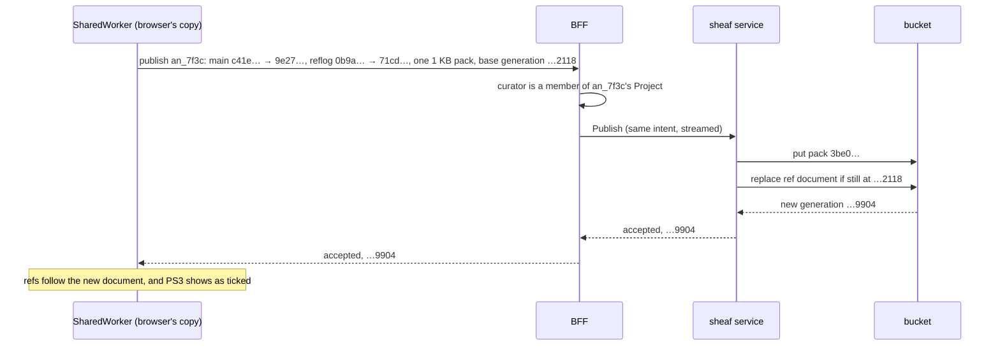

# Design: the workspace in the workbench

**Related:** [`sheaf.md`](sheaf.md) (the repository format, and the hook the agent's pushes pass);
[`sheaf-service.md`](sheaf-service.md) (the rpcs that read and publish a repository);
[`sandbox-worker.md`](sandbox-worker.md) (the agent's side, whose mirror this design copies);
[`document-widgets.md`](document-widgets.md) (the typed assets a widget draws); [`document-pane.md`](document-pane.md)
(the pane that renders a revision, and its windows); [`workspace-model.md`](workspace-model.md) (the working document
and the Project boundary); [`rpc-authorization.md`](rpc-authorization.md) (how a call names the Analysis it acts on).

## Overview

An Analysis's workspace is a git repository kept in object storage. Two parties change it. The agent commits and pushes
with a real `git` inside its sandbox. A curator changes it from the workbench, for now only by changing the state a
widget shows, such as ticking an item of a checklist. This doc decides how the workbench reads the repository and how a
curator's change becomes a commit in it.

No server holds a readable copy of the repository. The service in front of the bucket moves whole packfiles and one
small document, and the only git database is the one the sandbox worker builds for its session. So the workbench needs a
copy of its own, and this design puts it in the browser. The browser builds that copy from the same packfiles the worker
downloads and reads every revision from it. A server-side copy would have cost memory per open workspace and a `git`
binary in a service that holds no git objects and ships none, and every read would have waited on it.

With the repository in the browser, a curator's edit becomes the same act as the agent's. The browser builds a commit on
the revision the curator was looking at and publishes it with the storage protocol's compare-and-swap. The BFF relays
the publish after checking that the curator belongs to the Analysis's Project. If the agent pushed in the meantime, the
browser rebases the curator's commit onto the agent's, with a whole file as the unit of conflict: the new commit is the
agent's tree with the curator's files in place of the old ones. If the agent's push changed one of those files, the
browser refuses the rebase, and the curator redoes the change on what the agent left.

The browser is trusted as the sandbox worker is: no server checks the objects it publishes. The agent is the one writer
that is checked: a hook outside its sandbox checks every push, and among its rules is that the agent's commits carry
only the agent's name. The cost of the design is that every curator's browser holds the whole workspace, history and the
agent's working files included. Once the pane reads from that copy, the store service has nothing left to serve. It
retires with both of its buckets, and sheaf's repositories move to a bucket of their own.

## Background

The storage format is sheaf ([`sheaf.md`](sheaf.md)). A git repository is a set of objects (file contents, directory
listings, commits) plus a few named pointers to commits, called refs. Sheaf stores the objects in packfiles, each under
a key derived from its own bytes. It stores every ref, with the list of packfiles, in one small **ref document**. Here
is a workspace after two pushes from the agent:

```
the Analysis's repository in sheaf's bucket
  ref document      generation 1727163041502118
    refs/heads/main    → c41e…    the working document's branch
    refs/sheaf/reflog  → 0b9a…    one entry per publish: which tip each ref had, and when
    packs              5d2f…, a817…
  pack 5d2f…   1.9 MB   objects of the agent's first push
  pack a817…   14 KB    objects of its second push
```

A write uploads its new pack, then replaces the ref document on the condition that the document is still at the
generation the writer read. That condition is all the concurrency control there is. Writers only move refs forward, and
nothing is deleted, so every revision that was ever a tip stays readable, and the reflog ref records when each was
current.

A publish can lose a race in two ways, and the storage protocol tells them apart. `ABORTED` means someone else published
first but moved none of the branches this publish moves. Of the refs this publish moves, only sheaf's reflog ref has
changed. Rebuilding the same change against the new document lands it. `FAILED_PRECONDITION` means a ref this publish
moves has itself moved. That is git's non-fast-forward, and the writer has to redo its change on the new tip.

The sheaf service ([`sheaf-service.md`](sheaf-service.md)) is the one account with access to the bucket. The worker uses
three of its rpcs: read the ref document, fetch a pack, and publish. The service holds no git objects and parses none,
so it checks only what the document shows: that names are well formed, that no ref is deleted, and that the reflog ref
moves with every publish. What needs objects is the writer's job. The writer must only move a ref forward, write a
correct reflog entry, and upload every object the new tips reach.

The agent's side shows the pattern this design follows. The sandbox holds two copies of the repository. The guest's
clone belongs to the agent, and the model's code controls it completely. The sandbox worker keeps a second, bare copy on
the host, in the one trusted process ([`sandbox-worker.md`](sandbox-worker.md)). The worker builds that copy through the
first two rpcs. A pre-receive hook in it checks every push the agent makes, then publishes it through the third. The
worker's copy is where the untrusted writer's pushes are checked, out of that writer's reach.

The curator's side has no such split. It rests on a trust model, which the rest of the doc relies on. Curators are
members of their Project who act in good faith. The browser is trusted as the worker is: it meets the writer's contract
by its own construction and tests, and no server checks the objects it publishes. Why no such check is needed is argued
with the browser's write path (§"A curator's edit is a local commit, published with the store's compare-and-swap"). The
write path adds no defence of its own against injected script, because a script running in the page could do anything
the curator can, whichever write path it used. Keeping script off the page is the renderer's job everywhere in the
workbench, which renders text the agent wrote, text the agent may have copied from a hostile page
([`agent-output-rendering.md`](agent-output-rendering.md)).

Some constraints come from elsewhere:

- The BFF is the one place that checks Project membership. It answers a non-member as if the Analysis did not exist
  ([`workspace-model.md`](workspace-model.md) §Authorization).
- A browser can receive a streamed response but cannot stream a request, so a client-streaming rpc such as `Publish` has
  to reach the BFF as one message.
- A widget whose asset is missing or malformed draws a placeholder, and the rest of the document renders
  ([`document-widgets.md`](document-widgets.md) §"Drawability is checked where the file is, and tolerated where it is
  shown").

## Non-goals

- **Comments on the document.** Widget interactions come first, because each is a typed change to a typed asset. Where
  comments live is an open question.
- **Merging.** A curator's edit lands on the revision it was built on, or on the new tip with the curator's files
  swapped in, while the agent has left those files unchanged. Nothing reconciles two versions of a file's bytes.
- **An interface for the agent.** The agent reaches the repository with `git` through its sandbox; nothing here is
  exposed inside the sandbox.

## Design

### One widget edit, end to end

A curator is reading the working document at commit `c41e…`. Its checklist of criteria is drawn from
`assets/review.binpb`, a serialized protobuf message of a few hundred bytes
([`document-widgets.md`](document-widgets.md) §"One widget, end to end"). The curator ticks PS3.

```
 Curator checks                                                 c41e…
   [✓] PS3  Functional studies support a damaging effect   saving…
   [ ] PM2  Absent from population controls
```

The widget reads the asset at `c41e…`, decodes it, sets PS3's `checked` field and encodes it again. It hands the
SharedWorker that owns the browser's copy the new file and the commit it was drawn from. The SharedWorker writes the new
file, the two directory listings above it, a commit `9e27…` whose parent is `c41e…`, authored as the curator, and a
reflog entry. It packs exactly those five objects, about 1 KB, and sends them to the BFF with the generation of the ref
document it built against.



The checkbox shows the new state from the click, marked as saving, so the curator waits only for the confirmation. A
curator need not wait for one tick to save before making the next: each shows at once, and the SharedWorker publishes
them in order. Each is built on the commit the previous publish produced. The widget compares the item there with the
item the curator ticked by its label and citation, not by its tick. When they match, the new file comes from the asset
at that commit, so a second tick keeps the first, and so does unticking an item ticked a moment before. When they
differ, the item changed in between, and the tick is built on the commit it was drawn at instead. Its publish then meets
a checklist that differs from the one it was drawn from and is refused, as §"A curator's edit is rebased onto the tip,
file by file" describes, so the curator redoes that tick and no earlier one is lost. Batching edits into a periodic save
would pay off only if the number of commits became a cost, which edits made by hand are unlikely to reach.

Had the agent pushed `d8f0…`, a commit that rewrote a paragraph of the working document, between the page load and the
click, the service would have answered `FAILED_PRECONDITION`. The SharedWorker would then download the agent's new pack,
find the checklist unchanged, build a new commit on `d8f0…` with the curator's file in place of the old one, and publish
again. The sections below take these steps one at a time.

### Versions are the branch's history

The working document is `working_document.md` at the tip of the collaborative branch, and the workbench shows that tip.
The obvious alternative is an explicit publishing step: the agent marks some commits as versions, and the pane shows the
last one marked. That keeps unfinished states out of a curator's view. It breaks on a curator's own edit, which lands on
the tip: the pane would go on showing the last marked version, and the curator's change would stay unseen until the
agent marked another.

So every push and every curator publish is a version, and a curator watching mid-session sees states the agent has not
finished. For example, the document may name `assets/pedigree.binpb` a minute before the agent writes it. The renderer
draws a placeholder naming the missing file and renders the rest. The linter in the sandbox applies the same rules while
the agent still holds the file and can fix it.

The workbench poll carries the branch's tip, which the BFF reads from the ref document on every tick. The tip is in one
of four states: a commit, no commit yet, unavailable when the ref document could not be read on that tick, or damaged
when the stored document does not parse. A window whose rendered commit differs from the tip brings the copy up to date
and renders the new tip. When the tip is unavailable, the pane says that the workspace is unavailable and keeps what it
shows, and the conversation's events keep arriving. Damage gets a state apart from an outage because a later tick does
not repair it, so the pane says the workspace is damaged rather than asking the curator to wait. A failed read gets a
state of its own because both alternatives cost something: reporting the tip as absent would be a silent wrong answer,
and failing the whole poll would let a sheaf outage stop the conversation too.

The version picker lists each tip the reflog recorded for the branch, newest first, timed by its reflog entry. A push of
three commits moves the tip once, so it shows as one version, the state a reader could have seen. Its time comes from a
record only trusted writers write, not from commit dates, which every writer chooses. Listing versions, opening an older
one and comparing two are reads of the browser's copy and cost no request.

### The browser keeps its own copy of the repository

The obvious design reads through a server. The sheaf service would keep a copy of each repository, return "the document
at this commit, with every file it names" to the pane, and commit the curator's changed file itself. That keeps the
agent's scripts and intermediate files on the backend, and the browser would hold only what it renders. It breaks on
cost, on coupling and on download size:

- The sheaf service holds no git objects. A copy per repository would bring memory per open workspace, a `git` in its
  image, and a choice between keeping each copy warm and rebuilding it per request, on the path of every uncached read
  and every edit.
- Returning "every file the document names" means parsing the document. That puts working-document rules into a generic
  git service, with a second markdown walker beside the renderer's that can disagree with it about what the document
  references.
- The read's unit is a file at a commit, so after the one-field edit above the pane would download the document and
  every asset again, 193 KB for a document with a figure and three assets, because every file now sits under the new
  commit.

So the browser keeps the copy. One SharedWorker per origin owns every copy the browser holds: a bare repository per
Analysis, kept by isomorphic-git in IndexedDB through its companion filesystem, LightningFS. Both libraries are
MIT-licensed. The main window and its mirror windows ([`document-pane.md`](document-pane.md) §Windows) ask the
SharedWorker for what they draw.

Bringing a copy up to date, called hydrating it, follows the worker's steps:

1. Read the ref document, through the BFF.
1. Ask for signed URLs to the packs the document lists that the copy lacks. The sheaf service returns each pack's size
   with its URL.
1. Download each pack from the bucket, check its SHA-256 against the id it was listed under, so that a truncated or
   altered download fails before it is indexed, and index it. Check that the index holds as many objects as the pack's
   header declares, because isomorphic-git skips an object it cannot resolve without saying so.
1. Flush the copy's storage, then set its refs to exactly what the document says (§"Keeping the copy consistent").

```
IndexedDB, one database per Analysis
  an_7f3c   2.1 MB   last read 25 Sep, 10:14
    objects/pack/  5d2f….pack  a817….pack  3be0….pack  (and an index for each)
    refs/heads/main          9e27…    as the ref document says
    refs/sheaf/reflog        71cd…    as the ref document says
    pending                  none     a curator's commit waiting on its publish
  an_02b1   0.4 MB   last read 19 Sep, 16:02
```

A revision is read from the copy. The renderer asks for the document at a commit, then for each file as it draws the
directive that names it, so what is read is what is drawn. Every other file is in the copy too, which makes history
features cheap to add: a comparison of two versions or a view of who changed a file is a git read with no interface of
its own. The price is the first open, which downloads the workspace's whole history, and the residence described under
§"Where things are stored".

### The copy is a cache

The copy's refs say only what the ref document said, and losing the copy to eviction or a cleared browser costs a
download. A curator's commit waiting on its publish is the one exception: it sits on a local-only ref, and the pane
never shows it as a version.

Compaction rolls a repository's packs into one new pack. It is sheaf's maintenance, run elsewhere, for example as a
periodic background job, like a database's vacuum. The browser never runs it, and nothing it does triggers it.

Keeping the copy a cache sets its rules:

- **Refuse a repository too large before downloading it.** The pack sizes arrive with the URLs, so a repository over the
  browser's budget is refused whole, in the same shape as the ceiling [`sheaf.md`](sheaf.md) puts in front of the
  worker's download.
- **Keep only the packs the document lists.** After each hydration the copy deletes packs the document no longer lists,
  and it measures its own size by the ones it does. A compacted repository then takes its compacted size in the browser
  too.
- **Offer to clear the cache.** A curator can clear an Analysis's copy from the pane, beside the error a failed read of
  the copy shows or from the pane's menu. The control says that it clears the browser's cache and reloads, and that
  nothing saved is lost, because the copy is only a cache. The SharedWorker waits for the Analysis's lock, deletes the
  copy whole as eviction does, and hydrates again, at the cost of one download. An edit not yet published is discarded
  with the copy, so the pane asks first when there is one.
- **Stay consistent through a killed browser and a deploy.** The copy's writes are ordered so that a browser killed at
  any point leaves refs that name only objects the copy holds, and a hydration that stopped resumes where it stopped. A
  lock per Analysis lets the SharedWorkers of two builds share the copies during a deploy. §"Keeping the copy
  consistent" gives the mechanism.

When a repository has been compacted, the copy pays one full download, because the new pack's id is one it has never
seen. A typical dev workspace is a few megabytes (§Appendix), so the browser downloads it again rather than working out
which objects it already holds. Compaction also keeps the browser's reads fast. isomorphic-git looks an object up in
each pack's index in turn, and a history read ran three times slower per commit across 21 packs than across one.

The copy costs memory as well as storage. isomorphic-git keeps every pack it has read in memory while its cache lives,
so an open workspace costs about its pack bytes. Indexing a pack costs a multiple of the history it holds, not of its
compressed size. At the measured sizes that is tens of megabytes; a history of a hundred megabytes compressed peaked
above half a gigabyte while it was indexed (§Appendix).

### The BFF relays three calls as the web tier

The browser needs three of sheaf's operations: read the ref document, get URLs for packs, and publish. It cannot call
the sheaf service itself. It holds no credential the service accepts, and the service knows nothing of Projects, because
the BFF is the one place that checks Project membership. So the BFF offers the browser three Workbench methods,
`ReadWorkspaceRefDoc`, `SignWorkspacePackUrls` and `PublishWorkspace`
([`workbench.proto`](../../schema/proto/themis/workbench/rpc/workbench.proto)), and each relays the sheaf rpc of the
same purpose. For each call the BFF checks that the curator belongs to the Analysis's Project. It then calls the sheaf
service as the web tier and names the Analysis through a session it derives for it
([`rpc-authorization.md`](rpc-authorization.md)). The sheaf contract admits the web tier on `ReadRefDoc` and `Publish`,
beside the worker, and `SignPackUrls` admits the web tier alone, since the worker streams packs through `FetchPack`.

The BFF masks upstream failures as internal errors, except the answers the browser acts on. Those are the refusals of
`Publish` (`ABORTED`, `FAILED_PRECONDITION`, `RESOURCE_EXHAUSTED` and `INVALID_ARGUMENT`), a pack the document no longer
lists when signing, and `DATA_LOSS` on any of the three. `INVALID_ARGUMENT` is relayed because the intent and the pack
are the browser's own bytes. The unlisted pack, the service's `NOT_FOUND`, reaches the browser as `FAILED_PRECONDITION`,
because on the Workbench surface `NOT_FOUND` means an Analysis outside the curator's membership. `DATA_LOSS` means the
repository itself is damaged, and the browser never retries it.

The service makes the checks every publish gets and adds none for the web tier. §"A curator's edit is a local commit,
published with the store's compare-and-swap" argues why none is needed.

### Packs come straight from the bucket, by URLs the sheaf service signs

The obvious route for pack bytes is `FetchPack`, the rpc the worker uses, relayed by the BFF. It needs nothing new. It
breaks on a first open, which downloads the whole repository: every byte would stream through the sheaf service and then
the BFF, and neither does anything with it.

The paper pane already serves bucket objects through URLs the web tier signs ([`document-pane.md`](document-pane.md)
§"Backend seam"). Reusing that breaks on what a signed URL is. It carries the signer's own permission to read, so the
web tier would need read access to every repository in sheaf's bucket, and it would have to know how sheaf lays keys
out.

So the sheaf service signs, through `SignPackUrls` in [`sheaf.proto`](../../schema/proto/themis/rpc/sheaf.proto), and
the BFF passes the URLs on. The service stays the one account with access to the bucket, and it signs only packs the
current document lists, on these terms:

- One call names at most 256 packs, because each costs the service a signing request. A first open of a long-uncompacted
  repository asks in batches.
- Anyone holding a URL can read the pack until it expires. The SharedWorker keeps URLs in memory, fetches each once and
  never navigates to one.
- Each URL comes with its expiry. A failed download is signed again rather than retried, because an expired URL's
  refusal can reach a browser as an opaque network error.
- A pack the document no longer lists, after a compaction for example, comes back as `NOT_FOUND`, relayed to the browser
  as `FAILED_PRECONDITION` (§"The BFF relays three calls as the web tier"), and the browser reads the document again.

The bucket needs a CORS rule that admits the workbench's origin. The workbench's content security policy has to admit
connections to sheaf's bucket, scoped to the bucket's path in the way the policy already scopes the bucket that serves
papers. Offline, the fixture backend serves a seeded repository's document and packs through a route on the BFF, so the
browser runs the same code in both modes.

### A curator's edit is a local commit, published with the store's compare-and-swap

The obvious interface for an edit is an rpc that takes a file's new bytes and the commit they were read at, and commits
them on the server. It gives typed refusals, and the service builds the commit. It breaks on what building a commit
needs: the directory listings along the file's path at the tip, which only a copy of the repository holds. The browser
has one and the service does not.

A `git push` from the browser, through the BFF, is the other obvious answer. It breaks because `receive-pack`, git's
receiving end, needs a full copy of the repository, so the service would hold one anyway. The hook would also have to
check the curator's identity, which paths a curator may write, and that a push is one commit on one branch. And git
reports a hook's refusal only as text.

So the browser builds the commit and publishes it with `Publish`, the rpc the worker's hook calls. It authors the commit
as the email the BFF verified for the page's request. The BFF does not check the author again, under the trust model
(§Background). The BFF takes the ref moves, the pack and the generation in one call under a size cap, checks membership,
and streams them into the service.

The browser meets the writer's side of the contract by construction. Before it commits, its write path checks that the
new payload differs from its version at the edit's base only in the fields that hold a curator's judgement
([`document-widgets.md`](document-widgets.md) §"Each writer's change is checked where it passes"). The commit's parent
is the tip it read. The reflog entry names the previous entry and the new tip, in sheaf's format, and sheaf's own reader
parses it. The pack holds exactly the new objects the commit reaches. isomorphic-git's pack writer stores every object
whole, with no deltas against objects outside the pack, which is what the store requires of every pack.

The browser writes directory listings itself. Git sorts a listing's entries by the UTF-8 bytes of their names, while
isomorphic-git's tree writer sorts them as JavaScript strings, which compare UTF-16 code units. The two orders differ
when a directory holds a name with a character outside the Basic Multilingual Plane beside one with a character near its
top, say `😀.md` beside `ｆ.md`. A listing in the wrong order fails git's own checks: `git fsck` fails on a mirror that
holds it, and a clone that validates objects refuses it. Nothing is deleted, so it would stay in the history. So every
listing the browser writes has to be byte-identical to what `git mktree` writes for the same entries, and that
comparison is the test.

Each outcome of a publish has one response:

- **Accepted.** The copy's refs follow the new document, and the pending ref goes.
- **`ABORTED`.** An unrelated publish landed first. The commit is still right, because its parent is still the tip. The
  browser rebuilds the reflog entry on the new reflog tip and packs the commit's objects again, since the lost attempt's
  pack is in the bucket but no document names it. If the copy, once up to date, shows that the branch has moved since,
  the browser answers as for `FAILED_PRECONDITION`.
- **`FAILED_PRECONDITION`.** The branch moved. The browser brings its copy up to date and checks whether its pending
  commit is reachable from the new tip. If it is, an earlier attempt landed and only its answer was lost, as when the
  agent pushed on top of the curator's commit before the browser retried, and the edit is done. Otherwise the browser
  rebuilds the commit on the new tip with the curator's files and publishes again, unless the agent changed one of those
  files. Then the edit is not applied, and the curator redoes it on the new tip (§"A curator's edit is rebased onto the
  tip, file by file").
- **`RESOURCE_EXHAUSTED` or `INVALID_ARGUMENT`.** The publish is over a ceiling or malformed, and would fail again. The
  curator is told the edit was not saved, and the widget returns to the state at the tip.
- **`DATA_LOSS`.** The repository is damaged. The browser does not retry, and the curator is told that the workspace is
  damaged and the edit was not saved.
- **No answer**, because the call timed out, the network failed or the BFF masked a fault. The outcome is unknown, so
  the browser sends the same publish again. That is safe, because a publish that already landed succeeds again, and one
  the agent has since built on comes back as `FAILED_PRECONDITION` with the commit reachable.
- **Anything else, or a spent retry budget,** is shown to the curator as an edit that was not saved.

One case is left to the curator. The intent lives in the SharedWorker, so a worker that dies mid-publish, because every
tab reloaded, takes the intent with it, and only the tip can say whether the publish landed. The widget draws what the
tip holds and tells the curator their last change may not have been saved, so they can redo it if it is missing. A
publish that did land shows up on the next poll, and the widget redraws with it.

The cost is a second implementation of the writer's contract, in TypeScript beside the hook's Python. Two server-side
safeguards against a mistake in it are obvious. The sheaf service could parse and check every object a publish carries.
Or it could refuse any publish that moves a ref backwards: the document cannot show ancestry, but the pack could, since
it holds every commit between the old tip and the new. Neither is worth building. The service's two callers are the
worker and the BFF relaying a browser, both trusted (§Background), and the agent's pushes already pass the hook, which
refuses a rewind. What a mistake that got through would cost depends on its kind. A malformed object would stay in the
history for good, because nothing is deleted. The one divergence from git's output that the comparison with git found
(§Appendix) is the order of a directory listing, and the defence is the listing writer's byte comparison with
`git mktree` above. Every other mistake is recoverable. A bug that corrupts the browser's copy wedges that copy alone,
and clearing the cache repairs it. A rewind destroys nothing: if a buggy republish moved `main` from `d8f0…` back to a
commit built on `c41e…`, `d8f0…` would stay reachable from the reflog, and the next forward move would bring it back.

### A curator's edit is rebased onto the tip, file by file

The obvious thing to send again after `FAILED_PRECONDITION` is the commit built on `c41e…`, with only the expected old
value updated. It would drop the agent's commit `d8f0…` from the branch, and with it whatever the agent changed. So the
browser rebases the curator's commit onto `d8f0…`, the tip the refusal named, much as `git rebase` would. The new
commit's parent is `d8f0…`, and its tree is `d8f0…`'s with the curator's files in place of the ones there. Suppose
`d8f0…` rewrote a paragraph of the working document and left the checklist alone. The rebased commit carries the agent's
paragraph beside the curator's tick.

git stops a rebase with a conflict when the commit being moved and the commit it moves onto changed the same lines. The
browser applies that rule to whole files. It refuses the rebase when the agent changed one of the curator's files
between `c41e…`, the commit the widget was drawn from, and `d8f0…`: a different blob or mode at that path, a file
created or deleted there, or a file where the path needs a directory. The edit is then not applied. The SharedWorker
tells the widget which file changed and at which tip, and the widget redraws from that tip and asks the curator to redo
the tick on what is now there.

Swapping the curator's file in regardless would undo whatever the agent changed in it, and merging the two versions
would put a tick where the curator never looked. Suppose `d8f0…` had rewritten PS3's citation while the curator was
ticking PS3. A merge would keep the agent's citation and the curator's tick, and the tick would then vouch for a
citation the curator never saw. The guard rule in [`document-widgets.md`](document-widgets.md) (§"A user's judgement
stands only while what it judges is unchanged") keeps every tick beside the content it was given on, because a push by
the agent that changes what a tick judges has to clear the tick. A merge in the browser would break the same property
from the curator's side.

A text format would not make a merge safe either. Written as textproto, the curator's tick and an agent's rewording of
PS3's label touch different lines:

```
c41e… (drawn)              curator's commit           d8f0… (agent)
items {                    items {                    items {
                             checked: true
  id: "PS3"                  id: "PS3"                  id: "PS3"
  label: "Functional …"      label: "Functional …"      label: "No functional …"
  citation { … }             citation { … }             citation { … }
}                          }                          }
```

So a line merge succeeds without a conflict, and its result puts the curator's tick under a label the curator never saw.

The refusal is coarser than the guard rule. Any change the agent makes to the file stops the rebase, so an agent's
change to PM2 while the curator ticks PS3 costs the curator the PS3 tick as well, and they tick it again. The rule errs
the cheap way, because a redo costs a click, whereas a tick left on unseen content is a false attestation in the record.

A merge at the level of the payload's elements would save that click. The widget would keep the curator's change as a
typed operation, "set PS3 checked", and the browser would apply it again to the asset at `d8f0…` whenever the agent's
change left PS3's protected content alone, matching elements by the same keys as the guard rule. The PS3 tick would then
land beside the agent's PM2 change. The agent's side does resolve a conflicting widget file element by element: when it
rebases onto a curator's commit, its widget helper rebuilds the file on the curator's version and carries each judgement
across where what it judges is unchanged ([`document-widgets.md`](document-widgets.md) §"Each writer's change is checked
where it passes"). There the conflict is routine, because the agent rewrites its assets as its work proceeds. In the
browser it is rare, and that is why the browser keeps the file-level refusal. Each window renders the new tip as soon as
the poll reports it, so a click meets a moved tip only when the agent pushed in the seconds before it, and the redo then
costs one click.

The widget makes the new file by decoding the asset and encoding it again, and the asset may come from a newer agent SDK
than the browser's build. Say the agent's build added a field 9 the browser's build does not know. The decode keeps
field 9 as an unknown field and the encode writes it back unchanged. protobuf-es does this by default (§Appendix), and
nothing on this path may turn it off, because doing so would delete data the agent wrote whenever a curator clicks.

### The agent's commits carry only the agent's name

Everything in the sandbox belongs to the agent, author and committer lines included, so the agent could commit as
`curator@example.org` for free. A commit under a curator's name would then read as the curator's judgement. So the hook
refuses any new commit whose author or committer is not the agent's own name and email, and any annotated tag whose
tagger is not, as the worker sets them in the guest's git configuration ([`sheaf.md`](sheaf.md) §"Protecting what the
agent must not write"). A merge that brings in a curator's existing commit passes, because that commit is not new. A
cherry-pick that copies one is refused, because the copy is a new commit under the curator's name.

Only two paths write to a repository: the worker's hook and the BFF's publish. The hook holds the agent to its own name.
The BFF's publish is reached only from a curator's browser, which authors the commit as the email the BFF verified for
the signed-in curator, under the trust model in §Background. So a curator's name on a commit means that curator made it.

The hook also keeps every commit readable by the browser. isomorphic-git refuses a directory listing that holds a name
with a backslash, such as `back\slash.md`, although git accepts one, and it would then read nothing else in that
directory. The hook refuses such a push, and the agent renames the file. [`sheaf.md`](sheaf.md) states the other shapes
the hook refuses because git and the browser would read them differently.

### Where things are stored

- **The bucket**: the packs and the ref document, as for every sheaf repository.
- **The curator's browser**: the whole repository of each Analysis the curator has opened, until it is evicted.
- **The BFF and the sheaf service**: nothing beyond the lifetime of a request.

The browser's copy holds every revision and the agent's working files, its scripts and intermediate outputs, as well as
the document and its assets. It stays after sign-out. A curator removed from a Project keeps what they downloaded until
it is evicted or they clear their browser: removal stops every later read but cannot reach the copy. This is accepted
under the trust model (§Background), and because curators' workstations are their own. If the workbench ever runs on
shared workstations, the change is a copy keyed by the signed-in identity and dropped when another identity signs in.

Neither isomorphic-git nor LightningFS expires anything, so eviction is the workbench's own. Each copy is a database of
its own. The SharedWorker records each copy's size and when it was last read, and over a byte budget it deletes the
least recently read copy whole, skipping a copy whose lock is held. The browser may also clear the origin's storage
itself, under disk pressure or, in Safari, after a week without a visit. The workbench does not ask for persistent
storage, because losing a copy costs a download.

### The store service retires, with both of its buckets

Today the store service keeps two things for an Analysis, in two buckets. The working-document bucket holds the document
as numbered versions. The worker writes one after every sandboxed command through `PutWorkingDocument`, and the BFF
reads them from the bucket for `GetDocument` and for the poll's version number. The workspace bucket holds the workspace
as a tar archive, replaced whole through `PutWorkspace`, and it is also where sheaf keeps every repository today, under
a prefix of its own.

Once the workspace is a sheaf repository, the archive has no reader. Once the document's versions are the branch's
history, a second version store could only disagree with it. Those four rpcs are the whole of the store's contract, so
the service retires with them, and both buckets go too. Sheaf moves to a bucket of its own, named for it and configured
for packs that are written once and never rewritten, so that no bucket holds two services' objects and nothing named for
the store outlives it. The retirement is additive-first ([`proto.md`](proto.md) §Schema evolution), in this order:

1. The sheaf service switches to its own bucket in one deploy.
1. The pane reads the document from the browser's copy and follows the poll's tip.
1. `GetDocument` and the poll's integer version lose their last caller and go, and with them the web tier's read access
   to the working-document bucket.
1. The worker stops writing through `PutWorkingDocument`, and the tar rpcs go as the changeover plan's last step
   ([`../plans/sheaf-changeover.md`](../plans/sheaf-changeover.md)).
1. The store service and both of its buckets are deleted.

Two steps delete history without migrating it, because what they delete is dev's alone and no production Analysis
predates the repository. Step 1 leaves dev's existing repositories behind; an Analysis whose repository is then empty is
seeded again by the worker from the store's copy of the document, which still exists then. Step 5 deletes the documents
of Analyses from before the changeover whose agent has not run since.

One property goes with the store. Its document rpcs let the worker save the document after every command, so an edit
survived an ungraceful exit up to the last command. In the repository, the document is durable once the agent commits
and the teardown push lands, and the worker makes no commits for the agent. An ungraceful exit loses what came after the
agent's last commit.

### Keeping the copy consistent

The copy's storage and its locking follow three rules, which together give the guarantee §"The copy is a cache" relies
on: refs name only objects the copy holds, whatever point a browser is killed at, and two builds never write one copy at
once.

**Flush before every ref write, a local commit's included.** LightningFS keeps its list of files in memory and saves it
half a second after the last write, while overwriting a ref reaches IndexedDB at once. A browser killed between the two
would leave `refs/heads/main` naming a commit the copy no longer has. Flushing first applies the store's own rule to the
copy: objects are durable before anything names them.

**Resume where a hydration stopped.** The SharedWorker dies when every tab of the workbench reloads. The flush-first
ordering is what makes that safe to resume from: packs already indexed stay, the refs have not moved, and the next
hydration asks only for the packs still missing.

**Hold a lock per Analysis.** Across a deploy, a tab on the old build and a tab on the new build run two different
SharedWorkers over the same databases. Every write to a copy holds a Web Lock named for its Analysis exclusively, and
every read holds it shared, so the two workers take turns as two tabs would. Eviction asks for the lock without waiting,
so it skips a copy in use in either build's worker rather than deleting it under its reader. Clearing the cache on a
curator's request waits for the lock instead, because the curator asked for that copy in particular.

## Alternatives considered

- **A commit request that carries its own proof.** The browser sends the new file with the tip's commit and the
  directory listings along the file's path. The service checks each object against the hashes it knows, builds the
  commit from those objects with git's plumbing, and publishes it. That keeps typed refusals and a service-built commit
  with no copy of the repository on any server, and it holds even against a browser that lies about the repository. It
  lost for the reasons the service checks no objects in a publish (§"A curator's edit is a local commit, published with
  the store's compare-and-swap"), and it would put object parsing and git's plumbing into a service that holds no
  objects.
- **A stored rendering: one archive per revision, written when a push lands and served by a signed URL.** The browser
  would download one object per version and never index a pack. It lost because the archive is a second copy of a tree
  git already stores immutably, a revision nobody rendered could not be shown, and the history features would still need
  the repository.
- **A curator branch that the agent merges.** Curators' commits would never race the agent's. It lost because a
  curator's edit would stay off the working document until the agent next ran, and merging a changed binary asset would
  fall to the agent.
- **Curator edits as a replicated data type that merges without coordination.** Concurrent edits would converge with no
  retry. It lost because coordination is available and cheap here, one compare-and-swap, and the writer that edits
  alongside a curator is the agent, which writes files with `git` rather than operations such a type could merge.

## Open questions

- **Which branch is the collaborative line.** `main` is the obvious choice. Whether an Analysis's branches ever map onto
  refs is [`sheaf.md`](sheaf.md)'s open question. If they do, which branch the pane shows and which a curator's edit
  lands on needs a rule.
- **The numbers.** How long a signed URL lives, the size cap on a publish, and the browser's byte budget and
  per-Analysis ceiling.
- **Whether the store keeps an index beside each pack.** git builds a self-contained pack's index from the pack alone,
  so the sheaf service could build one when a publish lands and sign its URL beside the pack's. The browser would skip
  indexing: 6 ms against 1.8 s for a 111 MB pack, with no memory peak. It is a second object per pack that no build
  needs to read, the shape [`sheaf.md`](sheaf.md) reserves for such additions, and the browser would trust the service
  for offsets isomorphic-git does not check. The measured workspace sizes do not need it yet.
- **Where comments on the prose live.** A comment anchored to a span of the document could sit inline, as a marker in
  the markdown that moves with the text when the agent edits it, carrying the whole comment or naming a thread kept in a
  file of its own. It could sit in a file beside the document, anchored by a quote, or stay in Cloud SQL, where
  [`frontend-framework.md`](frontend-framework.md) §Comments puts it today. An inline marker is the one anchor that
  survives the agent rewriting a paragraph, and also the one the agent can drop without anyone noticing.

## Appendix: measurements

These were measured in September 2026 against isomorphic-git 1.42.2, protobuf-es 2.13.0 and git 2.54.

**Workspace sizes on dev.** The dev workspaces are still mostly the store service's uncompressed tar archives, which
stand in for a workspace's content until sheaf repositories accumulate history:

| Workspaces           | Median  | 90th percentile | Largest                       |
| -------------------- | ------- | --------------- | ----------------------------- |
| 27 tar archives      | 2.0 MiB | 5.1 MiB         | 114 MiB (the next is 6.3 MiB) |
| 6 sheaf repositories | 1.2 KB  | 108 KB          | 108 KB                        |

No sheaf repository on dev has been compacted, so each holds one pack per publish, and each publish lengthens the ref
document's pack list by one entry.

**The browser as a writer.** A Node script stood in for the browser. It indexed a sheaf repository's packs with
isomorphic-git, committed a changed file as a curator, wrote the reflog entry, packed the new objects and published them
through sheaf's store. A fresh mirror then synced with a clean `git fsck --full`, a real clone showed the curator's
commit, sheaf's reflog reader parsed the browser's entries (the first-publish root entry included), and an agent push on
top of the curator's commit went through the hook. The commits and reflog entries were byte-identical to those
`git commit-tree` writes for the same inputs. Directory listings matched `git mktree` except for the ordering defect
described under §"A curator's edit is a local commit, published with the store's compare-and-swap", which the browser's
own listing writer fixes. Both lost races replayed correctly: after `ABORTED` by rebuilding the reflog entry and the
pack, after `FAILED_PRECONDITION` by rebuilding the commit on the new tip.

**Hydration in a browser.** A SharedWorker running isomorphic-git over LightningFS hydrated generated workspaces (a
markdown document edited on every commit, binary assets, images) from single self-contained packs, served locally. Times
are in milliseconds inside the worker; the peak is the ArrayBuffer memory indexing held in Chrome, measured over the
DevTools protocol.

| Engine      | Pack   | Commits | Index | First read | Warm read | History read | Commit and pack | Indexing peak |
| ----------- | ------ | ------- | ----- | ---------- | --------- | ------------ | --------------- | ------------- |
| Chrome 153  | 1.2 MB | 40      | 24    | 4          | 1         | 2            | 7               |               |
| Chrome 153  | 10 MB  | 300     | 144   | 10         | 2         | 8            | 5               | about 100 MB  |
| Chrome 153  | 116 MB | 2,500   | 1,783 | 104        | 5         | 44           | 6               | about 680 MB  |
| WebKit 26.5 | 10 MB  | 300     | 203   | 10         | 1         | 7            | 8               |               |
| WebKit 26.5 | 116 MB | 2,500   | 1,959 | 119        | 3         | 49           | 7               |               |

Firefox could not be launched in the test environment and is untested. Every pack the browser made verified clean with
git: no delta entries, indexable in an empty repository, and a clean `git fsck --strict` once added. Two pages sharing
the SharedWorker read consistently while it hydrated, and a reload and a browser restart found the copy intact with no
download. With an index built by git beside the 116 MB pack, indexing took 6 ms and the peak fell to the pack's size.

**Unknown fields.** A payload carrying two fields its schema does not know went through the widget's round trip, which
unpacks the `Any`, changes a known field, and packs it again. Both unknown fields came back unchanged. With
unknown-field reading turned off, the same round trip dropped them.
