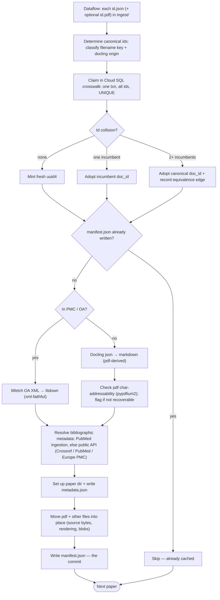

# Plan: Literature cache (S0)

**Status:** plan — concrete design settled (this doc); build pending. Seed source identified
(`gs://cpg-themis-dev-fulltext/ingest/`, copy complete). Schema authoring is **unblocked**: the TypeSpec Stage-0 rails
have landed ([`../design/typespec.md`](../design/typespec.md)), and **litfetch is prototyped** (a standalone package
with a working `.litcache/`). **Related:** design + rationale in
[`../design/literature-evidence-layer.md`](../design/literature-evidence-layer.md) §2 (cache), §2.1 (layout), §2.2
(identity), §3 (capture), §4.2 (source anchors); boundary/egress in
[`../design/spike-infrastructure.md`](../design/spike-infrastructure.md) §8; schema rails in
[`../design/typespec.md`](../design/typespec.md). This plan **decides** the buildable S0 cache; the design doc holds the
why.

## Scope

S0 = **cache storage + seed ingestion**, recording provenance. Everything that needs a user/entitlement model or query
surface is deferred.

- **In:** per-paper GCS storage; UUID identity + crosswalk; versioning + source anchors; `manifest.json` /
  `metadata.json` schemas; the seed-ingestion path; extraction of the fetch ladder into a shared `litfetch` package.
- **Out (deferred):** the gated read-tool and any entitlement enforcement ("don't worry about serving"); live
  proven-access fetch and the upload route; the durable Cloud SQL serving projection (only the crosswalk table lands
  now, §Mechanisms); KU extraction (§4), embeddings (§2.4/§4.4), collections (§5).

## Decisions

| Area                      | Decision                                                                                                                                                                                                                                                                                                                                                                                                                                                                                                                                                                                                                                                                                                           |
| ------------------------- | ------------------------------------------------------------------------------------------------------------------------------------------------------------------------------------------------------------------------------------------------------------------------------------------------------------------------------------------------------------------------------------------------------------------------------------------------------------------------------------------------------------------------------------------------------------------------------------------------------------------------------------------------------------------------------------------------------------------ |
| Storage                   | The cache lives in the existing **`gs://cpg-themis-dev-fulltext`** bucket — seed under `ingest/`, built cache under `papers/` — behind the boundary (`cpg-themis-dev`). No separate bucket; **"litcache" names the component** (writer + layout), not a bucket. Bucket policy (private; versioned with soft-delete off; Autoclass→Archive; `force_destroy` off — the "precious" tier) is **owned by Pulumi** and documented once in [`../../infra/themis_infra/storage.py`](../../infra/themis_infra/storage.py) + `infra/README.md` §Storage; not restated here. Papers are **never GCS-TTL-expired** (a logical paper spans files with differing times; eviction, if ever, is an explicit operation, not a TTL). |
| PubMed metadata           | Full PubMed metadata (baseline + dailies XML, and the exploded parquet) lives in a **separate, public bucket** (not themis-managed yet), not the cache bucket — it is unambiguously public data. Themis pulls the parquet → Cloud SQL (serving, deferred). Per-paper `metadata.json` (PubMed canonical JSON, or synthesised for non-PubMed) lives **per-paper in the cache bucket**. Cross-project SA grant for now; moving it into themis or making it requester-pays-public is a **later, staged** cleanup.                                                                                                                                                                                                      |
| Fetch ladder              | Depend on the standalone **`litfetch`** package (prototyped; wheel via the wheelhouse, dep `litdown>=0.3`): a fetch ladder of `Fetcher` backends (PMC-OA S3, Europe PMC, Elsevier OA) + demand-driven `Resolver`s + `Generator`s, modelling an article as a **file-set** of External/Derived `File`s. Themis capture/ingestion runs it with its own allowlisted egress — licensed bytes never transit the shared plane.                                                                                                                                                                                                                                                                                            |
| litfetch boundary         | **litfetch owns** identity (`ArticleIds`), the file-set model, fetching (uri + per-source credentials), source metadata + **raw licence + basis**, and `GenerationProvenance`. **litcache (consumer) owns** placement (this GCS layout + the `manifest.json` record), bibliographic `metadata.json`, and the **SPDX/policy** mapping. litfetch is **not** a bibliographic-metadata client. Mapping: External Files → `sources[]`; Derived Files (+`GenerationProvenance`) → `renderings[]`.                                                                                                                                                                                                                        |
| Identity                  | Random **uuid4** per paper = directory name. Deterministic ids rejected (preprints/supplements have no external id; late-binding).                                                                                                                                                                                                                                                                                                                                                                                                                                                                                                                                                                                 |
| Atomic mint               | **Cloud SQL crosswalk table** (in the instance themis runs anyway). Workers mint against a shared `crosswalk(external_id UNIQUE, doc_id)` table: one transaction inserts *all* of a paper's ids (DOI, PMID, PMCID, …) under the constraint, minting a fresh uuid4 if none collide. Multi-id atomicity is native to the single transaction. A collision adopts the incumbent `doc_id`. The table is **persistent but safe to drop** — rebuildable from manifests (scan + invert), so it holds no irreplaceable state. The manifest is the system of record and the commit; the DB row is the mint lock.                                                                                                             |
| Equivalence               | Native multi-id claim removes the write-race edge case. An edge now arises only from a **genuine cross-paper link** — a paper's ids resolving to >1 distinct incumbent `doc_id` in one transaction (the late-binding case, §2.2) — detected atomically. The edge is written into the involved **manifests** (durable, rebuildable), never DB-only. Canonical uuid = lowest in the class; dedup/counting key on canonical (consumers deferred). Rare in a single-source seed.                                                                                                                                                                                                                                       |
| Version vs rendering      | `version` = **source snapshot** (raw bytes), e.g. `pmc-v2`. A **rendering** = one converter's markdown of that snapshot. **Converter is not part of version identity** — re-converting adds a rendering, never a version.                                                                                                                                                                                                                                                                                                                                                                                                                                                                                          |
| Source anchors            | Durable anchor = the extractor's **verbatim quote `{quote, exact}`** (write-once, boundary-side). Offsets are **recomputable** per `(ku_id, rendering)` by re-aligning the quote; never the source of truth. Recovering a quote's **bounding box in a pdf-derived rendering** needs the pdf's character layer, so ingestion records `char_addressable` per pdf source (below) to surface problem papers early; XML-backed papers map to the XML instead. (KU/extraction itself is deferred, but the cache layout reserves `knowledge_units.jsonl` and pins this contract.)                                                                                                                                         |
| Licence/access            | **Per-version** (`versions[]`): **raw `licence` + `licence_basis`** (`artifact`\|`asserted`) as litfetch returns them, plus an `access` named-union tag (publisher required iff licensed, structurally). Policy booleans (`redistributable`, …) derived at read time by normalizing the raw licence to an SPDX id — not stored. Retraction = **paper-level** flag.                                                                                                                                                                                                                                                                                                                                                 |
| Provenance vs entitlement | **Capture-side provenance** recorded now (per paper, no user-ID needed). **Read-side entitlement** deferred — there is no themis user/affiliation system yet.                                                                                                                                                                                                                                                                                                                                                                                                                                                                                                                                                      |
| Ingestion policy          | **Ingest everything** (OA / non-OA / unknown-basis); record what's known; quarantine nobody; serving not a concern at this stage.                                                                                                                                                                                                                                                                                                                                                                                                                                                                                                                                                                                  |
| S0 infra                  | **GCS holds the only irreplaceable state** — directories + manifests. The mint crosswalk table lives in themis's Cloud SQL instance and is rebuildable from manifests, so it is **persistent but safe to drop**. The durable serving projection (KU rows, embeddings, …) is still deferred — only the crosswalk lands now. The **manifest write is the commit point**; the resumability checkpoint is the written manifests, not the crosswalk.                                                                                                                                                                                                                                                                    |

## GCS layout

```
gs://cpg-themis-dev-fulltext/
  ingest/                                      # transient seed dump (raw docling json + pdf); deleted after ingestion. see Seed source
  papers/{uuid}/
    manifest.json
    metadata.json
    versions/{version}/
      sources/{source_id}.{xml,pdf}          # immutable; seed bytes copied in (ingest/ is transient); manifest cites by paper-relative path + hash
      renderings/{converter}-{cver}/
        markdown.md                          # immutable per rendering; markdown_hash
        docling.json                         # docling converter output (when converter=docling)
      knowledge_units.jsonl                  # write-once; reserved (KU layer, deferred)
    figures/        {hash}.{ext}             # content-addressed blobs
    supplementary/  {hash}.{ext}
```

Ingestion reads the `ingest/` seed and writes per-paper directories alongside it. The crosswalk is a **derived index** —
an inversion of the manifests' `external_ids` + `equivalence` — held in the Cloud SQL mint table, not in the bucket. GCS
holds the **only irreplaceable** state in S0; rebuild-from-bucket is trivial — scan manifests, re-invert. Schemas evolve
**additively only** (the TypeSpec rails, [`../design/typespec.md`](../design/typespec.md)): the current schema reads
every artifact ever written, validated against it directly. An unknown field fails loud as drift (closed at-rest content
model). The GCS layout and `manifest.json` shape here are **validated by a working `.litcache/` prototype** in the
litfetch repo.

## Schemas

### manifest.json — identity / provenance / cache-control

```jsonc
{
  "doc_id": "9f3a-…",                       // uuid4, == directory name
  "external_ids": { "doi": "10.…", "pmid": "32454403", "pmcid": "PMC7…",
                    "arxiv": null, "biorxiv": null },
  "claim_key": "doi:10.…",                  // precedence-primary external id (the mint key)
  "equivalence": { "edges": [], "canonical_doc_id": "9f3a-…" },
  "retraction": { "retracted": false, "source": null, "date": null },  // paper-level (§6.1)
  "versions": [
    { "version": "published",               // source snapshot (version of record)
      "licence": "https://creativecommons.org/licenses/by/4.0/ …",  // raw, as litfetch returned it
      "licence_basis": "artifact",          // artifact = from the bytes | asserted = from Unpaywall
      "access": { "access": "free-to-read" },   // tagged union; licensed → { "access":"licensed","publisher":"…" }
      "capture": { "route": "seed", "captured_at": "2026-…" },
      "sources": [                          // a version may hold several source artifacts
        { "id": "pdf", "kind": "seed",      "format": "pdf", "hash": "sha256:…",
          "path": "versions/published/sources/pdf.pdf" },    // relative to the paper dir; seed bytes copied in (ingest/ is transient)
        { "id": "xml", "kind": "pmc_oa_s3", "format": "xml", "hash": "sha256:…",
          "path": "versions/published/sources/xml.xml",
          "origin_url": "https://…" }      // origin_url = external provenance; OA fetch only
      ],
      "renderings": [                        // seed writes one (OA→litdown here); a list because later converters add to it
        { "converter": "litdown", "converter_version": "0.3.1", "from_source": "xml",
          "quality_tag": "xml-faithful", "markdown_hash": "sha256:…", "created_at": "2026-…" }
      ] }
  ],
  "default_rendering": { "version": "published", "converter": "litdown", "converter_version": "0.3.1" },
  "files": [                                 // every KNOWN associated file, even un-fetched (lazy fetch)
    { "role": "figure", "name": "fig1.jpg", "source_url": "https://…", "blob_hash": null }
  ]
}
```

### metadata.json — bibliographic

`pubmed_pb2` (`pubmed-proto`) canonical JSON, stored as plain JSON (no protobuf dependency downstream). Non-PubMed
papers (bioRxiv, uploads) are synthesised into the same shape so consumers stay uniform — litcache owns this
bibliographic shape, litfetch does not.

The PubMed schema is **bootstrapped once from the PubMed DTD by `xsd-former`**
(`xsdformer dtd pubmed.dtd --typespec-out`, optionally `--proto-compat` for a `.tsp` that round-trips `tsp→proto`) — a
one-time generation, then committed and maintained in place, not a continuously regenerated artifact. The wire/storage
format is **JSON, not proto**; the operational requirement is the ability to **round-trip the cached JSON ↔
`pubmed-proto`** by some means (generated or hand-written conversion). So the metadata schema can ride the same JSON
Schema / Pydantic rails as the litcache manifest, with JSON↔proto kept a conversion concern. Distinct from the
hand-authored `schema/litcache/` types; not re-modelled here.

### Schema definition

Authored in **TypeSpec** under `schema/litcache/` on the Stage-0 rails
([`../design/typespec.md`](../design/typespec.md)): snake_case, additive-only. `regen` emits the Pydantic models (the
cache-writer's models), the committed `jsonschema/litcache.schema.json` — the at-rest validation artifact *and* the
`schema-compat` baseline — and Zod. Cross-field rules that survive codegen are enforced structurally (the `access` named
union); the rest live in a thin hand-written layer over the generated models (the policy mapping below).

**Licence is stored raw, not as an SPDX id.** litfetch returns the licence verbatim with a `licence_basis` (`artifact` =
extracted from the fetched bytes — JATS `<license>`, Elsevier; `asserted` = stated by an access authority like Unpaywall
when the bytes carry none); normalizing to an SPDX id is the consumer's, done at read time for the policy table. Storing
the raw string keeps the exact terms and their provenance — litfetch can't know the SPDX id, so the boundary puts the
mapping here.

```tsp
// version.tsp — a source snapshot plus its renderings, licence, and access.
model Version {
  version: string;            // snapshot token, e.g. "published", "pmc-v1"
  licence: string;            // raw, as litfetch returned it (not an SPDX id)
  licence_basis: LicenceBasis;
  access: Access;             // named union — publisher required iff licensed
  capture: Capture;
  sources: Source[];          // ≥1 source artifact (pdf, xml, …)
  renderings: Rendering[];
}

enum LicenceBasis {
  artifact: "artifact",       // extracted from the fetched bytes
  asserted: "asserted",       // asserted by an access authority (Unpaywall)
}

// access-iff-publisher holds structurally in every target — typespec.md worked
// example (b); no hand-written validator. `access` is a tagged object on the wire:
// {"access": "licensed", "publisher": "…"} | {"access": "free-to-read"} | ….
model FreeToRead          { access: "free-to-read"; }
model Licensed            { access: "licensed"; publisher: string; }
model InstitutionCaptured { access: "institution-captured"; }
model UnknownAccess       { access: "unknown"; }
union Access { FreeToRead, Licensed, InstitutionCaptured, UnknownAccess }

enum CaptureRoute { seed: "seed", fetch: "fetch", upload: "upload" }
model Capture {
  route: CaptureRoute;
  captured_at: utcDateTime;
}

enum SourceKind {
  pmc_oa_s3: "pmc_oa_s3", europe_pmc: "europe_pmc", elsevier_oa: "elsevier_oa",
  biorxiv: "biorxiv", upload: "upload", seed: "seed",
}
enum SourceFormat { xml: "xml", pdf: "pdf" }
model Source {
  id: string;                 // stable within the version, e.g. "pdf", "xml"
  kind: SourceKind;
  format: SourceFormat;
  hash: string;               // "sha256:…" of the raw source bytes
  path: string;               // bytes' location, relative to the paper dir — keeps a paper movable
  origin_url?: string;        // external provenance (e.g. the OA fetch URL); omitted for seed-derived
  char_addressable?: boolean; // pdf only: pypdfium2 recovers positioned characters (quote→bbox feasible). set for pdf-derived papers; omitted when XML is the source of truth
}

enum QualityTag { xml_faithful: "xml-faithful", pdf_derived: "pdf-derived" }
model Rendering {
  converter: string;          // generator name, e.g. "litdown" | "docling"
  converter_version: string;
  from_source: string;        // Source.id this markdown was produced from
  quality_tag: QualityTag;
  markdown_hash: string;      // "sha256:…"
  created_at: utcDateTime;
}

// manifest.tsp — the per-paper cache record (litfetch's "consumer wrapper").
model Manifest {
  doc_id: string;             // uuid4, == directory name
  external_ids: ExternalIds;
  claim_key: string;          // precedence-primary external id, e.g. "doi:10.…"
  equivalence: Equivalence;
  retraction: Retraction;
  versions: Version[];
  default_rendering: RenderingRef;
  files: AssociatedFile[];
}
model ExternalIds { doi?: string; pmid?: string; pmcid?: string; arxiv?: string; biorxiv?: string; }
model Equivalence {
  edges: string[];            // other doc_ids of the same work
  canonical_doc_id: string;   // lowest uuid in the class
}
model Retraction { retracted?: boolean = false; source?: string; date?: string; }
model AssociatedFile {
  role: string;               // "figure" | "supplementary" | …
  name: string;
  source_url?: string;
  blob_hash?: string;         // absent until fetched (content-addressed)
}
model RenderingRef { version: string; converter: string; converter_version: string; }

// The crosswalk is a Cloud SQL mint table derived from manifests, not an at-rest
// artifact, so it carries no TypeSpec model on the additive-only rails.
```

Callers validate raw cache JSON against the generated `Manifest` model directly; additive-only evolution means the
current schema reads every artifact ever written. A genuine breaking change (e.g. dropping a field once all data is
migrated off it) is the out-of-band "merge a red `schema-compat`" one-off (typespec.md "Schema evolution").

`metadata.json` stays outside this schema: it is `pubmed-proto` canonical JSON, validated against the JSONSchema
generated from the proto (litfetch owns no bibliographic shape — see the litfetch-boundary row in Decisions).

**Derived policy booleans** — the thin hand-written layer over the generated models, computed at read time and never
stored (§2). The raw `licence` is first **normalized to an SPDX id** (the consumer's read-time job — litfetch returns
the licence verbatim), then mapped to the redistribution rules the design keys on, preserved per-licence rather than
collapsed to one flag.

```python
class Policy(BaseModel):
    redistributable: bool
    derivatives_allowed: bool
    commercial_allowed: bool
    share_alike: bool


class SpdxId(StrEnum):                    # read-time only; never stored (`licence` is raw)
    CC_BY = "CC-BY-4.0"
    CC_BY_NC = "CC-BY-NC-4.0"
    CC_BY_ND = "CC-BY-ND-4.0"
    CC_BY_SA = "CC-BY-SA-4.0"
    CC0 = "CC0-1.0"
    PROPRIETARY = "publisher-proprietary"
    UNKNOWN = "unknown"


_POLICY: dict[SpdxId, Policy] = {
    #                  redistributable, derivatives, commercial, share_alike
    SpdxId.CC_BY:       Policy(redistributable=True,  derivatives_allowed=True,  commercial_allowed=True,  share_alike=False),
    SpdxId.CC_BY_NC:    Policy(redistributable=True,  derivatives_allowed=True,  commercial_allowed=False, share_alike=False),
    SpdxId.CC_BY_ND:    Policy(redistributable=True,  derivatives_allowed=False, commercial_allowed=True,  share_alike=False),
    SpdxId.CC_BY_SA:    Policy(redistributable=True,  derivatives_allowed=True,  commercial_allowed=True,  share_alike=True),
    SpdxId.CC0:         Policy(redistributable=True,  derivatives_allowed=True,  commercial_allowed=True,  share_alike=False),
    SpdxId.PROPRIETARY: Policy(redistributable=False, derivatives_allowed=False, commercial_allowed=False, share_alike=False),
    SpdxId.UNKNOWN:     Policy(redistributable=False, derivatives_allowed=False, commercial_allowed=False, share_alike=False),  # conservative
}


def policy_for(raw_licence: str) -> Policy:
    return _POLICY[spdx_id(raw_licence)]  # spdx_id() normalizes; UNKNOWN if unrecognised
```

The `CC-BY-NC` commercial-allowed=False is the lever for the §9 open question (does a clinical-genomics product count as
commercial use); the table localises that decision to one cell.

## Mechanisms

- **Mint / dedup (capture & ingestion).** Resolve external ids → in **one transaction** against the Cloud SQL crosswalk
  table, insert every id under the `UNIQUE` constraint, minting a fresh uuid4 if none collide. A collision on any id
  adopts that row's incumbent `doc_id` (paper already cached); ids resolving to >1 distinct incumbent is a genuine
  cross-paper link → write an equivalence edge into the involved manifests (§2.2). Then write the paper directory and
  `manifest.json` — **the manifest write is the commit**. The DB row is the mint lock, not irreplaceable state: a crash
  before the manifest write leaves a claim row with no manifest; the re-run reprocesses that paper (manifest absent) and
  reuses the claimed uuid to complete it, so orphan rows are harmless.
- **Identity (per object).** Decode the GCS key (handle double-encoding) and classify it — DOI (`10.x/…`), bare-digit
  **PMID**, Elsevier PII, or opaque. Harvest the Docling `origin.filename` as a second id (often a PMID when the key is
  a DOI). All resolved ids are claimed together in the one mint transaction; a genuine cross-paper link surfaces as an
  equivalence edge (above).
- **Metadata resolution.** litcache resolves the identifier → bibliographic `metadata.json` (DOI → Crossref; PMID →
  PubMed / Europe PMC) and the cross-ids (DOI↔PMID↔PMCID) — bibliographic metadata is litcache's, not litfetch's.
  **Licence + access come from litfetch**: it returns the **raw `licence` + `licence_basis`** (`artifact` extracted from
  the bytes, else `asserted` via Unpaywall) and the OA `access`; litcache stores them verbatim into `versions[]` and
  normalizes to SPDX only at read time (policy table). `unknown` where unresolved.
- **Conversion (branch on OA).** If the paper is in PMC / otherwise OA and XML is obtainable via the `litfetch` ladder
  (PMC-OA / Europe PMC), convert the XML with `litdown` (`converter=litdown`, `xml-faithful`). Otherwise generate
  markdown from the seed Docling json via `docling-core` `export_to_markdown()` (`converter=docling`, `pdf-derived`).
  Either way the pdf is retained as source bytes. Seed ingestion writes **one rendering** per paper (the branch outcome)
  and `default_rendering` points at it; `renderings[]` stays a list because later versions/converters add to it
  (additive).
- **PDF text-layer check (pdf-derived only).** On the non-OA branch, probe the pdf with `pypdfium2` and record
  `char_addressable` on the pdf source — whether positioned characters are recoverable (not image-only). This is the
  precondition for recovering quote bounding boxes from the pdf at reconciliation time (Source anchors). **Skipped when
  XML is present** — the XML is the source of truth offsets map back to. Recorded now as a diagnostic; the fix for any
  `char_addressable=false` paper (stored bboxes / OCR) is deferred. Expected count: ~none.
- **Resumability.** The checkpoint is **manifest existence in GCS**, not the table: a run skips any paper whose manifest
  is already written. Idempotent, spot-preemption-safe, and safe to **re-run incrementally**. A half-minted paper (claim
  row, no manifest) self-heals — the re-run reprocesses it, reuses the claimed uuid, and writes the manifest. The table
  is **rebuildable from manifests** (scan + invert), so it stays safe to drop and recompute (schema change, loss).

## Seed source

**`gs://cpg-themis-dev-fulltext/ingest/`** — flat, one object per artifact named by URL-encoded identifier: `<id>.json`
(a **DoclingDocument**, schema v1.8.0) and/or `<id>.pdf`. One `.json` + one `.pdf` per paper (~33k papers). Keys are
**mixed id types** — DOI (`10.x/…`), bare-digit **PMID**, Elsevier PII, a few double-encoded DOIs. The prefix is
**transient**: source bytes are copied into each paper directory (manifest cites them by paper-relative path), so
`ingest/` is deleted once ingestion succeeds.

The Docling json carries **no licence and no bibliographic metadata** (only converted document structure:
`texts`/`tables`/`pictures`/`pages`), so both are recovered by identifier resolution (Mechanisms). It does carry
`origin.filename` (often a second id) and `origin.binary_hash` (a hash of the source PDF). For non-OA papers markdown is
exported from this json; OA papers are rendered from fetched XML instead (Conversion).

Per-paper pipeline (idempotent, resumable, safe to re-run incrementally): determine canonical ids (classify key +
docling origin) → claim uuid in the crosswalk (dedup / equivalence) → skip if the manifest already exists → convert
(OA/PMC: litfetch XML → litdown, `xml-faithful`; else Docling → markdown, `pdf-derived`, + flag pdf `char_addressable`
via pypdfium2) → resolve bibliographic metadata (PubMed ingestion or public API) → set up the paper dir +
`metadata.json` → move the pdf and other files into place → write manifest (**the commit**). Built as a **Dataflow**
pipeline reading/writing GCS and claiming crosswalk ids in Cloud SQL.



**Runtime** (a **Dataflow** pipeline, sized to ~33k+ papers) needs `docling-core` (markdown export), `litfetch` (OA
XML), Crossref/PubMed/Unpaywall resolvers, and the **Cloud SQL instance** themis runs, hosting the crosswalk table the
workers claim against. The mint/write logic is otherwise runtime-agnostic.

## Build order

1. **Adopt `litfetch`** as a themis dependency (prototyped standalone package; wheel via the wheelhouse). Repoint
   pubmedifier's MCP service at it too.
1. **Author the litcache schema** in `schema/litcache/*.tsp` and `regen` the committed Pydantic / JSON Schema / Zod (per
   Schema definition). Then the **cache writer library** (themis) over the generated models: the crosswalk-table mint
   (one transaction over all ids; equivalence edge on a genuine cross-paper link); crosswalk rebuild-from-manifests;
   directory + manifest writer (manifest = commit); idempotent re-run.
1. **Stand up the Cloud SQL instance** (the one themis needs anyway) and create the crosswalk table the ingestion mints
   against — persistent but rebuildable from manifests, so safe to drop. The cache bucket already exists
   (`gs://cpg-themis-dev-fulltext`, Pulumi-owned); no new bucket.
1. **Seed ingestion adapter** (a **Dataflow** pipeline over `gs://cpg-themis-dev-fulltext/ingest/`): the per-paper
   pipeline above (classify → claim uuid → skip-if-cached → convert OA-XML/litdown ⟨else docling⟩ → resolve metadata →
   dir + metadata.json → move files → manifest). Needs `docling-core` + `litfetch` + Crossref/PubMed/Unpaywall
   resolvers. Resumable; safe to re-run incrementally. Delete `ingest/` once the run completes.

## Deferred (later stages, per design §8)

Gated read-tool + entitlement (needs the §9 affiliation model); live proven-access fetch + upload; the **durable** Cloud
SQL serving projection (built from GCS when serving lands — distinct from the ingestion crosswalk table that lands now),
including the PubMed-metadata parquet → Cloud SQL load and the crosswalk rows it seeds; bringing the PubMed-metadata
bucket under themis management (or making it requester-pays-public); KU extraction + grounding (§4); paragraph/abstract
embeddings (§2.4/§4.4); collections (§5).
