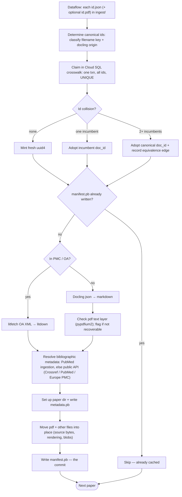

# litcache S0: cache storage + seed ingestion

**Status:** current — schema and the identity/mint core have landed; conversion, metadata resolution, the writer, and
the ingestion pipeline are in progress (Implementation state). **Related:**
[`../design/literature-evidence-layer.md`](../design/literature-evidence-layer.md) §2 (cache), §2.1 (layout), §2.2
(identity), §3 (capture), §4.2 (source anchors) — the design + why;
[`../design/litcache-manifest.md`](../design/litcache-manifest.md) (manifest structural model);
[`../design/proto.md`](../design/proto.md) (schema rails + serialization);
[`../design/spike-infrastructure.md`](../design/spike-infrastructure.md) §8 (boundary/egress).

## Overview

S0 is the buildable first slice of the litcache: per-paper, content-addressed GCS storage plus seed ingestion of the
~38k-paper dump, recording provenance. This doc decides the buildable cache and tracks what's built; the design and its
rationale live in [`literature-evidence-layer.md`](../design/literature-evidence-layer.md).

## Background

S0 covers **cache storage + seed ingestion**, recording provenance. In scope: per-paper GCS storage; UUID identity +
crosswalk; per-source revisions + source anchors; the `manifest.pb` / `metadata.pb` artifacts; the seed-ingestion path;
use of the shared `litfetch` fetch ladder.

The seed corpus is **`gs://cpg-themis-dev-fulltext/ingest/`** — ~38k papers (~2026-06 capture: mostly DOIs, 4432 bare
PMIDs, 2 Elsevier PII, 3 double-encoded DOIs), one object per artifact named by URL-encoded identifier: `<id>.json` (a
**DoclingDocument**) and/or `<id>.pdf`. The Docling json carries only converted document structure
(`texts`/`tables`/`pictures`/`pages`) — **no licence, no bibliographic metadata** — so both are recovered by identifier
resolution. It does carry `origin.filename` (often a second id) and `origin.binary_hash`. The prefix is **transient**:
source bytes are copied into each paper directory (the manifest cites them by paper-relative path), so `ingest/` is
deleted once ingestion succeeds.

## Non-goals

Deferred to later stages (design §8), not part of S0: the gated read-tool and any entitlement enforcement (there is no
themis user/affiliation model yet); live proven-access fetch and the upload route; the **durable** Cloud SQL serving
projection (only the mint crosswalk lands now, Design); the PubMed-metadata parquet → Cloud SQL load; bringing the
PubMed-metadata bucket under themis management (or making it requester-pays-public); KU extraction + grounding (§4);
paragraph/abstract embeddings (§2.4/§4.4); collections (§5).

## Design

### Decisions

| Area                      | Decision                                                                                                                                                                                                                                                                                                                                                                                                                                                                                                                                                                                                                                                                                                           |
| ------------------------- | ------------------------------------------------------------------------------------------------------------------------------------------------------------------------------------------------------------------------------------------------------------------------------------------------------------------------------------------------------------------------------------------------------------------------------------------------------------------------------------------------------------------------------------------------------------------------------------------------------------------------------------------------------------------------------------------------------------------ |
| Storage                   | The cache lives in the existing **`gs://cpg-themis-dev-fulltext`** bucket — seed under `ingest/`, built cache under `papers/` — behind the boundary (`cpg-themis-dev`). No separate bucket; **"litcache" names the component** (writer + layout), not a bucket. Bucket policy (private; versioned with soft-delete off; Autoclass→Archive; `force_destroy` off — the "precious" tier) is **owned by Pulumi** and documented once in [`../../infra/themis_infra/storage.py`](../../infra/themis_infra/storage.py) + `infra/README.md` §Storage; not restated here. Papers are **never GCS-TTL-expired** (a logical paper spans files with differing times; eviction, if ever, is an explicit operation, not a TTL). |
| PubMed metadata           | Full PubMed metadata (baseline + dailies XML, and the exploded parquet) lives in a **separate, public bucket** (not themis-managed yet), not the cache bucket — it is unambiguously public data. Themis pulls the parquet → Cloud SQL (serving, deferred). Per-paper `metadata.pb` (PubMed binary proto, or synthesised for non-PubMed) lives **per-paper in the cache bucket**. Cross-project SA grant for now; moving it into themis or making it requester-pays-public is a **later, staged** cleanup.                                                                                                                                                                                                          |
| Fetch ladder              | Depend on the standalone **`litfetch`** package (wheel via the wheelhouse, dep `litdown>=0.4`): a fetch ladder of `Fetcher` backends (PMC-OA S3, Europe PMC, Elsevier OA) + demand-driven `Resolver`s + `Generator`s, modelling an article as a **file-set** of External/Derived `File`s. Themis capture/ingestion runs it with its own allowlisted egress — licensed bytes never transit the shared plane.                                                                                                                                                                                                                                                                                                        |
| litfetch boundary         | **litfetch owns** identity (`ArticleIds`), the file-set model, fetching (uri + per-source credentials), source metadata + **raw licence + basis**, and `GenerationProvenance`. **litcache (consumer) owns** placement (this GCS layout + the `manifest.pb` record), bibliographic `metadata.pb`, and the **SPDX/policy** mapping. litfetch is **not** a bibliographic-metadata client. Mapping: External Files → `sources[]`; Derived Files (+`GenerationProvenance`) → `renderings[]`.                                                                                                                                                                                                                            |
| Identity                  | Random **uuid4** per paper = directory name. Deterministic ids rejected (Alternatives).                                                                                                                                                                                                                                                                                                                                                                                                                                                                                                                                                                                                                            |
| Atomic mint               | **Cloud SQL crosswalk table** (in the instance themis runs anyway). Workers mint against a shared `crosswalk(external_id UNIQUE, doc_id)` table: one transaction inserts *all* of a paper's ids (DOI, PMID, PMCID, …) under the constraint, minting a fresh uuid4 if none collide. Multi-id atomicity is native to the single transaction. A collision adopts the incumbent `doc_id`. The table is **persistent but safe to drop** — rebuildable from manifests (scan + invert), so it holds no irreplaceable state. The manifest is the system of record and the commit; the DB row is the mint lock.                                                                                                             |
| Equivalence               | Native multi-id claim removes the write-race edge case. An edge now arises only from a **genuine cross-paper link** — a paper's ids resolving to >1 distinct incumbent `doc_id` in one transaction (the late-binding case, §2.2) — detected atomically. The edge is written into the involved **manifests** (durable, rebuildable), never DB-only. Canonical uuid = lowest in the class; dedup/counting key on canonical (consumers deferred). Rare in a single-source seed.                                                                                                                                                                                                                                       |
| Source vs rendering       | A **source** is a primary-artifact lineage (the pdf, the xml) with a stable `handle` and append-only `revisions[]`; an update is a new revision, not a paper-wide version. A **rendering** = one converter's markdown of one revision, content-addressed and keyed by its hash. **Converter is not part of source identity** — re-converting adds a rendering. See [the litcache-manifest design](../design/litcache-manifest.md).                                                                                                                                                                                                                                                                                 |
| Source anchors            | Durable anchor = the extractor's **verbatim quote `{quote, exact}`** (write-once, boundary-side). Offsets are **recomputable** per `(ku_id, rendering)` by re-aligning the quote; never the source of truth. Recovering a quote's **bounding box in a rendering derived from a pdf** needs the pdf's character layer, so ingestion records `has_text_layer` per pdf source to surface problem papers early; XML-backed papers map to the XML instead. (KU/extraction itself is deferred, but the cache layout reserves `knowledge_units.pb` and pins this contract.)                                                                                                                                               |
| Licence/access            | **Per-source-lineage** (`sources[]`): **raw `licence` + `licence_basis`** (`artifact`\|`asserted`) as litfetch returns them, plus an `Access` `oneof` (variant + publisher-iff-`licensed` structural, [proto.md](../design/proto.md)). Varies between lineages (a CC-BY xml vs a restricted pdf), stable across a lineage's revisions. Policy booleans (`redistributable`, …) derived at read time by normalizing the raw licence to an SPDX id — not stored. Retraction = **paper-level** flag.                                                                                                                                                                                                                   |
| Provenance vs entitlement | **Capture-side provenance** recorded now (per paper, no user-ID needed). **Read-side entitlement** deferred — there is no themis user/affiliation system yet.                                                                                                                                                                                                                                                                                                                                                                                                                                                                                                                                                      |
| Ingestion policy          | **Ingest everything** (OA / non-OA / unknown-basis); record what's known; quarantine nobody; serving not a concern at this stage.                                                                                                                                                                                                                                                                                                                                                                                                                                                                                                                                                                                  |
| S0 infra                  | **GCS holds the only irreplaceable state** — directories + manifests. The mint crosswalk table lives in themis's Cloud SQL instance and is rebuildable from manifests, so it is **persistent but safe to drop**. The durable serving projection (KU rows, embeddings, …) is deferred — only the crosswalk lands now. The **manifest write is the commit point**; the resumability checkpoint is the written manifests, not the crosswalk.                                                                                                                                                                                                                                                                          |

### GCS layout

```
gs://cpg-themis-dev-fulltext/
  ingest/                                      # transient seed dump (raw docling json + pdf); deleted after ingestion
  papers/{uuid}/
    manifest.pb
    metadata.pb
    sources/{handle}/{hex}.{xml,pdf}         # immutable, content-addressed; seed bytes copied in
    renderings/{hex}.md                      # immutable; the markdown hash is the manifest map key
    renderings/{hex}.docling.json            # docling converter output (when converter=docling)
    knowledge_units.pb                       # write-once; reserved (KU layer, deferred)
    figures/        {hash}.{ext}             # content-addressed blobs
    supplementary/  {hash}.{ext}
```

Ingestion reads the `ingest/` seed and writes per-paper directories alongside it. The crosswalk is a **derived index** —
an inversion of the manifests' `external_ids` + `equivalence` — held in the Cloud SQL mint table, not in the bucket. GCS
holds the **only irreplaceable** state in S0; rebuild-from-bucket is trivial (scan manifests, re-invert). Schemas evolve
**additively only** ([proto.md](../design/proto.md)): a reader parses every artifact ever written, proto's unknown-field
retention means an older reader round-trips a newer writer's fields untouched, and a retired field-number is fenced with
`reserved`. The GCS layout and `manifest.pb` shape are validated by a working `.litcache/` prototype in the litfetch
repo.

### Schema

The at-rest schema is **hand-authored `.proto`** under `schema/proto/themis/litcache/models/`, on the proto rails
([`../design/proto.md`](../design/proto.md)): proto-canonical enums, a real `oneof` `Access` (so access-iff-`publisher`
is **structural**), and `protovalidate` options for residual rules; `regen` emits the Python stubs and the web tier's
protobuf-es. The manifest's structural model — per-source lineages, content-addressed renderings, the quote-reference
model — is the [litcache-manifest design](../design/litcache-manifest.md); not re-modelled here.

#### manifest.pb — identity / provenance / cache-control

The per-paper record: identity + external ids, equivalence, retraction, the `sources[]` lineages (licence/access per
lineage), the content-addressed `renderings` map, and the supplementary `files` registry. Structure + worked example:
[`litcache-manifest.md`](../design/litcache-manifest.md).

#### metadata.pb — bibliographic

`pubmed_proto` **binary proto** (`metadata.pb`) — bucket 1 per [proto.md](../design/proto.md): the at-rest format is
serialized protobuf, write-once over the re-derivable PubMed XML. The efetch path is XML → `PubmedArticle` proto
(`xml_converter`) → serialized `metadata.pb`; non-PubMed papers (Crossref, bioRxiv, upload) build the `PubmedArticle`
proto directly, so consumers stay uniform. No pydantic model or JSON at rest — canonical JSON is reserved for the
browser↔BFF seam (proto.md bucket 2). litcache owns this bibliographic shape; litfetch does not.

The `pubmed_proto` wheel is generated **once** by `xsd-former` from the NLM PubMed DTD, then committed and maintained in
place — not a continuously regenerated artifact. It qualifies for bucket 1 not on completeness (the DTD→proto transform
intentionally drops fields we don't model) but because it is write-once over a **re-derivable** source: the
authoritative PubMed XML stays the system of record, so a dropped field is recovered by re-running the transform.

#### Licence policy (read-time)

The raw `licence` (per lineage) is normalized to an SPDX id and mapped to redistribution rules **at read time** — never
stored (serving deferred). The table preserves the rules per-licence rather than collapsing to one flag:

```python
class Policy(BaseModel):
    redistributable: bool
    derivatives_allowed: bool
    commercial_allowed: bool
    share_alike: bool


class SpdxId(StrEnum):                    # read-time only; never stored (`licence` is raw)
    CC_BY = "CC-BY-4.0"
    CC_BY_NC = "CC-BY-NC-4.0"
    CC_BY_ND = "CC-BY-ND-4.0"
    CC_BY_SA = "CC-BY-SA-4.0"
    CC0 = "CC0-1.0"
    PROPRIETARY = "publisher-proprietary"
    UNKNOWN = "unknown"


_POLICY: dict[SpdxId, Policy] = {
    #                  redistributable, derivatives, commercial, share_alike
    SpdxId.CC_BY:       Policy(redistributable=True,  derivatives_allowed=True,  commercial_allowed=True,  share_alike=False),
    SpdxId.CC_BY_NC:    Policy(redistributable=True,  derivatives_allowed=True,  commercial_allowed=False, share_alike=False),
    SpdxId.CC_BY_ND:    Policy(redistributable=True,  derivatives_allowed=False, commercial_allowed=True,  share_alike=False),
    SpdxId.CC_BY_SA:    Policy(redistributable=True,  derivatives_allowed=True,  commercial_allowed=True,  share_alike=True),
    SpdxId.CC0:         Policy(redistributable=True,  derivatives_allowed=True,  commercial_allowed=True,  share_alike=False),
    SpdxId.PROPRIETARY: Policy(redistributable=False, derivatives_allowed=False, commercial_allowed=False, share_alike=False),
    SpdxId.UNKNOWN:     Policy(redistributable=False, derivatives_allowed=False, commercial_allowed=False, share_alike=False),  # conservative
}


def policy_for(raw_licence: str) -> Policy:
    return _POLICY[spdx_id(raw_licence)]  # spdx_id() normalizes; UNKNOWN if unrecognised
```

`CC-BY-NC`'s `commercial_allowed=False` is the lever for the commercial-use open question below; the table localises
that decision to one cell.

### Mechanisms

- **Mint / dedup (capture & ingestion).** Resolve external ids → in **one transaction** against the Cloud SQL crosswalk
  table, insert every id under the `UNIQUE` constraint, minting a fresh uuid4 if none collide. A collision on any id
  adopts that row's incumbent `doc_id` (paper already cached); ids resolving to >1 distinct incumbent is a genuine
  cross-paper link → write an equivalence edge into the involved manifests (§2.2). Then write the paper directory and
  `manifest.pb` — **the manifest write is the commit**. The DB row is the mint lock, not irreplaceable state: a crash
  before the manifest write leaves a claim row with no manifest; the re-run reprocesses that paper (manifest absent) and
  reuses the claimed uuid to complete it, so orphan rows are harmless.
- **Identity (per object).** Decode the GCS key (handle double-encoding) and classify it — DOI (`10.x/…`), bare-digit
  **PMID**, Elsevier PII, or opaque. Harvest the Docling `origin.filename` as a second id (often a PMID when the key is
  a DOI). All resolved ids are claimed together in the one mint transaction; a genuine cross-paper link surfaces as an
  equivalence edge (above).
- **Metadata resolution.** litcache resolves the identifier → bibliographic `metadata.pb` (DOI → Crossref; PMID → PubMed
  / Europe PMC) and the cross-ids (DOI↔PMID↔PMCID) — bibliographic metadata is litcache's, not litfetch's. **Licence +
  access come from litfetch**: it returns the **raw `licence` + `licence_basis`** (`artifact` extracted from the bytes,
  else `asserted` via Unpaywall) and the OA `access`; litcache stores them verbatim onto the matching `Source` lineage
  and normalizes to SPDX only at read time (Licence policy). `unknown` where unresolved.
- **Conversion (branch on OA).** If the paper is in PMC / otherwise OA and XML is obtainable via the `litfetch` ladder
  (PMC-OA / Europe PMC), convert the XML with `litdown` (`converter=litdown`). Otherwise generate markdown from the seed
  Docling json via `docling-core` `export_to_markdown()` (`converter=docling`). Either way the pdf is retained as a
  source lineage (on the OA branch its licence is asserted to the work's terms — it carries none of its own). Seed
  ingestion writes **one rendering** per paper (the branch outcome) into the content-addressed `renderings` map; the
  canonical rendering is derived at read time, and later converters (e.g. `llm-ocr`) append to the map.
- **PDF text-layer check (pdf sources only).** On the non-OA branch, probe the pdf with `pypdfium2` and record
  `has_text_layer` on the pdf source — whether positioned characters are recoverable (not image-only). This is the
  precondition for recovering quote bounding boxes from the pdf at reconciliation time (Source anchors). **Skipped when
  XML is present** — the XML is the source of truth offsets map back to. Recorded now as a diagnostic; the fix for any
  `has_text_layer=false` paper (stored bboxes / OCR) is deferred. Expected count: ~none.
- **Resumability.** The checkpoint is **manifest existence in GCS**, not the table: a run skips any paper whose manifest
  is already written. Idempotent, spot-preemption-safe, and safe to **re-run incrementally**. A half-minted paper (claim
  row, no manifest) self-heals — the re-run reprocesses it, reuses the claimed uuid, and writes the manifest. The table
  is **rebuildable from manifests** (scan + invert), so it stays safe to drop and recompute (schema change, loss).

### Ingestion pipeline

Per-paper (idempotent, resumable, safe to re-run incrementally): determine canonical ids (classify key + docling origin)
→ claim uuid in the crosswalk (dedup / equivalence) → skip if the manifest already exists → convert (OA/PMC: litfetch
XML → litdown; else Docling → markdown, + flag pdf `has_text_layer` via pypdfium2) → resolve bibliographic metadata
(PubMed ingestion or public API) → set up the paper dir + `metadata.pb` → move the pdf and other files into place →
write manifest (**the commit**). Built as a **Dataflow** pipeline reading/writing GCS and claiming crosswalk ids in
Cloud SQL, sized to ~38k+ papers; it needs `docling-core` (markdown export), `litfetch` (OA XML),
Crossref/PubMed/Unpaywall resolvers, and the Cloud SQL instance hosting the crosswalk. The mint/write logic is otherwise
runtime-agnostic.



## Alternatives considered

- **Deterministic ids (hash of DOI/PMID) instead of uuid4.** Rejected: preprints and supplements have no external id,
  and late-binding (a paper's ids becoming known only after ingestion) breaks a content-derived key. A random uuid4 with
  a crosswalk decouples identity from any external id.
- **A separate cache bucket.** Rejected: the cache is a *component* (writer + layout), not a storage domain; it reuses
  the existing `gs://cpg-themis-dev-fulltext` behind the boundary. "litcache" names the writer, not a bucket.
- **The crosswalk / DB as system of record.** Rejected: GCS manifests are the durable state and the commit point; the
  crosswalk is a derived mint lock, rebuildable by scanning + inverting the manifests. Losing it costs a recompute, not
  data.
- **TypeSpec as the schema IDL.** Rejected in favour of hand-authored `.proto` — it unlocks `protovalidate` and a real
  `oneof` (structural `Access`) the TypeSpec emitter could not express, and collapses to one codec. Full rationale:
  [proto.md](../design/proto.md) "Why this shape".

## Implementation state

**Landed (on `main`):**

- **Dependencies** — dependency groups + first-party PyPI carve-out for `litfetch` / `litdown` / `pubmed_proto` (#59).
- **Infra** — the ingestion runtime SA (Dataflow worker) + grants (#73), attached as a Cloud SQL DB user (#93).
- **Schema** — proto-native `schema/proto/themis/litcache/models/litcache.proto` + generated stubs, and the `Access`
  boundary validator (#155).
- **Identity + mint** — `themis/litcache/{identity,crosswalk,rebuild}.py`: id classification, the one-transaction
  crosswalk mint (equivalence edge on a genuine cross-paper link), and crosswalk rebuild-from-manifests (#161).
- **Metadata schema** — the `pubmed_proto` wheel wired + smoke-tested (S11b-0). The at-rest write is binary
  `metadata.pb`; the landed smoke's pydantic canonical-JSON path is being retired for direct proto serialization.

**In progress (staged, not yet merged):**

- **Converters** — non-OA Docling → markdown (S8); OA xml → litdown (S9); the pdf text-layer probe (S10).
- **Metadata resolvers** — efetch → `PubmedArticle` proto → `metadata.pb` (S11b-1); Crossref → `PubmedArticle` (S11b-2).
- **Storage + writer** — the GCS + in-memory storage backends, and the cache writer (content-addressed layout +
  `manifest.pb`, manifest-write-is-commit, idempotent re-run).
- **Pipeline** — the Beam/Dataflow ingestion pipeline over `ingest/` and the local driver.

Test fixtures for the in-progress slices are committed under `tests/fixtures/litcache/` (one real CC-BY paper +
synthetic inputs). Delete `ingest/` once the full ingestion run completes.

## Open questions

- **Does a clinical-genomics product count as commercial use?** Decides whether `CC-BY-NC` papers are redistributable in
  this product — the `commercial_allowed` cell of the Licence policy table. Unresolved; the table localises the switch
  to one place.
