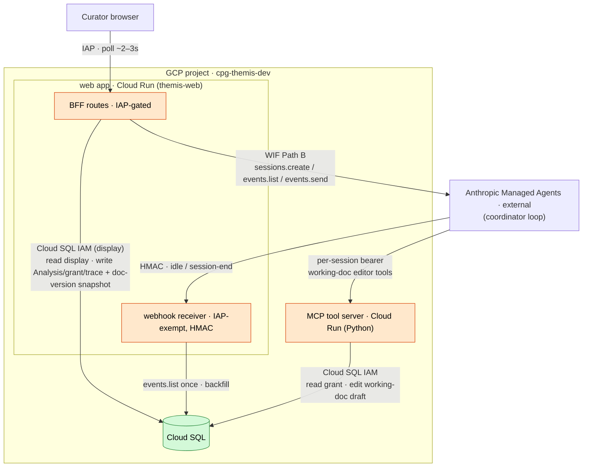
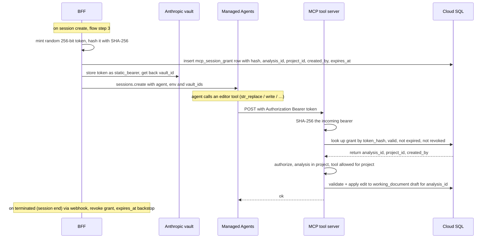
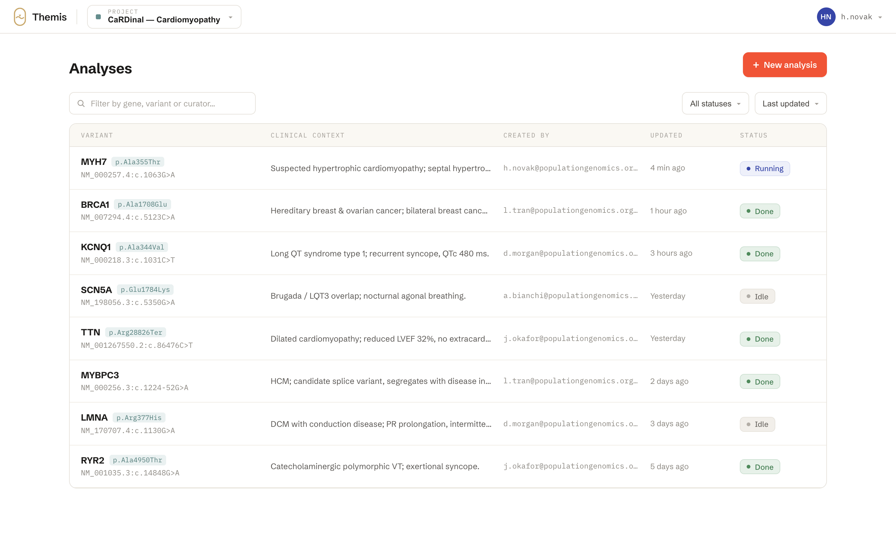
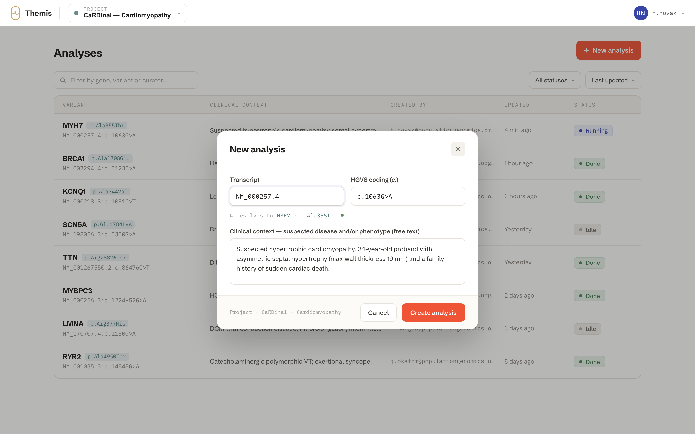
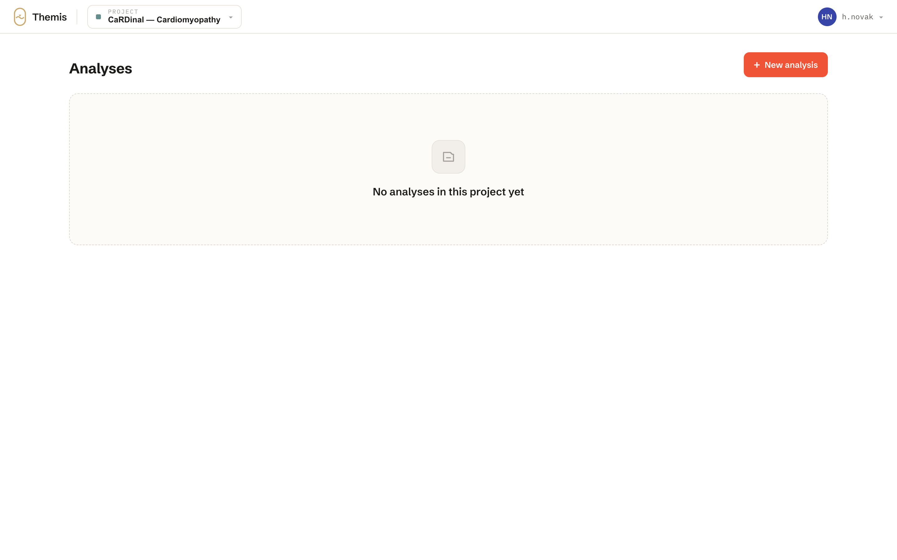
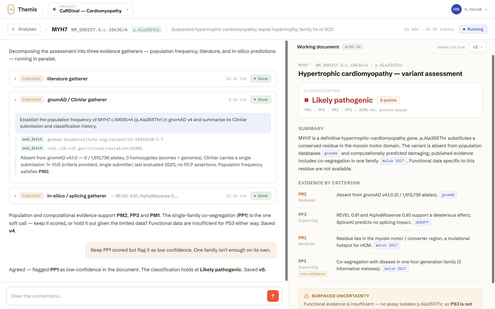
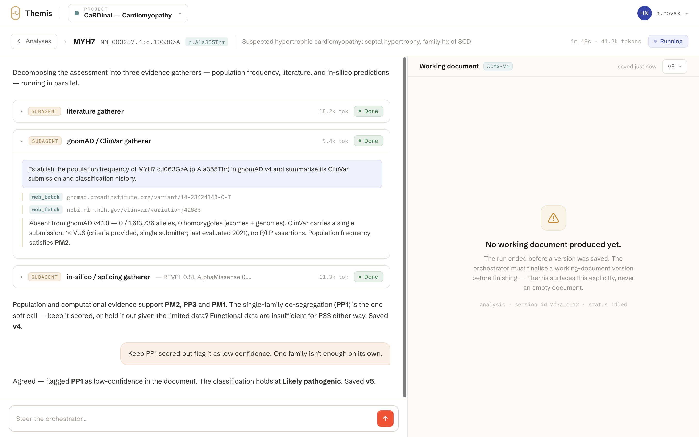
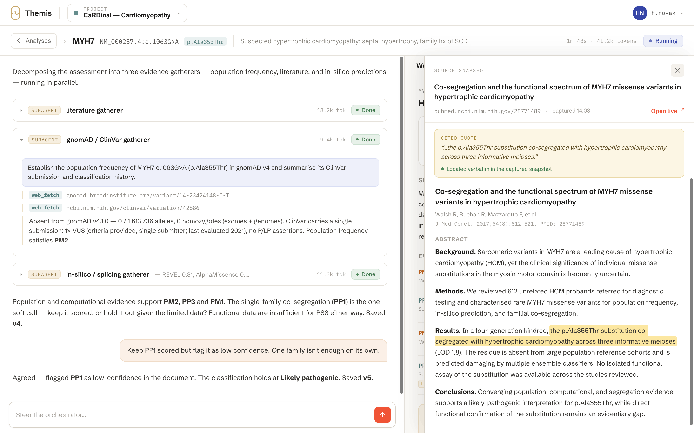
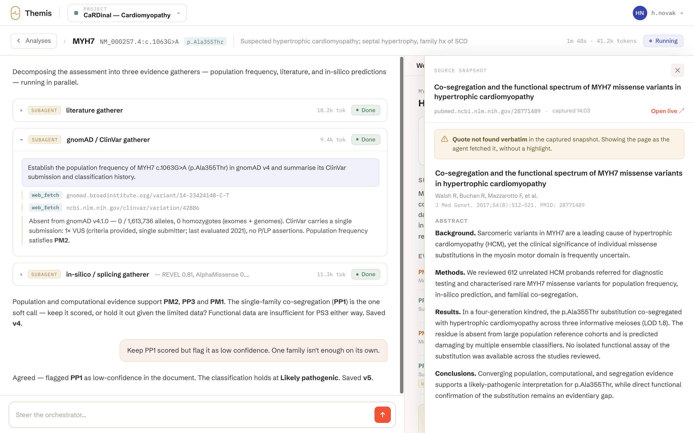

# Plan: Managed Agents wiring

This slice stands up the Managed Agents wiring **end-to-end through the Next.js BFF** — auth → structured variant entry
→ session → live thread → working document → on-demand source → steer/rewrite → session-end persistence — so the team
can dog-food and debug the wiring against synthetic scenarios, and grow each piece in place. It is the **first buildable
vertical slice**; the design docs hold the why (§2).

## 1. Overview

**Three identities, kept separate.** The browser carries the IAP cookie; the **BFF** holds the Anthropic identity (WIF
Path B, [`../runbooks/claude-api-wif.md`](../runbooks/claude-api-wif.md)) and a display-scoped Cloud SQL identity; the
**MCP server** holds the Cloud SQL _write_ identity for the agent's working-document edits, and binds each edit to its
Analysis via a per-session grant (§5). The agent never touches the store directly.

The call topology and boundaries — boxed is inside our GCP project; orange marks a public endpoint, green internal-only
(no public ingress). Auth labels each hop. The MCP tool server is reached via a vault-bearer-authed **public** endpoint
(the spike); its end-state reachability is an open question (§2), not shown here.



### End-to-end flow

The happy path for one variant, auth to a persisted, reviewable Analysis.

1. **Auth.** The curator reaches the app through IAP (group membership,
   [`../design/spike-infrastructure.md`](../design/spike-infrastructure.md) §2). The BFF trusts the IAP JWT per request;
   the asserted email is the identity for attribution and audit.

1. **Variant list / new.** The BFF lists the Analyses in the curator's Projects ([§4](#4-web-tier--bff)). The curator
   opens one, or fills the **new-variant form** — `transcript`, `hgvs_c`, and free-text `clinical_context`: the
   suspected disease and/or proband phenotype the variant is assessed against. ACMG-V4 classification is
   **gene–disease-specific**, so this context frames the criteria that depend on it (PP4 phenotype match,
   disease-specific prior classifications). It stays **free-text by design** — the agent reads it as prose, like its
   other inputs; no ontology/HPO coding. The variant is the _subject_ of the Analysis; the Analysis is the working
   session ([GLOSSARY](../../GLOSSARY.md)).

1. **Session create + kickoff.** On submit the BFF: writes the Analysis row (with its `project_id`); **mints the
   per-session MCP grant** — a random bearer stored as an `mcp_session_grant` row keyed by its hash, plus an Anthropic
   vault `static_bearer` ([§5](#5-mcp-authorization--per-session-grants)); creates the Managed Agents **session** (the
   deployed coordinator agent + the cloud environment ([§3](#3-agent--environment)) + the MCP-tool `vault_ids`) via the
   SDK under [WIF Path B](../runbooks/claude-api-wif.md); stores the session id on the row; sends the variant as a
   `user.message`.

1. **Live conversation (poll-through).** The workbench polls the BFF (~2–3 s) through a **single poll endpoint** that
   returns both the new conversation events and the current working-document draft ([§4](#4-web-tier--bff)). The BFF
   reads Anthropic's event log since a cursor (the primary stream), **authorizes the IAP identity against the Analysis's
   Project membership**, projects events to the display model, and returns the new ones. The coordinator's narration /
   thinking / tool calls render inline; each `session.thread_created` drops a **worker card**; expanding one lazily
   polls that thread's own events. The BFF only _reads_ here — it persists nothing for liveness (Anthropic's log is the
   transcript).

1. **Agent runs; the working document is edited.** The coordinator (system prompt = the ACMG guiding prompt +
   working-document outline) gathers with `web_search` / `web_fetch`, spawns self-copies as workers when it sees fit,
   and authors the working document through a small **editor toolset** — `view` / `search` / `str_replace` / `insert` /
   `write` (the text-editor tool shape, so the model is on trained rails) — as its opinion forms. Anthropic injects the
   per-session bearer; the MCP server **resolves the grant to the `analysis_id`** and applies the edit to that
   Analysis's **working-document draft** in Cloud SQL (its own write identity), **validating** it and rejecting an
   invalid edit with a message the agent retries — so the draft never goes invalid. Edits accumulate in the draft across
   the turn; the webhook fires on `session.status_idled` (§1 step 9) and the BFF **snapshots one immutable version** —
   server-side, so it fires even with the tab closed; the poll is liveness only — only if the draft changed, so a round
   of edits — the initial run or a steering rewrite — coalesces into **one version**, not one-per-edit. The agent must
   edit the document to a conclusion — _unknown / insufficient evidence_ is itself a written conclusion, never an absent
   artifact (PRODUCT §6); the **absence of any version at session end** (the agent never edited) is a **loud error
   state** — Managed Agents enforces no output schema ([`../design/agent-runtime.md`](../design/agent-runtime.md)), so
   our code surfaces "no working document produced" explicitly, never an empty pane.

1. **Working-document pane.** The browser sees the draft change on the next poll — the body is fetched when it changes —
   and renders it in the permanent right pane: markdown against the ACMG outline, inline `[text](#cite:ref "quote")`
   citations, and a version dropdown listing the turn-boundary snapshots.

1. **Source view (on demand).** Clicking a citation resolves its opaque source-ref (a fetched URL now →
   `{doc_id, version}` later) to the source body — live from the event stream during the run, from `source_snapshot`
   after backfill (§4/§6) — shown with the quote highlighted (flowa's anchoring primitives).

1. **Steering.** The curator types into the chat input → the BFF `events.send`s a `user.message` to the **same session**
   (a continuing conversation — the agent keeps full context; or `user.interrupt` to cancel) → the agent revises the
   draft, and its next idle snapshots a new version.

1. **Session-end backfill + grant revoke (webhook).** On **`session.status_terminated`** (session end) the IAP-exempt
   HMAC webhook wakes the BFF, which reads `events.list` once and projects the **event-stream-only telemetry** — thread
   → `AgentRun`, tool calls (including the MCP calls), per-thread token/cache usage, thinking — plus the **cited source
   bodies** (from `web_fetch` results) into Cloud SQL, and **revokes the session's MCP grant**
   ([§5](#5-mcp-authorization--per-session-grants)); `expires_at` is the TTL backstop. Revocation keys off `terminated`,
   **not** the per-turn `session.status_idled`: idle is the turn boundary that drives the step-5 version snapshot and
   leaves the grant **live** so the curator can keep steering. The working document is already persisted (step 5); the
   backfill never touches it.

1. **Reopen.** The Analysis is durable in our store — the latest working-document version, the projected trace, the
   cited sources — surviving the tab closing and Anthropic's beta-API retention. The live conversation replays from
   Anthropic's log while it lasts, and from the projection thereafter.

**Store writers** (the two-writer shape of [`../design/frontend-framework.md`](../design/frontend-framework.md), with
the MCP writer now present): the **MCP server** edits the working-document **draft** during the run; the **BFF** writes
the Analysis row + the MCP grant (step 3), **snapshots the working-document version at the turn boundary** (step 5), and
writes the session-end trace + source projection (step 9). One schema owner — the Python tool tier — both tiers using
the TypeSpec-generated types ([§7](#7-persistence--trace)).

## 2. Scope & relationship to the designs

**Related:** runtime semantics in [`../design/agent-runtime.md`](../design/agent-runtime.md) (coordinator, threads,
typed emits, trace feeders); web tier in [`../design/frontend-framework.md`](../design/frontend-framework.md)
(poll-through, webhook backfill, anchored comments); infra/sandbox/CI in
[`../design/spike-infrastructure.md`](../design/spike-infrastructure.md) §1/§6/§8; deploy auth + confidential model
config in [`../design/deployment.md`](../design/deployment.md); entities in
[`../design/workspace-model.md`](../design/workspace-model.md); the future source-ref resolution in
[`../design/typespec.md`](../design/typespec.md) +
[`../design/literature-evidence-layer.md`](../design/literature-evidence-layer.md) §4.2. The UI lifts evidence-viewer /
citation-anchor patterns from [`populationgenomics/flowa`](https://github.com/populationgenomics/flowa). This plan
**decides** the first buildable vertical slice; the design docs hold the why.

This slice is the **first rung of the scaffold-vs-autonomy dial** (PRODUCT §4/§6/§11): a single self-spawning
coordinator with no curated tools, deliberately undershooting [`agent-runtime.md`](../design/agent-runtime.md)'s
coordinator-roster / self-hosted-sandbox / MCP-tool target. It **implements**, not supersedes, those designs — every
undershoot names the seam it extends through (§10). The governing constraint is _minimal but extensible_: the thinnest
thing that exercises the whole path, shaped so the deferred pieces slot in without rework.

### Scope

**In:**

- One Managed Agents **coordinator** agent: `multiagent` roster `[{type: "self"}]` (the coordinator spawns copies of
  itself; no per-criterion agents), `web_search` and `web_fetch`, a thin ACMG-V4 working-document outline as the
  scenario specialization, a cloud environment.
- Agent + environment as version-controlled **`ant` YAML applied from CI** (control plane); sessions created and driven
  from the BFF via the SDK (data plane).
- **Project membership model:** `project`, `user_project` (M:N membership), Analyses bound to a Project; the IAP
  identity is authorized against membership on every BFF route. Projects and memberships are **seeded out-of-band**
  (control-plane migration/script) — no Project-management UI this slice (§10).
- **Next.js BFF:** structured variant entry + variant list, session create + kickoff, the merged event/working-document
  poll + projection, per-thread detail, steering (`events.send`), the IAP-exempt HMAC webhook receiver.
- **Workbench UI:** a live multi-thread **conversation** (flat collapsible worker cards), a permanent markdown
  **working-document** pane (flowa-style `[text](#cite:ref "quote")` citations, versioned), an **on-demand source
  view**.
- **Python MCP tool tier** (first deployable): a standalone Python MCP server exposing a small **working-document editor
  toolset** (`view` / `search` / `str_replace` / `insert` / `write`) the agent uses to author the working document in
  Cloud SQL. This is the **data-plane mediator** — it holds the Cloud SQL write identity; the agent reaches the store
  only through these typed tools, never directly, and each edit is **validated** server-side before it lands. Each call
  is bound to its Analysis by a per-session grant (§5). Reached via a vault-bearer-authed public endpoint (the spike);
  the end-state reachability is an open question (see below).
- **Cloud SQL** provisioned (IAM auth) with a minimal schema owned by the tool tier (forward-only migrations). The
  working-document draft is written by the MCP editor tools during the run and snapshotted to an immutable version by
  the BFF at each turn boundary; the BFF backfills a minimal trace projection + cited source bodies at session end.

**Out (deferred — §10 names each seam):**

- The self-hosted **execution sandbox** (worker / poller / environment-key) and agent-side egress policy — cloud sandbox
  \+ synthetic data only; it gates in before any real data. (One of the two end-state MCP-reachability options below
  rides on it.)
- The **broader** curated MCP tool surface and the typed `record_claim` / `record_gap` / `record_verdict` emits — the
  working-document editor toolset is the first, minimal instance of that typed-tool seam (a validated, grant-bound
  data-plane write); the genomics tools follow.
- Roster specialization (fresh-context reviewer, agentic gatherers) beyond `[self]`.
- Typed/structured ACMG output, the claims/verdicts model, the TypeSpec ACMG domain — the working document is loose
  markdown, structured only at the citation seam.
- A Project-management UI (invite / role administration); reports / accept-to-publish; anchored comments; Analysis
  branching; SSE push.
- litcache-backed source resolution — sources are agent-fetched web pages captured from the event stream, behind an
  opaque source-ref that swaps to `{doc_id, version, spans}` later.
- The refined ACMG guiding prompt (placeholder now), per-role model defaults, the eval harness, and any non-synthetic /
  patient data.

### MCP reachability — the spike, and two open end states

The agent reaches the MCP tool server over the network. For the spike this is a **vault-bearer-authed public endpoint**
(Cloud Run, scale-to-zero): Anthropic's orchestration calls the public URL, injects the per-session bearer, and the
server resolves it to the Analysis and authorizes the write (§5). That public inbound surface is fine for the
synthetic-data spike, but it is **not** the end state — and the end state does **not** need deciding now. Two options
retire the public surface; **neither is a spike dependency**. Both keep the load-bearing property — the agent never
holds the credential, and each write is bound per (Project, Analysis) — and both leave the editor-tool _interface_ (§1
step 5) intact:

- **A — MCP tunnel.** `cloudflared` + an Anthropic proxy in our network give the MCP server **no public endpoint**,
  connectivity outbound-only; the migration is a **URL swap** (`{type: url}` and the server unchanged). Cost: MCP
  tunnels are a **beta research preview that requires access approval we do not hold**, and the tunnel needs a
  **standing proxy host** — a small always-on VM (long-lived outbound daemons Cloud Run cannot host), one tiny proxy
  fronting the scale-to-zero tool servers (infra in §8).
- **B — Ditch MCP; call internal APIs from the self-hosted sandbox.** Once tool execution is **self-hosted** (§10 — GA,
  not beta, and wanted anyway for egress control), the agent's `bash` / generated code runs **inside our network** and
  can call our **internal APIs directly** — no MCP server, nothing Anthropic-reached, no tunnel. The per-(Project,
  Analysis) credential is injected by a **sandbox-local proxy** the agent's code calls (localhost), which adds the
  credential and forwards to the internal endpoint — so the agent can **never** read it, the same isolation the vault
  gives today, relocated into our sandbox. Each of today's MCP tool calls becomes a `bash` call to an internal API,
  which is the ["code mode"](https://blog.cloudflare.com/code-mode/) /
  ["code execution with MCP"](https://www.anthropic.com/engineering/code-execution-with-mcp) argument: an LLM writes
  more reliable **code against an API** than long chains of discrete tool calls, so collapsing the typed tools into an
  API the agent scripts against is likely the better surface. Not built on our side yet.

## 3. Agent & environment

Both are **control-plane** resources — version-controlled YAML applied via `ant` from CI (§8); sessions are the data
plane, created from the BFF. `model`, `system`, `tools`, `mcp_servers`, and `multiagent` live on the **agent**, never
the session.

### Coordinator agent

One agent. Its `multiagent` roster is `[{type: "self"}]`: it spawns copies of itself as workers and decides the
decomposition at runtime — no per-criterion agents. Delegation is **one level** (a worker's roster is ignored), up to 25
concurrent threads. The prebuilt toolset is restricted to `web_search` + `web_fetch`; the working document is authored
through the `mcp_toolset` **editor tools** — `view` / `search` / `str_replace` / `insert` / `write` (§1, §5). Tool calls
run under the default `always_allow` policy — the curator steers with messages, not per-tool approval gates.

```yaml
# coordinator.agent.yaml — applied via `ant` from CI.
# `model` and the MCP `url` are deploy-time substitutions (below).
name: ACMG coordinator
model: <frontier model — gcpkms-confidential; see deployment.md>
system: |
  <ACMG guiding prompt — placeholder, refined during implementation>
  <working-document outline — the scenario's starting structure: classification +
   points, per-criterion evidence, citations, surfaced uncertainty>
multiagent:
  type: coordinator
  agents:
    - type: self
tools:
  - type: agent_toolset_20260401
    default_config: { enabled: false } # start off; opt in per tool
    configs:
      - { name: web_search, enabled: true }
      - { name: web_fetch, enabled: true }
  - type: mcp_toolset
    mcp_server_name: themis-store
mcp_servers:
  - type: url
    name: themis-store
    url: <MCP endpoint — vault-bearer public Cloud Run (the spike); end state undecided, §2>
```

The system prompt carries the two scenario specializations PRODUCT §4 names — the **guiding prompt** and the
**working-document outline** — both deliberately thin and refined during implementation; the outline gives the renderer
(§6) its known sections.

### Environment

A **cloud** environment, unrestricted networking:

```yaml
# cloud.environment.yaml
name: themis-cloud
config:
  type: cloud
  networking: { type: unrestricted }
```

Networking is barely exercised this slice: `web_search` / `web_fetch` run on Anthropic's side, and the MCP call is
orchestration → our endpoint, not sandbox egress. `unrestricted` is the simplest choice; `limited` (egress allowlist) is
the tightening lever, and the **self-hosted execution sandbox** is a deferred end state (§2, §10).

### MCP auth — declared on the agent, credentialed per session

The `mcp_servers` entry carries **no auth** — only `{type, name, url}`. The credential is a **per-session vault
`static_bearer`** the BFF mints at session create and attaches via `vault_ids` (§1 step 3); Anthropic injects it on the
call, and the MCP server resolves it to the session's Analysis and authorizes the write (§5). The split keeps secrets
out of the reusable agent definition, and the **per-session** grain — not a static shared secret — is what binds each
push to its Analysis and Project. The per-session credential is independent of how the server is reached (§2): the
tunnel option only transports it, and the ditch-MCP option would inject it via a sandbox-local proxy — either way the
agent never holds it.

### Deploy-time substitutions & extension seams

Two fields resolve at deploy, never committed plaintext:

- **`model`** — the concrete frontier-model id is gcpkms-confidential
  ([`../design/deployment.md`](../design/deployment.md) §Confidential config), substituted from encrypted stack config;
  the YAML carries a placeholder.
- **MCP `url`** — the vault-bearer-authed public Cloud Run endpoint for the spike; the end-state reachability is
  undecided (§2), and under the tunnel option `{type: url}` is unchanged across the swap.

Extension seams, each a local edit to this YAML: the roster grows (`{type: self}` → a fresh-context `reviewer`, then
agentic gatherers); `mcp_servers` grows (the genomics tool servers, each its own subdomain + vault credential — §2
end-state topology); `networking` tightens to `limited`; `config.type` moves to `self_hosted`.

## 4. Web tier / BFF

The Next.js server side — one Cloud Run container (§1) — with **two inbound interfaces**: the **BFF** (browser,
IAP-gated) and the **webhook receiver** (Anthropic, IAP-exempt, HMAC). The MCP endpoint is the separate Python tool
tier, not here. Stateless, poll-through, scale-to-zero: it holds no connection for a run's duration and persists nothing
for liveness.

### Identity & authorization

- **IAP gates the browser surface** ([`../design/spike-infrastructure.md`](../design/spike-infrastructure.md) §2). The
  BFF trusts the IAP JWT per request; the asserted email is the identity for attribution and audit. The two
  **Anthropic-facing** surfaces — the webhook receiver and the MCP endpoint — are **not** IAP-gated (Anthropic cannot
  present a GCP token); they are authed by HMAC and a per-session bearer (§5) respectively.
- **Project-membership authorization.** Analyses are **Project-scoped**
  ([`../design/workspace-model.md`](../design/workspace-model.md)); the BFF authorizes the IAP identity against
  **Project membership** on every route — a curator sees only the Analyses in Projects they belong to. Projects and
  memberships are **seeded out-of-band** (control-plane migration/script, §8); a Project-management UI is deferred
  (§10). The email is recorded on create/steer for attribution.
- The BFF holds the **Anthropic identity** (WIF Path B) and a **display-scoped Cloud SQL identity** (reads display rows;
  writes the Analysis row, the MCP grant, the turn-boundary working-document version snapshot, and the backfill).

### Routes

| Route                          | Does                                                                                                                                                                                                |
| ------------------------------ | --------------------------------------------------------------------------------------------------------------------------------------------------------------------------------------------------- |
| `GET` variants                 | List the Analyses in the curator's Projects (the home screen).                                                                                                                                      |
| `POST` variant                 | Write the Analysis row (with `project_id`); mint the per-session MCP grant (§5); create the session (agent + env + `vault_ids`) via the SDK; send the kickoff `user.message`; store the session id. |
| `GET` poll                     | The liveness tick: `events.list` (paginated) past a per-session cursor projected to the display model, **plus** the current working-document draft (fetched when it changes).                       |
| `GET` thread events            | Poll a worker thread's own events on expand (`threads.events.list`).                                                                                                                                |
| `GET` working document         | Read the current draft, or a selected version's markdown, from Cloud SQL (on change / dropdown selection).                                                                                          |
| `POST` steer                   | `events.send` a `user.message` (or `user.interrupt`) to the same session.                                                                                                                           |
| `GET` source                   | Resolve a citation's source-ref to its source body — live from the event stream (`events.list` `web_fetch` result) during the run, from the backfilled `source_snapshot` after session end.         |
| `POST /api/webhooks/anthropic` | IAP-exempt, HMAC-verified: the per-turn version snapshot on `idled`, and the session-end trace + source backfill + grant revocation on `terminated` (§1 step 9).                                    |

### Liveness — poll-through, merged, id-deduped

The browser polls the **single poll route** (~2–3 s) with TanStack Query (already in the scaffold). One tick returns the
new conversation events **and** the current working-document draft, so the conversation and the artifact cannot drift
out of sync and the client runs one interval, not two; the document body is fetched only when the draft changes. The BFF
reads Anthropic's log and relays it — Anthropic's log _is_ the transcript; the BFF copies nothing for liveness. The
event stream has **no replay-since-cursor**, so the robust shape is a paginated `events.list` deduped by event `id`,
advancing a per-session high-water mark (the [`frontend-framework.md`](../design/frontend-framework.md) cursor open
question — confirm the exact pagination params against the API at build). SSE push is deferred (§10).

### Data-access shape

Client-side polling needs cacheable GETs, so the live reads are **route handlers** returning JSON, consumed by TanStack
Query; mutations (submit, steer) are route handlers too. RSC reading Cloud SQL directly does not fit client polling — it
renders once at request time. This resolves `frontend-framework.md`'s RSC-vs-route-handler open question in favour of
route handlers for the slice's polled surfaces.

### The webhook interface

One **IAP-exempt path** on the same container (an LB path rule, §8), HMAC-verified with the signing key inventoried in
[`../design/spike-infrastructure.md`](../design/spike-infrastructure.md) §4. HMAC verification is the first step, and
the handler is a narrow single-POST module, isolated in code from the IAP-gated BFF routes. It is **not a separate
service** by design: the backfill needs the BFF's two most sensitive identities — WIF Path B (to call `events.list`) and
the Cloud SQL writer — so a separate service would _spread_ those credentials onto a second surface rather than contain
them. The true inbound-isolation lever, if ever needed, is a thin **verify-and-enqueue** front (Pub/Sub) so the
credentialed backfill worker holds no inbound surface; that is deferred (§10). The other Anthropic-facing surface, the
MCP endpoint, is the separate Python tier (§5, §8).

## 5. MCP authorization — per-session grants

The agent must reach the store only for the Analysis it is running, and it must not be trusted to name that Analysis (an
LLM could pass the wrong id — a silent cross-Analysis, later cross-Project, write). So **the credential the agent is
handed _is_ its authorization**: one secret does both authn (proves the caller is this session) and binding (identifies
what it may write). The editor tools therefore take **no** `analysis_id` — the server derives it from the bearer, so
every edit lands on the grant's Analysis.

**Grain — Analysis-bound, Project-scoped.** One Managed Agents session = one Analysis (§1 step 3), so the grant is
per-session. It binds a specific `analysis_id` (the tightest must-have, so the write lands on the right Analysis) and
carries the `project_id` (the authorization scope — the server checks the Analysis ∈ Project, and later Project-scoped
tools/data use it). A Project-_only_ grant would force the agent to supply `analysis_id`, reopening the wrong-write
hole.

**Where the token lives.** Two stores, by design:

- **Anthropic side:** the plaintext token lives in an **Anthropic vault** as a `static_bearer`, referenced by
  `vault_ids` on the session; Anthropic injects it as `Authorization: Bearer` on each MCP call. We never store the
  plaintext.
- **Our side:** only a **SHA-256 hash** of the token plus its binding, in the `mcp_session_grant` table (§7). A DB leak
  yields no live bearers. The token is 256-bit random — high-entropy, not a password — so a fast hash is correct here
  (no bcrypt/argon2); an optional shared pepper is a later hardening, not needed for the slice.



**Shared util — tools don't reinvent this.** A Python auth layer every MCP tool server mounts (a Streamable-HTTP /
FastMCP dependency): it extracts the bearer, hashes it, looks up the grant, authorizes it, and injects a resolved
`GrantContext(analysis_id, project_id, created_by)` into the handler. Tools receive **resolved context**, never raw
bearers or ids; the editor tools use it now, and the later `record_claim` / `record_gap` / `record_verdict` tools
inherit binding + authorization for free. The cross-language contract — the `mcp_session_grant` row shape and the
hashing constant — is **TypeSpec-defined** (§7), so the TS minter (BFF) and the Python validator (MCP server) stay in
lockstep.

**Lifecycle.** Mint on session create; revoke at **session end** — keyed off `session.status_terminated`, **not** the
per-turn `idled`, so the grant outlives steering (the webhook is the natural hook, §1 step 9); `expires_at` is the TTL
backstop. Re-opening an old Analysis (§10) re-provisions a session → a fresh grant; the model handles it without
special-casing.

**Forward to Project membership.** This is the seam through which Project authorization grows: the grant already carries
`project_id`, so when the broader genomics tools land and data access becomes Project-scoped end-to-end, each tool's
write/read is authorized server-side against the grant's Project — no agent trust, no new plumbing.

## 6. Output & UI

Two permanent panes plus an on-demand source view, over a home/list screen. The **shape** follows flowa's evidence
viewer ([`populationgenomics/flowa`](https://github.com/populationgenomics/flowa), cited in
[`frontend-framework.md`](../design/frontend-framework.md)) — but only the pieces a slice with **no stable stored
sources** can use: the citation format, the two-pane layout, the version dropdown. flowa's code-point-offset anchoring
is litcache-era (it needs a stable stored source markdown + a quote→span resolution step the slice doesn't have) and is
**not** used here.

_The mock-ups below are illustrative: curator names and emails are fabricated personas (no real staff), and the
variants, clinical contexts, and citations are textbook-synthetic (no real participants)._

### Home — variant list + new-variant form

A list of the curator's Analyses (those in their Projects, §4); **New** opens a structured form (`transcript`, `hgvs_c`,
free-text `clinical_context`) that drives §1 step 3.



_Home — the curator's Analyses in a Project: variant (gene + HGVS), free-text clinical context, curator, last update,
run status._



_New-analysis form: `transcript`, `hgvs_c`, free-text `clinical_context`._



_Empty state._

### Workbench — conversation │ working document

- **Conversation** (left/centre, primary): the live thread from the projected events (§4). The coordinator's narration /
  thinking / web tool calls render inline; each spawned worker is a **flat, collapsible card** — one level, no nesting —
  collapsed showing role / status / token usage / a one-line summary, expanded showing that thread's own stream (lazily
  polled on expand). A standard chat input steers the same session (§1 step 8).
- **Working document** (right, permanent): the artifact, always visible — rendered markdown against the ACMG outline
  (classification + points, per-criterion evidence, citations, surfaced uncertainty), inline `[text](#cite:ref "quote")`
  citations, and a **version dropdown** (one version per steering round — the turn-boundary snapshot, §7). The live
  draft is read from Cloud SQL (§4). If a run ends with no version, this pane shows the explicit "no working document
  produced" error state (§1 step 5), not an empty document.
- **Source view** (on demand): the citation carries the **quote as a self-anchor**. Clicking opens a drawer showing the
  **captured `web_fetch` snapshot** — what the agent actually read — with the quote located by a **client-side string
  search** (best-effort highlight + scroll) and a link to the live URL. No stored offsets; if the quote isn't found
  verbatim, the snapshot still shows. The snapshot body is read **live from the event stream** during the run and from
  the backfilled `source_snapshot` afterwards (§4) — the same live-then-durable read as the conversation.



_Workbench — left: the coordinator's live thread with collapsible sub-agent cards and web tool calls; right: the
versioned ACMG-V4 working document with citation chips and surfaced uncertainty._



_The working-document pane when a run produced no version: the explicit error state, not an empty document._



_Source view — the captured `web_fetch` snapshot, cited quote located verbatim and highlighted._



_Fallback when the quote isn't found verbatim: the snapshot still shows, without a highlight._

### What carries from flowa, and what doesn't

- **Now:** the citation format `[text](#cite:ref "quote")` (the quote string is the self-anchor); the two-pane artifact
  \+ source shape; the version dropdown.
- **Litcache-era (not now):** the code-point→UTF-16 conversion, stored `{doc_id, version, spans}` anchors,
  version-pinned offset resolution, and the anchored-comments contract built on them — all need a stable stored source
  markdown and a resolution step. The slice's highlight is a client-side quote-string match, computed in the browser.
- Depend-on-`@flowajs/react-viewer` vs vendor is a build call; deferred (a client-side quote search is trivial, so even
  the highlight-viewer reuse is optional).

### Source capture

During the run the source view reads the `web_fetch` snapshot **live from the event stream** (`events.list`). The
session-end backfill (§1 step 9) then extracts the **cited** `web_fetch` snapshots and stores them in `source_snapshot`
keyed by source-ref (the URL), so the view stays reproducible after the run — and after the live page changes or
vanishes (PRODUCT's verifiable-provenance principle, §6). This is the litcache stand-in: when litcache lands, the
source-ref resolves to `{doc_id, version}` and the snapshot to the pinned cache markdown (storage detail §7).

### Deferred

A Project-management UI; reports / accept-to-publish (a working-document version is what a future accept freezes);
typed/structured ACMG claims; anchored comments; Analysis branching; SSE push.

## 7. Persistence & trace

Cloud SQL (Postgres), provisioned this slice (§8), holds everything. The artifacts are small and few (synthetic, a
handful of variants), so blobs are **text columns**, not GCS — GCS-as-source-of-truth is litcache's pattern and earns
its keep at litcache scale, not here. **The Python tool tier owns the schema + forward-only migrations** (§5); the BFF
is a reader + session-plane writer; both tiers type their rows from the TypeSpec source
([`../design/typespec.md`](../design/typespec.md)).

### Minimal schema

- **`project`** — `id`, `name`, timestamps; the access/data boundary
  ([`../design/workspace-model.md`](../design/workspace-model.md)). _Seeded out-of-band (control plane)._
- **`user_project`** — `user_email`, `project_id`; M:N membership. _Seeded out-of-band._
- **`analysis`** — one row per variant / Analysis: `project_id`, `transcript`, `hgvs_c`, `clinical_context`,
  `session_id`, `created_by` (IAP email), timestamps. _Writer: BFF (on submit)._
- **`mcp_session_grant`** — `token_hash`, `analysis_id`, `project_id`, `created_by`, `created_at`, `expires_at`,
  `revoked_at`; binds a session's MCP bearer to its Analysis (§5). _Writer: BFF (mint + revoke); reader: MCP server._
- **`working_document`** — `analysis_id`, `markdown`, `updated_at`; the current editing **draft**, one row per Analysis,
  mutated in place by each editor-tool call. _Writer: MCP server._
- **`working_document_version`** — `analysis_id`, `version`, `parent_version`, `markdown`, `created_at`; an immutable
  snapshot appended at the turn boundary when the draft changed (§1 step 5). _Writer: BFF (webhook
  `session.status_idled`)._
- **`source_snapshot`** — `analysis_id`, `source_ref` (the URL), `body`, `fetched_at`; the cited `web_fetch` snapshots.
  _Writer: BFF (backfill)._
- **`agent_run`** — `analysis_id`, `thread_id`, `agent_name`, `model`, token/cache usage; per-thread run, the source for
  the token-cost dashboard ([`../design/spike-infrastructure.md`](../design/spike-infrastructure.md) §5). _Writer: BFF
  (backfill)._
- **`session_projection`** — `analysis_id`, `events` (jsonb), `projected_at`; the readable conversation projection for
  durable replay. _Writer: BFF (backfill)._

The normalized `AgentRun` / `ToolCall` / claim / verdict trace of the (still-unwritten) `trace-schema.md` is deferred;
`agent_run` + the jsonb projection are the minimal stand-in.

### Identities (two Cloud SQL clients, by design)

- **MCP server** — its own SA, Cloud SQL IAM auth; reads `mcp_session_grant` + the `working_document` draft (the editor
  tools `view` / `search` / `str_replace` read it), writes the `working_document` draft (the data-plane mediation, §5).
- **BFF** — its display-scoped SA, Cloud SQL IAM auth; reads all, writes `analysis` / `mcp_session_grant` /
  `working_document_version` (the turn-boundary snapshot) / `source_snapshot` / `agent_run` / `session_projection`.

One schema owner keeps the writers safe (§5). The BFF accesses Postgres via a TS driver over the Cloud SQL Node
connector (IAM auth, no password — `spike-infrastructure.md` §7), typed queries against the tool-tier-owned schema with
row shapes validated by the TypeSpec-generated types; no ORM or migrations on the BFF side.

### Migrations

Forward-only, applied to dev via the merge→deploy pipeline (`spike-infrastructure.md` §7), owned by the tool tier; run
against the embedded Postgres harness in hermetic tests (§8). The toolchain (lightweight SQL migrations vs Alembic) is a
**build-time open question** (§10) — lean: lightweight SQL files + a small runner, since the tool tier uses no ORM.

## 8. Infrastructure & control plane

New Pulumi resources + CI on top of the existing baseline / web / storage modules ([`../../infra/`](../../infra/)).

### Infra (Pulumi)

- **Cloud SQL** (new module): a Postgres instance (smallest dev tier, `spike-infrastructure.md` §5), **IAM database
  auth**, daily backups + 7-day PITR. Two IAM-auth DB users — the **BFF SA** (read all + session-plane writes, incl. the
  working-doc version snapshot) and the **MCP server SA** (read `mcp_session_grant` + `working_document`, write
  `working_document`).
- **MCP server** (new — Cloud Run, Python): its own SA (Cloud SQL IAM read grant + draft / write draft), **public
  ingress** (Anthropic's orchestration reaches it and cannot present an IAP/GCP token), **app-layer per-session bearer
  validation** against `mcp_session_grant` (§5) — no static shared secret. Its URL is the agent's `mcp_servers` url
  (deploy-substituted, §3). The public endpoint is the spike's; the end-state reachability is undecided (§2) — the
  tunnel option moves it private (URL swap, service stays Cloud Run behind the proxy), the ditch-MCP option retires this
  server for internal APIs the self-hosted sandbox calls.
- **Web service** ([`../../infra/themis_infra/web.py`](../../infra/themis_infra/web.py)) gains: the WIF Path B env vars
  (already specced in the runbook), the MCP URL, and an **IAP-exempt path** for `/api/webhooks/anthropic`. IAP is a
  **per-backend-service** toggle, so the exempt path is a URL-map path rule to a **second backend service** (a second
  serverless NEG onto the _same_ Cloud Run service) with IAP disabled; the rest of the service stays IAP-gated.
- **Secret Manager** delta: the **webhook signing key** (`whsec_…`, §4). **No static MCP bearer** — per-session grants
  (§5) replace it; the MCP server validates against the grant row, not a Secret Manager entry. **No environment key** —
  that is the self-hosted sandbox, deferred.

### Control plane (Managed Agents)

- The **agent** + **environment** YAML (§3) applied via `ant` from CI. The MCP **vault credential is minted per session
  by the BFF via the SDK** (§5), not a static control-plane credential; sessions reference it through `vault_ids`.
- **Project + membership seed** — a control-plane step (migration / script) seeds `project` + `user_project`; no
  management UI this slice (§4).
- This needs a **third WIF identity** beyond the runbook's two (Path A PR-review, Path B Cloud Run): **Path C — GitHub
  Actions → Anthropic** for the CI control-plane `ant` apply (a `cpg-themis-ci-deploy`-class svac + federation rule
  pinned to `push:main`). The apply step rides the deploy job, which already holds GCP access to **decrypt the gcpkms
  model id** and render the agent YAML before applying.

### CI/CD

On merge to `main` (`spike-infrastructure.md` §6): build the **two images** — `themis-web` (Next.js) and the **Python
MCP server** — push to Artifact Registry (WIF), `pulumi up` (points both Cloud Run services at the new images;
provisions Cloud SQL + secrets), then `ant` applies the agent/environment YAML. PR jobs stay read-only (`pulumi preview`
\+ cloud-free tests).

### Deferred infra — the end-state MCP reachability

Neither end-state option (§2) is built for the spike. The **tunnel** option needs a **standing host** (a GCE Docker VM
or a minimal GKE deployment) running `cloudflared` + the Anthropic proxy, plus a Console-created tunnel, a registered CA
/ server certificate, and WIF for the Tunnels API — the MCP server itself stays Cloud Run behind the proxy. The
**ditch-MCP** option needs the self-hosted sandbox worker plus a sandbox-local credential-injecting proxy, and no
standing tunnel host at all.

## 9. Build sequencing

Three milestones, each independently demoable, reaching a testable end-to-end fast. The end-state MCP reachability (§2)
is deferred and undecided — outside these milestones.

**M1 — conversation visible end-to-end.** Exercise the riskiest wiring (WIF Path B, session lifecycle, event projection,
multiagent thread rendering) with no persistence beyond the Analysis.

- Cloud SQL Pulumi module (instance, IAM auth) + the `project` / `user_project` / `analysis` tables + the membership
  seed.
- Agent + environment YAML (coordinator + `[self]` + `web_search` / `web_fetch`, **no MCP yet**); `ant` CI apply + the
  Path-C WIF identity; gcpkms model-id substitution.
- BFF: new-variant form + Project-scoped list; session create + kickoff (WIF Path B); merged event/doc poll +
  projection; per-thread detail; steering; Project-membership authorization on every route.
- UI: home (list + form) + conversation pane (worker cards, lazy thread detail) + chat input.
- _Outcome:_ submit a variant, watch the coordinator + workers gather and reason.

**M2 — the working document.** Add the data-plane tool seam + the per-session grant + the artifact pane.

- TypeSpec domain for the slice's shapes (rows incl. `mcp_session_grant` + wire/display models); the full schema +
  forward-only migrations (tool tier).
- Python MCP server (working-document editor tools + per-edit validation → the `working_document` draft in Cloud SQL) +
  its SA + the shared grant auth util (§5); the BFF mints the per-session grant (`mcp_session_grant` + the Anthropic
  vault credential) and snapshots a version at each turn boundary; add `mcp_toolset` + `mcp_servers` to the agent.
- UI: working-document pane (markdown + ACMG outline + `#cite:` citations + version dropdown + the no-document error
  state).
- _Outcome:_ the agent authors a versioned ACMG artifact (one version per round), shown permanently; steering revises
  it.

**M3 — durable + reproducible.** Add the backfill + source view + grant revocation.

- Webhook receiver (IAP-exempt path + LB rule + HMAC) + the backfill: `agent_run` + `session_projection` + cited
  `source_snapshot` capture + MCP-grant revocation.
- UI: source view (snapshot drawer + client-side quote highlight).
- The token-cost dashboard query over `agent_run` (`spike-infrastructure.md` §5).
- _Outcome:_ Analyses are reviewable after the tab closes and Anthropic's retention lapses; sources reproducible.

**End-state MCP reachability** (§2) is deferred and undecided — either the **tunnel** option (beta access + a standing
`cloudflared`/proxy host, then an `mcp_servers` URL swap) or **ditch MCP** for internal APIs called from the self-hosted
sandbox. Neither is a spike dependency; the vault-bearer public endpoint ships now.

The ACMG guiding prompt + working-document outline start as placeholders throughout and are tuned via dog-fooding (§3).

## 10. Deferred seams & open questions

### Deferred — and the seam each extends through

| Deferred                                                                  | Extends through                                                                                                                      |
| ------------------------------------------------------------------------- | ------------------------------------------------------------------------------------------------------------------------------------ |
| MCP reachability end state (undecided)                                    | MCP tunnel (an `mcp_servers` URL swap, §2) **or** ditch MCP for internal APIs called from the self-hosted sandbox (§2)               |
| Self-hosted execution sandbox                                             | environment `config.type` → `self_hosted` + a worker (§3, §8)                                                                        |
| Curated genomics MCP tools + typed `record_*` emits                       | new tools on the tool tier; the per-session grant + data-plane mediation already exercised by the working-document editor tools (§5) |
| Roster specialization (reviewer, gatherers)                               | agent `multiagent.agents` roster edit (§3)                                                                                           |
| Typed/structured ACMG claims + TypeSpec ACMG domain                       | typed emits + citation-fidelity grow in the editor tools' per-edit validation layer; the claims model the MCP tools own (§6, §7)     |
| Project-management UI                                                     | CRUD over `project` / `user_project`, on the enforcement already in place (§4)                                                       |
| Reports / accept-to-publish                                               | freezes a `working_document_version` (§6)                                                                                            |
| Anchored comments                                                         | the code-point-span contract — litcache-era (§6)                                                                                     |
| litcache source resolution                                                | source-ref → `{doc_id, version}`; snapshot → pinned cache markdown (§1, §6)                                                          |
| Analysis branching                                                        | the workspace-model tree-of-turns (§6)                                                                                               |
| Webhook inbound isolation                                                 | a verify-and-enqueue (Pub/Sub) front ahead of the backfill worker (§4)                                                               |
| SSE push                                                                  | replaces poll-through (§4)                                                                                                           |
| Per-role model defaults, eval harness, refined prompt, non-synthetic data | §2, §3                                                                                                                               |

### Open questions (resolve at build)

- **Migration toolchain** — lightweight SQL migrations vs Alembic (§7); lean lightweight.
- **`events.list` cursor** — the exact pagination / dedupe shape (the `frontend-framework.md` open question, §4).
- **Session status identifiers** — the SSE stream / `events.list` name idle `session.status_idle`, but the **webhook**
  names it `session.status_idled` (both share `session.status_terminated`); the plan drives version snapshots off the
  webhook's `idled`. Confirm the exact strings against the Managed Agents API at build.
- **flowa reuse boundary** — depend-on-`@flowajs/react-viewer` vs vendor the primitives (§6).
- **Snapshot capture scope** — only cited `web_fetch` bodies vs all, and size handling (§6, §7).
- **Session reuse on reopen** — returning to an old variant days later, the Managed Agents session/container may be
  reclaimed; confirm whether a new `user.message` re-provisions, or reopening starts a fresh session (our persisted
  artifact + projection survive regardless, and a fresh session re-mints its grant, §5) (§1, §4).
- **MCP server transport** — the Python Streamable-HTTP MCP implementation / library (§3, §8).
