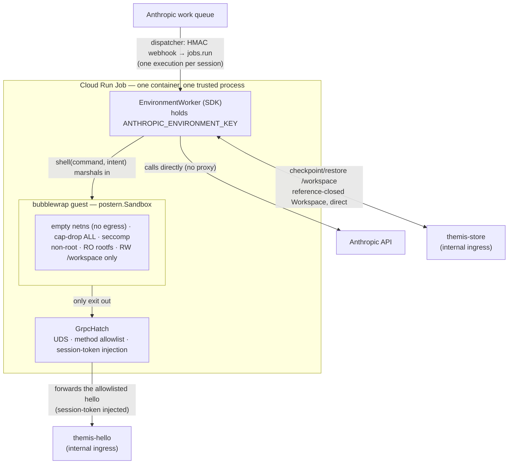

# The postern sandbox worker

The self-hosted sandbox isolates untrusted model execution with
[`postern`](https://github.com/populationgenomics/postern). It supersedes the execution + isolation model in
[`self-hosted-sandbox.md`](self-hosted-sandbox.md) — that doc's rationale, dispatcher, and credential model still hold;
its sandbox-job-plus-credential-proxy architecture, egress subsystem, and `/workspace` sync do not. The design was
pressure-tested in two adversarial reviews against postern (`../postern/attic/SECURITY-REVIEW.md`,
`SECURITY-REVIEW-2.md`), both concluding: run it without an egress firewall or load balancer.

## 1. Execution model

The worker is a single **trusted** process running the Anthropic SDK `EnvironmentWorker`. Untrusted model code never
shares that process: each `shell` command is marshaled into a [bubblewrap](https://github.com/containers/bubblewrap)
sandbox (`postern.Sandbox`) whose **only** exit is a method-allowlisted gRPC hatch. Egress containment is a
fail-*closed* empty network namespace, not a fail-*open* firewall.

This replaces a two-container Cloud Run Job — an **untrusted** `agent` container (`ant beta:worker run`, with bash and
file tools executing *inside* it) beside a **trusted** `proxy` sidecar holding the credentials, plus a network subsystem
(dedicated VPC, deny-all egress firewall, Cloud NAT, DNS sinkhole, internal load balancer) whose sole purpose was
containing the untrusted container's egress. A single trusted process, with untrusted execution pushed into an empty
netns, needs none of it.

## 2. Architecture



The worker reaches Anthropic over a Cloud NAT and the internal-ingress `store`/`hello` over Direct VPC egress (§2 egress
bullet). Only the *guest* has no network at all.

- **Isolation** is postern's: empty netns (no egress, fails closed), `--cap-drop ALL`, non-root guest (uid 65534),
  strict `--unshare-user`, seccomp denylist (arch-fail-closed), read-only curated rootfs, RW `/workspace` only. The
  guest reaches nothing but the hatch. `Sandbox.verify()` runs at worker startup and refuses to serve if isolation is
  not enforced here.
- **The hatch is the capability boundary.** A frozenset of exact `/pkg.Service/Method` names; anything else is
  `PERMISSION_DENIED`. The trusted worker registers a forwarding `Hello` servicer on the hatch, injects the per-session
  `x-themis-session-token`, and forwards to the real services — the guest never holds a credential and never names an
  upstream. The Anthropic-leg reverse proxy is gone: the trusted worker calls Anthropic itself.
- **The data path** is checkpoint/restore of `/workspace`, done by the trusted worker directly against the store through
  a reference-closed `Workspace` accessor (postern 0.3.0), so no guest-planted symlink is followed out of the tree. The
  guest reaches only `hello` through the hatch — the data-plane gate; genomics/compute APIs plug in as more allowlisted
  methods.
- **Egress**: the *trusted* worker has normal egress (Anthropic + store); only the *guest* has zero network. So there is
  no egress firewall, DNS sinkhole, or internal LB. The Job keeps Direct VPC egress onto the services network to reach
  the internal-ingress store at its `run.app` URL; a Cloud NAT on that network is the worker's public route to Anthropic
  (Google APIs and internal-ingress services stay on the subnet's private path). No host-filtering requirement remains,
  so the LB that requirement forced does not exist.

## 3. Replaced and retained

The single-trusted-process model needs none of the following, which the two-container model required:

| Absent                                                                                              | Why it is unneeded                                                                                                                                                                                      |
| --------------------------------------------------------------------------------------------------- | ------------------------------------------------------------------------------------------------------------------------------------------------------------------------------------------------------- |
| `infra/themis_infra/internal_lb.py`                                                                 | The LB existed only to give internal services a *host-filterable* private IP for the locked-down sandbox. No firewall ⇒ no filtering requirement ⇒ the worker dials the store's `run.app` URL directly. |
| `SandboxNetwork` (VPC + deny-all egress firewall + Anthropic-CIDR allow + Cloud NAT + DNS sinkhole) | Replaced by the empty netns.                                                                                                                                                                            |
| Anthropic reverse-proxy + path allowlist (`anthropic_proxy.py`, `allowlist.py`)                     | Existed only because the untrusted `ant` worker shared a container and reached Anthropic through an injector. The trusted worker calls Anthropic directly.                                              |
| `grpc_forward.py`                                                                                   | Replaced by the `GrpcHatch` forwarding servicer (`hatch.py`).                                                                                                                                           |
| The `agent` container (`ant beta:worker run`)                                                       | Replaced by `EnvironmentWorker` + the sandboxed `shell` tool; a hatch-based `services` helper ships into the guest rootfs as `themis.agent.services`.                                                   |
| `store`/`hello` `custom_audiences` (LB hostnames)                                                   | Services use their `run.app` audience.                                                                                                                                                                  |

Ported into `themis/services/sandbox_worker/`: `sync.py` (`WorkspaceSync`) and `store_client.py` (`GrpcStore`). Scratch
pack/restore and the working-document read go through postern's reference-closed `Workspace` (0.3.0) — it replaced a
hand-rolled hardened-tar module and confines every access, so the trusted worker never dereferences a guest-planted
reference out of the workspace. Retained: the credential seam (`session_token_signing_key`, `environment_key_secret`,
`webhook_signing_key_secret`, `derive.py` KMS MAC), the `store` and `auth` services, `services_network`, the
`dispatcher` (webhook verify + `jobs.run` + reclaim), and the `id_token` and `work_queue` clients.

## 4. The worker

`themis/services/sandbox_worker/` is one trusted process.

- `worker.py` — the session lifecycle: `Sandbox.verify()` boot gate (refuse to serve unless isolation is enforced here);
  build the `Sandbox` (one per session, RW `/workspace` host dir, curated `rootfs`) and the `GrpcHatch` (hello
  forwarder); restore `/workspace`; **ack the work item once restore proves** (§5); run the `EnvironmentWorker` loop for
  the claimed session; checkpoint at each tool call and at session end; exit (one execution per spawn — scale-to-zero
  preserved).
- `tool.py` — the `@beta_async_tool shell(command, intent)` the agent calls. It marshals **every** command into the
  sandbox: `command` runs via postern's hatch-bound `Sandbox.run_python` (a subprocess shim, so a `python3` the command
  spawns inherits `$POSTERN_HATCH` and can reach the services), then checkpoints. `intent` is the model-stated action
  label the BFF renders. No host-side tool exists — a tool running on the worker host would bypass the sandbox.
- `hatch.py` — a sync forwarding `Hello` servicer on the hatch, method-allowlisted (`GUEST_METHODS`), injecting the
  session token and forwarding to the real service. (The hatch server is sync `grpc.server`; the worker's own checkpoint
  client is async `grpc.aio` — different sides, different concurrency models.)
- guest SDK (`guest/services.py`) — shipped into the rootfs as `themis.agent.services`; the model's code-mode
  `services.hello()` dials `unix:$POSTERN_HATCH`. The Dockerfile also ships `themis/document_linter` and the gRPC stubs
  into the guest, so the agent's `import`s resolve inside the sandbox.
- `Dockerfile` — multi-stage: worker deps via `uv sync` (`postern[grpc]` + `anthropic` + `themis.*`), a guest rootfs (a
  full `python:slim` userland + grpcio + the committed store stubs) at `/opt/guest-root`, then assemble (bubblewrap +
  the venv + the guest rootfs). The guest sees only `/opt/guest-root`, never the worker userland. The rootfs is not
  trimmed to a shell-less base — isolation does not rest on that (cap-drop ALL + non-root + empty netns hold
  regardless).

Placement: the worker sits under `themis/services/` (where the former proxy lived), though `repo-structure.md` reserves
`apps/sandbox-worker` for the eventual deployable and defines `themis/services/` as gRPC servicers — to reconcile.

## 5. Trade-offs and limitations

- **Tool surface.** Only *arbitrary execution* is sandboxed, not file I/O. The worker serves `agent_toolset_20260401`
  **minus `bash`**: the file tools (`read`/`write`/`edit`/`glob`/`grep`) resolve every path against `workdir`
  (=/workspace, symlink-aware) and reject escapes, so they run in the trusted worker; `shell` marshals commands into the
  postern guest as `bash`'s isolated replacement; `web_search`/`web_fetch` run on Anthropic's side and never touch the
  worker or the sandbox. The trade-off: the credential-holding process runs the file tools directly — accepted because
  `agent_toolset`'s trust model holds file tools safe unsandboxed and only `bash` unsafe. So the worker passes
  `tools=lambda ctx: [*file_tools(ctx), shell]`, not `tools=[shell]`.
- **Reclaim and ack.** The dispatcher polls without acking (`reclaim_older_than_ms`); the worker acks the item once
  `/workspace` restore proves, moving it out of the reclaimable set so a session outliving that window is not reclaimed
  and re-dispatched mid-flight. A spawn that dies before restore stays unacked and re-surfaces on a later drain; a store
  error resolving the working document is terminal, so the item is acked to stop reclaim and stopped to end it. Known
  limitation (accepted): a worker death *after* the restore-proven ack wedges the session — the acked item is out of the
  reclaimable set, and the dispatcher only drains on a `run_started` webhook, which a `requires_action` idle never
  re-fires, so nothing re-drains it. Recovering it automatically would need a reclaim tick independent of the webhook.
- **Memory.** No `cgroup memory.max`. A Cloud Run memory limit + `SandboxProfile(rlimit_as=…)` bounds it with a
  one-session blast radius; a delegated child cgroup is the alternative if the platform allows. `RLIMIT_NPROC` untested.
- **Checkpoint cap asymmetry.** `Workspace.restore_tar` caps entries and bytes (512 MiB), but `pack_tar` is uncapped — a
  guest can inflate the scratch it ships (bounded to one execution, and the store caps its own blob). Cap the pack side
  too.
- **Skills in RW `/workspace`.** `EnvironmentWorker` downloads the session agent's skills into `{workdir}/skills`, and
  `workdir` must be `/workspace` so the guest reaches them at the managed-agents convention path.
  `WorkspaceSync(exclude=…)` prunes `/workspace/skills` from `pack()`, so no stale copy is checkpointed or restored —
  skills are re-downloaded each spawn. Residual: skills sit in RW `/workspace`, writable by guest code (harmless — the
  guest already runs arbitrary code, and they refresh each spawn); a true read-only mount needs postern to overlay a
  read-only bind *inside* `/workspace`.
- **Data-plane gate.** No general-purpose hatch method (`fetch(url)`/`query(sql)`); scope stays server-derived from the
  verified token (the store already does this). The store is worker-only — no `Store` method is on `GUEST_METHODS`, so
  the guest reaches it through no hatch method. A guest-facing store API, if ever added, must be scoped and size-capped
  by design, not the raw working-document RPCs on the allowlist.

## 6. Testing

The suite runs offline (no bubblewrap); on-platform isolation tests gate on `postern.available()` (Linux + bwrap).

- Off-platform (no bwrap), the worker's `verify()` boot gate raises (bwrap-absent → `RuntimeError` → `SystemExit`), so
  it refuses to serve rather than run model code unsandboxed — the intended fail-closed behaviour.

- Offline tests: `test_sync.py` (`WorkspaceSync` restore fail-closed / scratch fail-open / checkpoint versioning, and no
  dereference of a symlinked document, driven against `FixtureStore` + a real `Workspace`), `test_hatch.py` (the
  `GUEST_METHODS` allowlist scope + the hello forwarder's session-token injection), and `test_client.py` (the work-queue
  `ack`/`stop` SDK call shape). `test_session_dispatch.py` runs the *real* `SessionToolRunner` over a faked
  `client.beta.sessions.events` (the narrowest Anthropic seam — tool-call events in, results out), proving the
  dispatch→sandbox→checkpoint→post contract without a live session, credentials, or bwrap. `test_serve_wiring.py` locks
  `_serve`'s ordering (verify → restore → ack → serve → checkpoint → teardown), the store-restore-error path (ack +
  stop, no serve), and its fail-loud env checks.

- `test_session_integration.py` is `skipif(not postern.available())` — it runs on a Linux + bwrap host and asserts the
  on-platform isolation (boot gate passes, guest has no network, hatch UDS bound in). CI installs bubblewrap; locally on
  macOS, in Docker:

  ```bash
  docker run --rm -it --privileged -v "$PWD":/w -w /w python:3.13-slim bash -c '
    apt-get update && apt-get install -y bubblewrap && pip install uv &&
    sysctl -w kernel.apparmor_restrict_unprivileged_userns=0 || true &&
    uv run --group test pytest themis/services/sandbox_worker/tests'
  ```

`../postern-test` proves the isolation + hatch stack on a real gen2 Cloud Run Job (root + unprivileged userns + real
kernel), and a live self-hosted session drives the `EnvironmentWorker`→postern leg through the themis worker.
