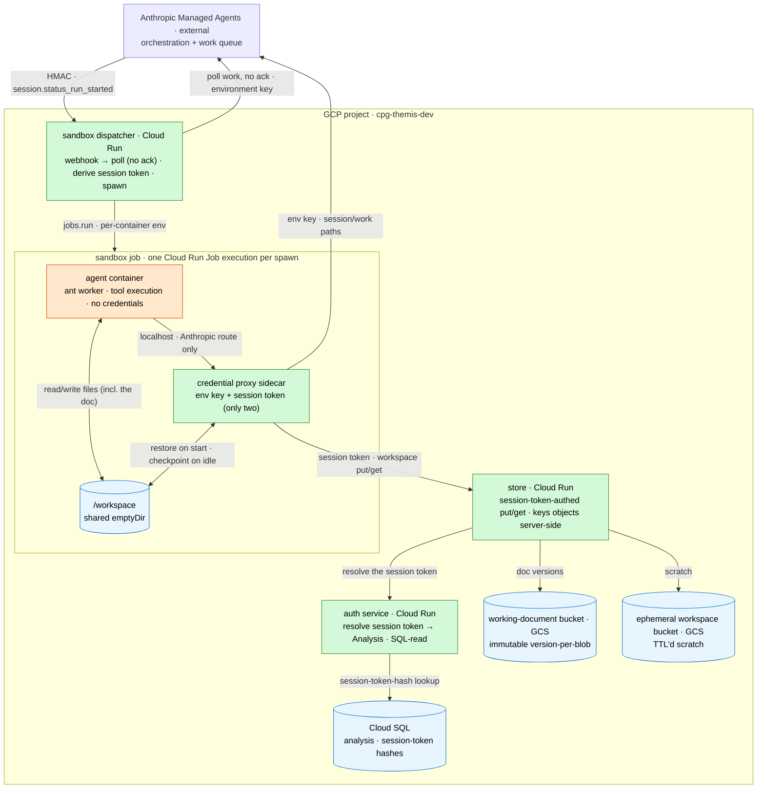
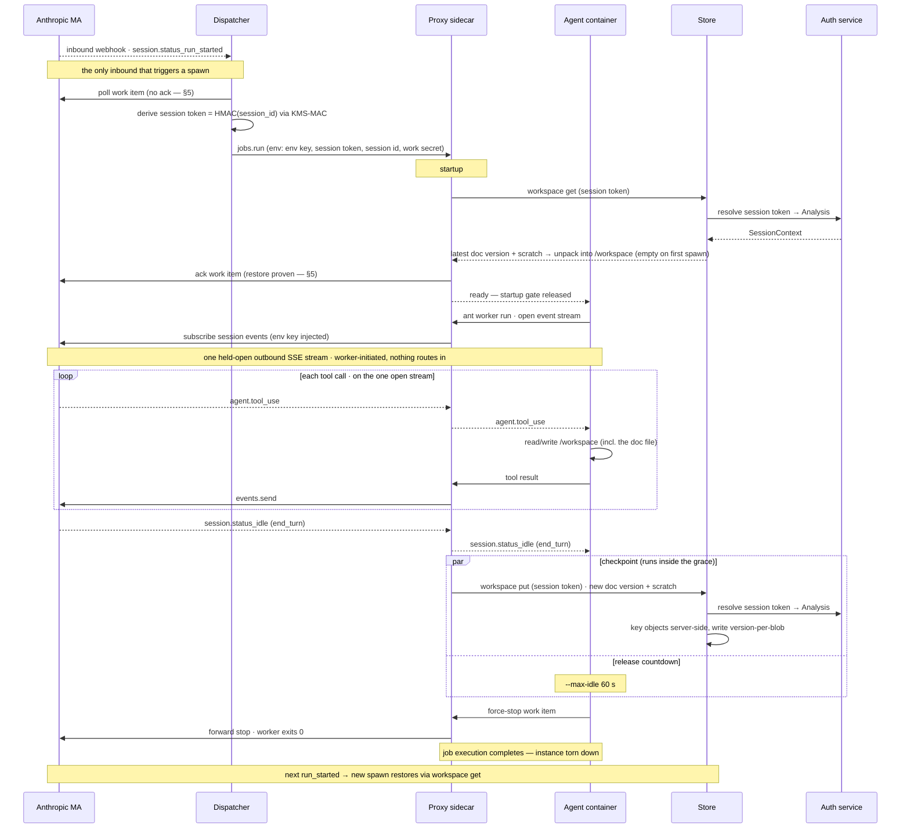

# Plan: Self-hosted sandbox on Cloud Run

This plan decides the **self-hosted execution sandbox**: where the agent's tool execution runs, and how the credentials
involved stay out of the agent's reach. It is the **execution model the wiring slice builds**
([`managed-agents-wiring.md`](managed-agents-wiring.md)) — self-hosted from the first synthetic scenarios, not a later
replacement for Anthropic's cloud sandboxes. "Self-hosted" is about *where execution runs*; it is orthogonal to *what
data* runs through it — synthetic scenarios first, non-synthetic data a later gate on top (wiring §2 scope).

## 1. Why self-host the sandbox

By default, Managed Agents executes the agent's tools inside Anthropic's cloud sandboxes. This plan runs that execution
in our own GCP project instead, from day one — the wiring plan's cloud environment is dropped (§10). Two reasons drive
it, and they compound:

- **Keep the data and internal services inside our boundary.** Once the agent's code runs in our project, the data it
  reads and the services it calls — the working-document persistence now, the genomics/compute APIs later — never leave
  our network. There is no Anthropic-reached MCP server to expose or tunnel.
- **Code mode for the internal APIs.** As the agent's work grows past editing a document — a quick analysis over a VCF,
  a call to a genomics service (§12) — it does that work by writing code (`bash`) that calls our internal APIs, which an
  LLM drives more reliably than long chains of discrete MCP tool calls
  ([code mode](https://blog.cloudflare.com/code-mode/),
  [code execution with MCP](https://www.anthropic.com/engineering/code-execution-with-mcp)). Self-hosting is the
  platform for that: the code runs inside our network and a sandbox-local proxy injects the per-session credential (§6).
  This slice exercises none of those APIs yet — **the working document is edited as a plain file** (§9), not through an
  API — but the proxy-injection pattern is built for them.

The design is held to four requirements:

- **The environment key is never agent-readable.** The worker credential (`ANTHROPIC_ENVIRONMENT_KEY`) authorizes
  claiming work and posting results for the whole environment. Agent code — `bash` running model-written commands on
  web-derived context — must not be able to read it, following the proxy-injection shape of the
  [Vercel Sandbox guide](https://vercel.com/kb/guide/run-claude-managed-agent-tools-with-vercel-sandbox): the sandbox
  holds no credential; an injector it cannot inspect adds the `Authorization` header, scoped to that session's paths.
- **Sandbox-originated egress under our policy.** The sandbox's own egress is an allowlist we control, not Anthropic's —
  a core reason we self-host. It bounds what agent code can reach *from the sandbox*, not every exfil path: the
  Anthropic-side `web_search`/`web_fetch` server tools (§2) and a residual DNS channel (§8) do not traverse it, and are
  named where they bite.
- **Scale-to-zero.** No standing compute while no session runs: no warm pool, no always-on poller, no tunnel host.
  Anthropic's work queue holds a session until a worker claims it, so waking on a webhook loses no work — a missed or
  slow spawn re-surfaces on the reclaim path (§5). There is no interactive-latency budget to trade against: a curation
  steer invokes long-running work (analysis, generation over a scenario), not a chat reply, so a cold start is dominated
  by the work it triggers and is never on the perceived critical path (§4). Scale-to-zero is unconditional — favoured
  over warmth, not balanced against it.
- **Minimal moving parts.** Anthropic keeps the orchestration loop; we run tool execution plus a thin data plane. The
  implementation should read as: one dispatcher, one job (agent + proxy), a session-token chokepoint, and a store
  fronting two GCS buckets.

### Shapes rejected

- **[GKE Agent Sandbox sample](https://github.com/GoogleCloudPlatform/kubernetes-engine-samples/tree/main/ai-ml/anthropic-agent-sandbox)**
  — an Autopilot cluster, `SandboxWarmPool`/`SandboxClaim` CRDs, a dispatcher and a stats-adapter autoscaler. Built for
  sub-second claim latency and fleet scale; our sessions run for minutes and a cold start of seconds is invisible. Its
  worker pod mounts `ANTHROPIC_ENVIRONMENT_KEY` (a `secretKeyRef`) straight into the same container that runs
  `ant beta:worker run` — the env key is readable by agent code, the property we specifically want to avoid.
- **MCP tunnel** (wiring §2 option A) — needs beta access we don't hold and a standing proxy host. Nothing needs it: the
  model edits the working document as a synced file, and the genomics APIs later are internal, so no server of ours is
  ever Anthropic-reached.
- **Always-on poller** (`ant beta:worker poll`, or a Cloud Run worker pool at min-instances 1) — the simplest worker,
  but standing cost for a queue that is empty almost always, and in-process execution would share one filesystem across
  sessions.

## 2. The self-hosted contract

What Anthropic gives us, condensed from the
[self-hosted sandboxes docs](https://platform.claude.com/docs/en/managed-agents/self-hosted-sandboxes):

- A `self_hosted` environment is a **work queue**: a session assigned to it becomes a work item. A worker claims the
  item (continuous poll, or wake on the `session.status_run_started` webhook and drain), downloads the agent's skills
  into its workdir, executes the agent-toolset tool calls (`bash`, `read`, `write`, `edit`, `glob`, `grep`), and posts
  results back. Tool inputs/outputs still flow through Anthropic's control plane; the filesystem, processes, and network
  stay ours. `session.status_run_started` fires on **every** idle → running transition, so each steering turn re-wakes a
  webhook-triggered worker.
- **Two credentials, strictly split**: the environment key (Console-generated, `sk-ant-oat01-…`) authenticates the
  worker to its queue and nothing else; the org API key creates sessions and reads queue stats and must never reach a
  worker host.
- The per-session pattern is a container whose entrypoint is **`ant beta:worker run`**, reading `ANTHROPIC_SESSION_ID`,
  `ANTHROPIC_WORK_ID`, `ANTHROPIC_ENVIRONMENT_ID`, `ANTHROPIC_ENVIRONMENT_KEY` — and honoring **`ANTHROPIC_BASE_URL`**,
  which is the hook the credential proxy hangs on.
- `web_search` / `web_fetch` are Anthropic **server tools**; the self-hosted worker's toolset implements only
  `bash`/`read`/`write`/`edit`/`glob`/`grep`, so on that evidence they execute **Anthropic-side**, not in our sandbox —
  but the docs do not state the execution locus for self-hosted sandboxes, so this is inferred, not documented, and
  wants an empirical confirmation (§12). Either way there is no MCP call and no Anthropic-reached server of ours — the
  working document is a synced file (§9) — so the sandbox's required egress is the Anthropic API (the worker's stream)
  plus the internal store the proxy syncs to (§8). Both web tools stay enabled, and exfiltration through them is bounded
  by the tools themselves. `web_fetch` only retrieves URLs **already present in the conversation** — it cannot fetch a
  URL the model fabricates, so the high-bandwidth attack (a prompt-injected agent posting the working document to a
  crafted `attacker.com/?d=…` URL) is blocked at the source. `web_search` carries only a query to a provider whose logs
  an attacker cannot read. The residual is narrow — a poisoned page could plant a collector URL for a later fetch, and
  low-bandwidth staged channels survive — and is accepted and monitored (output/citation monitoring; synthetic data this
  slice), not an unmanaged hole: the egress lockdown (§8) governs sandbox-originated egress, and the web tools are a
  separate, bounded, monitored channel, not a gap it leaves open.
  [Memory](https://platform.claude.com/docs/en/managed-agents/memory) is unsupported self-hosted (not used by the wiring
  slice).

### Verified worker mechanics

Read from the worker implementations, not the docs: `anthropic-sdk-python` @ `5e98d72`, `anthropic-sdk-typescript` @
`96d1a99`, `anthropic-sdk-go` @ `v1.55.1` (the version `anthropic-cli` pins), and the `ant` CLI itself; all four agree.
These are implementation behavior, not documented contract — re-verify the constants on worker upgrades.

- **Release trigger.** The worker holds its session and exits only when the session emits `session.status_idle` with
  `stop_reason: end_turn` and stays quiet for `max_idle` (default **60 s**; any newer event resets the countdown;
  `--max-idle 0` disables the timeout), or when the session terminates. An idle with `stop_reason: requires_action`
  never arms the countdown — but this design produces no such idle: `requires_action` arises only from a custom tool or
  an `always_ask` permission policy, and the agent's toolset (`bash`, the file tools, `web_search`/`web_fetch`, default
  `always_allow`, no custom tools — §10) has neither, so every idle is `end_turn` or terminal. The task-timeout backstop
  for a would-be `requires_action` hold is therefore defensive (config drift, a future trigger), not an operating mode
  (§6). Idle timeout and termination are benign exits (the CLI exits **0**), and on every exit the worker force-stops
  its work item.
- **Lease heartbeat.** A dedicated background task, started before skills download; first beat immediate, then every
  `min(lease TTL / 2, 30 s)` — fully independent of tool execution, so a long-running command can never lose the lease.
  A stop signal reaches the worker via the heartbeat: either the success body says `state: stopping/stopped` or the
  lease wasn't extended, or the heartbeat call returns **412** (the lease was reclaimed) — any of which cancels the
  runner.
- **Tool dispatch.** Tool calls arrive on the session's SSE event stream, reconciled against the paginated events list
  on every reconnect; results post back via `events.send`. The sandbox never calls the queue's `work/poll` endpoint —
  the dispatcher polls (§5). The `ant beta:worker run` worker itself does not `ack`; it only `heartbeat`s and `stop`s
  its own work item. Who issues the `ack`, and when, is a recovery-critical design choice (§5): the ack is issued
  **inside the sandbox** (by the proxy, once restore succeeds), never by the dispatcher before the spawn.
- **Per-tool-call ceiling.** The bash tool defaults to 120 s per command; the model can pass `timeout_ms`, but the
  session runner wraps every tool call in its own cap — 120 s in the CLI/Go worker (not flag-exposed; 150 s in Python).
  On timeout the shell is killed and restarted and the model sees an error result; bash output is capped at 100 KiB
  (tail kept). Long computations therefore run as agent-backgrounded processes polled across bash calls, and must finish
  within the sandbox's lifetime.
- **Work-item grain.** Items are enqueued at session creation and when a *dormant* session receives a new message. One
  item spans every run served while the worker is attached: a steering message inside the idle grace resets the
  countdown and reuses the same sandbox. After release, the next message must produce a fresh item — the dormancy
  threshold is server-side and undocumented (§12).
- **Auth and base URL.** Every worker call — work `heartbeat`/`stop`, session get, events, skills list/download — is a
  relative path on `ANTHROPIC_BASE_URL`, carrying `Authorization: Bearer <environment key>` with `X-Api-Key` stripped.
  The spawned bash shell is additionally scrubbed of `ANTHROPIC_*` env vars.

## 3. Architecture

Three pieces on top of the wiring slice — a **dispatcher** (Cloud Run service), a **sandbox job** (Cloud Run Job, one
execution per spawn, holding the untrusted agent container and a credential-proxy sidecar), and a **thin data plane**: a
session-token **auth service** and a **store service** fronting two GCS buckets. The store is the wiring plan's,
reshaped from an editor-tool MCP server into a session-token-authed put/get mediator (§9). The agent holds no credential
of any kind.

Orange is the one untrusted component (the agent container); green are the credentialed mediators; blue is data. The
agent edits files on the shared `/workspace` — the working document among them, at the contract path (§9) — and reaches
Anthropic only through the proxy; it calls **no** data-plane service. The proxy syncs the filesystem to the store on its
behalf, and the store resolves the session token through the auth service, the sole reader of the session-token table.
In the diagram the **environment key** is the Anthropic worker credential (§2) and the **session token** is the
per-session sync credential (§7). Sections 5–9 detail each piece; §4 is how they move together.

## 4. The end-to-end flow

One session, from spawn to release, then respawn:

1. The session goes `running`; Anthropic enqueues a work item and fires the `run_started` webhook to the **dispatcher**.
1. The dispatcher **polls** the item (without acking — §5), **derives** the session token (§7), and triggers **one Cloud
   Run Job execution**, injecting the environment key and the session token into the **proxy** container only.
1. The **proxy** starts first. It restores `/workspace` from the store — the latest working-document version into the
   contract path, plus the session's ephemeral scratch (§9) — then **acks** the work item (only now, restore proven —
   §5) and marks itself ready, gating the agent container's start, so `ant beta:worker run` always boots onto the
   restored filesystem.
1. The **agent** attaches to the session's SSE event stream (through the proxy) and runs the tool loop: `bash`/file
   tools operate on the shared `/workspace`, and the model **edits the working document as a plain file** at the
   contract path. It calls no data-plane service.
1. When the session idles with `stop_reason: end_turn`, the proxy — which is forwarding that stream — **checkpoints**:
   it snapshots the durable glob (the paths marked for versioning, §9) into a new immutable working-document version and
   syncs the ephemeral scratch, via the store under the session token. The same idle event starts the worker's 60 s
   release countdown, so the checkpoint runs concurrently with it (§9).
1. The worker releases, force-stops its work item, and the **job execution exits 0**. Scale-to-zero until the next
   steer.
1. The next steering turn fires another `run_started`; a fresh sandbox spawns and restores `/workspace` from the store.
   This is the **run-lived** model — one Job execution per run, not one per session — held coherent across the gap by
   §9's checkpoint/restore.

**One outbound connection — no inbound path to the sandbox.** After the dispatcher spawns the job, the worker
*initiates* every connection: it opens a single long-lived SSE subscription to the session's events on
`ANTHROPIC_BASE_URL` (through the proxy, which injects the environment key) and holds it across the run, re-establishing
and reconciling on drop (§2). Tool calls arrive on it; results post back via `events.send`. The proxy's sync calls to
the store are also outbound and **proxy-initiated** — the agent never issues them. Nothing is dispatched *into* the
sandbox: the only externally-initiated connection that triggers a sandbox spawn is the `run_started` webhook to the
dispatcher (§5), and the sandbox exposes no port of its own. That is what lets it be a scale-to-zero Job behind
internal-only networking (§8) rather than a reachable service.

**Run-lived, with a grace window.** The worker exits 60 s (`--max-idle`, §2) after the `end_turn` idle; a steer landing
inside that window reuses the live sandbox instead of respawning. `--max-idle` is a latency/cost knob, but latency is
not a driver here — a steer invokes long-running work, not a chat reply (§1), so the cold start on the first steer or
after a pause past the window is dominated by the work it triggers, not felt as UI lag. We therefore keep `--max-idle`
low and favour scale-to-zero; correctness does not depend on it either way, because `/workspace` is checkpoint/restored
(§9).

**"Idle" is a protocol state, not a traffic heuristic** (§2). The release countdown arms only on the `end_turn` idle
event, never on output silence, and a `requires_action` idle holds the sandbox indefinitely — so the minutes-long
thinking gaps *between* tool calls never read as idle. Nor does a long computation: it cannot be a single command (the
runner caps each call at ~120 s, §2), so it runs as an agent-backgrounded process polled across bash calls while the
session stays `running` and the background heartbeat holds the lease. A 30-minute analysis is many sub-120 s polls, not
one in-flight call — and looks `running`, never idle, throughout.

**Long-run maintenance events — connections break, `/workspace` survives.** For executions running **beyond ~1 h**,
Cloud Run may migrate the task between machines during a maintenance event. The docs describe this as a **live
migration** — the container is paused (`SIGTSTP`, with 10 s of warning) and resumed (`SIGCONT`) on the new machine, not
restarted — so in-memory state, including the tmpfs `/workspace`, is preserved across it. What drops is in-flight
network connections: the worker's SSE stream and any proxy sync in flight, both survivable (the worker reconnects and
reconciles, §2; a sync retries). So the residual exposure is a torn in-flight connection, not a lost workspace — and the
real bound on a runaway long computation is the **task timeout** (§6), not migration. Live migration is transparent to
the workload — the pause/resume preserves memory, so `/workspace` is never lost to a maintenance event. What is *not*
covered is a **non-migration** instance loss mid-turn (OOM, machine failure, the task-timeout kill): checkpoints run
only at `end_turn` (§9), so an in-progress turn's scratch and uncommitted edits are lost and the turn re-runs from the
last committed version. The deliverable is always safe — versions are immutable and minted only at `end_turn` — so this
is a bounded re-run, cheap for the short turns of this slice; the long-computation (code-mode) case, where a re-run is
expensive, is the gate on intra-turn durability (§12).

## 5. Dispatcher

A minimal Cloud Run service (scale-to-zero); it reads the environment key from Secret Manager and is the only service
that does. One public HMAC-verified webhook endpoint (Anthropic cannot present a GCP token — the same posture as the
BFF's webhook receiver, wiring §4). On `session.status_run_started` it:

1. **Drain-polls the queue** (`work.poller` with `drain`, `auto_stop=false` — the spawned sandbox owns the stop call).
   The poller **does not ack** — ack is deferred into the sandbox (below). It **force-stops** a non-`session` item
   itself rather than skipping it, since under `auto_stop=false` a skipped item's lease would sit until TTL. It forwards
   the poll response's work fields (session/work/environment ids) into the spawn; work-item operations authenticate on
   the environment key + work id, so the poll's per-item `secret` is unused and not forwarded.
1. **Derives the session token** — `HMAC(session_id)` via the KMS MAC key (§7). No DB access and no session→Analysis
   resolution here: the BFF already bound the session token to its Analysis at session create, and the auth service
   resolves it at call time. (If the session has no session-token row, the store rejects downstream — a bug in session
   create, surfaced there.)
1. **Triggers one sandbox job execution** via `jobs.run` with per-container environment overrides: session/work/
   environment ids to both containers; the environment key and the derived session token **to the proxy container
   only**. **If the spawn call fails, do nothing** — the item is still unacknowledged, so `reclaim_older_than_ms`
   re-surfaces it on a later drain (below), the same recovery as a slow cold start.

**Ack is deferred into the sandbox — this is recovery-critical.** `reclaim_older_than_ms` re-surfaces only
*unacknowledged* work items (the API's exact word); `ack` transitions an item `queued → starting` and **removes it from
the queue**, and no documented mechanism returns an acked-but-heartbeatless item (lease-TTL-expiry behavior is
unspecified, and there is no re-enqueue endpoint — §12). So a dispatcher that acked on claim would strand a spawn that
dies during cold start — after the ack, before the worker's first heartbeat — with **no automatic recovery**. Keeping
the item unacked until the sandbox is proven up puts every cold-start failure back on the documented reclaim path. The
**proxy** therefore issues the `ack` as its first action after a **successful restore** (§9), just before it releases
the agent-start gate: an instance that never comes up, or whose restore fails, never acks, and reclaim brings the item
back — a persistently-failing restore is bounded by the store-counted circuit breaker (§9), not looped forever. The
lease is bound to the environment key + work id, not the ack'er's identity, so the sandbox heartbeats and stops the item
the dispatcher polled (§2, verified against the SDK's `auto_stop=false` handoff).

Webhook deliveries retry with the same event id and draining an empty queue is a no-op, so duplicate or overlapping
deliveries are harmless. If the dispatcher is down, sessions queue rather than fail — but Anthropic **auto-disables** a
webhook endpoint after ~20 consecutive failed deliveries, so an extended outage needs the queue-depth alert plus a
Console re-enable step in the runbook (§11).

**Recovery is `reclaim_older_than_ms`, since the item stays unacked until the sandbox proves itself.** An item polled
but not yet acked sits in the queue's pending set; a later drain with `reclaim_older_than_ms` past the window
re-surfaces it for another spawn. Two things must hold. **Set it explicitly** — the poller leaves it unset and the
server applies a 5 s default, far below cold-start latency (Direct VPC egress connection-establishment runs a minute or
more on a cold instance, §8), so a 5 s window re-surfaces the still-booting item and **double-spawns on nearly every
cold job**. Size it above worst-case cold-start-plus-restore time (a few minutes), accepting that a genuinely failed
spawn takes that long to recover. It is the reclaim window, not the webhook retry, that bounds recovery: retries reuse
the event id (Anthropic documents "at least once", same id; no schedule), so a retry landing inside the window drains
empty and no-ops. But reclaim only re-surfaces the item — the dispatcher still drains only when a webhook wakes it (no
timer, §1). If delivery already returned 2xx (a silent spawn failure, no further retries), the orphaned item waits for a
later unrelated webhook to drain it — or, in a quiescent environment, for the queue-depth alert and runbook (§11).

A double-spawn cannot become double-*service*: the sandbox's first `heartbeat` claims the lease with
`expected_last_heartbeat: NO_HEARTBEAT`, and every later heartbeat echoes the server's value (412 on mismatch), so two
workers can never hold one lease (§2). The loser's worker is cancelled on the 412 and exits before any `end_turn`, so it
never reaches the checkpoint that would mint a document version (§9); its redundant `ack` is harmless (the item is
already `starting`); and because both spawns derive the same per-session bearer, there is no stray session-token row to
clean up (§7).

## 6. Sandbox job & the credential proxy

One Cloud Run Job execution per sandbox spawn — its own instance (Cloud Run's per-instance gVisor/microVM sandbox) with
a fresh filesystem, exiting when the worker releases the session (§4). A Job task has CPU allocated for its entire
lifetime — there is no request-based throttling because there are no requests — so long computations run at full speed;
this is why the sandbox is a Job and not a request-billed service. A long computation is not one long tool call (the
runner caps each call at ~120 s, §2): the agent backgrounds the process and polls it across bash calls, keeping the
session `running` — and the sandbox alive — until the work completes. The Job's **task timeout** is the ultimate
backstop and must be **set explicitly**, sized to the longest legitimate session plus margin — not Cloud Run's short
default, which would kill a long agent-backgrounded computation. It caps the cost of a worker network-partitioned from
Anthropic — which can't even receive the heartbeat `412` that would otherwise stop it (§2), so only its own
self-exit-on-failure (if any, §12) or the timeout ends it — and, defensively, of a would-be `requires_action` hold,
which this design does not otherwise produce (no custom tools, no `always_ask` — §2). The timeout bounds one instance,
not a session that keeps re-spawning; that is the queue-depth alert and runbook's job (§11).

**One runner, one shell, one workspace per session.** The worker runs a single tool runner over one persistent bash
session and one `/workspace` for the whole session — tool calls execute **serially**, so the coordinator's up-to-25
concurrent threads (wiring §3) do not get parallel tool execution, and they share shell state, the background-job table,
and scratch files. This is the Managed Agents worker's default (the cloud sandbox shares one container across threads
the same way), not a self-hosting artifact — and it is largely harmless: serial dispatch only bites as **head-of-line
blocking** when a single tool call runs long, and the throughput-relevant parallelism (LLM reasoning across the threads)
is concurrent regardless. Short calls interleave fine. The discipline that keeps calls short is to background anything
slow and poll it (§4) and to push heavyweight or long analyses to dedicated async API endpoints that return a monitor
token (§12), so nothing long-blocking runs inline. The residual — shared mutable state across concurrent *inline*
analysis — the async-RPC direction avoids; and self-hosting, unlike the cloud, holds the lever to add per-thread
isolation later (the worker's tool runner is pluggable, §12). Two containers:

- **Agent container** — the untrusted one; all tool execution happens here. Entrypoint `ant beta:worker run`; env: the
  session/work/environment ids, `ANTHROPIC_BASE_URL=http://127.0.0.1:<proxy-port>`, and a **placeholder**
  `ANTHROPIC_ENVIRONMENT_KEY` (the CLI requires one; the proxy replaces the header, so the value is never valid). Image:
  a slim base plus `ant`, a Python runtime, and the document linter (§9). Workdir `/workspace` (the shared emptyDir,
  checkpoint/restored, §9); an in-memory volume at `/mnt/session/outputs` satisfies the harness contract (the system
  prompt directs deliverables to the working-document file, so anything written there is discarded by design).

- **Credential proxy sidecar** — a **host-pinning reverse proxy** for the Anthropic route (not a forward proxy: a
  forward proxy honors client-named upstreams, which would let agent code tunnel anywhere), **the sandbox's sync
  client** for the store, and the issuer of the work-item **`ack`** once restore succeeds (§5, §9). It is configured
  entirely by per-execution env (injected by the dispatcher).

  **The agent-facing surface is a single route — the Anthropic API.** The model calls no data-plane service (it edits
  files; the proxy syncs them, §9), so there is no agent-forwarded store route this slice. The proxy's calls to the blob
  store are **proxy-initiated** (the proxy is a client, injecting the session token on its own `workspace put`/`get`),
  not forwarded on the agent's behalf. The forward-and-inject machinery is retained but dormant: it is the mechanism the
  genomics/compute RPCs will use when the model again calls an internal API through the proxy (§1, §12).

  **Transport — gRPC (HTTP/2, binary protobuf) over TypeSpec-authored proto.** The internal data-plane services (the
  store and auth this slice; the genomics/compute APIs the model scripts later) speak gRPC, their contracts authored in
  TypeSpec and emitted to `.proto` (see [`../design/services.md`](../design/services.md)). Credential injection across
  the untrusted boundary drives the shape, and this slice makes it trivial: the model calls no data-plane service, so
  the proxy is the store's gRPC **client**, injecting the session token as `x-themis-session-token` metadata (and the SA
  ID token as `authorization`) on its own `workspace put`/`get` — a per-call option, no forwarding involved. The
  Anthropic route stays an HTTP/1.1 reverse proxy (third-party REST, below). The dormant forward leg — agent → proxy →
  an internal gRPC service, for the genomics/compute RPCs (§1, §12) — is a fixed-upstream, method-allowlisting,
  metadata-injecting HTTP/2 forwarder: gRPC's structure (upstream from config, not client-named; `/pkg.Service/Method`
  paths allowlisted exactly; HTTP/2-native streaming) keeps it small, not the Envoy-class rebuild REST framing would
  force. The committed `.proto` is the contract: the server subclasses the generated servicer base — the interface is
  forced structurally, `buf breaking` gates evolution, and the generated stub ships in the sandbox image for the model
  to call. gRPC is less self-inspectable than JSON in code mode, but the model calls the typed stub, not raw HTTP, and
  streaming is first-class (the workspace sync).

  Its hardening, each property load-bearing on the Anthropic route (the store-client leg validates the store's hostname
  and injects the session token as `x-themis-session-token` metadata):

  - **No client-named upstream.** Ignores any client Host / absolute-form target; **rejects `CONNECT`**.
  - **Path canonicalization.** Full percent-decode, then `..` collapse, rejecting any residual encoded slash; matches
    *and forwards* the same canonical form, so `..%2f`-style traversal can neither match the allowed prefix nor resolve
    elsewhere upstream.
  - **No credential-carrying redirect.** Never follows a 3xx with the injected credential attached (a redirect to an
    off-allowlist host would leak the key or session token).
  - **Strict upstream TLS.** Validates the certificate on both legs; the L4 FQDN allow (§8) admits any connection to the
    allowed IP, so cert validation — not the firewall — authenticates the upstream and stops a hijacked IP from
    receiving the credential or injecting tool calls. Pin `api.anthropic.com` at SPKI/CA granularity (a leaf pin
    hard-fails every session on Anthropic's cert rotation); the store leg validates the store's specific hostname (not
    any `*.run.app` cert), which an IP hijacker cannot forge.
  - **Unbuffered streaming.** The Anthropic route streams — no response buffering, no idle timeout, per-chunk flush: it
    carries the worker's long-lived SSE event stream (minutes quiet between tool calls, §2); a buffering or idle-timeout
    proxy stalls tool delivery or tears the stream on every thinking gap.

  The one agent-facing route forwards the Anthropic API base URL to `api.anthropic.com`, injecting
  `Authorization: Bearer <environment key>`. Allowed paths: `/v1/sessions/<sid>`, `…/<sid>/**`,
  `/v1/environments/<eid>/work/<wid>`, `…/work/<wid>/**` — literal ids, 403 otherwise.

Matching is **path-only** (the query string is stripped first — every worker call carries `?beta=true`) and the ids are
**literal, not wildcard segments**. Both the bare resource and its subtree are allowed on purpose: the worker issues a
bare `GET /v1/sessions/<sid>` at startup — session retrieve, unconditionally, before the skills loop and whether or not
the agent has any skills (verified in the SDK source, §2). A subtree-only `…/**` pattern would 403 that call. The two
SDK workers then diverge: the Python worker **fails the whole job** (the retrieve is outside its skills try/except), and
the `ant`/Go worker — the one we deploy — **logs a warning and runs on with skills silently skipped**. Either way the
entry is required. Pinning the literal `<sid>`/`<wid>` (rather than a `*` segment) is what confines the sandbox to *its
own* session and work item — a wildcard would admit other sessions' and other work items' paths, including the
queue-level `/work/poll` and `/work/stats` that must never be reachable (§2). The one surface the allowlist **cannot**
scope is skills: `/v1/skills` is org-wide, not session-scoped, so it stays out until skills are used. Adding it
knowingly widens a sandbox compromise to an org-wide skill **read** — every Project's skill definitions — so it is gated
on keeping skills free of sensitive content (§12).

So compromised agent code can act only as *this* session on the Anthropic path, and it has **no data-plane path at
all**: the session token lives only in the proxy (§7), so a request the agent crafts to the store carries no valid
session token and is rejected (§8). The secrecy of the injected credentials rests on Cloud Run's per-container
namespaces (§7).

## 7. Credentials & identities

The wiring plan's stance of keeping identities separate, extended. Three new identities, all narrow:

| Identity                 | Holds                                                                                                                                                                                                                                                     | Deliberately lacks                                                                                                                       |
| ------------------------ | --------------------------------------------------------------------------------------------------------------------------------------------------------------------------------------------------------------------------------------------------------- | ---------------------------------------------------------------------------------------------------------------------------------------- |
| **Dispatcher SA** (new)  | environment-key secret access, plus the webhook-signing-key on the own-subscription path (§12); KMS *MAC* (use-only) on the session-token signing key, to derive the per-session bearer; `run.jobs.run` on the sandbox job                                | org API key; any table; the raw signing key; any GCS/store credential                                                                    |
| **Sandbox job SA** (new) | `run.invoker` on the sandbox-reachable services only (the store now)                                                                                                                                                                                      | every other role; invoke alone yields no data — a metadata-minted token opens nothing without the session token (held only by the proxy) |
| **Auth SA** (new)        | session-token-hash **read** on Cloud SQL, and nothing else                                                                                                                                                                                                | environment key; any GCS; any write                                                                                                      |
| BFF SA                   | its wiring §4/§8 roles, minus the working-document-version write (now the store's checkpoint, §9), + KMS *MAC* (use-only, to compute the bearer whose hash it records at session create) + **read** on the working-document bucket (the version selector) | environment key; the raw signing key; GCS write                                                                                          |
| Store SA                 | GCS **read/write** (object admin) on the working-document and ephemeral buckets; invoke the auth service                                                                                                                                                  | environment key; org API key; Cloud SQL (session tokens resolved via auth)                                                               |

- **Environment key.** Generated in the Anthropic Console (Console-only — a manual runbook step per environment), stored
  as encrypted stack config → Secret Manager, read by the dispatcher. It reaches the proxy container as a per-execution
  env override; at runtime it exists only in the dispatcher and the proxy container — never the agent container.
  Rotation = regenerate in Console + config update — and Anthropic cannot fast-revoke a leaked key, so keeping it out of
  the agent container is load-bearing, not defense-in-depth.
- **Session token — the per-session sync credential, derived not stored.** One per-session key authorizes the whole
  workspace sync — the working document and the ephemeral scratch (§9) — replacing the wiring §5 vault-stored session
  token; its lifecycle is wiring §5's.
  - *Derivation.* The bearer is `HMAC(session-token-signing-key, session_id)`, the signing key a use-only Cloud KMS MAC
    key (the material never leaves KMS, so no service can exfiltrate it). So there is no plaintext at rest, no
    per-session secret, and no runtime secret creation.
  - *At rest.* Only the one KMS key (read-only) and, in `session_context`, the hash of the bearer plus its binding
    (Analysis, Project) — written once by the BFF at session create (compute via KMS-MAC, hash, store) and revoked once
    at `terminated`.
  - *Resolution.* The dispatcher re-derives the bearer at each spawn and injects it into the proxy (no DB write, no
    lookup); the proxy presents it on its `workspace put`/`get` calls; the store forwards it to the auth service, which
    hashes it, matches the row, and returns `SessionContext(analysis_id, project_id, created_by)`; the store keys the
    blobs server-side from that Analysis (§9). One session token per session — no per-claim churn, no bulk-revoke.
  - *Blast radius.* The proxy only ever receives its own session's derived bearer, never the signing key, so a
    compromised proxy is confined to its own Analysis. The concentrated trust is the signing key: a compromised
    dispatcher or BFF can forge a bearer for any live session, so those two are the credential's blast radius — guarded
    like the env key, never reachable from the sandbox. Deterministic derivation (`HMAC(session_id)` under one org-wide
    key) makes a signing-key compromise retroactive and total — every session's bearer, past and present, is forgeable —
    where the wiring plan's random-per-session bearers survive a DB leak (only hashes are stored). The trade buys
    statelessness (no per-session secret at rest, no runtime secret creation) against a single higher-value key; it is
    defensible because KMS MAC material never leaves KMS, but it is a real shift, not pure upside.
- **Auth service — the sole session-token-table reader.** A tiny Cloud Run service: bearer in → `SessionContext` out,
  backed by a session-token-hash read on Cloud SQL (resolve-only). It is a **credential chokepoint**, not a reuse
  convenience — the wiring §5 auth *library* already gives reuse and a lockstep contract. Its value is that with the
  genomics/compute APIs coming (§1, §12) — several session-token-authed internal services — **one** service reads the
  session-token table rather than each data service holding SQL-read. It commits to no capability format: minting scoped
  capabilities (signed URLs, downscoped tokens) so a caller reaches a resource *directly* is the evolution when the
  first non-blob API lands, and it trades sandbox-egress tightness (§8) for removing the byte-serving hop — deferred
  (§12). This is a change from wiring §5's per-server auth library, updated downstream.
  - **Why not the env key for the sync?** The env key is environment-wide (identical for every session), so the store
    couldn't derive *which* Analysis a call is for without a proxy-supplied session id — and authorizing on "valid env
    key + session id" would let one compromised sandbox reach **every** session's document across all Projects. The
    per-session token contains a sandbox compromise to its own Analysis.
  - **Why one key for the whole sync?** Routing both the working document and the scratch through the same session token
    → same Analysis check (§9) means the narrow per-session key does the job for both, and no blob-storage credential
    goes near the sandbox — no workspace-writer SA, token minting, or downscoping.
- **Minimal job SA — invoke-only, inert without the session token.** Cloud Run instances share one runtime identity
  across containers, and agent code can always mint that SA's tokens from the metadata server (link-local, unblockable)
  — so the SA holds only `run.invoker` on the sandbox-reachable services and nothing else. That role is not a data
  capability: every reachable service resolves the session token on every route (§8), so a metadata-minted token passes
  the Cloud Run gate but opens nothing without the proxy-held session token. The invoker binding documents the caller
  set and adds a second factor against a session token forged by a non-sandbox identity (the signing-key blast radius,
  above); it never substitutes for the session token, since the agent shares the SA. The SA still holds no Secret
  Manager, GCS, or DB role — the proxy cannot fetch its own secrets (that access would extend to agent code); the
  dispatcher pushes them in.
- **Why the proxy's env stays secret from the agent.** Cloud Run's container contract runs each container under its own
  user, network, PID, and other namespaces, so the agent container cannot read the proxy's environment via
  `/proc/<proxy-pid>/environ` (containers share only the network namespace and talk over localhost, §8). The proxy's two
  credentials — the env key and the session token — live only in its env. Multi-container **Jobs** are GA, and the
  contract's namespace language is not scoped to services — but it does not name the mount namespace explicitly, so we
  still confirm PID/mount isolation on Jobs with a negative test before trusting it (§12).
- **Override visibility.** Per-execution env overrides are readable by project principals holding `run.executions.get` —
  the same humans and deploy identity who can read the source secret, so no new trust is extended. If that ever
  tightens, the seam is KMS envelope encryption of the override values, decrypt granted to the job SA (agent code would
  hold the permission but can never read the ciphertext, which lives only in the sidecar's env). Deferred (§12).

## 8. Egress & instance hardening

- **Direct VPC egress, all traffic**, for the sandbox job: a deny-all egress firewall for the job's SA/tag, allowing
  Anthropic's published inbound range (`160.79.104.0/23`, `2607:6bc0::/48`) on `:443` and the internal route to the
  store (internal-ingress Cloud Run). The sandbox reaches **only** Anthropic and the store — all workspace persistence
  goes through the store (§9), not GCS, so there is no `storage.googleapis.com` in the sandbox's allowlist (the store
  reaches its own buckets with its own identity; the auth service is reached only by the store, not the sandbox). This
  bounds L3/L4 egress hard; the two channels that would otherwise keep it from being an absolute seal — DNS resolution
  and the egress IP itself — are each closed below:
  - **DNS — closed by a response-policy allowlist.** An L3/L4 egress rule does not restrict which *names* the workload
    resolves, so on its own it leaves recursive queries for `<base64-chunk>.attacker.example` as a low-bandwidth
    exfiltration path (the query reaching the attacker's authoritative nameserver *is* the leak). Close it with a
    **Cloud DNS response policy (RPZ)** on the sandbox VPC: a wildcard `*` catch-all sinkholed locally — answered
    without recursing, so the query never leaves — with `bypassResponsePolicy` exceptions for the *exact* names the
    sandbox needs (`api.anthropic.com`, the store), exact rather than `*.anthropic.com` so subdomain tunnelling under an
    allowed parent is caught too. The two ways out — querying an external resolver directly, or DNS-over-HTTPS — are
    outbound to non-allowlisted hosts, so the deny-all egress firewall already drops them. The metadata resolver
    (`169.254.169.254`) is link-local and firewall-exempt but *forwards to the VPC's Cloud DNS*, so it is governed by
    the same RPZ — not a bypass. One build-time probe confirms the metadata path honours the policy (§12).
  - **Egress IP — pinned to Anthropic's published range.** Anthropic publishes fixed, dedicated inbound CIDRs for the
    API ([`160.79.104.0/23`, `2607:6bc0::/48`](https://platform.claude.com/docs/en/api/ip-addresses), "will not change
    without notice"), so the egress rule pins those directly rather than resolving `api.anthropic.com` firewall-side.
    That removes the FQDN-object IP cap and any firewall/workload resolution mismatch, and — because the block is
    Anthropic-owned, not shared-CDN — leaves no co-tenant for an SNI-mismatched connection to reach (the agent shares
    the network namespace, below, and can open its own socket to the allowed range, bypassing the proxy's cert pinning;
    a dedicated block is what makes that harmless). Residual: watch the published list for changes, which arrive with
    notice — a bounded operational watch, not a hole.
- Containers in an instance share the network namespace, so the policy cannot distinguish agent from proxy. That is
  acceptable because reachability without the session token is harmless: agent code can reach `api.anthropic.com` or the
  store directly — and can mint the job SA's invoker token — but holds no environment key and no session token, so every
  such request is rejected at the credential check; the scoped proxy is the only path that carries them. (Credential
  *secrecy* across the container boundary rests on the PID/mount-namespace split, §7 — a separate mechanism from network
  reachability.)
- **The store's ingress is internal and IAM-gated to the sandbox job SA** — no public endpoint; the sandbox reaches it
  over the VPC, and the auth service sits behind it, reachable only from the store. The proxy presents the job SA's ID
  token (`run.invoker`, §7) *and* the session token. IAM is defense-in-depth, not the authorization: the agent shares
  the job SA and can mint that token, so invoke never substitutes for the session token — the store enforces it on
  **every** route, **default-deny**, `workspace put`/`get` answering only after the auth service resolves the session
  token, with no unauthenticated surface beyond a trivial health check that leaks no version or dependency detail (§12).
  What the invoker gate buys over an IAM-open store is a documented caller set and a second factor against a session
  token forged by a non-sandbox identity (the signing-key blast radius, §7).
- Sandbox sizing starts small (1 vCPU / 2 GiB — the workload is CLI calls and small scripts, and all 25 threads of a
  session share one sandbox); tune from `agent_run` usage data.
- The dispatcher keeps default egress — it reaches `api.anthropic.com` plus KMS, Secret Manager, and the Cloud Run Admin
  API (`jobs.run`) over Google APIs, and does no DB access (§5, §7); it has no VPC-facing role and no Cloud SQL
  connector.

## 9. Persistence — the working document and `/workspace`

The wiring plan's store is reshaped. It is no longer an editor-tool MCP server the agent calls per edit; it is a
session-token-authed blob mediator (`workspace put`/`get`) fronting two buckets, resolving the session token through the
auth service (§7). The agent never calls it — **the model edits files, the proxy syncs them.** Two kinds of state, split
by an explicit persistence contract:

### The working document — a file the model edits directly

- **Direct file editing.** The model authors the working document with the standard, well-trained file tools
  (`edit`/`grep`/`read`/`write`/`glob`) on a plain markdown file at a **contract path** in `/workspace`. There is no
  store CLI and no MCP editor tools; the agent YAML drops `mcp_toolset` and `mcp_servers` and enables `bash` + the file
  tools (§10). The system prompt tells the model where the file is and what shape it takes (the ACMG outline, wiring
  §3).
- **Persistence contract.** A glob names the **durable** paths (default: the working document); the complement is
  ephemeral scratch. Widening the glob to a whole directory is the same mechanism — a deliberate choice about *what
  deserves versioning*, not a default, since scratch churn should not mint versions.
- **Versioning — immutable version-per-blob.**
  - *Creation.* Only the proxy writes a version, and only while its worker holds the lease — the proxy forwards the
    heartbeats, so it sees the 412 on the next forwarded heartbeat when the lease is lost (§2 cadence; the fencing check
    is a §12 build item) — on the live `end_turn` of the turn it served. A double-spawn straggler, whose heartbeat 412s
    and whose runner is cancelled before it serves a turn (§5), writes none.
  - *Layout.* Each version is `working-documents/<analysis_id>/versions/<n>` — a bare markdown object while the durable
    glob matches one file, a tar once it matches several. `<n>` is **store-assigned**: the checkpoint reads the latest
    stored key and writes `<n> = latest + 1`, **zero-padded** so a prefix listing orders numerically and the newest is
    the last key. The store is the sequence authority — ordering never depends on Managed Agents exposing a comparable
    per-session turn sequence (its high-water mark may be dedup-able only, wiring §4). The MA steer index, curator, and
    session id ride in GCS custom metadata as **labels**, not as the ordering key; `timeCreated` is intrinsic.
  - *Ordering.* The write is create-only (`if-generation-match: 0`) over the store-assigned successor of the latest key,
    so two writers racing the same `<n>` cannot both win and no straggler can reorder or clobber history — the guarantee
    rests only on GCS's atomic create and the lease fence (§12), both ours. `<n>` derives from the latest *stored* key,
    never from restored content, so a corrupt-latest restore that falls back to a prior version still mints a
    superseding higher `<n>` rather than colliding.
  - *Not GCS generations.* No object-versioning anywhere: versions are first-class objects, so their identity is stable
    and their history explicit, not a retention side effect. A future accept-to-publish freeze is a retention hold on
    the chosen object (§12).
- **Why blob, not Cloud SQL.** The document is fetched **whole** by `(analysis, version)`, never queried by content, so
  Cloud SQL's relational strengths do not apply; a Cloud-SQL representation would force the checkpoint to *parse and
  persist* — a server-side editor step the file+sync model exists to delete. Blob is the content's natural home and
  collapses the document onto the **same sync path already needed for scratch**. (This reverses the wiring plan §7's
  Cloud-SQL-for-small-artifacts rationale, which is downstream to update: small scale argued for SQL's *simplicity*; the
  reason here is *fit* + one sync mechanism, not scale. Cloud SQL still holds the relational session-plane data — the
  Analysis rows, Project membership, and `session_context` hashes — only the document *content* moves to the blob.)
- **Read path — the BFF, directly.** The BFF reads the working-document bucket with a read-scoped SA, authorizing via
  IAP + Project membership (wiring §4) — it does **not** go through the session-token chokepoint, which exists to
  confine the *untrusted sandbox*, a different trust domain. The version selector lists the `versions/` prefix; the
  current draft is the latest version. This resolves the wiring plan's Cloud-SQL working-document reads (wiring
  §4/§6/§7) onto GCS. Version-creation **unifies**: the checkpoint *is* the version, so the wiring plan's separate
  BFF-written per-turn version snapshot (on the `idled` webhook) is gone — the same `end_turn` boundary, one writer.
- **Live mid-run draft.** The model's edits live only in `/workspace` between checkpoints, so the working-document pane
  updates at **turn boundaries**, not per edit — a change from the MCP path, where each edit hit Cloud SQL immediately.
  Turn-boundary coherence is acceptable for the slice (and avoids showing half-edited states); a debounced draft blob
  the proxy overwrites on file-change is the enhancement if a live pane is wanted (§12).
- **Validation.** The wiring plan's per-edit store validation is gone (there are no store edits). Two replacements: a
  **linter** shipped in the sandbox image (a skill/CLI the model runs to self-correct during the turn — a convenience,
  not a gate), and **render-time validation** in the frontend — the renderer is the arbiter, and on a parse/validation
  failure it shows a warning and falls back to raw text (beside wiring §6's "no document produced" state). The hard
  synchronous gate becomes a visible-at-render soft gate — weaker, but *visibly* weaker, which is the fail-loud property
  that matters. Linter and renderer share rules where practical; the renderer is authoritative.

### Durable `/workspace` — scratch continuity across respawns

Run-lived sandboxes (§4) give each spawn a fresh `/workspace`. Within one spawn persistence is full — the same
filesystem and one persistent bash subprocess carry across every tool call — but a **respawn** (the next `run_started`
after the grace window) starts blank. Anthropic's **cloud** sandboxes instead keep the per-session container alive
across turns, so the model is trained to treat its local files as session-persistent: a script it wrote a turn ago, a
note-to-self, an intermediate dataset. Under run-lived self-hosting those vanish across a respawn. The durable
*artifact* is safe (the working-document versions are immutable in GCS), but the agent's ephemeral *scratch* is not, and
the gap surfaces as lost coherence when a curator steers after a pause.

The naive fix reintroduces the exact credential hole the design avoids. A native Cloud Run GCS-FUSE volume authenticates
as the **job's runtime SA**, and agent code can mint that SA's token off the metadata server — reachable from
application code, and blockable by neither the proxy (a cooperative injector, not a network chokepoint) nor the VPC
firewall (metadata is link-local) (§7, §8). So it can call the GCS API directly and bypass the mount view. A shared
bucket then means cross-session — and, since one job has one SA spanning all Projects, cross-**Project** — read/write:
the GKE-sample hole (§1). So scratch persistence must hold three properties at once: the agent's SA holds **no storage
role**, each session is confined to **its own state even against adversarial code**, and the agent still sees a **real
filesystem**.

We route scratch through the same store under the same session token, so the proxy holds no GCS credential: it is just
another authorized `workspace put`/`get`, using the per-session token that also carries the document (§7). `/workspace`
is a shared in-memory `emptyDir` mounted into both containers; the `workspace put`/`get` pair carries the ephemeral
complement of the durable glob, and the store persists it in the ephemeral bucket with its own identity, keyed
server-side from the resolved session token.

These endpoints take no caller-supplied key: the store derives the blob key server-side from the resolved session token
(§7), so even a request agent `bash` hand-crafts to the store at L3 (§8) can only ever touch its own session's state.

- **Restore — proxy, on startup, gates the agent, then acks.** The agent container declares a startup dependency on the
  proxy; the proxy calls `workspace get`, unpacks into `/workspace`, and — only once restore completes — issues the
  work-item `ack` (§5) and releases the gate, so `ant beta:worker run` boots onto the restored filesystem and no item is
  acked until its sandbox is proven up. A restore that fails closed (below) never acks, so reclaim re-surfaces the item.
  - *Untrusted input.* The agent controls `/workspace` and can `workspace put` a hand-crafted archive, so extraction
    rejects entries with `..`, absolute paths, or symlink/hardlink escapes, confines every write under `/workspace`, and
    caps decompressed size, entry count, and compression ratio — unhardened, a crafted archive is an arbitrary-write or
    persistent-DoS primitive against the credential-holding proxy (a decompression bomb OOMs the 2 GiB emptyDir on every
    respawn, permanently wedging the Analysis) (§12). The checkpoint side tars without dereferencing symlinks and the
    store caps the stored blob size.
  - *Asymmetric failure.* A bad **scratch** archive fails open to empty scratch — the next checkpoint overwrites it, so
    it self-heals. The **document** fails closed: a corrupt latest version restores the prior good version, and anything
    ambiguous — a version present but unreadable, or the `workspace get` itself failing (store 5xx, session token
    rejected) — fails the spawn (reclaim retries) rather than boot onto a blank document, since a blank restore would be
    served a turn and mint a superseding higher-sequence version that regresses the deliverable. Only a store response
    that positively reports no versions boots empty — the genuine first spawn.
  - *Bounded retry — the circuit breaker.* A document that fails closed on every spawn (a corrupt latest with no good
    fallback, a persistently rejected session token) would reclaim-loop indefinitely, since the item stays unacked (§5).
    The store counts consecutive failed restores per Analysis (it serves every `workspace get` and is the fail-closed
    point); past a threshold the proxy breaks the loop instead of reclaiming — it acks and force-stops the item and
    marks the Analysis errored, surfaced to the curator (fail-loud). This is the only per-Analysis respawn bound, and it
    lives where the state already is, so the dispatcher stays stateless (§5, §7).
- **Checkpoint — proxy, on the idle it forwards.** The proxy reverse-proxies the Anthropic route (§6), so the session's
  SSE stream passes through it; it watches for `session.status_idle` / `stop_reason: end_turn`. On that signal it copies
  the durable glob — small (the versioned document this slice) — to a staging path while the tool loop is quiet, then
  tars-and-`workspace put`s that copy as the new version (gated as above), so a steer landing inside the grace and
  re-arming the worker cannot tear the versioned snapshot. Scratch it tars live and best-effort: a steer inside the
  grace may tear it, but only scratch, never the versioned document, is affected — consistency of files an
  agent-backgrounded process (§4) is still writing is the agent's responsibility. A best-effort final `workspace put` on
  the sidecar's SIGTERM is the backstop; it flushes the same lease-gated, sequence-guarded document version — recovering
  the deliverable if the instance was torn down before the normal checkpoint finished — and the scratch.
- **Lifetime — the grace window is the checkpoint window.** The `end_turn` idle that triggers the checkpoint is the same
  event that starts the 60 s `--max-idle` release countdown (§2), so checkpoint and release run concurrently; a
  scratch-sized `workspace put` finishes well inside the grace. Across the run-lived boundary, state flows spawn N →
  checkpoint at idle → store → restore at spawn N+1, so the agent sees a continuous `/workspace` and **run-lived becomes
  indistinguishable from session-lived** (the Vercel reframe), scale-to-zero intact.
- **TTL & cleanup.** The two buckets have different lifetimes — the reason for the split. Working-document versions are
  the deliverable: they survive `session.status_terminated` (a reopened Analysis restores its last version),
  retention/GC a separate policy (§12). Scratch is reaped by an Object Lifecycle age rule: a live session rewrites its
  scratch each turn, resetting the age, so only scratch no live session is touching ages out — and once the session
  token is revoked at `terminated` (wiring §5) nothing can refresh it. Set the TTL well above the longest expected
  inter-steer pause, so a paused-but-live session keeps its scratch; the ~1-day age granularity means terminated scratch
  lingers up to a day until the deferred prompt-delete route lands. Prompt deletion at `terminated` needs a
  `workspace delete` route the BFF calls after re-deriving the bearer — ordered before session token revocation, since
  the store's default-deny (§8) rejects a revoked bearer, and no identity today both writes the ephemeral bucket and
  sees the `terminated` signal — so it is deferred (§12).
- **No git (deferred).** Version-per-blob already gives history, cross-session persistence, and restart recovery — most
  of what a git-backed workspace would give. The residue is analysis *branching* (deferred anyway, wiring §6) and
  model-driven *intra-turn commits*; both are §12 seams.

## 10. Infrastructure & control plane

- **`agents/`**: a `selfhosted.environment.yaml` (`config: {type: self_hosted}` — no `networking` block; the network is
  ours now), applied by the existing control-plane apply. It is **the** environment for the slice — the wiring plan's
  cloud environment is dropped (self-hosted from the first synthetic scenarios, §1). (A cloud environment can serve as a
  throwaway dev/test harness for app iteration while the sandbox is de-risked, but it is not a shipped path.) The agent
  YAML drops `mcp_toolset` and `mcp_servers` and enables `bash`, the file tools, and the `web_search` / `web_fetch`
  server tools (default `always_allow`, no custom tools — §2); the system prompt teaches the contract path (§9). The BFF
  stops parking the session token in an Anthropic vault (`vault_ids` disappears from session create) and records only
  the bearer's hash — the bearer is derived per spawn, not stored (§7).
- **`infra/themis_infra/sandbox.py`** (new module): the dispatcher service + SA, the sandbox job + its minimal SA
  (`run.invoker` on the sandbox-reachable services only), the environment-key secret plumbing, the VPC egress wiring,
  the Cloud DNS response policy, and the egress-IP allowlist. Prerequisite: the baseline has no VPC/subnet today —
  Direct VPC egress needs one (small, single-region).
- **The data plane** (with the store, or here): the **store** service + SA, the **auth service** + SA, the
  **working-document bucket** (object-versioning off; retention/GC for terminated Analyses is a §12 policy) and the
  **ephemeral workspace bucket** (Object Lifecycle TTL). No workspace-writer SA reaches the sandbox — persistence is the
  store's (§7, §9).
- **Secret Manager / KMS delta**: the environment key; the **KMS MAC key** that derives the per-session bearer (BFF and
  dispatcher compute `HMAC(session_id)` via KMS — use-only, the key never leaves KMS, §7); a second webhook signing key
  if the dispatcher gets its own subscription (§12).
- **CI**: five more images — the sandbox agent image, the credential-proxy image, the dispatcher, the store, and the
  auth service — built and pushed alongside `themis-web` on `push:main`.

## 11. Operations

- **Alerting.** Queue-depth / liveness monitoring off `work.stats`, run from ops tooling with the org API key and kept
  off any worker. This alert is the designated detector for a **silently auto-disabled webhook** (§5): `depth` growing
  (or `oldest_queued_at` aging) while `workers_polling == 0` is the signature — sessions enqueue but nothing drains —
  and it pages on-call to re-enable the endpoint in the Console. The security property is that the proxy allowlist
  excludes `/work/stats` (and `/work/poll`), so the sandbox can't reach it regardless of which credential it would
  accept.
- **Runbook.** Environment-key generation and rotation (Console-only, §7), draining a queue backlog, reclaiming stuck
  work, and re-enabling the webhook endpoint after Anthropic auto-disables it (§5).

## 12. Open questions & deferred seams

### Deferred — and the seam each extends through

| Deferred                                                  | Extends through                                                                                                                                                                                                                                         |
| --------------------------------------------------------- | ------------------------------------------------------------------------------------------------------------------------------------------------------------------------------------------------------------------------------------------------------- |
| Capability-minting auth (signed URLs / downscoped tokens) | auth service gains minting; first non-blob API or a GCS-direct sync is the trigger; trades sandbox-egress tightness (§7, §8)                                                                                                                            |
| Prompt scratch delete on `terminated`                     | a store `workspace delete` route the BFF calls after re-deriving the bearer; today only the age rule reaps scratch (§9)                                                                                                                                 |
| Data contract grows to a whole directory                  | wider durable glob; the version becomes a tar (§9)                                                                                                                                                                                                      |
| Live mid-run draft pane                                   | a debounced draft blob the proxy overwrites on file-change (§9)                                                                                                                                                                                         |
| Queryable version metadata                                | a Cloud SQL metadata table pointing at the version blobs; only if versions need relational queries (§9)                                                                                                                                                 |
| accept-to-publish freeze                                  | a retention hold on the chosen immutable version object (§9)                                                                                                                                                                                            |
| Typed genomics / compute RPCs (async monitor token)       | gRPC over TypeSpec→proto; the model scripts a spec-generated stub through the proxy's forward route, session token injected there as metadata; heavyweight/long work returns a monitor token the model polls, so nothing long-blocking runs inline (§6) |
| Parallel / isolated tool execution                        | custom self-hosted worker with per-thread workspace/shell (the worker's tool runner is pluggable); serial-shared-state is the MA-worker default, not a self-hosting artifact (§6)                                                                       |
| Intra-turn durability for long computations               | periodic durable-glob checkpoint / debounced draft blob; the code-mode gate where a mid-turn re-run is expensive, since checkpoints are `end_turn`-only (§4, §9)                                                                                        |
| Analysis branching / model-driven commits                 | git-shaped; GCS versioning covers history + persistence, not branching (§9)                                                                                                                                                                             |
| KMS envelope over per-execution overrides                 | dispatcher encrypts, proxy decrypts; job SA gets `decrypt` only (§7)                                                                                                                                                                                    |
| Queue autoscaling / warm capacity                         | only if claim latency ever matters; the GKE sample is the reference shape (§1)                                                                                                                                                                          |

### Cloud Run execution model

The multi-container Job behaviour the design relies on (validated on a two-container Job — an `agent` that exits 0, a
never-exiting `proxy` sidecar, credentials injected into the proxy only):

- **Exit semantics.** The execution completes on the **main** container's exit-0 while the never-exiting sidecar is torn
  down — it does not wait for all containers, nor hang to the task timeout. Main = the **first** container in the list,
  so the agent-main / proxy-sidecar shape holds and no shared-volume exit sentinel is needed. Build check: whether the
  sidecar's `SIGTERM` reaches the logs (a teardown flush race) — the graceful-SIGTERM-with-grace window §9's
  checkpoint-flush backstop rides on needs its own confirmation (Cloud Run's default termination grace is 10 s,
  tunable).
- **Per-container override targeting.** A `jobs.run` `containerOverrides[]` entry with an explicit `name` reaches the
  proxy container **only**; the agent's env carries neither credential. `gcloud run jobs execute` cannot set
  per-container env, so the dispatcher calls the REST `:run` endpoint. Always set `name` — the empty/omitted case is
  undocumented.
- **Namespace isolation.** The agent container cannot read the proxy's env via `/proc/*/environ` — its own PID namespace
  exposes only its own PIDs, so the §7 credential-secrecy assumption holds.
- **Startup ordering & probe fidelity.** `agent`-depends-on-`proxy` gates the agent until restore completes. The
  `container-dependencies` annotation for a **Job** sits on the **execution-template** metadata
  (`spec.template.metadata.annotations`) — top-level Job metadata is silently ignored, task-template metadata rejected;
  and a `tcpSocket` startup probe the proxy binds **only after** restore makes "ready" mean restore-complete, not merely
  listening.

The Anthropic ack/reclaim behaviour is characterised with the ack model (below). Work-item grain and the dormancy
threshold stay eyeballed (not automated), and Direct VPC egress cold-start latency is unmeasured (validation ran on
default networking).

### Open questions (verify at build)

The open items that gate the build, ordered by weight (worker mechanics: §2; the Cloud Run model: above):

- **Work-item ack ordering & lease expiry** (recovery-critical). An unacked item stays `queued` and
  `reclaim_older_than_ms` re-surfaces it; `ack` moves it `queued → starting` (setting `acknowledged_at`) and it is
  **not** auto-recovered — no reclaim re-surfaces a `starting` item without a heartbeat. So an acked-then-died sandbox
  strands its item, which is why the ack is deferred into the sandbox (§5) (validated against a live `self_hosted`
  environment). Open: whether `ant beta:worker run` itself acks (a build check — a redundant proxy ack is harmless
  either way); and the acked-*and-heartbeated*-then-died variant (only ack-without-heartbeat is characterised).
  Incidental API facts: the work-item `id` is the session id; the poll's `secret: null` shows work-item operations
  authenticate on the env key + work id, not a per-item secret (§5); and `GET /work/{id}` status reads need a
  control-plane (`workspace:developer`) credential, not the env key (poll/ack/heartbeat/stop only — §11's cred split).
- **Dormancy re-enqueue threshold** — work items are enqueued at session creation and when a "long-dormant" session
  receives a new message; the threshold is server-side and appears in no client code. Confirm with a live probe that a
  steer arriving *after* the worker released but *before* whatever "long-dormant" means still enqueues a work item
  promptly — a gap there would stall steering. Probe this early.
- **Direct VPC egress cold-start latency** — measure worst-case poll → sandbox-up time (cold start + egress-path
  establishment + restore, ending at the proxy's post-restore ack; Google documents "a minute or more" for egress-path
  establishment alone) to set `reclaim_older_than_ms` (§5). This is not gating an interactive-latency budget — there is
  none (§1, §4) — so the transport is settled: **Direct VPC egress** (scale-to-zero), not a Serverless VPC Access
  connector (warmer but standing cost), since no latency pressure justifies the standing cost.
- **DNS egress control** — the Cloud DNS response-policy allowlist closes the DNS channel (§8); confirm at build that a
  Direct-VPC-egress workload's metadata resolver (`169.254.169.254:53`) resolves through the RPZ-governed Cloud DNS (a
  non-allowlisted name is sinkholed from inside the sandbox) and that no alternate-resolver path escapes the deny-all
  egress firewall.
- **Web-tool exfil (decided; residual monitored)** — both `web_search` and `web_fetch` stay enabled. The channel is
  bounded by `web_fetch`'s "URLs already in the conversation" property and `web_search`'s low bandwidth (§2), so it is
  accepted and monitored, not a gate. The remaining build checks are functional, not go/no-go: confirm the web tools
  execute under `self_hosted` at all, and stand up the output/citation monitoring that watches the residual (planted-URL
  and low-bandwidth staged channels). Revisit the acceptance at the non-synthetic-data gate.
- **Upstream TLS verification** — confirm the proxy validates both upstream certs and pins `api.anthropic.com` at
  SPKI/CA granularity (not the leaf, which cert rotation would break) (§6).
- **Checkpoint extraction hardening** — negative test that a `workspace put` archive with `../` / absolute / symlink
  entries, or a decompression bomb, cannot escape `/workspace` or OOM the instance on the next spawn's restore (§9).
- **Lease fencing** — the store is the version-sequence authority (`<n>` = latest stored key + 1, create-only, §9), so
  ordering does not depend on Managed Agents exposing an orderable per-session sequence — that dependency is designed
  out. The one build check that remains: confirm the proxy can gate the checkpoint on a fresh non-412 heartbeat, so a
  straggler cannot win the create race with **stale content** — a create-only write it would lose on `<n>` anyway, but
  the fence stops it minting a version from an out-of-date `/workspace` (§5).
- **Store default-deny** — negative test that both store routes (`workspace put`/`get`) reject a missing or invalid
  session token, and that no health-check surface leaks version or dependency detail (§8).
- **Working-document retention on `terminated`** — the versions are the deliverable, so the default is **keep** (a
  reopened Analysis restores its last version, §9), unlike the scratch which is deleted. Decide any age/cost GC policy
  on the working-document bucket separately, and confirm nothing keys document deletion off the `terminated` webhook.
- **`requires_action` — no operating mode** — the agent has no custom tools and no `always_ask` policy, so no turn idles
  on `requires_action` (§2, §6); its task-timeout backstop is defensive only. Were one to occur it was acked on restore,
  so at task-timeout it is an acked-`starting` item — which is **not** reclaimed (the model above) — so it strands, it
  does not loop. The genuine unbounded path, a document that fails closed on every restore, is bounded by the
  store-counted circuit breaker (§9), not left to the alert alone.
- **Worker behavior on sustained failure** — read from the SDK source (as with the other §2 mechanics): does the
  `ant`/Go worker self-exit after N failed heartbeats or event-stream reconnects, and after how long? If so, that
  (minutes) is the real burn bound on a broken stream or a partition; if not, only the task timeout (§6) caps it.
- **Skills exposure** — enabling `/v1/skills` grants a compromised sandbox an org-wide skill read; gate it on keeping
  skills free of sensitive content (§6).
- **Checkpoint size vs grace** — a large workspace may not `workspace put` within the 60 s grace; raise `--max-idle`, or
  checkpoint incrementally (delta upload) rather than a full tar (§9).
- **Webhook fan-out** — endpoints are Console-registered with per-`data.type` subscriptions (an endpoint receives only
  the types it subscribes to). Whether **two** endpoints can coexist is undocumented; here the dispatcher wants only
  `session.status_run_started` and the BFF receiver only `session.status_terminated` (the per-turn `idled` snapshot is
  gone — the proxy checkpoint is the version, §9), so the two subscribe to **disjoint** types, the most benign case.
  Fallback if a single endpoint is enforced: the BFF receiver forwards `run_started` to the dispatcher.
