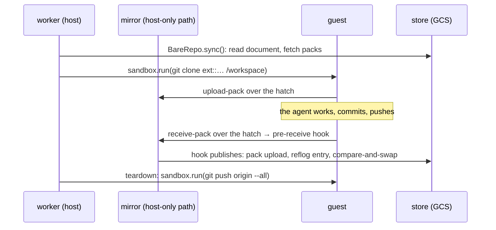

# Plan: the changeover from the tar workspace to a sheaf repository

**Related:** [`../design/sheaf.md`](../design/sheaf.md) (the storage layer this switches the sandbox onto);
[`../design/sandbox-worker.md`](../design/sandbox-worker.md) (the worker whose restore and checkpoint this replaces);
[`../design/workspace-model.md`](../design/workspace-model.md) (what a workspace is for);
`agents/sandbox-probe.agent.yaml` (the prompt this changes).

## Context

The sandbox worker restores `/workspace` from two store rpcs — the working document, versioned in its own bucket, and a
tar of everything else — and checkpoints both after every `shell` call and once more at session end. All of it runs in
the trusted worker through postern's reference-closed accessor. The BFF reads working-document versions straight from
the bucket. The agent is told that `/workspace/working_document.md` is its deliverable and everything else is scratch
discarded between sessions.

`themis.sheaf` is complete and nothing imports it. postern 0.4.0 has the stream hatch: one Unix socket per service, the
guest's bytes reaching nothing but a fixed subprocess's stdin, with git's `ext::` transport as the case it was built
for.

This plan switches the sandbox's workspace to a sheaf repository per Analysis. Existing tar workspaces are not migrated:
an Analysis whose session runs under the new worker starts from an empty repository, and its old scratch is gone. That
is accepted.

## Constraints

**Every git command that touches `/workspace` runs inside the guest.** The guest owns `/workspace`, `.git` included, so
a `git` the trusted worker ran there would execute whatever `core.hooksPath`, `core.fsmonitor` or a clean filter pointed
at, in the process holding the credential. This includes hydration: the clone is a guest command over the hatch, not a
host-side copy. The one host-side git is the mirror's — a bare repository at a host-only path that the guest never sees,
driven through `themis.sheaf.wire.bare.BareRepo` and the hook.

Enforcement, in two layers. The structural one is postern's `host_uid`: mapped to a dedicated uid rather than the
worker's root, every file the guest creates is owned by a uid that owns nothing else on the host, and git refuses to
operate on a repository owned by another user (`fatal: detected dubious ownership`, root not exempt) — so an accidental
host-side `git` in `/workspace` fails, and the only override is a `safe.directory` entry a reviewer would see. Its cost
is that the SDK's file tools write as the worker, so a file they create is not the guest's to modify in place unless the
worker makes it so; that interaction is the first thing to settle in step 1. The conventional layer is a test over the
worker package asserting that its only `git` invocations are `Sandbox.run` (guest) and `BareRepo.git` (mirror).

**The agent controls its snapshots.** The worker makes no commits. What the agent has not committed when the session
ends is gone, and it is told so. The worker's one contribution is at teardown: a guest-side `git push origin --all`, so
anything committed and not yet pushed survives. If that push is refused because the store moved, the tip is pushed to a
fresh `refs/stranded/<session-id>` instead — creating a ref is always allowed — so the work survives for a later session
to merge rather than dying with the container.

**History is append-only**, which the hook enforces ([`sheaf.md`](../design/sheaf.md)). The prompt says so, in git's own
terms: no force-push, no branch deletion; `pull --rebase` then push is the recovery.

## Target shape

- **One repository per Analysis**, keyed by analysis id in the workspace bucket.
- **Two hatches**, `upload-pack` and `receive-pack`, each splicing to git against the mirror. The handler syncs the
  mirror before handing the connection over, under the per-repository lock the HTTP server already uses, and passes the
  hook its environment explicitly — postern scrubs the subprocess env by default. `origin` gets the upload-pack socket
  as its fetch URL and the receive-pack socket as `remote.origin.pushurl`, which is how one remote reaches two
  single-service sockets. `SheafGitServer` stays for a writer that is not sandboxed; it is not in this path.
- **Restore is fail-closed.** The repository is the deliverable; a hydrate that fails fails the spawn, as the working
  document does today. An Analysis with no repository yet clones an empty one.
- **A new repository's first commit is the worker's, made in the guest**: `.gitignore` naming `scratch/` and `skills/`,
  pushed before the agent runs. Not the agent's job, and not the prompt's.
- **Protected paths** `scratch/**` and `skills/**` on the hook. The `.gitignore` is a writable convenience that keeps
  `git status` honest; the refusal that matters is the hook's, which the guest cannot reach. Locking the file would not
  help — the guest owns the directory and `git add -f` ignores it — and is not needed.
- **The guest rootfs** gains `git`, a system gitconfig with `protocol.ext.allow=always` and the agent's identity as
  `user.name`/`user.email`, and nothing else.
- **Compaction is not part of this.** Who runs it, and when, stays an open question in [`sheaf.md`](../design/sheaf.md);
  nothing here depends on the answer, and the worker's contract does not grow one.

## Steps

1. **Uid mapping.** Set `host_uid` to a dedicated uid in the worker's deploy and confirm the SDK file tools and guest
   `shell` still cooperate on the same files. Land or reject the structural guard on the result; the test-based guard
   lands regardless.
1. **Hatches.** A `git_hatches(mirror)` in the worker: two `StreamHatch`es over the mirror, sync-before-splice, hook env
   passed through. Tested offline with a `LocalBackend`, a real guest where bubblewrap is present and the existing
   fixture path where it is not.
1. **Restore and teardown.** Replace `WorkspaceSync.restore` with the guest-side clone (plus the first commit for an
   empty repository), and its scratch checkpoint with the teardown push and the stranded-ref fallback. The working
   document's restore and checkpoint stay exactly as they are (below).
1. **Guest rootfs and prompt.** `git` and the gitconfig in the guest stage of the Dockerfile; prompt v2 (below) on the
   probe agent, created fresh so a running Analysis keeps the prompt it started with.
1. **Validate in dev** with the probe agent: clone, commit, push, a refused force-push and its recovery, a teardown with
   unpushed commits, a second session finding the first's work.
1. **Retire the tar rpcs.** `PutWorkspace`/`GetWorkspace` go dead at step 3; removing them from `store.proto` is an
   interface change and its own PR.

### The working document stays in its bucket for now

Through every step above, the worker keeps reading and writing `/workspace/working_document.md` through the existing
rpc, so the BFF and the workbench are untouched. Moving the document into the repository needs a read path the BFF can
call — a Python rpc serving "this file at this ref" and history — which is the store service with its ingress opened to
IAM-gated public and `git` in its image ([`sheaf.md`](../design/sheaf.md), Background). That is a second plan, and this
one does not depend on it.

## The prompt

What changes in `agents/sandbox-probe.agent.yaml`, at the level of what the agent is told:

- `/workspace` is a git clone of this Analysis's repository; `origin` is the store. Commit your work and push it. What
  is not pushed when the session ends is lost — the worker pushes commits you made and forgot to push, and nothing else.
- History here is append-only. A push is refused if it would rewrite or delete anything; `git pull --rebase` and push
  again. Do not force-push; it will not work.
- `scratch/` is yours and ignored; `skills/` is the platform's. Neither can be pushed.
- `refs/sheaf/reflog` is the record of what each ref pointed at and when. Read it if you need it; you cannot write it.
- The working document is still `/workspace/working_document.md`, and is still read at the turn boundary — unchanged for
  now.

## Open decisions

- **Stranded refs.** `refs/stranded/<session-id>` preserves refused teardown pushes at the cost of a namespace to
  explain and, eventually, to tidy. The alternative is to log and lose. This plan takes the ref.
- **Whether the guest keeps `git` between spawns.** It does not: the rootfs is rebuilt from the image, so this is a
  build concern only.
